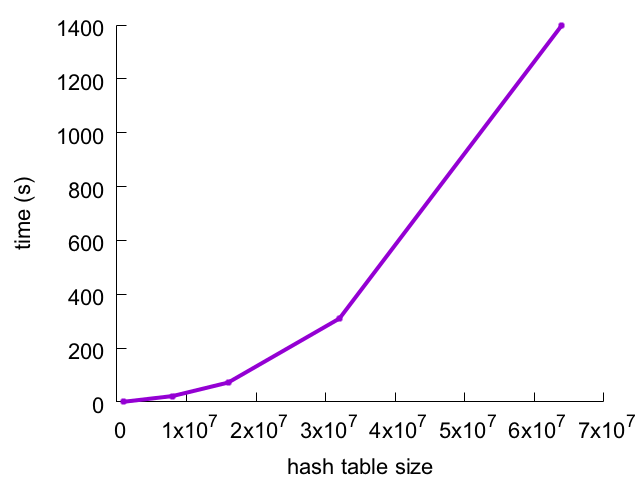
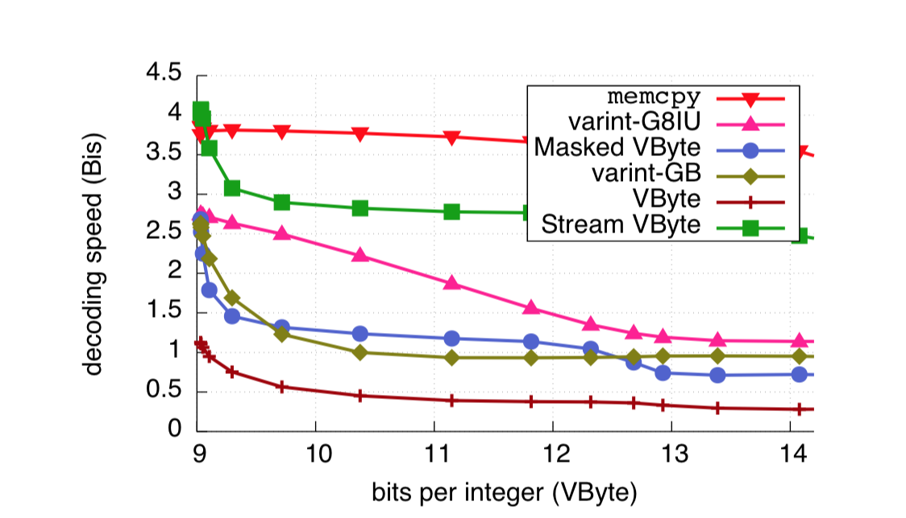

<!--open with Marp-->

<!-- *template: invert -->
<style>

 *[data-template~="invert"] {
color:white !important;
background-color:#cccccc !important;
}
 *[data-template~="invert"] * {
color:black !important;
background-color:#ccccc !important;
}
.slide h2 {
color:#008dc8;
}
.slide   {
background-color:#ccccc;
}
</style>

<!-- $size: 16:9 -->


---


## Next Generation Indexes For Big Data Engineering


Daniel Lemire and collaborators
blog: https://lemire.me 
twitter: [@lemire](https://twitter.com/lemire)

Université du Québec (TÉLUQ)
Montreal :canada:


---
<!-- page_number: true -->

<blockquote>
“One Size Fits All”: An Idea Whose Time Has Come and Gone (Stonebraker, 2005)
</blockquote>


---

## Rediscover Unix

In 2018, Big Data Engineering is made of several specialized and re-usable components:
- Calcite : SQL + optimization
- Hadoop
- etc.


---

> "Make your own database engine from parts"

We are in a Cambrian explosion, with thousands of organizations and companies building their custom high-speed systems.

- Specialized used cases
- Heterogeneous data (not everything is in your Oracle DB)

---

## For high-speed in data engineering you need...

- Front-end (data frame, SQL, visualisation)
- High-level optimizations 
- Indexes (e.g., Pilosa, Elasticsearch)
  - Great compression routines 
  - Specialized data structures
- ....


---

## Sets

A fundamental concept (sets of documents, identifiers, tuples...)

$\to$ For performance, we often work with sets of **integers** (identifiers).


---

- tests : $x \in S$?
- intersections : $S_2 \cap S_1$, unions : $S_2 \cup S_1$, differences : $S_2 \setminus S_1$
- Similarity (Jaccard/Tanimoto): $\vert S_1 \cap S_1 \vert  /\vert  S_1 \cup S_2\vert$
- Iteration 
```
for x in S do
    print(x)
```
---

## How to implement sets?


- sorted arrays (``std::vector<uint32_t>``)
- hash tables (``java.util.HashSet<Integer>``, ``std::unordered_set<uint32_t>``)
- $\ldots$
- bitmap (``java.util.BitSet``)
- :heart: :heart: :heart: **compressed bitmaps** :heart: :heart: :heart:

---

## Arrays are your friends


```
while (low <= high) {
   int mI = 
   (low + high) >>> 1;
   int m = array.get(mI);
   if (m < key) {
     low = mI + 1;
   } else if (m > key) {
     high = mI - 1;
   } else {
     return mI;
   }
}
return -(low + 1);
```


<!-- Source: https://theproductiveprogrammer.blog -->


---

## Hash tables

- value $x$ at index $h(x)$ 
- random access to a value in expected constant-time 
   - **much** faster than arrays

---

## in-order access is kind of terrible


- $[15, 3, 0, 6, 11, 4, 5, 9, 12, 13, 8, 2, \color{red}{1}, 14, 10, 7]$
- $[15, 3, 0, 6, 11, 4, 5, 9, 12, 13, 8, \color{red}{2}, 1, 14, 10, 7]$
- $[15, \color{red}{3}, 0, 6, 11, 4, 5, 9, 12, 13, 8, 2, 1, 14, 10, 7]$
- $[15, 3, 0, 6, 11, \color{red}{4}, 5, 9, 12, 13, 8, 2, 1, 14, 10, 7]$
- $[15, 3, 0, 6, 11, 4, \color{red}{5}, 9, 12, 13, 8, 2, 1, 14, 10, 7]$
- $[15, 3, 0, \color{red}{6}, 11, 4, 5, 9, 12, 13, 8, 2, 1, 14, 10, 7]$

(Robin Hood,  linear probing,  MurmurHash3 hash function)


---

## Set operations on hash tables


```
  h1 <- hash set
  h2 <- hash set
  ...
  for(x in h1) {
     insert x in h2 // cache miss?
  }
```


---

## "Crash" Swift


```
var S1 = Set<Int>(1...size)
var S2 = Set<Int>()
for i in d {
    S2.insert(i)
}
```


---

## Some numbers: half an hour for 64M keys


| size | time (s) |
|--------|-----------|
| 1M     | 0.8       |
| 8M     | 22        |
| 64M     | 1400        |


* Maps and sets can have quadratic-time performance https://lemire.me/blog/2017/01/30/maps-and-sets-can-have-quadratic-time-performance/
* Rust hash iteration+reinsertion https://accidentallyquadratic.tumblr.com/post/153545455987/rust-hash-iteration-reinsertion

---




---

## Bitmaps

Efficient way to represent sets of integers.

For example, 0, 1, 3, 4 becomes ``0b11011`` or "27".

* $\{0\}\to$ ``0b00001``
* $\{0, 3\}\to$ ``0b01001``
* $\{0, 3, 4\}\to$ ``0b11001``
* $\{0, 1, 3, 4\}\to$ ``0b11011``


---

## Manipulate a bitmap

64-bit processor.

Given``x``, word index is ``x/64`` and bit index ``x % 64``.

```
add(x) {
  array[x / 64] |= (1 << (x % 64))
}

```


---

## How fast is it?

```
index = x / 64         -> a shift
mask = 1 << ( x % 64)  -> a shift
array[ index ] |- mask -> a OR with memory
```

One bit every $\approx 1.65$ cycles because of superscalarity

---

## Bit parallelism 


Intersection between {0, 1, 3} and {1, 3}
a single AND operation 
between ``0b1011`` and ``0b1010``.

Result is``0b1010`` or {1, 3}.

No branching!

---

## Bitmaps love :heart: wide registers

- SIMD: Single Intruction Multiple Data
  - SSE (Pentium 4), ARM NEON 128 bits
  - AVX/AVX2 (256 bits)
  - AVX-512 (512 bits)

AVX-512 is now  available (e.g., from Dell!) with Skylake-X processors.

---

## Bitsets can take too much memory

{1, 32000, 64000} : 1000 bytes for three values

We use compression!

---

## Git (GitHub) utilise EWAH

Run-length encoding

Example: $000000001111111100$ est
$00000000-11111111-00$

Code long runs of 0s or 1s efficiently.


https://github.com/git/git/blob/master/ewah/bitmap.c


---


## Complexity

- Intersection : $O(|S_1| + |S_2|)$ or $O(\min(|S_1|, |S_2|))$
- In-place union ($S_2 \leftarrow S_1 \cup S_2$): $O(|S_1| + |S_2|)$ or $O(|S_2|)$

---
<!-- footer: Roaring bitmaps -->


##  Roaring Bitmaps

http://roaringbitmap.org/

- Apache Lucene, Solr et Elasticsearch, Metamarkets’ Druid, Apache Spark, Apache Hive, Apache Tez, Netflix Atlas, LinkedIn Pinot, InfluxDB, Pilosa, Microsoft Visual Studio Team Services (VSTS), Couchbase's Bleve, Intel’s Optimized Analytics Package (OAP), Apache Hivemall, eBay’s Apache Kylin.

- Java, C, Go (interoperable)


 ----
 
 ## Hybrid model
 
 
 
Set of containers 

 - sorted arrays ({1,20,144})
 - bitset (0b10000101011)
 - runs ([0,10],[15,20])
 
 
<!-- Earlier work: O'Neil's RIDBit + BitMagic-->

Related to: O'Neil's RIDBit + BitMagic
  
---


Voir https://github.com/RoaringBitmap/RoaringFormatSpec

 ----
 
 ## Roaring
 
 - All containers are small (8 kB), fit in CPU cache
 - We predict the output container type during computations
 - E.g., when array gets too large, we switch to a bitset
 - Union of two large arrays is materialized as a bitset...
 - Dozens of heuristics... sorting networks and so on


---

> Use Roaring for bitmap compression whenever possible. Do not use other bitmap compression methods (Wang et al., SIGMOD 2017)

<!--
> kudos for making something that makes my software run 5x faster (Charles Parker, BigML)


- Daniel Lemire et al., Roaring Bitmaps: Implementation of an Optimized Software Library, Software: Practice and Experience (to appear)
- Samy Chambi et al.,  Better bitmap performance with Roaring bitmaps, Software: Practice and Experience 46 (5), 2016
- Daniel Lemire et al. Consistently faster and smaller compressed bitmaps with Roaring Software: Practice and Experience 46 (11), 2016
-->

---

## Unions of 200 bitmaps 

#### bits per stored value


|   | bitset | array   | hash table | Roaring |
|---|------|-----------|---------|---------|
|census1881   | 524 | 32  | 195 | <span style="color:red">15.1</span> |
|weather   | 15.3 | 32   | 195 | <span style="color:red">5.38</span> |

### cycles per input  value:

|   | bitset | array   | hash table | Roaring |
|---|------|-----------|---------|---------|
|census1881   | 9.85 | 542   | 1010 | <span style="color:red">2.6</span> |
|weather   | 0.35 | 94   | 237 | <span style="color:red">0.16</span> |


--- 
<!-- footer: Integer compression -->

## Integer compression

- "Standard" technique: VByte, VarInt, VInt
- Use 1, 2, 3, 4, ... byte per integer
- Use one bit per byte to indicate the length of the integers in bytes
- Lucene, Protocol Buffers, etc.

--- 

## varint-GB from Google

- VByte: one branch per integer
- varint-GB: one branch per  4 integers 
- each 4-integer block is preceded byte a *control byte*


--- 

## Vectorisation

- Stepanov (STL in C++) working for Amazon proposed varint-G8IU
- Use vectorization (SIMD)
- *Patented*
- Fastest byte-oriented compression technique (until recently)

 SIMD-Based Decoding of Posting Lists, CIKM 2011
 https://stepanovpapers.com/SIMD_Decoding_TR.pdf


--- 

## Observations from Stepanov et al. 


- We can vectorize Google's varint-GB, but it is not as fast as  varint-G8IU

--- 

## Stream VByte

- Reuse varint-GB from Google
- But instead of mixing control bytes and data bytes, ...
- We store control bytes separately and consecutively...  

> Daniel Lemire, Nathan Kurz, Christoph Rupp
Stream VByte: Faster Byte-Oriented Integer Compression
Information Processing Letters 130, 2018

--- 



---

## Stream VByte is used by...

- Redis (within RediSearch) https://redislabs.com
- upscaledb https://upscaledb.com
- Trinity https://github.com/phaistos-networks/Trinity


---

## Dictionary coding

Use, e.g., by Apache Arrow

Given a list of values: 
- "Montreal", "Toronto", "Boston", "Montreal", "Boston"...

Map to integers

- 0, 1, 2, 0, 2

Compress integers: 

- Given $2^n$ distinct values...
- Can use $n$-bit per values (binary packing, patched coding, frame-of-reference)

---

## Dictionary coding + SIMD

| dict. size  | bits per value | scalar    | AVX2 (256-bit)  | AVX-512 (512-bit)  |
|---|---|---|---|---|
|  32 | 5 | 8  |  3 |  1.5 |  
|  1024 | 10 | 8  |  3.5 |  2 |  
|  65536 | 16 | 12  |  5.5 |  4.5 |  

(cycles per value decoded)

https://github.com/lemire/dictionary

---

<!-- footer: @lemire -->

## To learn more...


* Blog (twice a week) : https://lemire.me/blog/
* GitHub: https://github.com/lemire
* Home page : https://lemire.me/en/
* CRSNG : *Faster Compressed Indexes On Next-Generation Hardware* (2017-2022)
* Twitter  @lemire

