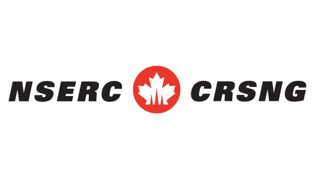

<!--open with Marp-->

<!-- *template: invert -->

## Les subventions à la découverte du CRSNG

### Trucs et stratégies

Daniel Lemire
https://lemire.me

---

## À propos

- Membre du comité CRNSG informatique 1507 (2017-2020)
- Subvention à la découverte du CRNSG depuis 2002

---

## Comité

- 340 demandes
- chaque membre du comité évalue environ 50 demandes
- les demandes sont réparties par sections (systèmes, théorie, etc.)
- Un membre peut intervenir dans différentes sections

---

## Jury

- jury de cinq membres pour chaque demande
- délibérations principalement en anglais
- quinze minutes (top chrono)
- premier lecteur, second lecteur...

---

## $$$

- Le financement n'est pas discuté
- On somme les trois notes
- Les directeurs de section déterminent avec le CRSNG les fonds octroyés en fonction des notes

---

## Biais

- Ne pas divulguer le genre du chercheur
- Ne pas attaquer l'institution (petite, grande)

---

## Critères

- excellence of researcher, merit of the proposal, HQP
- insufficient, moderate, strong, very strong, outstanding, exceptional
- financé: strong, strong, strong (sauf exceptions)
- la plupart des notes {moderate, strong, very strong}
- rare: insufficient, outstanding
- très rare: exceptional

---

## Le hasard ?

- Dans la plupart des cas (80%) il n'y a que de petits  écarts entre les évaluations.
- On utilise la médiane de cinq évaluations.
- Le premier lecteur a un poids plus grand, mais pas déterminant
- Possible pour un membre de faire changer les opinions (en 2 minutes)

---

## Moderate, insufficient

- Le premier lecteur doit produire un rapport

---

## Subvention d'accélération

- Un membre doit en faire la proposition
- Il doit convaincre le jury et rédiger un rapport
- Le rapport est transmis en amont et sujet à un autre concours

---

## La triche

- Soyez honnête.
- Un atelier n'est pas la conférence.

---

## Remplissez la demande avec soin

- Incluez des notices complètes
- Relisez votre demande

---

## Évaluations externes

- Elles peuvent avoir un grand ou un petit poids
- Identité de l'évaluateur importe
- Les amis ?

---

## Publications

- Volume a peu d'importance
- Qualité, qualité, qualité
- Certaines publications sont négatives
- Junk journal !!!
- Publier avec les étudiants : +1
- Publier souvent seul : -1
- Volume de citation : +/-
- Rôle

---

## Excellence of researcher

- Financement est formellement ignoré mais pas nécessairement positif
- Service

---

## Merit of proposal

- Doit être compréhensible!
- Deep Learning applied to IoT with Bitcoin
- Incidence?
- Bien couvrir l'état de la question

---

## Réalisme, faisabilité

- Réseautage
- Publications dans le domaine

---

## HQP

- Doit être compréhensible!
- training plan
- training philosophy
- volume
- genre
- succès des étudiants

---

## 1. Colère

Soyez patient en remplissant les formulaires. 

## 2. Avarice

Contribuez à votre communauté avec générosité.

## 3. Envie

On sait que vous avez envie de faire la même chose que les vedettes... mais concentrez-vous sur vos affaires.

## 4. Orgueil

Si vous ne savez pas bien comment faire quelque chose, faire semblant est une stratégie risquée. Admettez vos limites et expliquez plutôt comment vous allez les surmonter. Demandez de l'aide !

## 5. Gourmandise

Vos propositions doivent être réalistes.

## 6. Paresse

Une multitude de projets qui n'aboutissent pas...

## 7. Luxure

Vous rendre 20 fois par an dans un lieu touristique pour y présenter vos travaux ne fait pas de vous une sommité.

---

## Pour en savoir plus...

* Blogue (2 fois/semaine) : https://lemire.me/blog/
* Page personnelle : https://lemire.me/fr/
* CRSNG : *Faster Compressed Indexes On Next-Generation Hardware* (2017-2022)
* Twitter  @lemire
