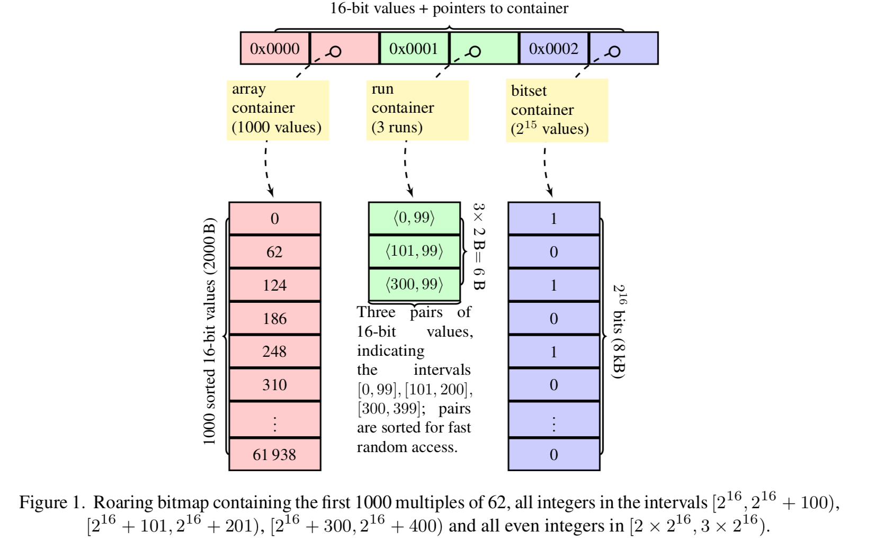

<!--open with Marp-->

<!-- *template: invert -->
<style>

 *[data-template~="invert"] {
color:white !important;
background-color:#cccccc !important;
}
 *[data-template~="invert"] * {
color:black !important;
background-color:#ccccc !important;
}
.slide h2 {
color:#008dc8;
}
.slide   {
background-color:white;
}
</style>
<!-- footer: Fast indexes with roaring - Daniel Lemire #gomtl-10 November 19th. -->


## Fast indexes with roaring


Daniel Lemire and collaborators
blog: https://lemire.me 
twitter: [@lemire](https://twitter.com/lemire)

Université du Québec (TÉLUQ)
Montreal :canada:

---

The [roaring Go library](https://github.com/RoaringBitmap/roaring) is used by

* [Cloud Torrent](https://github.com/jpillora/cloud-torrent)
* [runv](https://github.com/hyperhq/runv)
* [InfluxDB](https://www.influxdata.com)
* [Pilosa](https://www.pilosa.com/)
* [Bleve](http://www.blevesearch.com)
* [lindb](https://github.com/lindb/lindb)
* [Elasticell](https://github.com/deepfabric/elasticell)
* [SourceGraph](https://github.com/sourcegraph/sourcegraph)
* [M3](https://github.com/m3db/m3)
* [trident](https://github.com/NetApp/trident)


Part of the [Awesome Go collection](https://awesome-go.com).


                
---

## Sets

A fundamental concept (sets of documents, identifiers, tuples...)

$\to$ For performance, we often work with sets of **integers** (identifiers).


---

- tests : $x \in S$?
- intersections : $S_2 \cap S_1$, unions : $S_2 \cup S_1$, differences : $S_2 \setminus S_1$
- Similarity (Jaccard/Tanimoto): $\vert S_1 \cap S_1 \vert  /\vert  S_1 \cup S_2\vert$
- Iteration 

---

## How to implement sets?


- hash tables (`map[int]bool{}`)
- bitmap:  [willf/bitset](https://github.com/willf/bitset)
- :heart: :heart: :heart: **compressed bitmaps** :heart: :heart: :heart:

---

## Hash tables

 in-order access is kind of terrible


- [15, 3, 0, 6, 11, 4, 5, 9, 12, 13, 8, 2, 1 :frog:, 14, 10, 7]
- [15, 3, 0, 6, 11, 4, 5, 9, 12, 13, 8, 2 :frog:, 1, 14, 10, 7]
- [15, 3 :frog:, 0, 6, 11, 4, 5, 9, 12, 13, 8, 2, 1, 14, 10, 7]
- [15, 3, 0, 6, 11, 4 :frog:, 5, 9, 12, 13, 8, 2, 1, 14, 10, 7]
- [15, 3, 0, 6, 11, 4, 5 :frog:, 9, 12, 13, 8, 2, 1, 14, 10, 7]
- [15, 3, 0, 6 :frog:, 11, 4, 5, 9, 12, 13, 8, 2, 1, 14, 10, 7]


---

## Bitmaps

Efficient way to represent sets of integers.

For example, 0, 1, 3, 4 becomes ``0b11011`` or "27".

* $\{0\}\to$ ``0b00001``
* $\{0, 3\}\to$ ``0b01001``
* $\{0, 3, 4\}\to$ ``0b11001``
* $\{0, 1, 3, 4\}\to$ ``0b11011``


---

## Manipulate a bitmap

64-bit processor.

Given``x``, word index is ``x/64`` and bit index ``x % 64``.

```
add(x) {
  array[x / 64] |= (1 << (x % 64))
}

```


---

## How fast is it?

```
index = x / 64         -> a shift
mask = 1 << ( x % 64)  -> a shift
array[ index ] |- mask -> a OR with memory
```

One bit every $\approx 1.65$ cycles because of superscalarity

---

## Bit parallelism 


Intersection between {0, 1, 3} and {1, 3}
a single AND operation 
between ``0b1011`` and ``0b1010``.

Result is``0b1010`` or {1, 3}.

No branching!


---

## Bitsets can take too much memory

{1, 32000, 64000} : 1000 bytes for three values

We use compression!

---

## Git (GitHub) use EWAH

Run-length encoding

Example: $000000001111111100$ est
$00000000-11111111-00$

Code long runs of 0s or 1s efficiently.


https://github.com/git/git/blob/master/ewah/bitmap.c


---


## Complexity

- Intersection : $O(|S_1| + |S_2|)$ or $O(\min(|S_1|, |S_2|))$
- In-place union ($S_2 \leftarrow S_1 \cup S_2$): $O(|S_1| + |S_2|)$ or $O(|S_2|)$

---
<!-- footer: Roaring bitmaps -->


##  Roaring Bitmaps


- Java, C, Go, Swift, Python, Node/JavaScript, Rust, C#

- interoperable


---

Roaring bitmaps (http://roaringbitmap.org/) are found in:


* [Apache Lucene](http://lucene.apache.org/core/) and derivative systems such as Solr and [Elasticsearch](https://www.elastic.co),
* [Apache Druid](http://druid.io/),
* [Apache Spark](http://spark.apache.org),
* [Yandex ClickHouse](https://clickhouse.yandex),
* [Netflix Atlas](https://github.com/Netflix/atlas),
* [LinkedIn Pinot](https://github.com/linkedin/pinot/wiki),
* [Whoosh](https://pypi.python.org/pypi/Whoosh/),
* [Microsoft Visual Studio Team Services (VSTS)](https://www.visualstudio.com/team-services/),
* [Intel's Optimized Analytics Package (OAP)](https://github.com/Intel-bigdata/OAP),
* eBay's [Apache Kylin](http://kylin.io),
* and many more!!!


---

## Several papers

- Roaring Bitmaps: Implementation of an Optimized Software Library, Software: Practice and Experience 48 (4), April 2018. 
- Better bitmap performance with Roaring bitmaps, Software: Practice and Experience 46 (5), May 2016.
- Consistently faster and smaller compressed bitmaps with Roaring, Software: Practice and Experience 46 (11),  November 2016. 


 ----
 
 ## Hybrid model
 
 
 
Set of containers 

 - sorted arrays ({1,20,144})
 - bitset (0b10000101011)
 - runs ([0,10],[15,20])
 
---




---

## Format specification

See https://github.com/RoaringBitmap/RoaringFormatSpec

 ----
 
 ## Roaring
 
 - All containers are small (8 kB), fit in CPU cache
 - We predict the output container type during computations
 - E.g., when array gets too large, we switch to a bitset
 - Union of two large arrays is materialized as a bitset...
 - Dozens of heuristics... sorting networks and so on


---

> Use Roaring for bitmap compression whenever possible. Do not use other bitmap compression methods (Wang et al., SIGMOD 2017)


---

## Go issues

---

## Go is shy about inlining  

Won't inline some small functions that contain a branch?

```Go
func (b *BitSet) Set(i uint) *BitSet {
	b.extendSetMaybe(i)
	b.set[i>>log2WordSize] |= 1 << (i & (wordSize - 1))
	return b
}
``` 


https://lemire.me/blog/2017/09/05/go-does-not-inline-functions-when-it-should/


---

## Go guards too much

```Go
bits.OnesCount64(x)
```

---

```
0x1093534 0fb63d22810c00 MOVZX 0xc8122(IP), DI
0x109353b 4084ff TESTL DI, DI
0x109353e 7407 JE 0x1093547
0x1093540 f3480fb8f6 POPCNT SI, SI
0x1093545 ebd6 JMP 0x109351d
0x1093547 4889442418 MOVQ AX, 0x18(SP)
0x109354c 4889542410 MOVQ DX, 0x10(SP)
0x1093551 48894c2420 MOVQ CX, 0x20(SP)
0x1093556 48893424 MOVQ SI, 0(SP)
0x109355a e801ffffff CALL math/bits.OnesCount64(SB)
0x109355f 488b742408 MOVQ 0x8(SP), SI
0x1093564 488b442418 MOVQ 0x18(SP), AX
0x1093569 488b4c2420 MOVQ 0x20(SP), CX
0x109356e 488b542410 MOVQ 0x10(SP), DX
0x1093573 488b5c2440 MOVQ 0x40(SP), BX
0x1093578 eba3 JMP 0x109351d
```

---

## Thankfully assembly in Go is "easy"

```
TEXT ·popcntOrSliceAsm(SB),4,$0-56
XORQ	AX, AX
MOVQ	s+0(FP), SI
MOVQ	s_len+8(FP), CX
TESTQ	CX, CX
JZ		popcntOrSliceEnd
MOVQ	m+24(FP), DI
popcntOrSliceLoop:
MOVQ	(DI), DX
ORQ		(SI), DX
POPCNTQ_DX_DX
ADDQ	DX, AX
ADDQ	$8, SI
ADDQ	$8, DI
LOOP	popcntOrSliceLoop
popcntOrSliceEnd:
MOVQ	AX, ret+48(FP)
RET
```

---

[But may not work in the cloud](https://cloud.google.com/appengine/kb/).

---

## Fast serialization

```Go
		buf := &bytes.Buffer{}
		_, err := rb.WriteTo(buf)
```

---

## Fast deserialization

No memory allocation, no copy!

```Go
		r := NewBitmap()
		_, err = r.FromBuffer(buf.Bytes())
```

---

## Casting a slice is tricky

```Go
func byteSliceAsUint16Slice(slice []byte) (result []uint16) { // here we create a new slice holder
	if len(slice)%2 != 0 {
		panic("Slice size should be divisible by 2")
	}
	// reference: https://go101.org/article/unsafe.html

	// make a new slice header
	bHeader := (*reflect.SliceHeader)(unsafe.Pointer(&slice))
	rHeader := (*reflect.SliceHeader)(unsafe.Pointer(&result))

	// transfer the data from the given slice to a new variable (our result)
	rHeader.Data = bHeader.Data
	rHeader.Len = bHeader.Len / 2
	rHeader.Cap = bHeader.Cap / 2

	// instantiate result and use KeepAlive so data isn't unmapped.
	runtime.KeepAlive(&slice) // it is still crucial, GC can free it)

	// return result
	return
}

```


---

## Iterators: don't drink from straws


---

## Old School

```Go
it := b.Iterator()
for it.HasNext() {
...
}
```

---

## Batched Iterations

```Go
buf := make([]uint32, 4096)

...

for n := it.NextMany(buf); n != 0; n = it.NextMany(buf) {
	for _, v := range buf[:n] {
		...
	}
}
```

---

```
BENCH_REAL_DATA=1 go test -bench BenchmarkRealData -run -

BenchmarkRealDataNext/census1881-4       8479939 ns/op
BenchmarkRealDataNextMany/census1881-4   1057743 ns/op
```

Batched iterators can be 8 times faster!

---

## To learn more...


* Blog (twice a week) : https://lemire.me/blog/
* GitHub: https://github.com/lemire
* Home page : https://lemire.me/en/
* CRSNG : *Faster Compressed Indexes On Next-Generation Hardware* (2017-2022)
* Twitter @lemire

