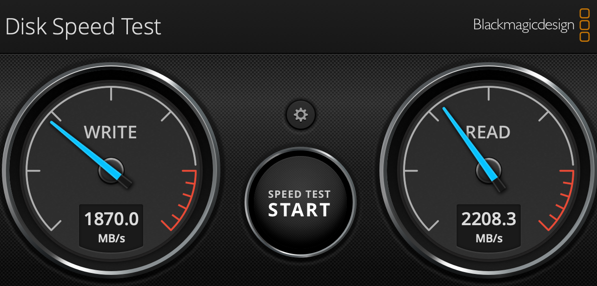
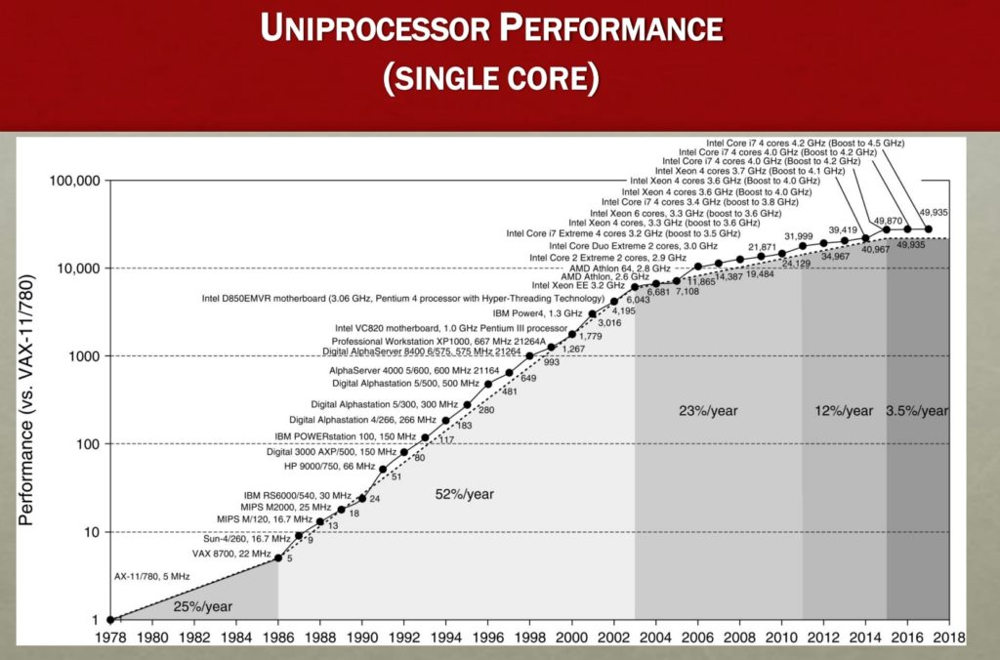
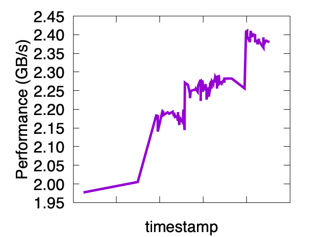
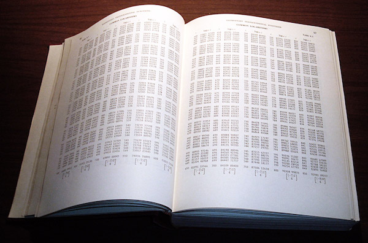

<style>
  img[alt~='center'] {
    display: block;
    margin-left: auto;
    margin-right: auto;
  }
</style>


---

## <!--fit--> Parsing JSON Really Quickly : Lessons Learned
:rocket: :rocket: :rocket: :rocket: :rocket: :rocket: 


Daniel Lemire 
blog: https://lemire.me 
twitter: [@lemire](https://twitter.com/lemire)
GitHub: [https://github.com/lemire/](https://github.com/lemire/)

professor (Computer Science) at Université du Québec (TÉLUQ)
Montreal :canada: :cocktail: :beer:

---

## <!--fit--> How fast can you read a large file?

- # Are you limited by your disk or
- # Are you limited by your CPU?

---
# An iMac disk: 2.2 GB/s, [Faster SSDs (e.g., 5 GB/s) are available](https://www.anandtech.com/show/14960/team-group-joins-pcie-40-ssd-race-with-cardea-zero-z440-drives) 


 

---
# Reading text lines (CPU only)

# ~0.6 GB/s on 3.4 GHz Skylake in Java

```java
void parseLine(String s) {
  volume += s.length();
}

void readString(StringReader data) {				
  BufferedReader bf = new BufferedReader(data);
  bf.lines().forEach(s -> parseLine(s));
}
```

[Source available.](https://github.com/lemire/Code-used-on-Daniel-Lemire-s-blog/tree/master/2019/07/26)
Improved by [JDK-8229022](https://bugs.openjdk.java.net/browse/JDK-8229022)


---
# Reading text lines (CPU only)

~1.5 GB/s on 3.4 GHz Skylake 
in C++ (GNU GCC 8.3)

```C++
size_t sum_line_lengths(char * data, size_t length) {
   std::stringstream is;
   is.rdbuf()->pubsetbuf(data, length);
   std::string line;
   size_t sumofalllinelengths{0};

   while(getline(is, line)) {
     sumofalllinelengths += line.size();
   }

   return sumofalllinelengths;
}
```

[Source available.](https://github.com/lemire/simdjson/pull/344/files)


---

 [source](https://www.nextbigfuture.com/2019/02/the-end-of-moores-law-in-detail-and-starting-a-new-golden-age.html)

---

# JSON 

- Specified by Douglas Crockford 
- [RFC 7159](https://tools.ietf.org/html/rfc8259) by Tim Bray in 2013
- Ubiquitous format to exchange data

```javascript
{"Image": {"Width":  800,"Height": 600,
"Title":  "View from 15th Floor",
"Thumbnail": {
    "Url":    "http://www.example.com/81989943",
    "Height": 125,"Width":  100}
} 
```        

---


# <!--fit--> "Our backend spends half its time serializing and deserializing json"


---


## JSON  parsing

- Read all of the content
- Check that it is valid JSON
- Check Unicode encoding
- Parse numbers
- Build DOM (document-object-model)

Harder than parsing lines?

---

## Jackson JSON speed (Java)

# twitter.json: **0.35 GB/s** on  3.4 GHz Skylake

[Source code available.](https://github.com/lemire/jackson-json-bench)


|         | speed  |
| ------------- |:-------------:
| Jackson   (Java)  | 0.35 GB/s |
| readLines C++      | 1.5 GB/s |
| disk     |    2.2 GB/s |

---


## RapidJSON speed (C++)

# twitter.json: **0.650 GB/s** on  3.4 GHz Skylake


|         | speed  |
| ------------- |:-------------:
| RapidJSON (C++)     | 0.65 GB/s |
| Jackson   (Java)  | 0.35 GB/s |
| readLines C++      | 1.5 GB/s |
| disk     |    2.2 GB/s |

---

# simdjson speed (C++)

twitter.json: **2.4 GB/s** on  3.4 GHz Skylake

|         | speed  |
| ------------- |:-------------:
| simdjson (C++)     | 2.4 GB/s |
| RapidJSON (C++)     | 0.65 GB/s |
| Jackson   (Java)  | 0.35 GB/s |
| readLines C++      | 1.5 GB/s |
| disk     |    2.2 GB/s |

---

# 2.4 GB/s on a 3.4 GHz (+turbo) processor is

# ~1.5 cycles per input byte


---


## <!--fit--> Trick #1 : avoid hard-to-predict branches

---

Write random numbers on an array.

```java
while (howmany != 0) {
    out[index] =  random();
    index += 1;
    howmany--;
}
```
e.g., ~ 3 cycles per iteration

---

Write only odd random numbers:

```java
while (howmany != 0) {
    val = random();
    if( val is odd) { // <=== new
      out[index] =  val;
      index += 1;
    }
    howmany--;
}
```

---

# <!--fit--> From 3 cycles to 15 cycles per value !

---

# <!--fit--> Go branchless!

``` java
while (howmany != 0) {
    val = random();
    out[index] = val;
    index += (val bitand 1);
    howmany--;
}
````

back to under 4 cycles!

[Details and code available](https://lemire.me/blog/2019/10/15/mispredicted-branches-can-multiply-your-running-times/)

---

## <!--fit--> What if I keep running the same benchmark?

(same pseudo-random integers from run-to-run)


---

# <!--fit--> Trick #2 : Use wide "words"

# Don't process byte by byte

---

# <!--fit--> When possible, use SIMD

- Available on most commodity processors (ARM, x64)
- Originally added (Pentium) for multimedia (sound)
- Add wider (128-bit, 256-bit, 512-bit) registers 
- Adds new fun instructions: do 32 table lookups at once.

----


|     ISA    |  where |  max. register width   |
| -------------| ------------- |:-------------:
| ARM NEON (AArch64)  | mobile phones, tablets | 128-bit |
| SSE2... SSE4.2    | legacy x64 (Intel, AMD) | 128-bit |
| AVX, AVX2   | mainstream x64 (Intel, AMD) | 256-bit |
| AVX-512  | latest x64 (Intel) | 512-bit |

----

- "Intrinsic" functions (C, C++, Rust, ...) mapping to specific instructions on specific instructions sets :heart: :heart: :heart:
- Higher level functions (Swift, C++, ...): [Java Vector API](https://bugs.openjdk.java.net/browse/JDK-8201271)
- Autovectorization ("compiler magic") (Java, C, C++, ...)
- Optimized functions (some in Java)
- Assembly (e.g., in crypto)


---


## <!--fit--> Trick #3 : avoid memory/object allocation

---

# <!--fit--> In simdjson, the DOM (document-object-model) is stored on one contiguous tape.


---


## <!--fit--> Trick #4 : measure the performance!


-  benchmark-driven development 




---
## <!--fit--> Continuous Integration Performance tests 

- performance regression is a bug that should be spotted early

---


## <!--fit--> Processor frequencies are not constant

- Especially on laptops
- CPU cycles different from time
- Time can be noisier than CPU cycles


---

# <!--fit--> Specific examples

---
## <!--fit--> Example 1. UTF-8 

Strings are ASCII (1 byte per code point)

Otherwise multiple bytes (2, 3 or 4)

Only 1.1 M valid UTF-8 code points

---

## Validating UTF-8 with if/else/while

```java
if (byte1 < 0x80) {
        return true; // ASCII
}
if (byte1 < 0xE0) {
      if (byte1 < 0xC2 || byte2 > 0xBF) {
        return false;
      }
} else if (byte1 < 0xF0) {
      // Three-byte form.
      if (byte2 > 0xBF
          || (byte1 == 0xE0 && byte2 < 0xA0)
          || (byte1 == 0xED && 0xA0 <= byte2)
       blablabla
     ) blablabla
} else {
      // Four-byte form.
      .... blabla
}
```
---

# Using SIMD 

- Load 32-byte registers
- Use ~20 instructions
- No branch, no branch misprediction

---

Example: Verify that all byte values are no larger than 244

Saturated subtraction: `x - 244` is non-zero if an only if `x > 244`.

```C
 _mm256_subs_epu8(current_bytes, 244 );
```

One instruction, checks 32 bytes at once!


---


## <!--fit--> processing random UTF-8

|         |  cycles/byte |
| ------------- |:-------------:
| branching    | 11  |
| simdjson    | 0.5 |


#  20 x faster! 

[Source code available.](https://github.com/lemire/fastvalidate-utf-8)


---

## <!--fit--> Example 2. Classifying characters

- comma (0x2c) `,`
- colon (0x3a) `:`
- brackets (0x5b,0x5d, 0x7b, 0x7d): `[, ], {, }`
- white-space (0x09, 0x0a, 0x0d, 0x20)
- others

Classify 16, 32 or 64 characters at once!

---

Divide  values into two 'nibbles'

0x2c is 2 (high nibble) and c (low nibble)


There are 16 possible low nibbles.

There are 16 possible high nibbles.


---

# ARM NEON and x64 processors have instructions to lookup 16-byte tables in a vectorized manner (16 values at a time): pshufb, tbl




---

Start with an array of 4-bit values
[1, 1, 0, 2, 0, 5, 10, 15, 7, 8, 13, 9, 0, 13, 5, 1]

Create a lookup table

[200, 201, 202, 203, 204, 205, 206, 207, 208, 209, 210, 211, 212, 213, 214, 215]

0 :arrow_right: 200, 1 :arrow_right: 201, 2 :arrow_right: 202

Result:
[201, 201, 200, 202, 200, 205, 210, 215, 207, 208, 213, 209, 200, 213, 205, 201]


---

Find two tables `H1` and `H2` such as the bitwise AND of the look classify the characters.

`H1(low(c)) & H2(high(c))`


- comma (0x2c): 1
- colon (0x3a): 2
- brackets (0x5b,0x5d, 0x7b, 0x7d): 4
- most white-space (0x09, 0x0a, 0x0d): 8
- white space (0x20): 16
- others: 0

---
```
const uint8x16_t low_nibble_mask =
      (uint8x16_t){16, 0, 0, 0, 0, 0, 0, 0, 0, 8, 12, 1, 2, 9, 0, 0};
const uint8x16_t high_nibble_mask =
      (uint8x16_t){8, 0, 18, 4, 0, 1, 0, 1, 0, 0, 0, 3, 2, 1, 0, 0};
const uint8x16_t low_nib_and_mask = vmovq_n_u8(0xf);
```

Five instructions:
```C
    uint8x16_t nib_lo = vandq_u8(chunk, low_nib_and_mask);
    uint8x16_t nib_hi = vshrq_n_u8(chunk, 4);
    uint8x16_t shuf_lo = vqtbl1q_u8(low_nibble_mask, nib_lo);
    uint8x16_t shuf_hi = vqtbl1q_u8(high_nibble_mask, nib_hi);
    return vandq_u8(shuf_lo, shuf_hi);
```

---

## <!--fit--> Example 3. Detecting escaped  characters


- #  " :arrow_right: \\"
- # \\ :arrow_right: \\\\
- #  \\" :arrow_right: \\\\\\"

---

# Can you tell where the strings start and end?

# `{ "\\\"Nam[{": [ 116,"\\\\"` ...

# Without branching?


---
# Escape characters follow an *odd* sequence of backslashes!
     

---


- Identify backslashes:

`{ "\\\"Nam[{": [ 116,"\\\\"`
`___111________________1111_`: B


Odd and even positions 

- `1_1_1_1_1_1_1_1_1_1_1_1_1_1`: E (constant) 
- `_1_1_1_1_1_1_1_1_1_1_1_1_1_`: O (constant)

---

Do a bunch of arithmetic and logical operations...
`(((B + (B &~(B << 1)& E))& ~B)& ~E) | (((B + ((B &~(B << 1))& O))& ~B)& E)`


Result:
`{ "\\\"Nam[{": [ 116,"\\\\"` ...
`______1____________________`

No branch!

---

# <!--fit-->  Remove the escaped quotes, and
# <!--fit-->  the remaining quotes tell you where the strings are!

---

`{ "\\\"Nam[{": [ 116,"\\\\"`
`__1___1_____1________1____1` : all quotes
`______1____________________` : escaped quotes
`__1_________1________1____1` : string-delimiter quotes

---

# Find the span of the string


```Java
mask = quote xor (quote << 1); 
mask = mask xor (mask << 2);
mask = mask xor (mask << 4);
mask = mask xor (mask << 8);
mask = mask xor (mask << 16); 
...
```

`__1_________1________1____1` (quotes) 
becomes
`__1111111111_________11111_` (string region) 


---

# <!--fit--> Entire structure of the JSON document can be
# <!--fit-->  identified (as a bitset) without any branch!


---

## <!--fit--> Example 4. Decode bit indexes

Given the bitset `1000100010001`, we want the location of the 1s (e.g., 0, 4, 8 12)


---

```java
 while (word != 0) {
    result[i] = trailingzeroes(word);
    word = word & (word - 1);
    i++;
  }
```

If number of 1s per 64-bit is hard to predict: lots of mispredictions!!!

---

Instead of predicting the number of 1s per 64-bit, predict whether it is in 

- {1, 2, 3, 4}
- {5, 6, 7, 8}
- {9, 10, 11, 12}

Easier!

---

Reduce the number of misprediction by doing more work per iteration:


```java
  while (word != 0) {
    result[i] = trailingzeroes(word);
    word = word & (word - 1);
    result[i+1] = trailingzeroes(word);
    word = word & (word - 1);
    result[i+2] = trailingzeroes(word);
    word = word & (word - 1);
    result[i+3] = trailingzeroes(word);
    word = word & (word - 1);
    i+=4;
  }
````

Discard bogus indexes by counting the number of 1s in the word directly (e.g., `bitCount`)

---

## <!--fit--> Example 5. Number parsing is expensive

`strtod` : 

- 90 MB/s
- 38 cycles per byte
- 10 branch misses per floating-point number

---

## Check whether we have 8 consecutive digits

```
bool is_made_of_eight_digits_fast(const char *chars) {
  uint64_t val;
  memcpy(&val, chars, 8);
  return (((val & 0xF0F0F0F0F0F0F0F0) |
           (((val + 0x0606060606060606) & 0xF0F0F0F0F0F0F0F0) >> 4)) 
           == 0x3333333333333333);
}
```

---

## Then construct the corresponding integer

Using only three multiplications (instead of 7):

```
 uint32_t parse_eight_digits_unrolled(const char *chars) {
  uint64_t val;
  memcpy(&val, chars, sizeof(uint64_t));
  val = (val & 0x0F0F0F0F0F0F0F0F) * 2561 >> 8;
  val = (val & 0x00FF00FF00FF00FF) * 6553601 >> 16;
  return (val & 0x0000FFFF0000FFFF) * 42949672960001 >> 32;
}
```

Can do even better with SIMD


---

## <!--fit--> Runtime dispatch


On first call, pointer checks CPU, and reassigns itself. No language support. 


---

```
int json_parse_dispatch(...) {
  Architecture best_implementation = find_best_supported_implementation();
  // Selecting the best implementation
  switch (best_implementation) {
  case Architecture::HASWELL:
    json_parse_ptr = &json_parse_implementation<Architecture::HASWELL>;
    break;
  case Architecture::WESTMERE:
    json_parse_ptr= &json_parse_implementation<Architecture::WESTMERE>;
    break;
  default:
    return UNEXPECTED_ERROR;
  }

  return json_parse_ptr(....);
}
```

---

## Where to get it?

- GitHub: [https://github.com/lemire/simdjson/](https://github.com/lemire/simdjson/)
- Modern C++, single-header (easy integration)
- ARM (e.g., iPhone), x64 (going back 10 years)
- Apache 2.0 (no hidden patents)
- Used by Microsoft FishStore and Yandex ClickHouse
- wrappers in Python, PHP, C#, Rust, JavaScript (node), Ruby
- ports to Rust, Go and C#

---

## Reference


- Geoff Langdale, Daniel Lemire, Parsing Gigabytes of JSON per Second,  VLDB Journal, https://arxiv.org/abs/1902.08318


---

## Credit


Geoff Langdale (algorithmic architect and wizard)

Contributors:

Thomas Navennec, Kai Wolf, Tyler Kennedy, Frank Wessels, George Fotopoulos, Heinz N. Gies, Emil Gedda, Wojciech Muła, Georgios Floros, Dong Xie, Nan Xiao, Egor Bogatov, Jinxi Wang, Luiz Fernando Peres, Wouter Bolsterlee, Anish Karandikar, Reini Urban. Tom Dyson, Ihor Dotsenko, Alexey Milovidov, Chang Liu, Sunny Gleason, John Keiser, Zach Bjornson, Vitaly Baranov, Juho Lauri, Michael Eisel, Io Daza Dillon, Paul Dreik, Jérémie Piotte and others

---
