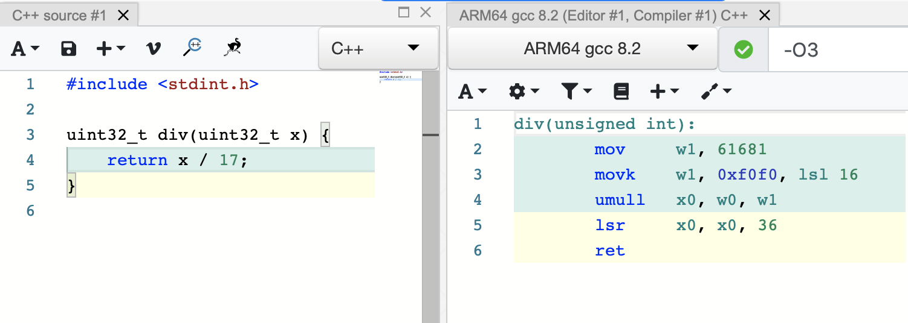

<!-- -->

<!--  --- -->

## <!--fit--> Floating-point number parsing with perfect accuracy at a gigabyte per second


Daniel Lemire 
professor, Université du Québec (TÉLUQ)
Montreal :canada: 

blog: https://lemire.me 
twitter: [@lemire](https://twitter.com/lemire)
GitHub: [https://github.com/lemire/](https://github.com/lemire/)

:exclamation:  work with Michael Eisel, with contributions from Nigel Tao, R. Oudompheng, and others!


---
# How fast is your disk?


PCIe 4 disks: 5 GB/s reading speed (sequential)


---

# Fact

Single-core processes are often CPU bound

---

# How fast can you ingest data?

```javascript
{ "type": "FeatureCollection",
  "features": [
[[[-65.613616999999977,43.420273000000009],
[-65.619720000000029,43.418052999999986],
[-65.625,43.421379000000059],
[-65.636123999999882,43.449714999999969],
[-65.633056999999951,43.474709000000132],
[-65.611389000000031,43.513054000000068],
[-65.605835000000013,43.516105999999979],
[-65.598343,43.515830999999935],
[-65.566101000000003,43.508331000000055],
...
```
 

---

# How fast can you parse numbers?

```C++
std::stringstream in(mystring);
while(in >> x) {
   sum += x;
}
return sum;
```

50 MB/s (Linux, GCC -O3)

Source: https://lemire.me/blog/2019/10/26/how-expensive-is-it-to-parse-numbers-from-a-string-in-c/


---

# Some arithmetic


5 GB/s divided by 50 MB/s is 100.

Got 100 CPU cores?

Want to cause climate change all on your own?

---

# How to go faster?


- Avoid streams (in C++)
- Fewer instructions (simpler code)
- Fewer branches


---


# How fast can you go?

|     function    |  bandwidth |  instructions   | ins/cycle  |
| -------------| ------------- | ------------- |:-------------:
| strtod (GCC 10)  | 200 MB/s | 1100 | 3 |
| ours   | 1.1 GB/s |  280 |  4.2|

17-digit mantissa, random in [0,1].

AMD Rome (Zen 2). GNU GCC 10, -O3.


---

# Floats are easy

- Standard in Java, Go, Python, Swift, JavaScript...
- IEEE standard well supported on all recent systems
- 64-bit floats can represent all integers up to 2^53 exactly.

---

# Floats are hard

```
> 0.1 + 0.2 == 0.3
false
```


---

# Generic rules regarding "exact" IEEE support

- Always round to nearest floating-point number (*,+,/)
- Resolve ties by rounding to nearest with an even mantissa.


---

# Benefits

- Predictable outcomes. 
- Debuggability.
- Cross-language compatibility (same results).


---

# Challenges

- Machine A writes float X to string
- Machine B reads string gets float X'
- Machine C reads string gets float X''

Do you have X == X' and X == X''?


---

# What is the problem?

Need to go from 

w * 10^q   (e.g., 123e5)

to

m * 2^p

---

# Example

0.1 => 7205759403792793 x 2^-56
0.10000000000000000555


0.2 => 7205759403792794 x 2^-55
0.2000000000000000111

0.3 => 5404319552844595 x 2^-54
0.29999999999999998889776975


---

# Easy cases

Start with 3e-1 or 0.3.

Lookup 10 as a float: 10   (exact)

Convert 3 to a float (exact)

Compute  3 / 10

It works! Exactly!

William D. Clinger.  How to read floating point numbers accurately.SIGPLAN Not., 25(6):92–101, June 1990.


---

# Problems 

Start with 32323232132321321111e124.

Lookup 10^124 as a float   (not exact)

Convert 32323232132321321111 to a float (not exact)

Compute  (10^124) * (32323232132321321111)

Approximation * Approximation = Even worse approximation!


---


# Insight

You can always represent floats  exactly  (binary64) using at most 17 digits.


Never to this:

3.1415926535897932384626433832795028841971693993751058209749445923078164062862089986280348253421170679

---

 credit: xkcd


---


## We have 64-bit processors

So we can express all positive floats as 
`12345678901234567E+/-123`. 

Or w * 10^q

where mantissa w <  10^17

But 10^17 fits in a 64-bit word!

---


## Factorization 

10 = 5 * 2

---


## Overall algorithm 

- Parse decimal mantissa to a 64-bit word!
- Precompute 5^q for all powers with up to 128-bit accuracy.
- Multiply!
- Figure out right power of two

Tricks:
- Deal with "subnormals"
- Handle excessively large numbers (infinity)
- Round-to-nearest, tie to even


---


## Check whether we have 8 consecutive digits

```
bool is_made_of_eight_digits_fast(const char *chars) {
  uint64_t val;
  memcpy(&val, chars, 8);
  return (((val & 0xF0F0F0F0F0F0F0F0) |
           (((val + 0x0606060606060606) & 0xF0F0F0F0F0F0F0F0) >> 4)) 
           == 0x3333333333333333);
}
```

---

## Then construct the corresponding integer

Using only three multiplications (instead of 7):

```
 uint32_t parse_eight_digits_unrolled(const char *chars) {
  uint64_t val;
  memcpy(&val, chars, sizeof(uint64_t));
  val = (val & 0x0F0F0F0F0F0F0F0F) * 2561 >> 8;
  val = (val & 0x00FF00FF00FF00FF) * 6553601 >> 16;
  return (val & 0x0000FFFF0000FFFF) * 42949672960001 >> 32;
}
```


---

## Positive powers

- Compute w * 5^q where 5^q  is only approximate (128 bits)
- 99.99% of the time, you get provably accurate 55 bits


---

## Negative powers

- Compilers replace division by constants with multiply and shift

 
credit: godbolt

---

## Negative powers

- Precompute 2^b / 5^q (reciprocal, 128-bit precision)
- 99.99% of the time, you get provably accurate results

---

## What about tie to even?

- Need absolutely exact mantissa computation, to infinite precision.

- But only happens for small decimal powers (q in [-4,23]) where absolutely exact results are practical.

---

## What if you have more than 19 digits?

- Truncate the mantissa to 19 digits, map to w.
- Do the work for w * 10^q
- Do the work for (w+1)* 10^q
- When get same results, you are done. (99% of the time)

---

## Overall

- With 64-bit mantissa.
- With 128-bit powers of five.
- Can do exact computation 99.99% of the time.
- Fast, cheap, accurate.

---

## Resources

- Fast and exact implementation of the C++ from_chars functions  https://github.com/lemire/fast_float 
(used by Apache Arrow, PR in Yandex ClickHouse)
- Fast C-like function https://github.com/lemire/fast_double_parser with ports to Julia, Rust, PR in Microsoft LightGBM
- Algorithm adapted to Go's standard library (ParseFloat) by Nigel Tao and others: next release


- Upcoming paper, watch @lemire and https://lemire.me/blog/
