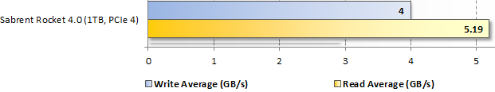
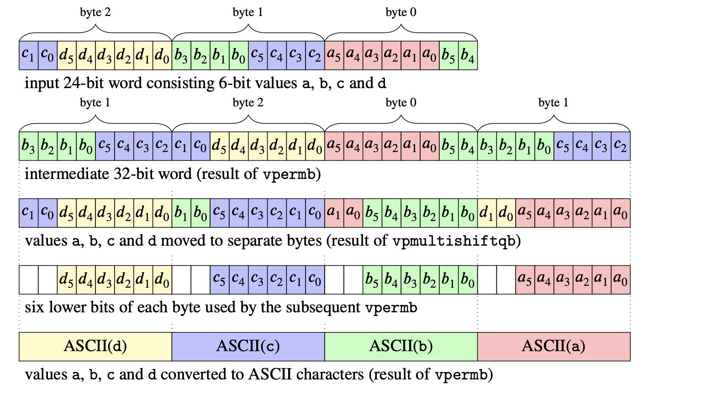

<!-- -->

<!--  --- -->

## <!--fit--> Data Engineering at the Speed of Your Disk


Daniel Lemire 
professor, Université du Québec (TÉLUQ)
Montreal :canada: 

blog: https://lemire.me 
twitter: [@lemire](https://twitter.com/lemire)
GitHub: [https://github.com/lemire/](https://github.com/lemire/)

:exclamation: Joint work with tens of smart engineers worldwide


---
# How fast is your disk?


PCIe 4 disks: 5 GB/s reading speed (sequential)

<style>
  img[alt~='center'] {
    display: block;
      margin-left: auto;
    margin-right: auto;
  }
</style>

 

 
 [benchmark: hothardware.com](https://hothardware.com/reviews/sabrent-rocket-nvme-40-ssd-review) :newspaper:

:pencil2: _Network speeds of 50 GB/s (400GbE) and better are coming near you._


---

# Unless you can eat data at gigabytes per second, you may be CPU bound when reading from disk!!!

:worried: :worried: :worried: :worried:

 

---

# How fast can you allocate dynamically memory?

```C++
buf  = new char[size]; // virtual alloc only!
// get physical pages
for (size_t i = 0; i < size; i += page_size) buf[i] = 0;
```

3.5 GB/s (Linux, Skylake 3.4GHz, 4kB pages)


---

# How fast can you remove spaces from a string?


```C++
  for (i = 0; i < size; ++i) {
    double r = random();
    if (r < 0.01) {
      buffer[i] = ' ';
    } else {
      ...
    }
  }
```
---

# Let us do some C

```C++
  for (size_t i = 0; i < howmany; i++) {
    unsigned char c = bytes[i];
    if (c > 32) {
      bytes[pos++] = c;
    }
    
  }
```

1.6 GB/s

---


# Working byte-by-byte

3.4 GHz implies a limit of 3.4 GB/s.


---


# When possible, use SIMD


|     ISA    |  where |  max. register width   |
| -------------| ------------- |:-------------:
| ARM NEON (AArch64)  | mobile phones, tablets | 128-bit |
| SSE2... SSE4.2    | legacy x64 (Intel, AMD) | 128-bit |
| AVX, AVX2   | mainstream x64 (Intel, AMD) | 256-bit |
| AVX-512  | latest x64 (Intel) | 512-bit |

---

# Removing spaces with SIMD

```C++
  __m128i spaces = _mm_set1_epi8(' ');
  for (i = 0; i + 15 < howmany; i += 16) {
    __m128i x = _mm_loadu_si128(bytes + i);
    __m128i anywhite = _mm_cmpeq_epi8(spaces, _mm_max_epu8(spaces, x));
    uint64_t mask16 = _mm_movemask_epi8(anywhite);
    x = _mm_shuffle_epi8(x, despace_mask16[mask16 & 0x7fff]);
    _mm_storeu_si128(bytes + pos, x);
    pos += 16 - _mm_popcnt_u64(mask16);
  }
```
8 GB/s


https://github.com/lemire/despacer

---

# Base64

Standard to map binary data to ASCII. Used to encode most emails. Amazon SimpleDB, Amazon DynamoDB, MongoDB, Elasticsearch, Web Storage.

```
TWFuIGlzIGRpc3Rpbmd1aXNoZWQsIG5vdCBvbmx5IGJ5IGhpcyByZWFzb24sIGJ1dCBieSB0aGlz
IHNpbmd1bGFyIHBhc3Npb24gZnJvbSBvdGhlciBhbmltYWxzLCB3aGljaCBpcyBhIGx1c3Qgb2Yg
dGhlIG1pbmQsIHRoYXQgYnkgYSBwZXJzZXZlcmFuY2Ugb2YgZGVsaWdodCBpbiB0aGUgY29udGlu
dWVkIGFuZCBpbmRlZmF0aWdhYmxlIGdlbmVyYXRpb24gb2Yga25vd2xlZGdlLCBleGNlZWRzIHRo
ZSBzaG9ydCB2ZWhlbWVuY2Ugb2YgYW55IGNhcm5hbCBwbGVhc3VyZS4=
```

:abc::abc::abc::abc:  :left_right_arrow:  :1234: :1234: :1234:


---

# To map 48 binary bytes into 64 ASCII





:arrow_forward: [Base64 encoding and decoding at almost the speed of a memory copy](https://arxiv.org/pdf/1910.05109.pdf), Software: Practice and Experience 50 (2), 2020


---
## Unicode fun: UTF-8 

Strings are ASCII (1 byte per code point)

Otherwise multiple bytes (2, 3 or 4)

Only 1.1 M valid UTF-8 code points

---

## Validating UTF-8 with if/else/while

0.3 GB/s

```java
if (byte1 < 0x80) {
        return true; // ASCII
}
if (byte1 < 0xE0) {
      if (byte1 < 0xC2 || byte2 > 0xBF) {
        return false;
      }
} else if (byte1 < 0xF0) {
      // Three-byte form.
      if (byte2 > 0xBF
          || (byte1 == 0xE0 && byte2 < 0xA0)
          || (byte1 == 0xED && 0xA0 <= byte2)
       blablabla
     ) blablabla
} else {
      // Four-byte form.
      .... blabla
}
```
---

# Using SIMD 

8 GB/s

- Load 32-byte registers
- Use ~20 instructions
- No branch, no branch misprediction

https://github.com/lemire/fastvalidate-utf-8

---

# JSON 

- Specified by Douglas Crockford 
- [RFC 7159](https://tools.ietf.org/html/rfc8259) by Tim Bray in 2013
- Ubiquitous format to exchange data

```javascript
{"Image": {"Width":  800,"Height": 600,
"Title":  "View from 15th Floor",
"Thumbnail": {
    "Url":    "http://www.example.com/81989943",
    "Height": 125,"Width":  100}
}}
```        

---


## JSON  parsing

- Read all of the content
- Check that it is valid JSON
- Check Unicode encoding
- Parse numbers
- Build DOM (document-object-model)

---

<!--  -->


source: @gwenshap


---

# JSON for Modern C++  (nlohmann-json)

0.1 GB/s (Skylake 3.4GHz, GNU GCC8, file: twitter.json)

---

# RapidJSON

0.3 GB/s (Skylake 3.4GHz, GNU GCC8, file: twitter.json)


---

# getline

```C++
size_t sumofalllinelengths{0};
  while(getline(is, line)) {
    sumofalllinelengths += line.size();
  }
```

1.4 GB/s (Skylake 3.4GHz, GNU GCC8, file: twitter.json)


---

# simdjson 

2.5 GB/s (Skylake 3.4GHz, GNU GCC8, file: twitter.json)


---

# Find the span of the string


```Java
mask = quote xor (quote << 1); 
mask = mask xor (mask << 2);
mask = mask xor (mask << 4);
mask = mask xor (mask << 8);
mask = mask xor (mask << 16); 
...
```

`__1_________1________1____1` (quotes) 
becomes
`__1111111111_________11111_` (string region) 

---

## <!--fit--> Number parsing is expensive

`strtod` : 

- 90 MB/s
- 38 cycles per byte
- 10 branch misses per floating-point number

---

## Check whether we have 8 consecutive digits

```
bool is_made_of_eight_digits_fast(const char *chars) {
  uint64_t val;
  memcpy(&val, chars, 8);
  return (((val & 0xF0F0F0F0F0F0F0F0) |
           (((val + 0x0606060606060606) & 0xF0F0F0F0F0F0F0F0) >> 4)) 
           == 0x3333333333333333);
}
```

---

## Then construct the corresponding integer

Using only three multiplications (instead of 7):

```
 uint32_t parse_eight_digits_unrolled(const char *chars) {
  uint64_t val;
  memcpy(&val, chars, sizeof(uint64_t));
  val = (val & 0x0F0F0F0F0F0F0F0F) * 2561 >> 8;
  val = (val & 0x00FF00FF00FF00FF) * 6553601 >> 16;
  return (val & 0x0000FFFF0000FFFF) * 42949672960001 >> 32;
}
```


---


| simdjson  |	660 MB/s |
------------|-----------|
| simdjson  |	660 MB/s |
| abseil, from_chars |	330 MB/s |
| strtod |	70 MB/s |

https://github.com/lemire/fast_double_parser

---

## Where to get simdjson?

- https://simdjson.org
- GitHub: [https://github.com/simdjson/simdjson/](https://github.com/simdjson/simdjson/)
- Modern C++, single-header (easy integration)
- 64-bit ARM (e.g., iPhone), x64
- Apache 2.0 (no hidden patents)
- Used by Microsoft FishStore and Yandex ClickHouse
- wrappers in Python, PHP, C#, Rust, JavaScript (node), Ruby
- ports to Rust, Go and C#


