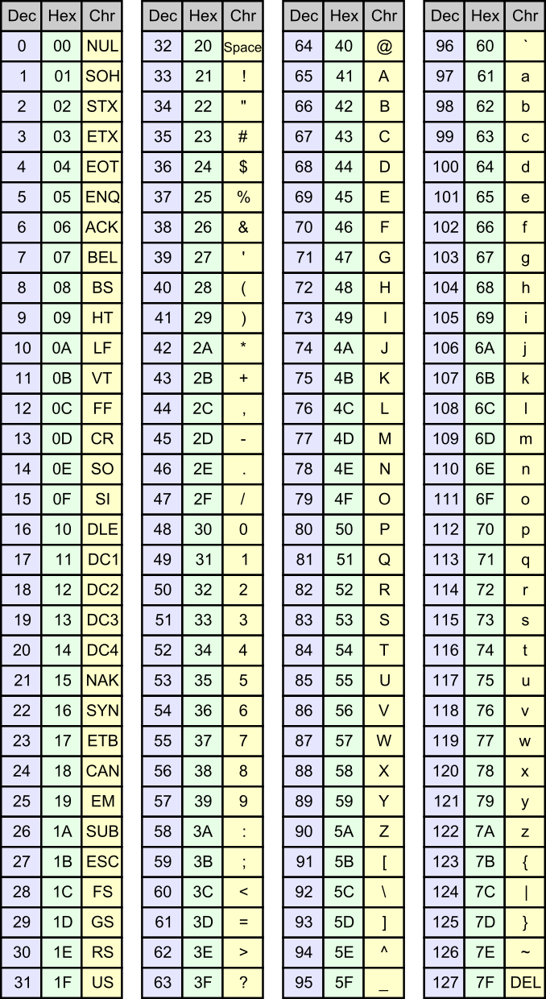
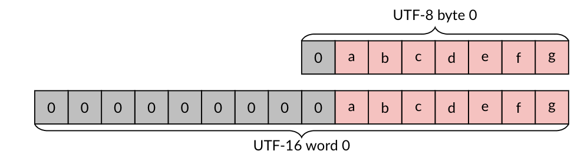
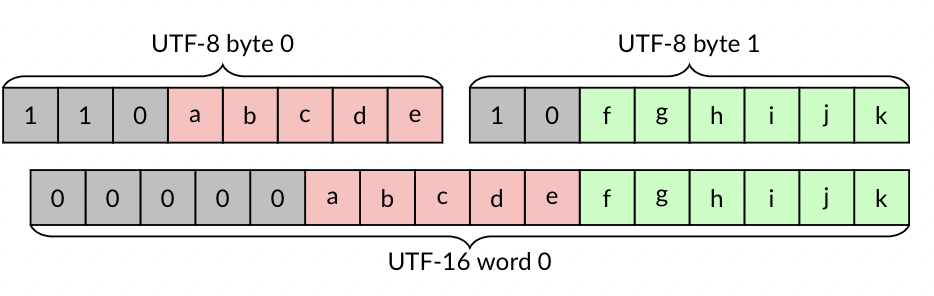
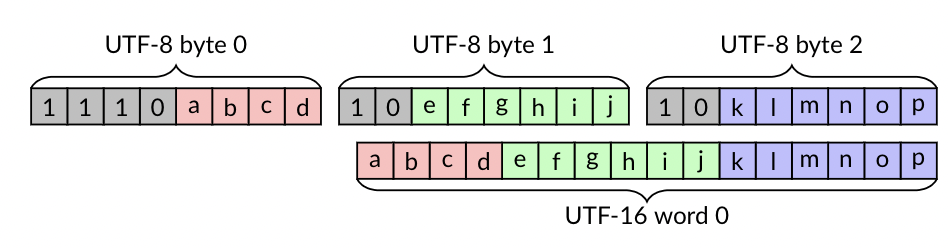
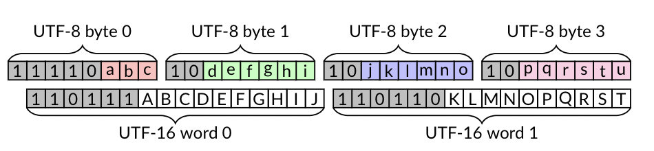
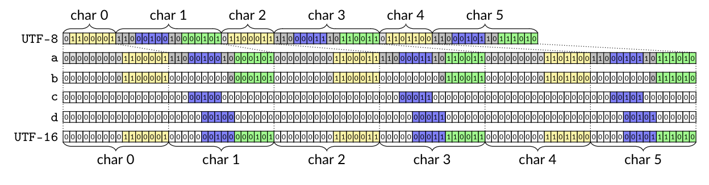

<!--  --- -->

## <!--fit--> Unicode at gigabytes per second

Daniel Lemire with Wojciech Muła and John Keiser
professor, Université du Québec (TÉLUQ)
Montreal :canada: 

blog: https://lemire.me 
twitter: [@lemire](https://twitter.com/lemire)
GitHub: [https://github.com/lemire/](https://github.com/lemire/)

credit for figures: Wojciech Muła

:exclamation: many other contributors!

---

# From characters to bits

Morse code

- A : 0 1
- B : 1 0 0 0
- C : 1 0 1 0

26 letters.

---

# Fixed-length codes

- Baudot code (~1860). 5 bits.
- Hollerith code (~1896). 6 bits.
- American Standard-Code for Information Interchange or ASCII (~1961). 7 bits. 128 characters.

---

---

# Too many fixed-length codes!

- IBM: Binary Coded Decimal Interchange Code.  6 bits.
- IBM: Extended Binary Coded Decimal Interchange Code or EBCDIC. 8 bits. 
- ISO 8859 (~1987). 8 bits. European.
- Thai (TIS 620), Indian languages (ISCII), Vietnamese (VISCII) and Japanese (JIS X 0201).
- Windows character sets, Mac character sets.

---

# Unicode (late 1980s)

- Extends ASCII.
- Universal.
- Replaces all other standards.
- Typography, full localisation, extensible.

---

# Unicode: how many bits?

- 16 bits ought to be enough?
- Numerical range from 0x000000 to 0x10FFFF.
- Would need 20 to 21 bits.

---

# UTF-16 and UTF-8

Two main formats.

UTF-16: Java, C#, Windows

UTF-8: XML, JSON, HTML, Go, Rust, Swift

---

# UTF-16 and UTF-8

| character range | UTF-8 bytes | UTF-16 bytes |
|:----------------|:------------|:-------------|
| ASCII (0000-007F) |  1  |   2 |
| latin (0080-07FF) |  2  |   2 |
| asiatic (0800-D7FF, E000-FFFF) |  3  |   2 |
| supplemental (010000-10FFFF) |  4  |   4 |

---

# UTF-16

- 16-bit words. 
- characters in 0000-D7FF and E000-FFFF, stored as 16-bit values---using two bytes.
- characters in 010000-10FFFF are stored using a 'surrogate pair'.
- Comes in two flavours (little and big endian at the 16-bit level).

---

# UTF-16 (surrogate pair)

- first word in D800-DBFF.
- second word in DC00-DFFF.
- character value is 10 least significant bits of each---second element is least significant.
- add 0x10000 to the result.

---

# UTF-8

- 8-bit words (no endianess)
- One 'leading' byte followed by 0 to 3 bytes.

---

# UTF-8 format

- Most significant bit of leading is zero, ASCII: [01000001].
- 3 most significant bits 110, two-byte sequence: [11000100] [10000101].
- 4 most significant bits 1100, three-byte sequence.
- 5 most significant bits 11000, four-byte sequence.
- Non-leading bytes have 10 as the two most significant bits.

---

# UTF-8 validation rules

- The five most significant bits of any byte cannot be all ones.
- The leading byte must be followed by the right number of continuation bytes. 
- A continuation byte must be preceded by a leading byte.
- The decoded character must be larger than 7F for two-byte sequences, larger than 7FF for three-byte sequences, and larger than FFFF for four-byte sequences. 
- The decoded code-point value  must be less  than 110000 
- The code-point value must not be in the range D800-DFFF.

---

# UTF-8/UTF-16 comparison (ASCII)

---

# UTF-8/UTF-16 comparison (2-bytes)

---

# UTF-8/UTF-16 comparison (3-bytes)

---

# UTF-8/UTF-16 comparison (4-bytes)

---

# UTF-8/UTF-16 transcoding

- Must convert (transcode) from one format to the other format, while validating the input.

---

# Some numbers

- bandwidth between node instances: over 3 GB/s
- PCIe 4.0 disks (and PlayStation 5): over 5 GB/s
- Popular C++ trancoding library (ICU): ~1 GB/s

---

# Gigabytes per second?

- x64, ARM, POWER: have SIMD instructions.

---

|                | UTF-8 to UTF-16 | UTF-16 to UTF-8   | validation | table size |
|:---------------|:-----------------|:-----------------|:------------|:-----------|
| Cameron's u8u16 (2008)      | yes              | no               | yes         | N/A |
| Inoue et al. (2008) | partial              | no           | no         |  105 kB |
| simdutf             | yes              | yes               | yes         | 20 kB |

Software implementations (no formal paper): Goffart (2012) and Gatilov (2019)

---

# Vectorized permutation

- Can permute blocks of 16 bytes (or 32 bytes) using a single cheap instruction.
- Need a precomputed shuffle mask.

- data         :  [a b c d e f g]
- shuffle mask :  [3 1 0 3 3 2 -1] (indexes)
- result       :  [d b a d d c 0] 

- Conversely may be used as a form of vectorized table lookup.
 
---

# UTF-8 to UTF-16 transcoding (core)

- Take a block of bytes.
- Continuation bytes (leading bits 10, less than -64)
- Non-continuation bytes are leading bytes
- Bytes before a leading byte end a character
- Build a bitmap
- Use the bitmap in a lookup table
 
---

# UTF-8 to UTF-16 transcoding (example)

Start with...

 [01000001] ([11000100] [10000101])
  [01100011] ([11000011] [10000011]) [01101100] ([11000101] [10111010])

We have 9 bytes. Build a 9-bit bitmap where '1' means the end of a character

101101101

Use this as index in a table.

---

# UTF-8 to UTF-16 transcoding (table)

- If using 12-byte blocks, need 4096-long table.
- Each entry points to a shuffle mask and number of consumed bytes.

---

# UTF-8 to UTF-16 transcoding (cases)

Shuffle masks are sorted into 'cases'.

1. First 64 cases correspond to 1-byte or 2-byte characters only.
2. Next 81 cases correspond to 1, 2 or 3 bytes per character.
3. Next 64 cases correspond to general case (1 to 4 bytes).

Each case corresponds to a code path.

---

---

# UTF-8 to UTF-16 transcoding (more tricks)

1. Load blocks of 64 bytes.
2. Check for fast paths (e.g. all ASCII).
3. Eat 12 bytes at a time within 64 bytes.
4. Add a few fast path (e.g., all ASCII, all 2-byte, all 3-byte).

---

# UTF-8 to UTF-16 transcoding (validation)

Given a 64-byte block, we can use a fast vectorized
validation routine.

- Validating UTF-8 In Less Than One Instruction Per Byte, Software: Practice and Experience 51 (5), 2021

---

# UTF-8 to UTF-16 transcoding (core algo)

- You can identify most UTF-8 errors by looking at sequences of 3 nibbles (4-bit).
- E.g., ASCII followed by continuation, leading not followed by continuation byte.

Do three lookups (using shuffe mask) and compute a bitwise AND. We call this
vectorized classification.

----

# Simplified vectorized classification

- Suppose you want to find all instances where  value 3 is followed by 
value 1 or 2.

- Create two lookup tables. 
- One for first nibble [0,0,0,1,0,0,0,0,0,0,0,0,0,0,0,0]
- second nibble [0,1,1,0,0,0,0,0,0,0,0,0,0,0,0,0]
- Lookup first nibble in table, lookup second, compute bitwise AND.
- If result is 1, you have a match.
- Can do this in parallel over many values.

----

# Fancier vectorized classification

- Suppose you want to find all instances where  value 3 is followed by 
value 1 or 2. Value 5 followed by 0. Value 6 followed by 10.

- Create two lookup table2. 
- One for first nibble [0,0,0,1,0,2,4,0,0,0,0,0,0,0,0,0]
- second nibble [2,1,1,0,0,0,0,0,0,0,4,0,0,0,0,0]
- Lookup first nibble in table, lookup second, compute bitwise AND.

----

Array of nibbles:

- original: [a0 a1 a2 a3 a4 ...]
- shift: [a1 a2 a3 a4 ...]
- shift: [a2 a3 a4 ...]
- f([a0 a1 a2 a3 a4 ...]) AND g([a1 a2 a3 a4 ...]) AND g([a2 a3 a4 ...])

---

# UTF-16 to UTF-8

The other direction (from UTF-16 to UTF-8) is somewhat easier!

---

# UTF-16 to UTF-8 (ASCII)

If all 16-bit words are ASCII (0000-007F), use a fast routine: 16 bytes into 8 'packed' bytes.

---

# UTF-16 to UTF-8 (0000-07FF)

If all 16-bit words are in (0000-07FF)... build an 8-bit bitset indicating which 16-byte
words are ASCII (0000-007F), load a shuffle mask, permute and patch.

---

# UTF-16 to UTF-8 (0000-07FF, E000-FFFF)

If all 16-bit words are in the ranges 0000-D7FF, E000-FFFF, we use another similar specialized  routine to produce sequences of one-byte, two-byte and three-byte UTF-8 characters.

Otherwise, when we detect that the input register contains at least one part of a surrogate pair, we fall back to a conventional/scalar code path.

---

# Experiments

- AMD processor (AMD EPYC 7262,  Zen 2 microarchitecture, 3.39 GHz) and GCC10.
- International Components for Unicode (UCI)
- u8u16 library
- lipsum text in various languages

---

# ASCII transcoding

|          | UTF-8 to UTF-16     | UTF-16 to UTF-8 |
|:---------|:--------------------|:----------------|
| simdutf  | 20 GB/s             |   36 GB/s       |
| UCI      | 1 GB/s             |   2 GB/s         |

---

---

## Software

https://github.com/simdutf/simdutf

- Open source, no patent.
- ARM NEON, SSE, AVX...
- Support runtime dispatch: adapts to your CPU.
- Easy to use: drop `simdutf.cpp` and `simdutf.h` in your project.
- Compiles to tens of kilobytes.

---

## Further reading

- Lemire, Daniel and Wojciech Muła , Transcoding Billions of Unicode Characters per Second with SIMD Instructions, Software: Practice and Experience (to appear) https://r-libre.teluq.ca/2400/
- Blog: https://lemire.me/blog/
