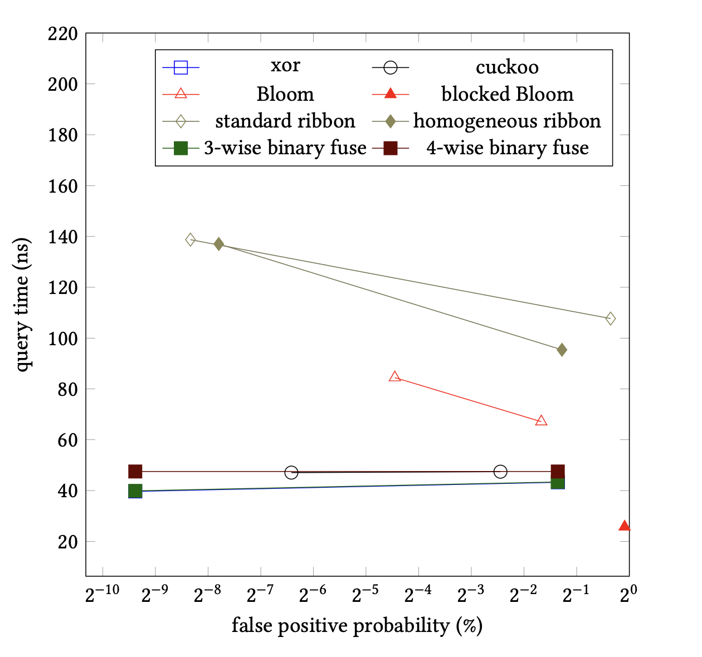

<!-- -->

<!--  --- -->

## <!--fit--> Binary Fuse Filters: Fast and Tiny Immutable Filters


Daniel Lemire 
professor, Data Science Research Center
Université du Québec (TÉLUQ)
Montreal 

blog: https://lemire.me 
twitter: [@lemire](https://twitter.com/lemire)
GitHub: [https://github.com/lemire/](https://github.com/lemire/)


---

# Probabilistic filters?

- Is $x$ in the set $S$?
- Maybe or *definitively not*

---

# Usage scenario?

- We have this expensive *database*. Querying it cost you.
- Most queries should not end up in the data.
- We want a small 'filter' that can prune out queries.

---

# Theoretical bound

- Given $N$ elements in the set
- Spend $k$ bits per element
- Get a false positive rate of $1/2^k$


---

# Usual constraints

- Fixed initial capacity
- Difficult to update safely without access to the set
- To get a 1% false-positive rate: $\approx 8$ bits?

---

# Hash function

- From any objet in the *universe* to a *word* (e.g., 64-bit word)
- Result looks random

---

```C
uint64_t murmur64(uint64_t h) {
  h ^= h >> 33;
  h *= UINT64_C(0xff51afd7ed558ccd);
  h ^= h >> 33;
  h *= UINT64_C(0xc4ceb9fe1a85ec53);
  h ^= h >> 33;
  return h;
}
```

---

# Conventional Bloom filter

- Start with a bitset $B$.
- Using `k` hash functions $f_1, f_2,\ldots$.


---

# Adding an element

- Given an object $x$ from the set, set up to `k` bits to 1
- $B[f_1(x)] \leftarrow 1, B[f_2(x)] \leftarrow 1, \ldots$


---

# Checking an element

- Given an object $x$ from the universe, set up to `k` bits to 1
- $(B[f_1(x)] = 1) \mathrm{AND} (B[f_2(x)] = 1) \mathrm{AND} \ldots$


---

# Bloom filters: upsides

- Fast construction
- Flexible: excess capacity translates into lower false positive rate


---

# Bloom filters: downsides

- 44% above the theoretical minimum in storage
- Slower than alternatives (lots of memory accesses)

---

# Blocked Bloom filters

- Same as a Bloom filters, but for a given object, put all bits in one cache line
- Optional: Use SIMD instructions to reduce instruction count
---


# Blocked Bloom filters: pros/cons

- Stupidly fast in both construction and queries
- ~56% above the theoretical minimum in storage

---

# Binary fuse filters (was: xor filters)

- Based on theoretical work by Dietzfelbinger and Walzer
- Immutable datastructure: build it once
- Fill it to capacity
- Fast construction
- Fast and simple queries

---

# Arity : 3-wise, 4-wise

- 3-wise version has three hits, 12% overhead
- 4-wise version has four hits, 8% overhead


---

 


---

# Queries are silly

- Have an array of *fingerprints* (e.g., 8-bit words)
- Compute 3 (or 4) hash functions: $f_1(x), f_2(x), f_3(x)$
- Compute fingerprint function ($f(x)\to$ 8-bit word)
- Compute XOR and compare with fingerprint:
$(B[f_1(x)] = 1) \mathrm{XOR} (B[f_2(x)] = 1) \mathrm{XOR} (B[f_3(x)] = 1) = f(x)$

---

 

---

# Construction 1

- Start with array for fingerprints containing slightly more fingerprints than you have elements in the set
- Divide the array into segments (e.g., 300 disjoint)
- The segments should have size that follows a power of two (hence *binary*)

---

# Construction 2


- Map each object $x$ in set, to locations $B[f_1(x)]$, $B[f_2(x)]$, $B[f_3(x)]$
- The locations should be in three consecutive segments (so relatively nearby in memory).


---

# Construction 3

- At the end, each location $B[i]$ is associated with some number of objects from the set


---

# Construction 4

- Find a location mapped from a single set element $x$, e.g., $B[f_1(x)]$
- Record this location which is owned by $x$
- Remove the mapping of $x$ to locations $B[f_1(x)]$, $B[f_2(x)]$, $B[f_3(x)]$
- Repeat

---

# Construction 5

- Almost always, the construction terminates after one trial
- Go through the matched keys, in reverse order, adn set (e.,g.) $B[f_1(x)] = f(x) \mathrm{XOR} B[f_2(x)] \mathrm{XOR} B[f_3(x)]$


---

# Construction: Performance

- Implemented naively: terrible performance (random access!!!)
- Before the construction begins, sort the elements of the sets according to the segments they are mapped to.
- This greatly accelerates the construction

---

 

---

# How does the performance scale with size?


---

# Huge tables?


---

# Compressibility?

If you are sending the filters over a network, you can further compress it.

---

# Some links

- Bloom filters in Go: https://github.com/bits-and-blooms/bloom
- Binary fuse filters in Go: https://github.com/FastFilter/xorfilter
- Binary fuse filters in C: https://github.com/FastFilter/xor_singleheader
- Binary fuse filters in Java: https://github.com/FastFilter/fastfilter_java
- Giant benchmarking platform: https://github.com/FastFilter/fastfilter_cpp

---

# Other Links

- Blog https://lemire.me/blog/
- Twitter: @lemire
- GitHub: https://github.com/lemire
