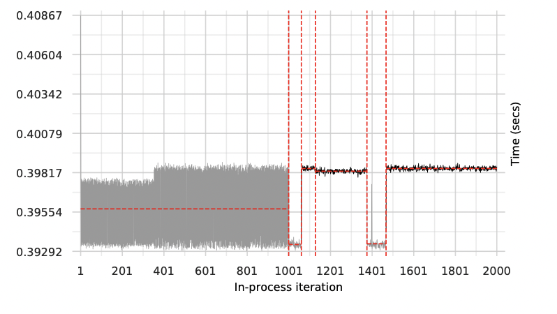
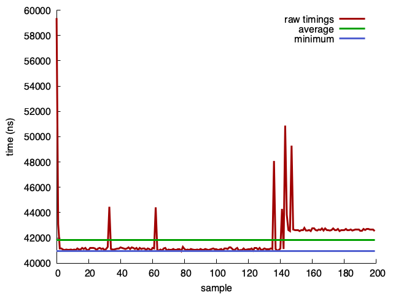
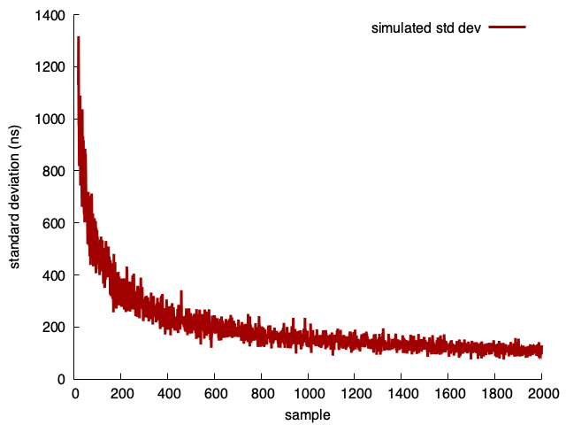
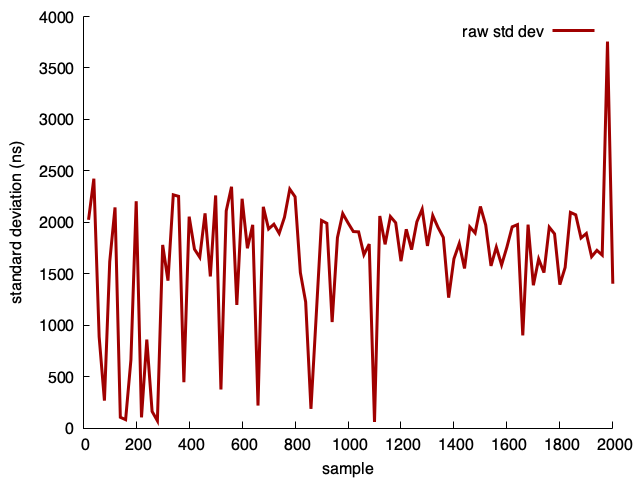
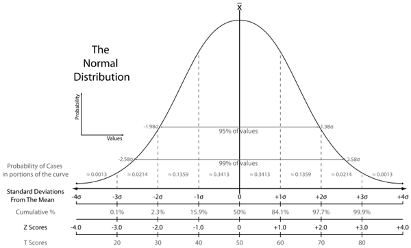
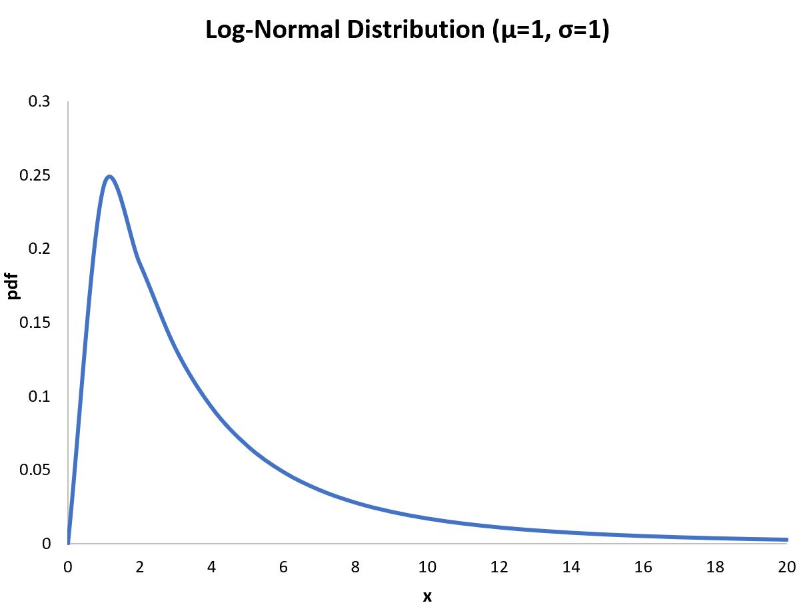
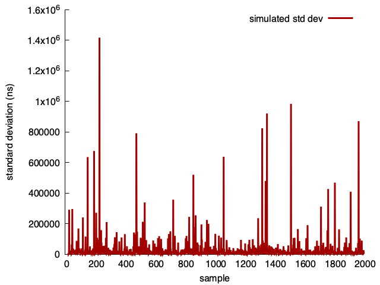
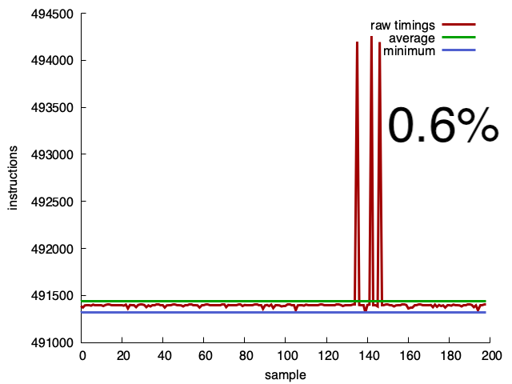

<!-- -->

<!--  --- -->

## <!--fit--> Accurate and efficient software microbenchmarks


Daniel Lemire 
professor, Data Science Research Center
Université du Québec (TÉLUQ)
Montreal :canada: 

blog: https://lemire.me 
twitter: [@lemire](https://twitter.com/lemire)
GitHub: [https://github.com/lemire/](https://github.com/lemire/)

---

# Background

* *Fastest JSON parser in the world* (on commodity processors): https://github.com/simdjson/simdjson
* First to parse JSON files at gigabytes per second

---

# Where is the code ?


All code for this talk is online (reproducible!!!)

https://github.com/lemire/talks/tree/master/2023/performance/code

---
# How fast is your disk?


PCIe 4 drives: 5 GB/s reading speed (sequential)

PCIe 5 drives: 10 GB/s reading speed (sequential)


 


---

# CPU Frequencies are stagnating

| architecture   |  availability | max. frequency |
|----------------|---------------|----------------|
| Intel Skylake  | 2015          |  4.5 GHz       |
| Intel Ice Lake | 2019          |  4.1 GHz       |

---

# Fact

Single-core processes are often CPU bound

---

# Solution?

Optimize the software.

Incremental optimization, how do you know that you are on the right track?

---

# Hypothesis

This software change (commit) improves our performance.

---

# Simple

Measure time elapsed before, time elapsed after.

---

# Complex system


Software systems are complex systems: changes can have unexpected consequences.

---

# JIT


*Virtual Machine Warmup Blows Hot and Cold*

 

---

# System calls

System calls (especially IO) may dominate, assume that they remain constant. Idem with multicore and multi-system processes.

---

# Data access

data structure layout changes can trigger expensive loads, assume that we keep that constant.

---

# Tiny functions

Uncertainty principle: by measuring you are affecting the execution so that you cannot measure safely tiny functions.

---

# Take statically compiled code

Transcoding UTF-16 to UTF-8 of an 80kB Arabic string using the simdutf library (NEON kernel).


 

---

# Use the average?


Let $t$ be the true value and let $\epsilon$ be the noise distribution (variance $\sigma^2$).

We seek $t$.


---

# Repeated measures increase accuracy


Measures are $t+\epsilon_1, t+\epsilon_2, t+\epsilon_3, \ldots$

Sum  is $Nt + (\sum_i \epsilon_i)$. Variance is $N \sigma^2$. 

Average  is $t + (\sum_i \epsilon_i)/N$. Variance is $\sigma^2/N$. Standard deviation of $\frac{\sigma}{\sqrt{N}}$.

---


# Simulation

```python
mu, sigma = 10000, 5000
for N in range(20, 2000+1):
    s = [sum(np.random.default_rng().normal(mu, sigma, N))/N for i in range(30)]
    print(N,np.std(s))
```

---

 


---

# Actual measurements


```C++
// returns the average
double transcode(const std::string& source, size_t iterations);


...

  for(size_t i = iterations_start; i <= iterations_end; i+=step) {
    std::vector<double> averages;
    for(size_t j = 0; j < 30; j++) { averages.push_back(transcode(source, i)); }
    std::cout << i << "\t" << compute_std_dev(averages) << std::endl;
  }
```

---

 

---
# Sigma events

 

---


- 1-sigma is 32%
- 2-sigma is 5%
- 3-sigma is 0.3% (once ever 300 trials)
- 4-sigma is 0.00669% (once every 15000 trials)
- 5-sigma is 5.9e-05% (once every 1,700,000 trials)
- 6-sigma is 2e-07% (once every 500,000,000)

$e^{- n^2 / 2} /(n * \sqrt{\pi /2}) \times  100$ for $n> 3$

---


# Measuring sigma events

Take 300 measures after warmup, and measure the worst relative deviation

```
$ for i in {1..10}; do sudo ./sigma_test; done
4.56151
4.904
7.43446
5.73425
9.89544
12.975
3.92584
3.14633
4.91766
5.3699
```


---

# What if we dealt with log-normal distributions?

 


---


```Python
for N in range(20, 2000+1):
    s = [sum(np.random.default_rng().lognormal(1, 4, N))/N for i in range(30)]
    print(N,np.std(s))
```

---

 

---

# What if we measured the minimum?

Relative standard deviation ($\sigma/\mu$)

| N     |  average      |  minimum    |
|-------|---------------|-------------|
| 200   | 3.44%         |  1.38%      |
| 2000  | 2.66%         |  1.19%      |
| 10000 | 2.95%         |  1.27%      |


---

- The minimum is easier to measure to 1% accuracy.


---

# CPU performance counters

Processors have *zero-overhead* counters recording instruction retired, actual cycles, and so forth.

No need to freeze the CPU frequency: you can measure it.

---

# Limitations

- You can only measure so many things (2, 4 metrics, not 25)
- Required privileged access (e.g., root)

---

# Counters in the cloud

- x64: Requires at least a full CPU
- ARM Graviton: generally available but limited number (e.g., 2 counters)


---

# Instruction counts are accurate

 


---

# Using performance counters

- Java instruction counters: https://github.com/jvm-profiling-tools/async-profiler
- C/C++: instruction counters are available through the Linux kernel
- [Go instruction counters](https://go.googlesource.com/proposal/+/refs/changes/08/219508/2/design/36821-perf-counter-pprof.md)


---

# Generally, fewer instructions means faster code

- Some instructions are more expensive than others (e.g., division).
- Data dependency can make instruction counts less relevant.
- Branching can artificially lower instruction count.


---

If you are adding speculative branching, make sure your test input is large.

```C++
while (howmany != 0) {
    val = random();
    if( val is an odd integer ) {
      out[index] =  val;
      index += 1;
    }
    howmany--;
}
```

---

[2000 'random' elements, AMD Rome](https://lemire.me/blog/2019/10/16/benchmarking-is-hard-processors-learn-to-predict-branches/)


| trial	| mispredicted branches |
|-------|-----------------------|
| 1	    | 50%                   |
| 2	    | 18%                   |
| 3	    | 6%                    |
| 4	    | 2%                    |
| 5	    | 1%                    |
| 6	    | 0.3%                  |
| 7	    | 0.15%                 |
| 8	    | 0.15%                 |
| 9	    | 0.1%                  |

---

# Take away 1

- Computational microbenchmarks can have log-normal distributions.
- Consider measuring the *minimum* instead of the *average*. 


---

# Take away 2

- Benchmarking often is good
- Long-running benchmarks are not necessarily more accurate.
- Prefer cheap, well-designed benchmarks.

---

# Links

- Blog https://lemire.me/blog/
- Twitter: @lemire
- GitHub: https://github.com/lemire
