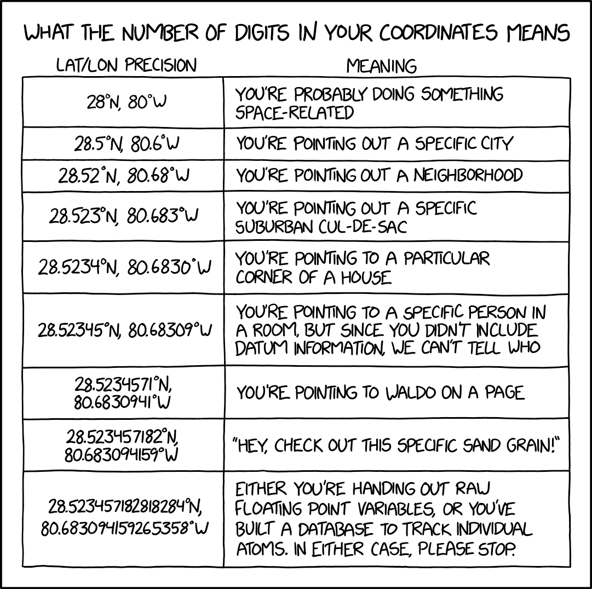

<!-- -->

<!--  --- -->

## <!--fit--> Floating-point number parsing with perfect accuracy at a gigabyte per second


Daniel Lemire 
professor, Université du Québec (TÉLUQ)
Montreal :canada: 

blog: https://lemire.me 
X: [@lemire](https://twitter.com/lemire)
GitHub: [https://github.com/lemire/](https://github.com/lemire/)

:exclamation:  work with Michael Eisel, Ivan Smirnov, Nigel Tao, R. Oudompheng, Carl Verret and others!


---
# How fast is your disk?


- PCIe 4 disks: 5 GB/s reading speed (sequential)
- PCIe 5 disks: 14.5 GB/s (0.20$/GB)

<!-- https://www.anandtech.com/show/21269/crucial-t705-gen5-nvme-ssd-a-145-gbps-consumer-flagship-with-2400-mts-232l-nand -->

---

# Fact

Single-core processes are often CPU bound

---

# How fast can you ingest data?

```javascript
{ "type": "FeatureCollection",
  "features": [
[[[-65.613616999999977,43.420273000000009],
[-65.619720000000029,43.418052999999986],
[-65.625,43.421379000000059],
[-65.636123999999882,43.449714999999969],
[-65.633056999999951,43.474709000000132],
[-65.611389000000031,43.513054000000068],
[-65.605835000000013,43.516105999999979],
[-65.598343,43.515830999999935],
[-65.566101000000003,43.508331000000055],
...
```
 

---

# How fast can you parse numbers?

```C++
std::stringstream in(mystring);
while(in >> x) {
   sum += x;
}
return sum;
```

50 MB/s (Linux, GCC -O3)

Source: https://lemire.me/blog/2019/10/26/how-expensive-is-it-to-parse-numbers-from-a-string-in-c/


---

# Some arithmetic


5 GB/s divided by 50 MB/s is 100.

Got 100 CPU cores?

Want to cause climate change all on your own?

---

# How to go faster?

- Fewer instructions (simpler code)
- Fewer branches


---


# How fast can you go?

AMD Rome (Zen 2). GNU GCC 10, -O3.


|     function    |  bandwidth |  instructions   | ins/cycle  |
| -------------| ------------- | ------------- |:-------------:
| strtod (GCC 10)  | 200 MB/s | 1100 | 3 |
| ours   | 1.1 GB/s |  280 |  4.2|

17-digit mantissa, random in [0,1].


---

# Floats are easy

- Standard in Java, Go, Python, Swift, JavaScript...
- IEEE standard well supported on all recent systems
- 64-bit floats can represent all integers up to $2^{53}$ exactly.

---

# Floats are hard

```
> 0.1 + 0.2 == 0.3
false
```


---

# Generic rules regarding "exact" IEEE support

- Always round to nearest floating-point number (*,+,/)
- Resolve ties by rounding to nearest with an even decimal mantissa/significand.


---

# Benefits

- Predictable outcomes. 
- Debuggability.
- Cross-language compatibility (same results).


---

# Challenges

- Machine A writes float $x$ to string
- Machine B reads string gets float $x'$
- Machine C reads string gets float $x''$

Do you have $x = x'$ and $x = x''$?


---

# What is the problem?

Need to go from 

$$w \times 10^q$$   
(e.g., 123e5)

to

$$m \times 2^p$$

---

# Example

$$0.1 \to 7205759403792793 \times 2^{-56}$$
0.10000000000000000555


$$ 0.2 \to 7205759403792794 \times 2^{-55}$$
0.2000000000000000111

$$ 0.3 \to 5404319552844595 \times 2^{-54}$$
0.29999999999999998889776975


---

# Problems 

Start with 32323232132321321111e124.

Lookup $10^{124}$as a float   (not exact)

Convert 32323232132321321111 to a float (not exact)

Compute  $(10^{124}) \times (32323232132321321111)$

Approximation $\times$ Approximation = Even worse approximation!


---


# Insight

You can always represent floats  exactly  (binary64) using at most 17 digits.


Never to this:

3.1415926535897932384626433832795028841971693993751058209749445923078164062862089986280348253421170679

---

 credit: xkcd


---


## We have 64-bit processors

So we can express all positive floats as 
`12345678901234567E+/-123`. 

Or $w \times 10^q$

where mantissa $w <  10^{17}$

But $10^{17}$ fits in a 64-bit word!

---


## Factorization 

$10 = 5 \times 2$

---


## Overall algorithm 

- Parse decimal mantissa to a 64-bit word!
- Precompute $5^q$ for all powers with up to 128-bit accuracy.
- Multiply!
- Figure out right power of two

Tricks:
- Deal with "subnormals"
- Handle excessively large numbers (infinity)
- Round-to-nearest, tie to even


---


## SIMD

- Stands for Single instruction, multiple data
- Allows us to process 16 bytes or more with one instruction
- Supported on all modern CPUs (phone, laptop)
- Not portable

---
## SWAR

- Stands for SIMD within a register
- Use normal instructions, portable (in C, C++,...)
- A 64-bit registers can be viewed as 8 bytes
- Requires some cleverness

---

## Check whether we have a digit

In ASCII/UTF-8, the digits 0, 1, ..., 9 have values
0x30, 0x31, ..., 0x39.

To recognize a digit:

- The high nibble should be 3.
- The high nibble should remain 3 if we add 6 (0x39 + 0x6 is 0x3f)


---


## Silly formula to recognize a digit

- $(x & 0xF0) + (( (x + 6) & 0xF0 ) >> 4) = 0x33$


---


## Check whether we have 8 consecutive digits


```
bool is_made_of_eight_digits_fast(const char *chars) {
  uint64_t val;
  memcpy(&val, chars, 8);
  return (((val & 0xF0F0F0F0F0F0F0F0) |
           (((val + 0x0606060606060606) & 0xF0F0F0F0F0F0F0F0) >> 4)) 
           == 0x3333333333333333);
}
```

(Works with ASCII, harder if input is UTF-16 as in Java/C#)

---

## Then construct the corresponding integer

Using only three multiplications (instead of 7):

```
 uint32_t parse_eight_digits_unrolled(const char *chars) {
  uint64_t val;
  memcpy(&val, chars, sizeof(uint64_t));
  val = (val & 0x0F0F0F0F0F0F0F0F) * 2561 >> 8;
  val = (val & 0x00FF00FF00FF00FF) * 6553601 >> 16;
  return (val & 0x0000FFFF0000FFFF) * 42949672960001 >> 32;
}
```


---

## Positive powers

- Compute $w \times 5^q$ where $5^q$  is only approximate (128 bits)
- Maybe surprisingly, 128-bit precision is all that is needed to always get exact results.

Noble Mushtak, Daniel Lemire,  Fast Number Parsing Without Fallback Software: Practice and Experience 53 (7), 2023

---

## Negative powers

- Compilers replace division by constants with multiply and shift

 
credit: godbolt


Reading: Integer Division by Constants: Optimal Bounds, https://arxiv.org/abs/2012.12369

---

## Negative powers

- Precompute $2^b / 5^q$ (reciprocal, 128-bit precision)
- Always get exact results.


---

## What about tie to even?

- Need absolutely exact mantissa computation, to infinite precision.

- But only happens for small decimal powers ($q \in [-4,23]$) where absolutely exact results are practical.

---

## What if you have more than 19 digits?

- Truncate the mantissa to 19 digits, map to $w$.
- Do the work for $w \times 10^q$
- Do the work for $(w+1)\times 10^q$
- When get same results, you are done. (99% of the time)

---

## Overall

- With 64-bit mantissa.
- With 128-bit powers of five.
- Can do exact computation 99.99% of the time.
- Fast, cheap, accurate.

---
## Full product?

- 64-bit $\times$ 64-bit $\to$ 128-bit product
- GNU GCC: `__uint128_t`.
- Microsoft Visual Studio: `_umul128`
- ARM intrinsic: `__umulh`
- Go: `bits.Mul64`
- C#: `Math.BigMul`

---

## Leading zeros

- How many consecutive leading zeros in 64-bit word?
- GNU GCC: `__builtin_clzll`
- Microsoft Visual Studio: `_BitScanReverse64`
- C++20: `std::countl_zero`
- Go: `bits.LeadingZeros64`
- C#: `BitOperations.LeadingZeroCount`

---

## C/C++

- https://github.com/lemire/fast_float 


- GNU GCC 
- LLVM clang
- used by Apache Arrow, Yandex ClickHouse, Microsoft LightGBM


---

## Go

- Algorithm adapted to Go's standard library (ParseFloat) by Nigel Tao and others


- Release notes (version 1.16): *ParseFloat (...) improving performance by up to a factor of 2.* 
- Perfect rounding.

- Blog post by Tao: [The Eisel-Lemire ParseNumberF64 Algorithm](https://nigeltao.github.io/blog/2020/eisel-lemire.html)

--- 

## Rust
function | speed 
------ | ------
| from_str (standard)	| 130 MB/s |
| lexical (popular lib.) |	370 MB/s |
| fast-float |	1200 MB/s |

--- 

## R

rcppfastfloat: https://github.com/eddelbuettel/rcppfastfloat

3x faster than standard library

--- 

## C#


`FastFloat.ParseDouble` is 5x faster than  standard library (`Double.Parse`)

https://github.com/CarlVerret/csFastFloat/

credit:  Carl Verret, Egor Bogatov (Microsoft) and others


---

## Further reading

- Noble Mushtak, Daniel Lemire, Fast Number Parsing Without Fallback, Software: Practice and Experience 53 (7), 2023
-  Daniel Lemire, Number Parsing at a Gigabyte per Second,
Software: Practice and Experience 51 (8), 2021 
- Blog: https://lemire.me/blog/
