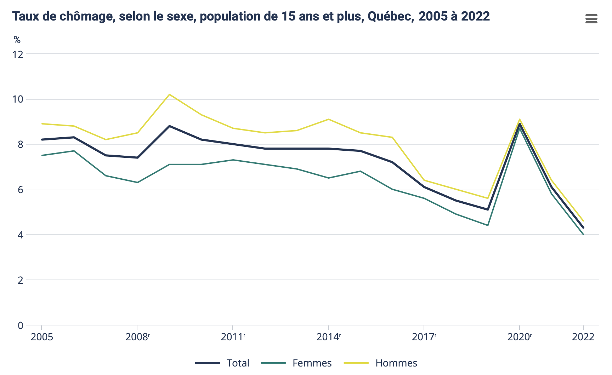
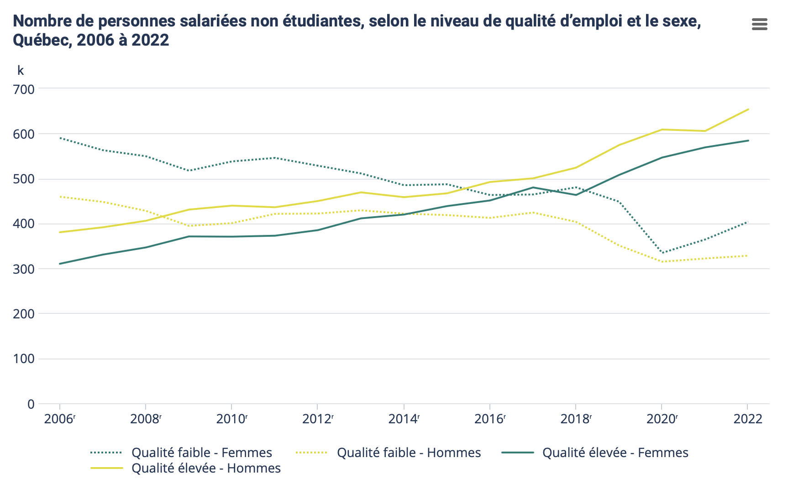

<!-- -->

<!--  --- -->

## <!--fit--> Intelligence artificielle

Daniel Lemire
professeur, Université du Québec (TÉLUQ)
Montréal :canada:

---

halucination

Retrieval-augmented generation (RAG) 
---

- Reconnaissance d'images
- Synthèse d'images, de vidéos et de textes
- Autocomplétion
- Traduction
- Résumés

Génération d'images (cas de Nicolas)

Génération de questions
---

## <!--fit-->  Qui suis-je?

- Professeur d'informatique à la TÉLUQ (20 ans)
- Directeur du département ST pendant 6 ans (2016-2023)
- Porteur de dossier: bac. en science des données
- Dir. du comité des programmes en informatique
- 4 diplômés au doctorat en informatique cognitive à la TÉLUQ depuis 2018

---

"Il est relativement facile de faire en sorte que les ordinateurs affichent des performances dignes d'un adulte lors de tests d'intelligence, mais il est difficile, voire impossible, de leur donner les compétences d'un enfant d'un an en ce qui concerne la perception et la mobilité." (Paradoxe de Moravec, 1988)

---

1997 : Un puissant ordinateur conçu pour jouer aux échecs (Deep Blue) a battu le champion du monde (Kasparov).

---

2009 : Un programme informatique (Pocket Fritz) fonctionnant sur un téléphone portable atteint le niveau de Grand Maître aux échecs.

---

2011 : L'État du Nevada autorise les voitures autonomes à circuler dans ses rues. 

IBM Watson, un puissant système informatique, bat les meilleurs humains au jeu Jeopardy. 

---

2016 : L'intelligence artificielle bat un joueur de Go professionnel. 

Tesla équipe toutes ses voitures d'un système de conduite autonome.

---

2017 : DeepStack devient le premier programme informatique à battre des joueurs de poker professionnels au poker sans limite.

Une entreprise allemande, DeepL, réalise une percée dans la qualité de la traduction automatique en utilisant un ordinateur de 5,1 pétaflops.

Une équipe de Google (Alphabet/DeepMind) a créé un système informatique (AlphaZero) capable d'apprendre des jeux comme le Go et les échecs en quelques heures, en se basant uniquement sur les règles, puis de battre les meilleurs systèmes logiciels et tous les êtres humains.

---

2022 : ChatGPT est largement considéré comme une percée de l'IA : il peut produire des dissertations complètes dans diverses langues.

---

*Nous avons constaté qu'un étudiant utilisant l'intelligence artificielle peut réaliser des travaux de programmation sans éveiller les soupçons de MOSS, un outil de détection de plagiat et de similarité logicielle largement utilisé. Cela est vrai malgré le fait que l'intelligence n'a pas été formé aux problèmes en question et qu'il n'a pas reçu d'exemples pour travailler.*

https://dl.acm.org/doi/abs/10.1145/3511808.3557079

---

2023

*GPT-4 a atteint le 90e centile à l'examen du barreau, le 93e centile lors d'un examen de lecture du SAT et le 89e centile lors de l'examen de mathématiques du SAT.*

https://www.cnbc.com/2023/03/14/openai-announces-gpt-4-says-beats-90percent-of-humans-on-sat.html

---

2023

*Des évaluations approfondies des passages de lecture générés et des questions d'exercice correspondantes, menées à la fois automatiquement et manuellement, démontrent que la matière générée par le système est adaptée aux étudiants et dépassent même la qualité du matériel écrits par des humains.*

https://aclanthology.org/2023.bea-1.52/

---

GPT-4 obtient une moyenne de 49.4% aux examens de 10 cours de physique à l'Université Durham

https://arxiv.org/pdf/2306.15609.pdf

---

2024: 

*Notre analyse empirique compare les analyses d'une intelligence artificielle aux analyses des juristes expérimentés. L'intelligence artificielle dépassent la précision humaine dans la détermination des questions juridiques. En termes de rapidité, les intelligences artificielles réalisent des examens en quelques secondes seulement, éclipsant les heures nécessaires à leurs homologues humains. Sur le plan des coûts, les intelligences artificielles  fonctionnent à une fraction du prix, offrant une réduction stupéfiante de 99,97 % par rapport aux méthodes traditionnelles.*

https://arxiv.org/pdf/2401.16212.pdf

---

2024

*Étant donné les compétences considérables des intelligences artificielles, les examens non surveillés sont très vulnérables.*

https://iopscience.iop.org/article/10.1088/1361-6552/ad1fa2/meta

---

*Le GPT-4 fait preuve d'une compétence exceptionnelle dans la résolution de problèmes financiers, atteignant un taux de précision de 85%. Il donne rarement des réponses complètement incorrectes ou non pertinentes.*

https://www.tandfonline.com/doi/full/10.1080/08832323.2023.2253963

---

*Nous nous dirigeons vers un avenir où il ne sera plus nécessaire d'écrire des programmes informatiques.* (Matt Welsh, May 2023)

https://learning.acm.org/techtalks/endporgramming

---

*Aucune donnée historique ou contemporaine convaincante ne suggère que les progrès technologiques nous conduisent vers un avenir sans emploi. Au contraire, nous prévoyons qu'au cours des deux prochaines décennies, les pays industrialisés auront plus d'offres d'emploi que de travailleurs pour les occuper, et que la robotique et l'automatisation joueront un rôle de plus en plus crucial pour combler ces lacunes.* (Autor, 2022)

---

 

---

 

---

 

*Il faudra de nombreuses années avant que l'intelligence artificielle générative ait un effet mesurable sur l'économie dans son ensemble. Nous ne sommes pas confrontés à une singularité technologique imminente.*

https://cacm.acm.org/blogs/blog-cacm/273606-chatgpt-is-not-a-technological-singularity

---

* Les employeurs ont besoin de professionnels capables d'utiliser l'intelligence artificielle.

---

* Frozen in time.

---

manque de main d'oeuvre.

Innovation dans les entreprises partout au québec, etc.

waterfall

Principe de subsidiarité
Le principe de subsidiarité est une maxime politique et sociale selon laquelle la responsabilité d'une action publique, lorsqu'elle est nécessaire, revient à l'entité compétente la plus proche de ceux qui sont directement concernés par cette action.

https://www.vice.com/en/article/dy3jbz/scientific-journal-frontiers-publishes-ai-generated-rat-with-gigantic-penis-in-worrying-incident?utm_source=Live+Audience&utm_campaign=98305e0a4a-briefing-ai-20240220&utm_medium=email&utm_term=0_b27a691814-98305e0a4a-51138468&mc_cid=98305e0a4a&mc_eid=9a6a1f72a7

It seems the chatbot was more generous and thoughtful than Air Canada would like. I, for one, welcome the generosity of our new chabot overlords. 

https://arstechnica.com/tech-policy/2024/02/air-canada-must-honor-refund-policy-invented-by-airlines-chatbot/
 

---

Utilisateur
Pourriez-vous me dire ce que représente 80 fois 29 ? S'il vous plaît, n'écrivez PAS de code ou, mais dites-moi simplement ce que vous pensez être la réponse sans utiliser d'outils.

IA: 80 fois 29 est égal à 2 320.

---

Utilisateur
Comment as-tu calculé cela ?

Pour calculer 80 fois 29 dans ma tête, j'ai utilisé une stratégie de multiplication de base, en divisant le processus en parties plus faciles. Voici comment j'ai procédé, étape par étape :
Je reconnais que multiplier par 80 revient à multiplier par 8 et à ajouter un zéro à la fin du produit.
Je commence donc par multiplier 29 par 8.
Je sais que 30 fois 8 donne 240, puisque 3 fois 8 donne 24, et que l'on ajoute un zéro lorsqu'on multiplie par 10.
Comme j'ai ajouté un 8 supplémentaire (en passant de 29 à 30), je soustrais 8 de 240 et j'obtiens 232.
Enfin, je me souviens que j'ai remplacé la multiplication par 80 par la multiplication par 8. J'ajoute donc un zéro à la fin de 232 pour en tenir compte, ce qui donne un résultat de 2 320.
Il s'agit d'une méthode simplifiée de calcul mental que j'ai utilisée pour obtenir la réponse sans l'écrire ni utiliser de calculatrice.

---

Pour être utiles, les intelligences artificielles doivent s'incarner dans le monde, et c'est souvent le monde qui détermine leur rythme d'innovation. La pensée ne suffit pas. Si elle ne mène pas d'expériences, ne construit pas de prototypes, ne connaît pas d'échecs et ne s'engage pas dans la réalité, une intelligence peut avoir des pensées, mais pas de résultats. Elle ne peut pas résoudre les problèmes du monde par la pensée.

Kevin Kelly, Thinkism https://en.wikipedia.org/wiki/Kevin_Kelly_(editor)

---

"For a successful technology, reality must take precedence over public relations, for Nature cannot be fooled.”  

- Richard P. Feynman

IA -- automisation, bicycle for the mind

"Air Canada's chatbot gave a B.C. man the wrong information. Now, the airline has to pay for the mistake"

https://bc.ctvnews.ca/air-canada-s-chatbot-gave-a-b-c-man-the-wrong-information-now-the-airline-has-to-pay-for-the-mistake-1.6769454

tous les articles de wikipedia: 22.14 GB (sans les images et contenu multimédia)

goliath 50 - 100 milliards d'instructions par token
goliath-120b.Q8_0.gguf
117GB

mixtral 8 - 50  milliards d'instructions par token
mixtral-8x7b-instruct-v0.1.Q8_0.gguf
 47G

 Un carte SD 128 GB, sur amazon 17$.

I discovered, to my amazement, that all through history there had been resistance ... and bitter, exaggerated, last-stitch resistance ... to every significant technological change that had taken place on earth. Usually the resistance came from those groups who stood to lose influence, status, money...as a result of the change (Isaac Asimov)

Our empirical analysis benchmarks LLMs against a ground truth set by Senior Lawyers, uncovering that advanced models match or exceed human accuracy in determining legal issues. In speed, LLMs complete reviews in mere seconds, eclipsing the hours required by their human counterparts. Cost-wise, LLMs operate at a fraction of the price, offering a staggering 99.97 percent reduction in cost over traditional methods.

https://arxiv.org/pdf/2401.16212.pdf

Le produit intérieur bruit du Canada en 2023 était de  2100 milliards de dollars.
La valeur en bourse de Nvidia a atteint 2000 milliards de dollars en 2024.

Human-level AI will eventually be trainable by someone no more experienced than a graduate student using the resources offered in any standard-sized university lab cluster.
https://digitalspirits.substack.com/p/moores-law-for-intelligence

Finance worker pays out $25 million after video call with deepfake ‘chief financial officer’

https://amp.cnn.com/cnn/2024/02/04/asia/deepfake-cfo-scam-hong-kong-intl-hnk/index.html

Software is eating the world
Andreessen
https://a16z.com/why-software-is-eating-the-world/

===
13 mars

10 h à 10 h 30

prise de conscience.

1h et 1h15

avant-midi au complet

perte d'emplois.

De nombreuses voix s'élèvent aujourd'hui pour réclamer une réglementation de l'intelligence artificielle. Il est probable que certains gouvernements envisagent des réglementations visant à empêcher les employeurs de remplacer les travailleurs par l'intelligence artificielle. Il est bon de rappeler que nous sommes déjà passés par là. Bastiat, économiste et philosophe français du XXe siècle, a posé la question suivante : "Qu'est-ce que la richesse ? Est-elle constituée de l'effort que nous déployons pour obtenir un résultat, ou est-ce le résultat lui-même ?" À l'époque, les hommes politiques craignaient que le train et d'autres innovations industrielles ne suppriment trop d'emplois. Comme on pouvait s'y attendre, le train a supprimé des emplois, mais en a créé beaucoup d'autres que les gens ne pouvaient pas imaginer. Les emplois existants ne sont pas la raison pour laquelle les États-Unis sont un pays riche : les États-Unis sont riches grâce à tout ce qu'ils produisent.

L'intelligence artificielle est indiscernable de "l'automatisation par le logiciel". Toute l'industrie du logiciel n'est rien d'autre qu'une machine à automatiser les emplois existants. Les programmeurs de logiciels sont experts dans l'art de se rendre obsolètes. Pourtant, le pourcentage d'Américains employés dans l'industrie du logiciel a augmenté massivement au cours des dix dernières années, tout comme la part du PIB total attribuée au logiciel.

Ce que les gens font dans l'industrie du logiciel ne cesse de changer. Mais il y a toujours plus d'emplois qui naissent de la destruction créative constante des logiciels. Entre 2001 et 2017, le nombre de développeurs d'applications a doublé aux États-Unis, et leur salaire moyen a augmenté de 50 %.

À court terme, il y a fort à parier que l'industrie informatique continuera à croître et à créer des emplois : les percées de l'intelligence artificielle pourraient même accélérer la tendance. La tendance de fond est évidente depuis longtemps et ne montre aucun signe d'affaiblissement : "Le logiciel est en train de manger le monde" (Marc Andreessen).

Qu'en est-il de l'économie dans son ensemble ? Aujourd'hui, aux États-Unis, le taux de chômage est l'un des plus bas de ces 20 dernières années, bien en dessous de 4 %. Le ratio emploi/population pour les femmes est à peu près le même qu'il y a 20 ans. Le taux d'emploi des hommes est au même niveau qu'il y a dix ans : il a chuté après la récession de 2008 et ne s'est jamais rétabli. Ce phénomène touche principalement les jeunes hommes, dont le taux d'activité s'est rapproché de celui des femmes au fil du temps, et il est plus susceptible de refléter des changements culturels que l'impact de l'intelligence artificielle.

Si nous étions en train de supprimer des emplois grâce à la technologie, la première indication serait une productivité beaucoup plus élevée des travailleurs : nous ferions plus avec moins de personnes. Toutefois, l'Office of Productivity and Technology des États-Unis suggère que les gains de productivité enregistrés récemment ne sont pas d'une ampleur historique.

https://cacm.acm.org/blogs/blog-cacm/273606-chatgpt-is-not-a-technological-singularity/fulltext

search engines were once AI, spam detection, and so forth. A better term might be software automatization.
the printing press was an automated scribe.

In retrospect, banning technology is rarely seen as the right move. The Ottoman empire severely restricted books and went from the most advanced society in the world, to a backward futile empire. What happened to teachers who banned wikipedia.

niveau tâche... nature... 

Hundreds of driverless cars are now an everyday part of traffic in San Francisco as they shuttle passengers across town, but how safe are they and how do they compare to human drivers? Waymo, owned by Google's parent company Alphabet, just released a new study that attempts to shed light on its own track record as one of San Francisco's largest driverless car companies. The findings, described as first-of-its-kind research, make the case that Waymo's driverless fleet is able to steer clear of certain types of collisions at a higher rate than human drivers.

https://www.nbcbayarea.com/investigations/googles-waymo-safety-study-on-driverless-cars/3311188/

continuité.

inquiétude remplacement des jobs...

la mise en oeuvre, la portée informationnelle...

1987... knowledge navigator

conception vidéo
analyse des places

règlements des études -- interrogé

===

collaboration en ligne

===

STP copilot 

forêts

- Pas conscient du ai 

- modèles 

Quel sera l'effet des voitures intelligentes capables de se conduire toutes seules ? Certainement, on devrait voir des pertes d'emploi chez les chauffeurs, mais ces pertes sont compensés pas de nouveaux emplois: spécialistes en science des données, ingénieurs en informatique, etc.

Automatisation tend à augmenter la productivité. Une productivité accrue tend à générer des revenus supplémentaires.

L'automatisation d'une partie de la tâche d'un employé peut donner à l'employé une plus grande valeur. Par exemple, pensons à un comptable sans calculatrice. Le comptable serait réduit à faire des sommes et des multiplications sur un boulier, contribuant peu à l'entreprise. Son statut social serait moindre.

Cet effet n'est pas assuré. Les propriétaires de calèche n'ont pas bénéficié de la venue de l'automobile. Les compagnies de taxi partout dans le monde ont été amoché par Uber et l'informatique mobil.

Il y a donc des gagnants et des perdants. Ceux qui sont mieux à même de s'adapter gagnent, tandis que ceux qui sont pris de court et doivent 'résister' tendent à perdre, inexorablement.

Les universités peuvent jouer un rôle en aidant les travailleurs déplacés par la technologie à travailler avec l'intelligence artificielle. 

'We know more than we can tell' (Polanya)

L'automatisationon prend du temps et elle n'est pas toujours rentable. Par exemple, les banques ont encore des humains dans leurs succursales, même si on a automatisé une grande partie des activités. Ces humains tendent à se concentrer sur des opérations spécifiques, et complexes, qu'on pourrait parfois automatiser, mais une analyse coût-bénéfice pourrait montrer qu'il faudrait des décennies ou plus pour rentabiliser l'investissement.

Software is eating the world.

Où est le numérique et l'intelligence articielle?

Baccalauréat en administration (cheminement général) (7764)
Baccalauréat en administration (cheminement général bilingue - français/anglais) (7364)
Baccalauréat en administration (concentration en comptabilité et finance) (6774)
Baccalauréat en administration (concentration en développement local et économie sociale) (6771)
Baccalauréat en administration (concentration en économie) (6775)
Baccalauréat en administration (concentration en entrepreneuriat) (6772)
Baccalauréat en administration (concentration en gestion des ressources humaines) (7564)
Baccalauréat en administration (concentration en gestion des services de santé et des services sociaux) (6773)
Baccalauréat en administration (concentration en management) (6768)
Baccalauréat en administration (concentration en marketing) (6769)
Baccalauréat en administration (concentration en planification financière) (6770)

Les universités sont majoritairement féminines, mais la fréquentation des femmes en informatique diminue par rapport à celle des hommes depuis 30 ans.

Passons aux emplois. Waymo a certainement et visiblement supprimé le conducteur de la voiture. Mais il a également créé de nombreux autres emplois qui n'existaient pas auparavant et qui sont beaucoup moins visibles - l'étiqueteur humain qui aide à collecter des données d'entraînement pour les réseaux neuronaux, l'agent d'assistance qui se connecte à distance aux véhicules qui rencontrent des problèmes, les personnes qui construisent et entretiennent la flotte de voitures, les cartes, etc. Toute une nouvelle industrie de capteurs divers et d'infrastructures connexes est créée pour assembler ces voitures hautement instrumentées et de haute technologie. De la même manière, en ce qui concerne le travail en général, de nombreux emplois changeront, d'autres disparaîtront, mais de nombreux nouveaux emplois apparaîtront également. Il s'agit davantage d'une refonte du travail que d'une suppression directe, même si la suppression est l'élément le plus important. Il est difficile d'affirmer que les chiffres globaux n'auront pas tendance à baisser à un moment donné et au fil du temps, mais cela se produit beaucoup plus lentement qu'une personne regardant naïvement la situation pourrait le penser.

Let’s turn to jobs. Certainly, and visibly, Waymo has deleted the driver of the car. But it has also created a lot of other jobs that were not there before and are a lot less visible - the human labeler helping to collect training data for neural networks, the support agent who remotely connects to the vehicles that run into any trouble, the people building and maintaining the car fleet, the maps, etc. An entire new industry of various sensors and related infrastructure is created to assemble these highly-instrumented, high-tech cars in the first place. In the same way with work more generally, many jobs will change, some jobs will disappear, but many new jobs will appear, too. It is a lot more a refactoring of work instead of direct deletion, even if that deletion is the most prominent part. It’s hard to argue that the overall numbers won’t trend down at some point and over time, but this happens significantly slower than a person naively looking at the situation might think.

https://web.archive.org/web/20240122062223/http://karpathy.github.io/2024/01/21/selfdriving-agi/

Zuckerberg's Meta Is Spending Billions to Buy 350,000 Nvidia H100 GPUs

Mark Zuckerberg plans on acquiring 350,000 Nvidia H100 GPUs to help Meta build a next-generation AI that possesses human-like intelligence. The 350,000 number is staggering, and it’ll also cost Meta a small fortune to acquire. Each H100 can cost around $30,000, meaning Zuckerberg’s company needs to pay an estimated $10.5 billion just to buy the computing power, not to mention paying all the electricity costs.

https://t.co/EpSTlMGmne

https://www.pcmag.com/news/zuckerbergs-meta-is-spending-billions-to-buy-350000-nvidia-h100-gpus

Author admits she used ChatGPT to write parts of prize-winning novel

https://www.telegraph.co.uk/world-news/2024/01/18/author-used-chatgpt-ai-to-write-prize-winning-novel-japan/

Mark Zuckerberg’s new goal is creating artificial general intelligence
And he wants Meta to open source it. Eventually. Maybe.

https://pbs.twimg.com/card_img/1748043011655630848/_o_NrvbJ?format=jpg&name=medium

https://thenota.com/post/2023/dec/20/ai-authored-novel-wins-literary-award-in-china/

https://www.youtube.com/watch?v=dUxD-WYNOyw

