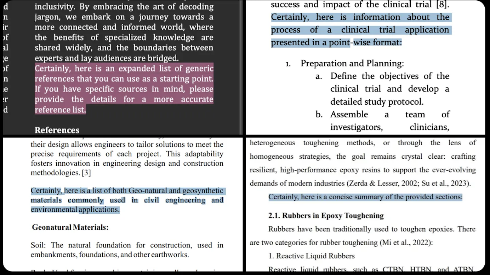
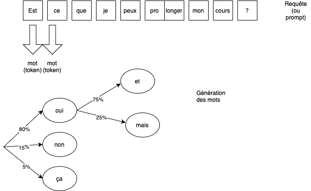
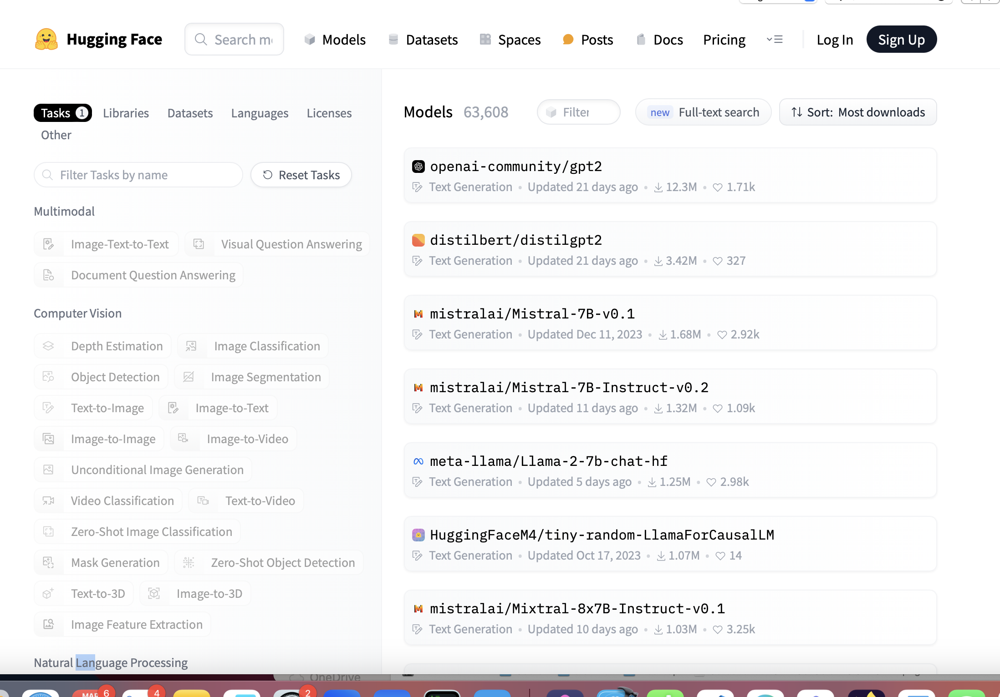
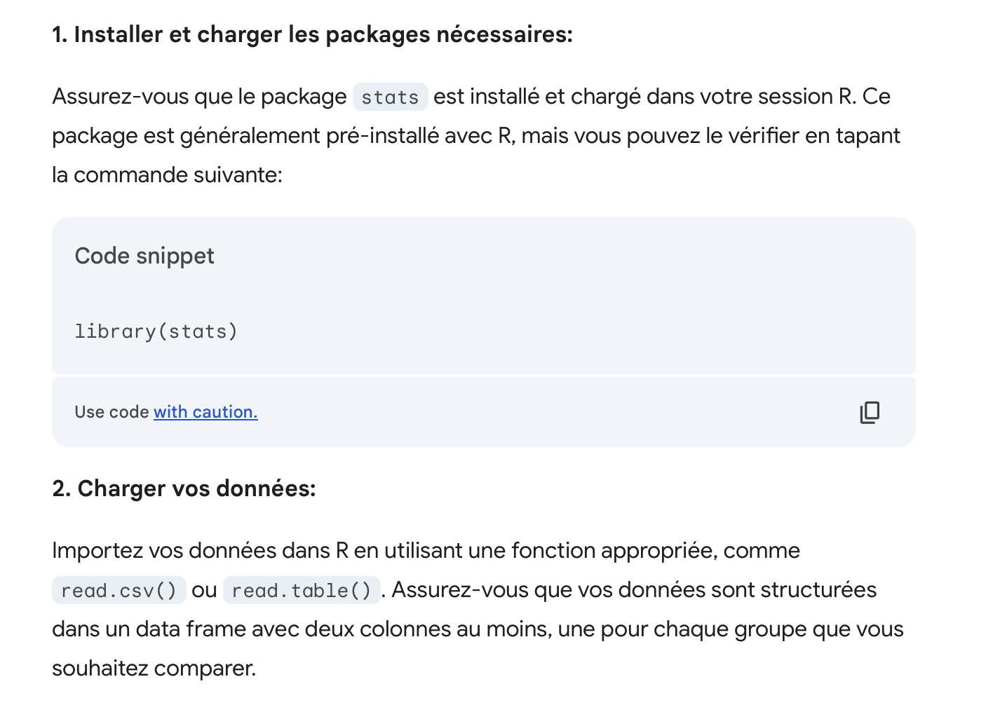
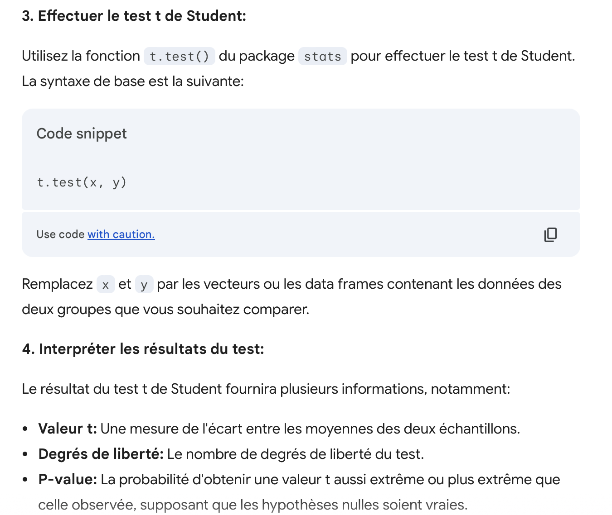
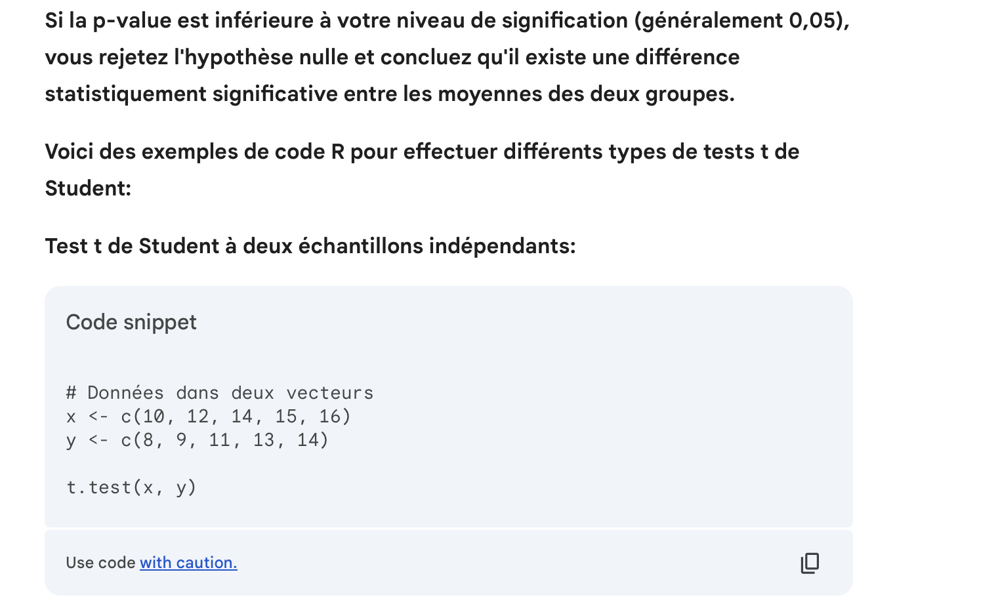
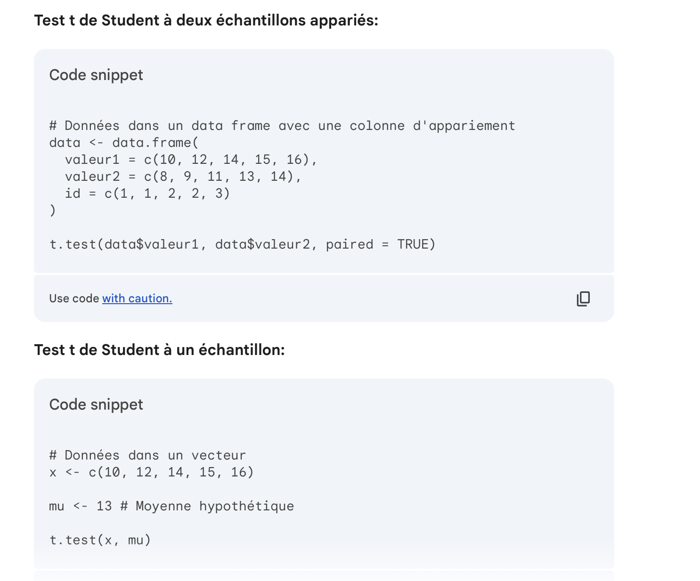

<!-- -->

<!--  --- -->

## <!--fit--> Intelligence artificielle

Daniel Lemire
professeur, Université du Québec (TÉLUQ)
Montréal :canada:

---

## 1950

*Je pense que dans une cinquantaine d'années, il sera possible de programmer les ordinateurs de manière à ce qu'un interrogateur moyen n'ait pas plus de 70 % de chances de reconnaître qu'il s'agit d'une machine.*

(Alan Turing)

---

## 2011

 L'État du Nevada autorise les voitures autonomes à circuler dans ses rues. 

---

## 2016

Un professeur d'informatique (Georgia Tech.) disposait d'un ensemble d'assistants de personnes tutrices en ligne, toutes humaines à l'exception d'un robot. Un  étudiant de la classe a découvert que l'un des assistants n'était pas un être humain, parce qu'il avait tendance à répondre aux questions beaucoup plus rapidement que les autres. 

https://www.washingtonpost.com/news/innovations/wp/2016/05/11/this-professor-stunned-his-students-when-he-revealed-the-secret-identity-of-his-teaching-assistant/

---

## 2018

- BERT
- GPT-1

---

## 2020

Retrieval-Augmented Generation for Knowledge-Intensive NLP Tasks

Lewis et al. (Facebook)

https://arxiv.org/abs/2005.11401

---

## 2022 

ChatGPT est largement considéré comme une percée de l'IA : il peut produire des dissertations complètes dans diverses langues.

GPT-3.5

---

## 2023

*GPT-4 a atteint le 90e centile à l'examen du barreau en Californie.*

https://www.cnbc.com/2023/03/14/openai-announces-gpt-4-says-beats-90percent-of-humans-on-sat.html

--- 

## 2023

It is estimated that slightly over 1% of all articles published in 2023 were LLM-assisted, though this number could be extended 

(Gray, 2024)

https://arxiv.org/abs/2403.16887

---

## 2024

Liang et al. (2024), Mapping the Increasing Use of LLMs in Scientific Papers
https://arxiv.org/pdf/2404.01268.pdf

---

---

---

---

## La technologie

---

Un moteur de recherche n'est qu'un chatbot très bête.
(Pedro Domingos)

---

- token (mot)
- température
- fenêtre de contexte

---

---

---

## Dizaines de milliers de modèles open source

---

## Apprentissage/inférence

- L'apprentissage est distinct de l'application du modèle.

- Le  modèle est fixe. GPT-3 est GPT-3. Il ne s'améliore pas quand on l'utilise.

---

## Hallucination

Intégration des connaissances : ça nous prend du contenu... un manuel, des notes de cours, etc.

*Retrieval-augmented generation (RAG)* ou génération améliorée par récupération.

---

Est-ce que les dictées aident les enfants à mieux écrire en français ?

--

Oui, les dictées sont un excellent moyen d’améliorer l’écriture en français, tant pour les enfants que pour les adultes. Voici quelques avantages des dictées :

Orthographe et Syntaxe : Faire une dictée permet d’améliorer l’orthographe et la syntaxe des mots entendus lors de l’exercice. En écoutant attentivement et en écrivant correctement, on renforce sa maîtrise de la langue.
Enrichissement du Vocabulaire : Les dictées exposent souvent à des mots inconnus ou peu fréquemment rencontrés. Elles permettent d’élargir le vocabulaire et d’apprendre de nouveaux termes.
Conjugaison : Les dictées offrent l’occasion de pratiquer la conjugaison en choisissant la bonne forme verbale en fonction du contexte. Cela renforce la compréhension des règles grammaticales.
En somme, les dictées sont un outil pédagogique efficace pour perfectionner ses compétences en français. Que ce soit à l’école, à la maison ou même en ligne, elles constituent un exercice utile et ludique. Si vous cherchez des dictées spécifiquement adaptées aux enfants, il existe également des ressources amusantes pour les aider à s’exercer

---

## Synthèse

---

## Synthèse

---

## Correction

Mon anglais n'est pas très bon. Est-ce que tu peux corriger ce texte: « I has write a book. It is a good books but it has flaw. Maybe I would write in French next times. »

---

Sure, here is the corrected text:

* Original: "I has write a book. It is a good books but it has flaw. Maybe I would write in French next times."
* Corrected: "I have written a book. It is a good book, but it has some flaws. Maybe I will write in French next time."

Here's a breakdown of the corrections:

* "I has write" becomes "I have written". This is the correct past tense conjugation of the verb "to write."
* "a good books" becomes "a good book". "Book" is a singular noun, so it only needs the singular indefinite article "a."
* "it has flaw" becomes "it has some flaws". "Flaw" is a singular noun, but here you're referring to multiple imperfections. "Some" indicates this plurality.
* "Maybe I would write" becomes "Maybe I will write". "Will" is more appropriate when talking about a future possibility.
* "next times" becomes "next time". Since you're only referring to one future instance of writing in French, "time" should be singular.

---

## Génération d'idées

Je suis un chercheur à l'Université TÉLUQ et je veux quantifier l'efficacité de la dictée pour l'apprentissage de la langue française. Comment est-ce que je pourrais procéder ?

---

En tant que chercheur, vous pouvez entreprendre une étude pour quantifier l’efficacité de la dictée dans l’apprentissage de la langue française. Voici quelques étapes que vous pourriez suivre :

Définir vos objectifs de recherche :
* Clarifiez vos objectifs spécifiques. Par exemple, voulez-vous mesurer l’amélioration de l’orthographe, la compréhension grammaticale ou la fluidité de l’expression écrite grâce à la dictée ?

Concevoir votre étude :

* Choisissez un groupe d’élèves (par exemple, des élèves du primaire, du collège ou du lycée).
Divisez ce groupe en deux sous-groupes : un groupe expérimental (qui participera à des dictées) et un groupe témoin (qui n’en fera pas).
* Concevez des dictées adaptées au niveau des élèves et assurez-vous qu’elles couvrent différents aspects de la langue (orthographe, grammaire, vocabulaire).

Collecter des données :

* Administrez les dictées aux deux groupes.
* Mesurez les performances des élèves (nombre d’erreurs, qualité de l’écriture, etc.).

Analyser les résultats :

* Comparez les performances des deux groupes.
* Utilisez des tests statistiques appropriés pour évaluer l’efficacité de la dictée.

Interpréter les résultats :

* Si le groupe expérimental montre une amélioration significative par rapport au groupe témoin, vous pourrez conclure que la dictée est efficace pour l’apprentissage de la langue française.

Réfléchir aux limites :

* Prenez en compte les biais potentiels (par exemple, la motivation des élèves, la durée de l’étude, etc.).
* Pensez à d’autres facteurs qui pourraient influencer les résultats.
* N’oubliez pas de consulter des références scientifiques sur le sujet pour vous inspirer et vous guider dans votre démarche. Bonne recherche ! 

---

## Évaluateurs

Mon étudiant vient de terminer son doctorat sur l'études des changements climatiques sur l'érable à sucre dans la vallée du Saint-Laurent. Est-ce que tu peux me suggérer 5 évaluateurs potentiels pour cette thèse ? Ils doivent lire le français.

(Gemini)

---

Cinq évaluateurs potentiels pour la thèse de votre étudiant :

* Dr. Pierre-Louis Filion, Professeur agrégé, Département des sciences forestières, Université Laval, Québec, Canada. Ses recherches portent sur la physiologie des arbres, l'écologie forestière et les changements climatiques. Il a publié de nombreux articles dans des revues scientifiques de premier plan et a une expertise reconnue dans l'étude de l'érable à sucre. https://www.ffgg.ulaval.ca/departements/sbf/
* Dr. Nathalie Isabel, Professeure associée, Département de biologie, Université du Québec à Montréal, Montréal, Canada. Ses recherches portent sur l'écologie forestière, la dynamique des populations d'arbres et les effets des changements climatiques sur les forêts. Elle a publié de nombreux articles dans des revues scientifiques de premier plan et a une expertise reconnue dans l'étude de l'érable à sucre. https://bio.umontreal.ca/
* Dr. Christian Couture, Scientifique principal, Service canadien des forêts, Ressources naturelles Canada, Québec, Canada. Ses recherches portent sur l'écologie forestière, la sylviculture et les changements climatiques. Il a publié de nombreux articles dans des revues scientifiques de premier plan et a une expertise reconnue dans l'étude de l'érable à sucre. https://natural-resources.canada.ca/home
* Dr. François Doyon, Professeur, Département des sciences forestières, Université du Nouveau-Brunswick, Fredericton, Canada. Ses recherches portent sur l'écophysiologie des arbres, la sylviculture et les changements climatiques. Il a publié de nombreux articles dans des revues scientifiques de premier plan et a une expertise reconnue dans l'étude de l'érable à sucre. https://www.umoncton.ca/umce-foresterie/node/10
* Dr. David Morrissette, Professeur, Département de géographie, Université d'Ottawa, Ottawa, Canada. Ses recherches portent sur la télédétection, la modélisation spatiale et les changements climatiques. Il a publié de nombreux articles dans des revues scientifiques de premier plan et a une expertise reconnue dans l'étude de l'érable à sucre. https://www.uottawa.ca/faculte-arts/geographie-environnement-geomatique

Note: Il est important de vérifier les affiliations et les domaines de recherche actuels de ces chercheurs avant de les contacter pour leur demander d'évaluer la thèse de votre étudiant.

En plus de ces cinq suggestions, vous pouvez également envisager de contacter des chercheurs d'autres universités et instituts de recherche au Canada et aux États-Unis qui travaillent sur l'érable à sucre et les changements climatiques.

Voici quelques ressources supplémentaires qui pourraient vous être utiles pour trouver des évaluateurs potentiels :

* L'Association canadienne de recherche forestière (ACRF): https://www.cif-ifc.org/
* Le Réseau québécois de recherche en foresterie (RQF): https://www.mffp.gouv.qc.ca/publications/enligne/forets/activites-recherche/recherche/index.asp
* L'American Society of Foresters (SAF): https://www.eforester.org/

J'espère que ces informations vous aideront à trouver des évaluateurs qualifiés pour la thèse de votre étudiant.
---

## Programmation?

Comment est-ce que je peux faire un test t de Student en utilisant R ?

---

---

---

---

---

## Revue? 

J'ai écrit un article intitulé « L'effet économique de la pandémie sur les enfants de la Montérégie ». À quelle revue est-ce que je devrais soumettre mon article ?

---

Revues en français:

* Revue d'économie politique: https://www.cairn.info/revue-d-economie-politique.htm (https://www.cairn.info/revue-d-economie-politique.htm) - Se concentre sur l'économie politique et les politiques publiques.
* Santé publique: https://www.cairn.info/revue-sante-publique.htm - Couvre la santé publique, l'épidémiologie et la prévention des maladies.
* Revue des sciences de l'éducation: https://www.erudit.org/en/journals/rse/ - S'intéresse à l'éducation, à la pédagogie et à la didactique.
* Population: https://www.ined.fr/en/publications/editions/population/ - Traite de la démographie, de la population et des questions sociales.

Revues internationales:

* Health Economics: https://www.sciencedirect.com/journal/journal-of-health-economics - Publie des recherches sur l'économie de la santé et les politiques de santé.
* Social Science & Medicine: https://www.sciencedirect.com/journal/social-science-and-medicine - Couvre la santé publique, les sciences sociales et les déterminants de la santé.
* Journal of Educational and Developmental Psychology: https://www.taylorfrancis.com/collections/developmental-psychology-curated/ubxa06?context=ubx - S'intéresse à la psychologie de l'éducation et au développement de l'enfant.
* Child and Adolescent Social Work Journal: https://link.springer.com/journal/10560 - Traite du travail social auprès des enfants et des adolescents.

En plus de ces suggestions, il est important de consulter les guides de publication des revues qui vous intéressent pour vous assurer que votre article correspond à leurs exigences en matière de format, de style et de contenu.

Voici quelques ressources supplémentaires pour vous aider à trouver une revue adaptée à votre article :

* ISOSS List of Social Science Journals: https://portal.issn.org/ - Une base de données de revues en sciences sociales.
* Ulrich's Periodicals Directory: http://ulrichsweb.serialssolutions.com/ - Un répertoire de revues dans tous les domaines.
* Google Scholar: https://scholar.google.com/ - Un moteur de recherche pour la littérature scientifique.

---

## Conclusion

https://www.tvanouvelles.ca/2024/02/26/ia--un-robot-conversationnel-suscite-la-controverse-a-la-teluq

order of the statements matter (middle seem best?)

https://arxiv.org/abs/2403.16887

génération de résumé, prompt initial (comme un chercheur), RAG (fournir les références), question.

Traduction : français, anglais.

Génération de diagramme SVG

https://twitter.com/lifeaftermyphd/status/1769620224461189336?s=61&t=vx8m95Ydj42MgGngWgz7wg

https://garymarcus.substack.com/p/the-exponential-enshittification?utm_source=post-email-title&publication_id=888615&post_id=142644561&utm_campaign=email-post-title&isFreemail=true&r=2lacyn&triedRedirect=true&utm_medium=email

mistral 
google gemini

https://mistral.ai

consommé les données est plus rapide que de produire les données

--- 30 minutes ---

exemples concrets

limites 
hallucination

chatgpt

étape du projet de recherche....

demandes de subvention...

la personne voulait utiliser des données, transformer les données... 

R de Python...

traitement de données...

-- fuite de données ---

copilot -- sécurisé -- bingchat

100% distance 

Neila : institution de l'intelligence appliquée

Outils et applications de l'intelligence artificielle générative.

mistral, gemini, 

bing image create, bing chat

Fondements des grands modèles de la langue (fenêtre, température, token).

Hallucination et génération augmentée par récupération (RAG)

Construction des requêtes : ordre et désordre

Exemples d'application. Assistance à l'écriture d'une demande de subvention.
Utiliser l'intelligence artificielle pour faire un état de l'art. 
Utiliser l'intelligence artificielle générative pour aider à l'analyse de données (code, etc.).

Les règlements et les lois entourant l'utilisation de l'IA. Les outils recommandés. 	Une liste d'outils et de recommendations 
Revue de littérature	
    
meilleurs usages de l'IA en recherche	des idées d'usage additionnelles / des savoirs faire
"Est-il possible d'utiliser l'IA pour faire des recherches documentaires et revues de la littérature fiables (lorsque j'ai tenté, cela inventait des références qui n'existaient pas et créait des contre-sens) et si oui comment?
"	Application et méthodes permettant de garantir la fiabilité 
Former l’étudiant à la critique envers l’IA et à comprendre les différents types d’IA.	Définitions de l’IA, savoir critiquer l’IA, savoir utiliser l’IA de façon critique
comment IA peut  nous aider dans la recherche .	
Automatisation des revues de littérature et de l'analyse des données de recherche en raison du manque d'étudiant.	Des outils, des recettes à expérimenter. 
De mon côté, je serais intéressée à en apprendre davantage sur les ChatBots (pas très connaissante à ce sujet), il semble que les ChatBots permettent de faciliter l'interaction avec d'autres chercheurs. Mais comment ? 	"1) J'aimerais avoir accès à une liste de ressources et d'outils pour faciliter mes propres projets de recherche
2) J'aimerais comprendre comme l'IA me permettrait de renforcer mes compétences en communication écrite (par dans d'autres langues) pour diffuser mes travaux et faciliter le maillage avec d'autres chercheurs du même domaine que moi."
    Identifier des outils et des moyens d'accélérer la recherche le tout en étant efficace et éthiquement responsable.
