<!-- -->

<!--  --- -->

## <!--fit--> Intelligence artificielle

Daniel Lemire
professeur, Université du Québec (TÉLUQ)
Montréal :canada:

---

## Paradoxe de Moravec

*Ce qui est simple pour nous est difficile pour l'IA, et ce qui est difficile pour nous est simple pour l'IA.* (Moravec, 1988)

---

*Ce sont les analystes et les ingénieurs qui risquent d'être remplacés par des machines. Les jardiniers sont assurés d'avoir un emploi pour les décennies à venir.*

Steven Pinker, The Language Instinct, 1994

---

## 1950

*Je pense que dans une cinquantaine d'années, il sera possible de programmer les ordinateurs de manière à ce qu'un interrogateur moyen n'ait pas plus de 70 % de chances de reconnaître qu'il s'agit d'une machine.*

(Alan Turing)

---

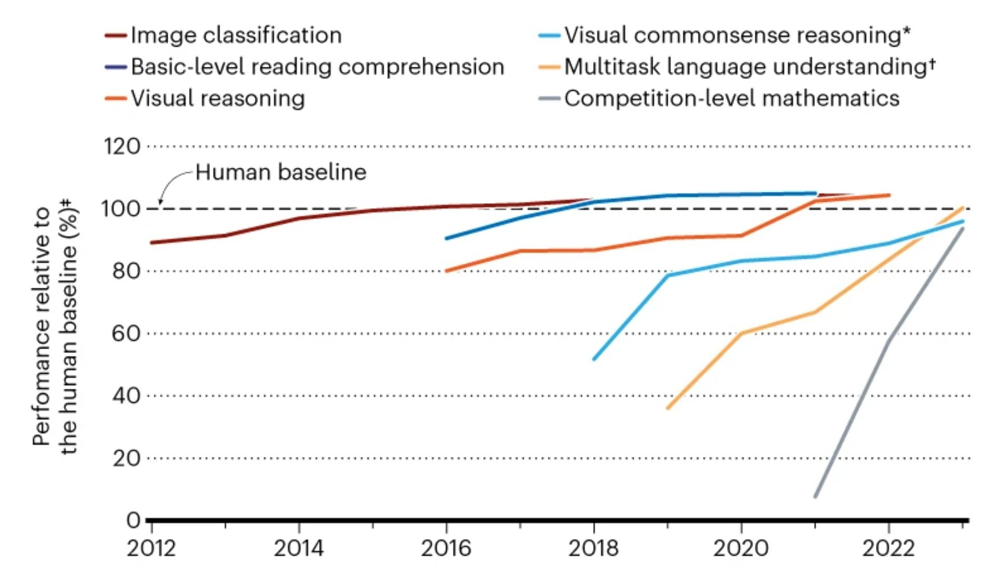

---

## 2023

*GPT-4 a atteint le 90e centile à l'examen du barreau en Californie.*

https://www.cnbc.com/2023/03/14/openai-announces-gpt-4-says-beats-90percent-of-humans-on-sat.html

---

## 2023

Le GPT-4 est un test de QI général qui se rapproche du 99e percentile des performances humaines.

(King, 2023)

---

## 2023

GPT-4 réussit de prestigieux tests menant à des certifications professionnelles:

- [North American Pharmacist Licensure Examination (NAPLEX)](https://www.biorxiv.org/content/10.1101/2023.12.06.570434.full.pdf) (Angel et al. 2023)
- [Offensive Security Certified Professional (OSCP)](https://arxiv.org/pdf/2312.10603) (Noever and Ciolino, 2023)

---
## 2024

L'IA fait des maths aussi bien que les mathématiciens olympiques

IA: 25/30

Moyenne des participants: 15/30

https://www.scientificamerican.com/article/ai-matches-the-abilities-of-the-best-math-olympians/

---

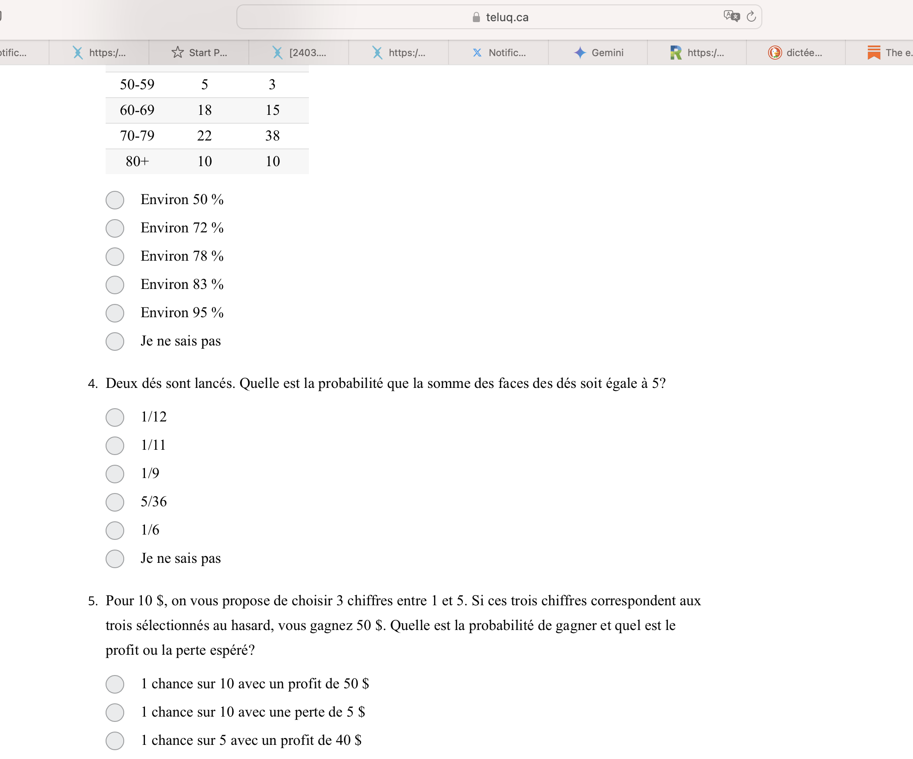

---

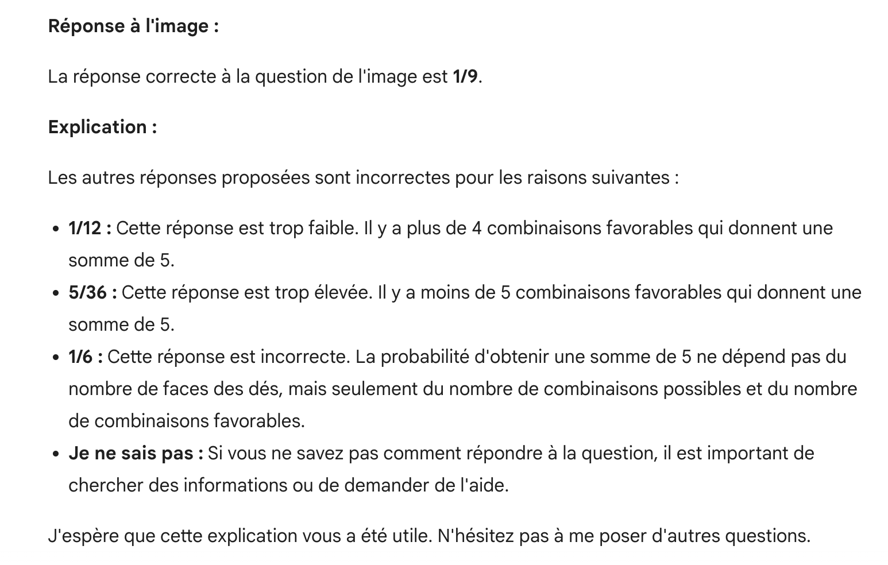

---

## 2024

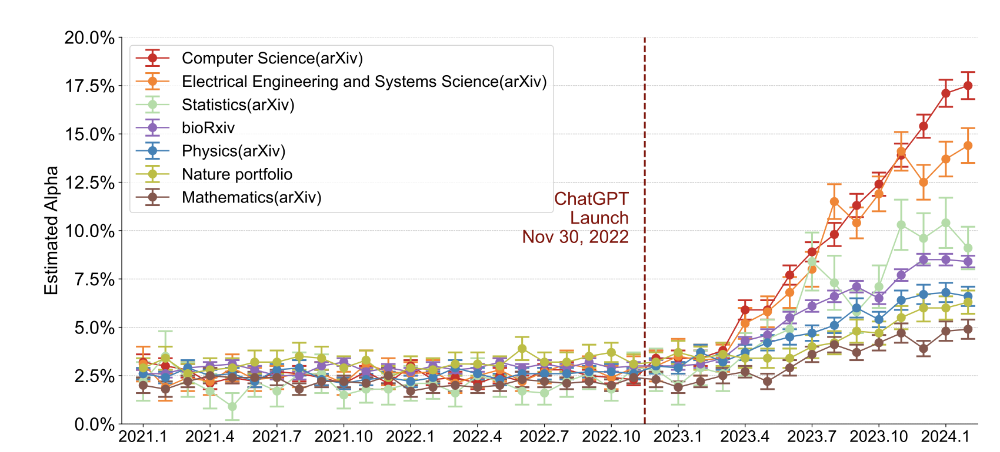

Liang et al. (2024), Mapping the Increasing Use of LLMs in Scientific Papers
https://arxiv.org/pdf/2404.01268.pdf

---

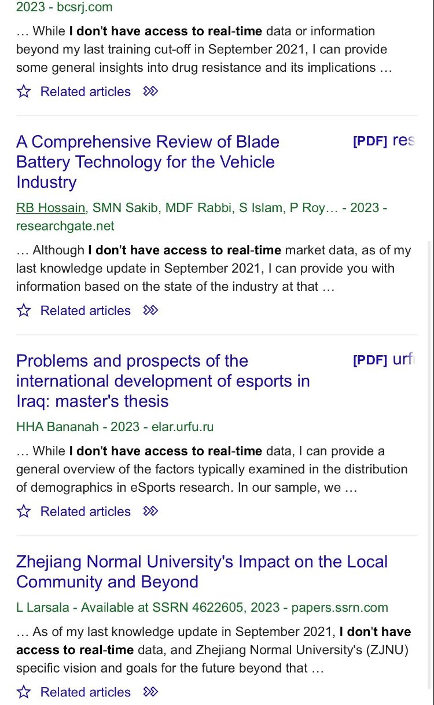

---

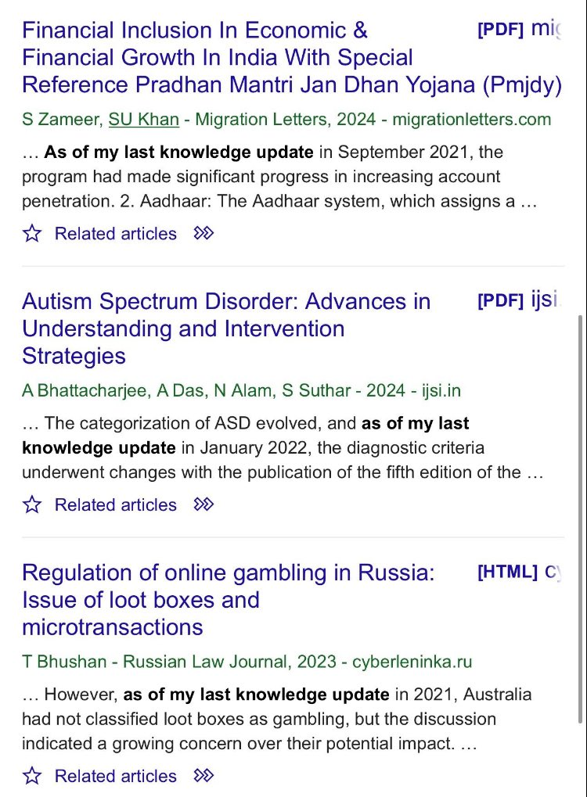

---

## Hallucination

*Retrieval-augmented generation (RAG)* ou génération améliorée par récupération.

[Lewis et al., 2020](https://arxiv.org/abs/2005.11401)

---

## RAG

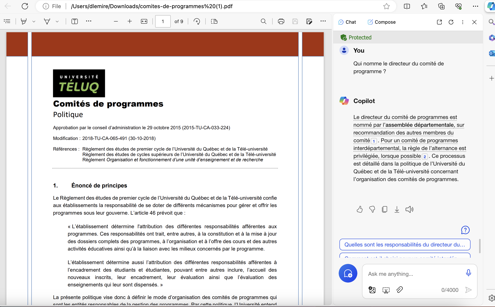

---

## Synthèse

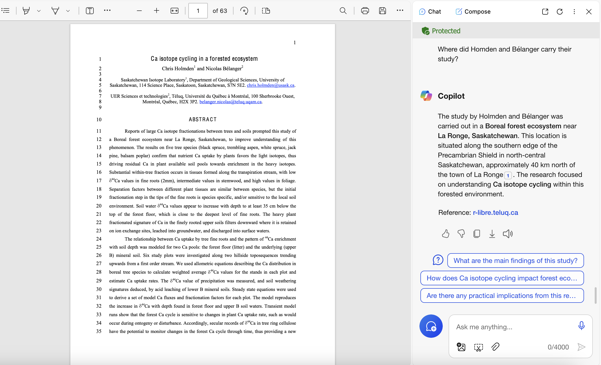

---

## Correction

Mon anglais n'est pas très bon. Est-ce que tu peux corriger ce texte: « I has write a book. It is a good books but it has flaw. Maybe I would write in French next times. »

---

Sure, here is the corrected text:

* Original: "I has write a book. It is a good books but it has flaw. Maybe I would write in French next times."
* Corrected: "I have written a book. It is a good book, but it has some flaws. Maybe I will write in French next time."

Here's a breakdown of the corrections:

* "I has write" becomes "I have written". This is the correct past tense conjugation of the verb "to write."
* "a good books" becomes "a good book". "Book" is a singular noun, so it only needs the singular indefinite article "a."
* "it has flaw" becomes "it has some flaws". "Flaw" is a singular noun, but here you're referring to multiple imperfections. "Some" indicates this plurality.
* "Maybe I would write" becomes "Maybe I will write". "Will" is more appropriate when talking about a future possibility.
* "next times" becomes "next time". Since you're only referring to one future instance of writing in French, "time" should be singular.

---

## Génération d'idées

Je suis un chercheur à l'Université TÉLUQ et je veux quantifier l'efficacité de la dictée pour l'apprentissage de la langue française. Comment est-ce que je pourrais procéder ?

---

En tant que chercheur, vous pouvez entreprendre une étude pour quantifier l’efficacité de la dictée dans l’apprentissage de la langue française. Voici quelques étapes que vous pourriez suivre :

Définir vos objectifs de recherche :
* Clarifiez vos objectifs spécifiques. Par exemple, voulez-vous mesurer l’amélioration de l’orthographe, la compréhension grammaticale ou la fluidité de l’expression écrite grâce à la dictée ?

Concevoir votre étude :

* Choisissez un groupe d’élèves (par exemple, des élèves du primaire, du collège ou du lycée).
Divisez ce groupe en deux sous-groupes : un groupe expérimental (qui participera à des dictées) et un groupe témoin (qui n’en fera pas).
* Concevez des dictées adaptées au niveau des élèves et assurez-vous qu’elles couvrent différents aspects de la langue (orthographe, grammaire, vocabulaire).

Collecter des données :

* Administrez les dictées aux deux groupes.
* Mesurez les performances des élèves (nombre d’erreurs, qualité de l’écriture, etc.).

Analyser les résultats :

* Comparez les performances des deux groupes.
* Utilisez des tests statistiques appropriés pour évaluer l’efficacité de la dictée.

Interpréter les résultats :

* Si le groupe expérimental montre une amélioration significative par rapport au groupe témoin, vous pourrez conclure que la dictée est efficace pour l’apprentissage de la langue française.

Réfléchir aux limites :

* Prenez en compte les biais potentiels (par exemple, la motivation des élèves, la durée de l’étude, etc.).
* Pensez à d’autres facteurs qui pourraient influencer les résultats.
* N’oubliez pas de consulter des références scientifiques sur le sujet pour vous inspirer et vous guider dans votre démarche. Bonne recherche ! 

---

## Évaluateurs

Mon étudiant vient de terminer son doctorat sur l'études des changements climatiques sur l'érable à sucre dans la vallée du Saint-Laurent. Est-ce que tu peux me suggérer 5 évaluateurs potentiels pour cette thèse ? Ils doivent lire le français.

(Gemini)

---

Cinq évaluateurs potentiels pour la thèse de votre étudiant :

* Dr. Pierre-Louis Filion, Professeur agrégé, Département des sciences forestières, Université Laval, Québec, Canada. Ses recherches portent sur la physiologie des arbres, l'écologie forestière et les changements climatiques. Il a publié de nombreux articles dans des revues scientifiques de premier plan et a une expertise reconnue dans l'étude de l'érable à sucre. https://www.ffgg.ulaval.ca/departements/sbf/
* Dr. Nathalie Isabel, Professeure associée, Département de biologie, Université du Québec à Montréal, Montréal, Canada. Ses recherches portent sur l'écologie forestière, la dynamique des populations d'arbres et les effets des changements climatiques sur les forêts. Elle a publié de nombreux articles dans des revues scientifiques de premier plan et a une expertise reconnue dans l'étude de l'érable à sucre. https://bio.umontreal.ca/
* Dr. Christian Couture, Scientifique principal, Service canadien des forêts, Ressources naturelles Canada, Québec, Canada. Ses recherches portent sur l'écologie forestière, la sylviculture et les changements climatiques. Il a publié de nombreux articles dans des revues scientifiques de premier plan et a une expertise reconnue dans l'étude de l'érable à sucre. https://natural-resources.canada.ca/home
* Dr. François Doyon, Professeur, Département des sciences forestières, Université du Nouveau-Brunswick, Fredericton, Canada. Ses recherches portent sur l'écophysiologie des arbres, la sylviculture et les changements climatiques. Il a publié de nombreux articles dans des revues scientifiques de premier plan et a une expertise reconnue dans l'étude de l'érable à sucre. https://www.umoncton.ca/umce-foresterie/node/10
* Dr. David Morrissette, Professeur, Département de géographie, Université d'Ottawa, Ottawa, Canada. Ses recherches portent sur la télédétection, la modélisation spatiale et les changements climatiques. Il a publié de nombreux articles dans des revues scientifiques de premier plan et a une expertise reconnue dans l'étude de l'érable à sucre. https://www.uottawa.ca/faculte-arts/geographie-environnement-geomatique

Note: Il est important de vérifier les affiliations et les domaines de recherche actuels de ces chercheurs avant de les contacter pour leur demander d'évaluer la thèse de votre étudiant.

En plus de ces cinq suggestions, vous pouvez également envisager de contacter des chercheurs d'autres universités et instituts de recherche au Canada et aux États-Unis qui travaillent sur l'érable à sucre et les changements climatiques.

Voici quelques ressources supplémentaires qui pourraient vous être utiles pour trouver des évaluateurs potentiels :

* L'Association canadienne de recherche forestière (ACRF): https://www.cif-ifc.org/
* Le Réseau québécois de recherche en foresterie (RQF): https://www.mffp.gouv.qc.ca/publications/enligne/forets/activites-recherche/recherche/index.asp
* L'American Society of Foresters (SAF): https://www.eforester.org/

J'espère que ces informations vous aideront à trouver des évaluateurs qualifiés pour la thèse de votre étudiant.

---

## Objectifs de recherche

Je dois déposer une demande de subvention pour un projet portant sur les robots conversationnels.
J'ai besoin de deux objectifs à long terme et cinq objectifs à long terme.

---

Bien sûr ! Voici quelques objectifs à long terme que vous pourriez inclure dans votre demande de subvention pour votre projet de robots conversationnels :

- Structurer et accompagner les acteurs de nouvelles chaînes de valeur d’équipements robotiques ou industriels stratégiques : Votre projet pourrait viser à créer des partenariats solides entre les entreprises, les universités et les organismes de recherche pour développer des solutions innovantes dans le domaine des robots conversationnels. Cela pourrait inclure la mise en place de plateformes de collaboration, de consortiums ou de réseaux d’experts.
- Renforcer la souveraineté nationale dans le domaine des robots conversationnels : Vous pourriez chercher à développer des technologies et des compétences spécifiques qui permettront à la France de rester compétitive sur le marché mondial des robots conversationnels. Cela pourrait impliquer la formation de talents locaux, la création de centres d’excellence ou la promotion de la recherche et du développement dans ce domaine.

En ce qui concerne les objectifs à court terme, voici quelques suggestions supplémentaires :

- Développer un prototype fonctionnel de robot conversationnel : Mettez l’accent sur la conception, le développement et la validation d’un prototype de robot conversationnel capable d’interagir avec les utilisateurs de manière fluide et efficace.
- Conduire des études de marché et des analyses de besoins : Identifiez les secteurs d’application les plus prometteurs pour les robots conversationnels et évaluez les besoins spécifiques des utilisateurs. Cela vous aidera à affiner votre approche et à cibler les domaines où votre projet peut avoir le plus grand impact.
- Établir des partenariats avec des entreprises et des institutions de recherche : Collaborez avec des entreprises du secteur, des universités et des laboratoires de recherche pour bénéficier de leurs connaissances et de leurs ressources. Ces partenariats peuvent accélérer le développement de votre projet.
- Définir une feuille de route pour le développement du projet : Élaborez un plan détaillé pour les prochaines étapes de votre projet, y compris les jalons clés, les ressources nécessaires et les délais. Cela montrera que vous avez une vision claire de la manière dont votre projet évoluera.
- Préparer une stratégie de communication et de sensibilisation : Pensez à la manière dont vous allez promouvoir votre projet et sensibiliser le public aux avantages des robots conversationnels. Cela peut inclure des événements, des articles de blog, des présentations, etc.
N’oubliez pas de consulter les détails spécifiques de la subvention pour vous assurer que vos objectifs sont alignés sur les critères d’éligibilité et les priorités du programme12. Bonne chance pour votre demande de subvention ! 🤖🚀

---

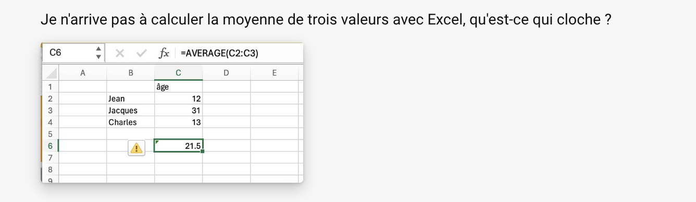

---

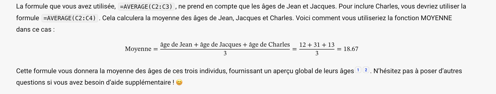

---

## Programmation?

Donne-moi un script R qui est capable de consulter un chiffrier excel nommé donnee.xsl, de calculer la moyenne et la variance des données dans la deuxième colonne.

---

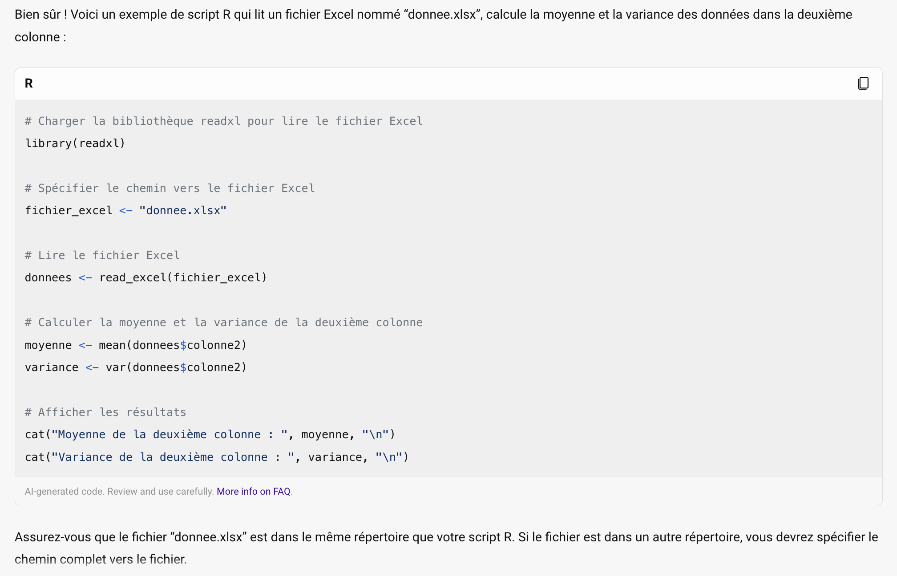

---

## Revue? 

J'ai écrit un article intitulé « L'effet économique de la pandémie sur les enfants de la Montérégie ». À quelle revue est-ce que je devrais soumettre mon article ?

---

Revues en français:

* Revue d'économie politique: https://www.cairn.info/revue-d-economie-politique.htm (https://www.cairn.info/revue-d-economie-politique.htm) - Se concentre sur l'économie politique et les politiques publiques.
* Santé publique: https://www.cairn.info/revue-sante-publique.htm - Couvre la santé publique, l'épidémiologie et la prévention des maladies.
* Revue des sciences de l'éducation: https://www.erudit.org/en/journals/rse/ - S'intéresse à l'éducation, à la pédagogie et à la didactique.
* Population: https://www.ined.fr/en/publications/editions/population/ - Traite de la démographie, de la population et des questions sociales.

Revues internationales:

* Health Economics: https://www.sciencedirect.com/journal/journal-of-health-economics - Publie des recherches sur l'économie de la santé et les politiques de santé.
* Social Science & Medicine: https://www.sciencedirect.com/journal/social-science-and-medicine - Couvre la santé publique, les sciences sociales et les déterminants de la santé.
* Journal of Educational and Developmental Psychology: https://www.taylorfrancis.com/collections/developmental-psychology-curated/ubxa06?context=ubx - S'intéresse à la psychologie de l'éducation et au développement de l'enfant.
* Child and Adolescent Social Work Journal: https://link.springer.com/journal/10560 - Traite du travail social auprès des enfants et des adolescents.

En plus de ces suggestions, il est important de consulter les guides de publication des revues qui vous intéressent pour vous assurer que votre article correspond à leurs exigences en matière de format, de style et de contenu.

Voici quelques ressources supplémentaires pour vous aider à trouver une revue adaptée à votre article :

* ISOSS List of Social Science Journals: https://portal.issn.org/ - Une base de données de revues en sciences sociales.
* Ulrich's Periodicals Directory: http://ulrichsweb.serialssolutions.com/ - Un répertoire de revues dans tous les domaines.
* Google Scholar: https://scholar.google.com/ - Un moteur de recherche pour la littérature scientifique.

---

## Conclusion

- RAG
- Synthèse
- Correction
- Génération d'idées

- Attention au plagiat et à la fraude