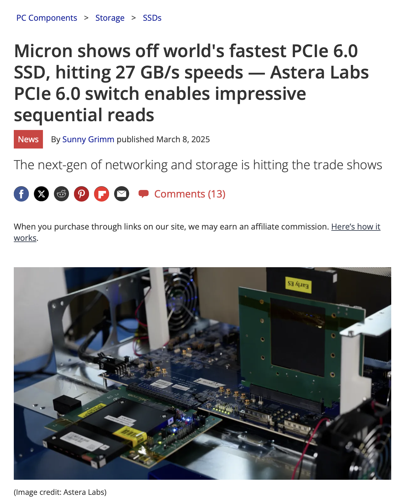

<!-- -->

<!--  --- -->

## <!--fit--> Algorithms for Modern Processor Architectures

Daniel Lemire, professor
Université du Québec (TÉLUQ)
Montréal :canada:

blog: https://lemire.me 
X: [@lemire](https://x.com/lemire)
GitHub: [https://github.com/lemire/](https://github.com/lemire/)

---

# Background

* Bitmap indexes (Google Procella, Lucene, Git, etc.)
* *Fastest JSON parser in the world*
* Number parsing at high speed (GCC, C#/.NET, Rust, Go, main web browsers such as Safari and Chrome)
* Fast unicode functions (main web browsers)
* Random number generation (Linux kernel, FreeBSD libc library, Go, Julia, C# runtime, Numpy, Swift standard library)
* URL parsing (Node.js)
* DNS (zone files)

---

# Time is discrete

- Clock cycle

---

# Some numbers

- Processors: 4 GHz ($4 \times 10^9$ cycles per second)
- One cycle is 0.25 nanoseconds
- light: 7.5 centimeters

- One byte per cycle: 4 GB/s

---

# Memory

`(Data Rate × Bus Width × Number of Channels) / 8`

- Bus Width: 64 bits
- Data Rate: *megatransfers per second* (or MHz)

- 6000 MHz, two channels would be 96 GB/s

---

# LLM

- Llama 4 Maverick
- Total storage 800 GB
- Each expert 34 GB
- Three tokens per second?

 with 17B active parameters out of ~400B total, with 128 experts.
- 17B $\times 2 = 34$ 

---

# High Bandwidth Memory

- Xeon Max processors contain 64 GB of HBM
- Bandwidth 800 GB/s
- 20 tokens per second?

---

# High Bandwidth Memory

- NVIDIA A100 80GB (Ampere Architecture)
- Bandwidth 2000 GB/s
- 50 tokens per second?

---

# Input/Output

PCI Express 4.0 (2011) : 31.5 GB/s (16 lanes)

PCI Express 5.0 (2017) : 63 GB/s (16 lanes)

PCI Express 6.0 (2019) : 128 GB/s (16 lanes)

PCI Express 7.0 (2022) : 242 GB/s (16 lanes)

---

# Disk

- DDR3 (2007) : up to 17 GB/s
- DDR4 (2014) : up to 25 GB/s
- DDR5 (2020) : up to 57 GB/s

---

# Disk bound ?

- 27 GB/s at 4 GHz 
- 6.75 bytes per cycle

---

# How fast is your disk?

PCIe 4 drives: 5 GB/s reading speed (sequential)

PCIe 5 drives: 10 GB/s reading speed (sequential)

PCIe 6 drives 

 

---

## Slide 1: Introduction
- For decades, Dennard scaling drove processor advancements
- Smaller transistors enabled higher clock frequencies and lower power consumption
- Consistent performance gains in hardware and software
- Focus: How to optimize performance in the post-Dennard era

## Slide 2: What is Dennard scaling?
- Principle: Constant power density as transistor size shrinks
- Key outcomes:
  - Increased clock frequencies
  - Reduced power consumption
  - Enhanced computational speed
- Result: Exponential performance improvements

## Slide 3: The end of Dennard scaling
- Over the past two decades, Dennard scaling faltered
- Challenges:
  - Physical constraints (transistor size limits)
  - Thermal constraints (heat dissipation issues)
- Impact:
  - Clock frequencies plateaued
  - Software performance often stagnant
  - Failure to fully utilize hardware capabilities

## Slide 4: Opportunities in modern processors
- Despite challenges, modern processors offer optimization potential
- Advanced architectural features:
  - SIMD instructions (e.g., SVE, AVX-512)
  - Memory-level parallelism
  - Advanced branch predictors
  - Broader superscalar execution

## Slide 5: SIMD instructions
- Single-Instruction-Multiple-Data (SIMD) capabilities
- Examples:
  - Scalable Vector Extensions (SVE)
  - AVX-512
- Benefit: Parallel processing of large datasets
- Application: Data-intensive tasks (e.g., machine learning, image processing)

## Slide 6: Memory-level parallelism
- Improves data access efficiency
- Key aspects:
  - Multiple memory requests handled simultaneously
  - Reduced latency in data retrieval
- Impact: Faster execution for memory-bound applications

## Slide 7: Advanced branch predictors
- Enhances instruction flow
- How it works:
  - Predicts conditional branches in code
  - Reduces pipeline stalls
- Benefit: Smoother execution, fewer delays

## Slide 8: Superscalar execution
- Executes multiple instructions per cycle
- Features:
  - Wider instruction pipelines
  - Increased instruction-level parallelism
- Result: Higher throughput for compute-intensive tasks

## Slide 9: A comprehensive approach
- Proposal: Align software design with hardware capabilities
- Strategy:
  - Robust mathematical models
  - Deep understanding of system architecture
- Goal: Optimize algorithmic design for modern processors

## Slide 10: Insights from case studies
- Practical examples from widely used software
- Observations:
  - Effective use of SIMD for data processing
  - Optimized memory access patterns
  - Branch prediction-aware coding practices
- Lesson: Hardware-aware software design is critical

## Slide 11: Challenges in the post-Dennard era
- Stagnant clock frequencies
- Software struggles to leverage hardware
- Complexity of modern processor features
- Need for specialized knowledge in architecture

## Slide 12: Conclusion
- Dennard scaling fueled decades of progress
- Post-Dennard era requires new strategies
- Key to success:
  - Leverage advanced processor features
  - Align algorithmic design with hardware
- Future: Hardware-software co-design for optimal performance

## Slide 13: Questions
- Open floor for discussion
- How can we further bridge the hardware-software gap?
