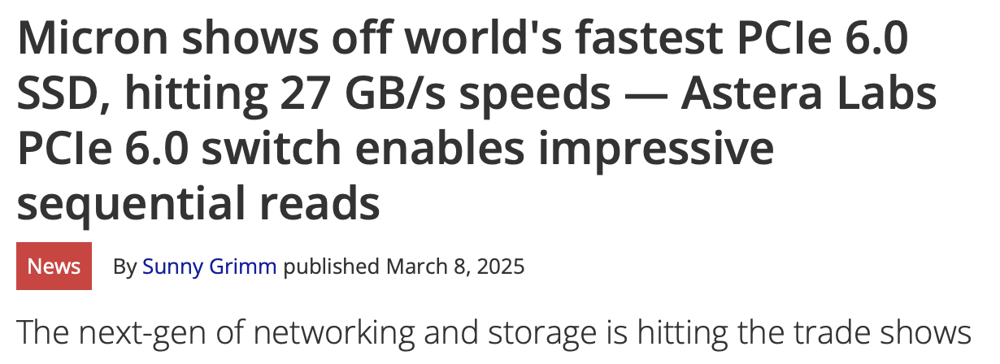
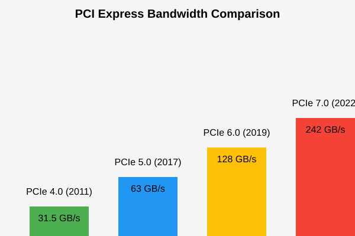
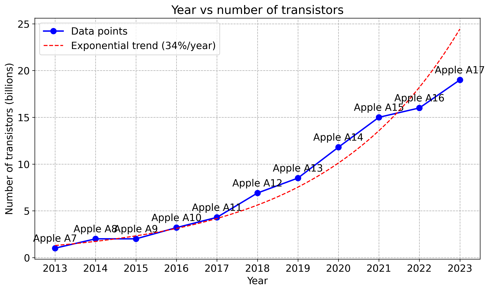
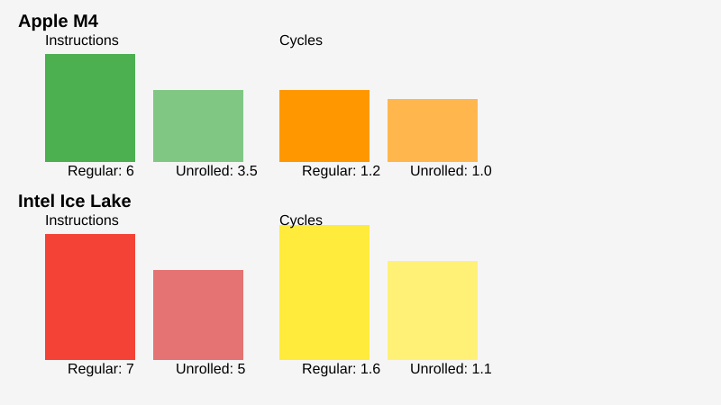
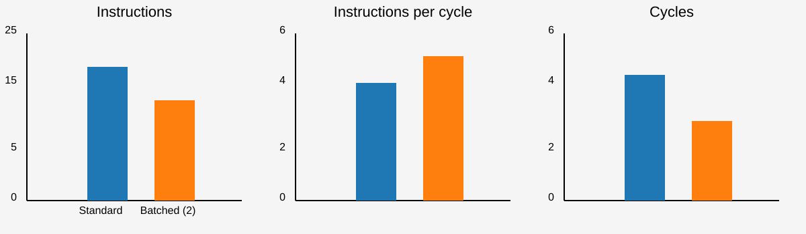
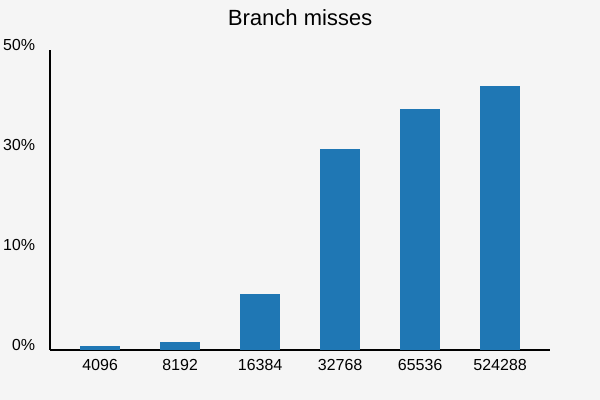
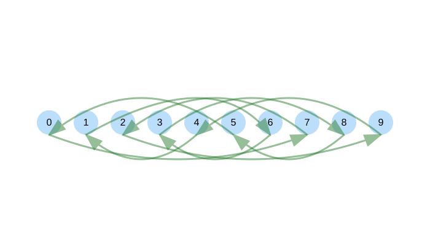
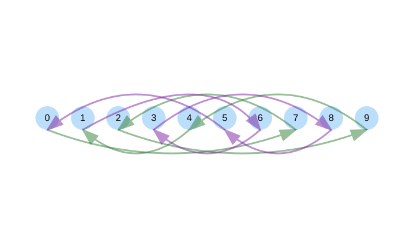
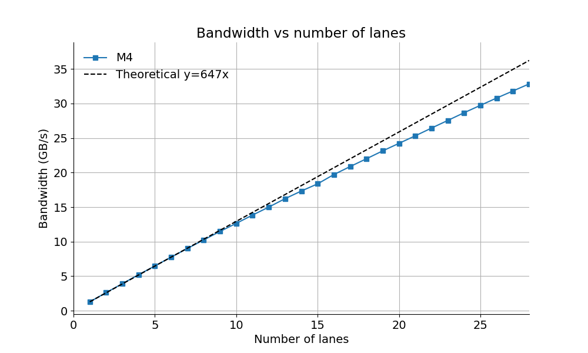
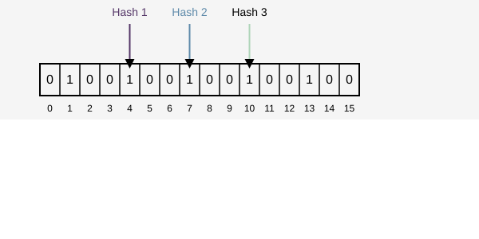

<!-- -->

<!--  --- -->

## <!--fit--> Algorithms for Modern Processor Architectures


Daniel Lemire, professor
Université du Québec (TÉLUQ)
Montréal :canada:

blog: https://lemire.me 
X: [@lemire](https://x.com/lemire)
GitHub: [https://github.com/lemire/](https://github.com/lemire/)

All software for this talk: https://github.com/lemire/talks/tree/master/2025/sea/software

---


# Disk at gigabytes per second




---





---

# High Bandwidth Memory

- Xeon Max processors contain 64 GB of HBM
- Bandwidth 800 GB/s

---


---


# Some numbers

- Time is discrete: clock cycle
- Processors: 4 GHz ($4 \times 10^9$ cycles per second)
- One cycle is 0.25 nanoseconds
- light: 7.5 centimeters per cycle
- One byte per cycle: 4 GB/s

**Easily CPU bound**

---

# Frequencies and transistors

| processor | year  | frequency  | transistors    |
|-----------|-------|------------|----------------|
| Pentium 4 | 2000  | 3.8 GHz    | 0.040 billions | 
| Intel Haswell  | 2013  | 4.4 GHz    | 1.4 billions  | 
| Apple M1  | 2020  | 3.2 GHz    | 16 billions    | 
| Apple M2  | 2022  | 3.49 GHz   | 20 billions    |
| Apple M3  | 2024  | 4.05 GHz   | 25 billions    | 
| Apple M4  | 2024  | 4.5 GHz    | 28 billions    |
| AMD Zen 5 | 2024  | 5.7 GHz    | 50 billions    |


---




---

# Where do the transistors go?

- More cores
- More superscalar execution
- Better speculative execution
- More cache, more memory-level parallelism
- Better data-level parallelism (SIMD)


---

# Where do the transistors go?

- More cores
- More superscalar execution (more instructions per cycle)
- Better speculative execution ($\to$ more instructions per cycle)
- More cache, more memory-level parallelism  ($\to$ more instructions per cycle)
- Better data-level parallelism (SIMD)  ($\to$ fewer instructions)


---

# Superscalar execution

| processor       | year    | arithmetic logic units    | SIMD units |
|-----------------|---------|---------------------------|-----|
| Pentium 4       |  2000   |    2                      | $2 \times 128$ | 
| AMD Zen 2       |  2019   |    4                      | $2 \times 256$ |
| Apple M*       |  2019   |    6+                      | $4 \times 128$ |
| Intel Lion Cove       |  2024   |    6                | $4 \times 256$ |
| AMD Zen 5       |  2024   |    6                      | $4 \times 512$ |

Moving to up to 4 load/store per cycle

---

# Parsing a number

- `1.3321321e-12` to `double`

```cpp
double result;
fast_float::from_chars(
  input.data(), input.data() + input.size(), result);
```

*Reference*: Number Parsing at a Gigabyte per Second, Software: Practice and Experience 51 (8), 2021

---

# Parsing a number


---

# Lemire's Rule 1

> Modern processors execute *nearly* as many instructions per cycle as you can supply.

-  with caveats: branching, memory, and input/output

---

# Lemire's Corrolary 1

> In computational workloads (batches), minimizing instruction count is critical for achieving optimal performance.


---

# Lemire's Tips

1. Batch your work in larger units to save instructions.
2. Simplify the processing down to as few instructions as possible.


---

# Going back to number parsing


- Our number parser: major browsers (Safari, Chrome), GCC (12+), C#, Rust
- About $4 \times$ faster than the conventional alternatives.
- How did we do it?


---

We massively reduced the number of CPU instructions required.

| function | instructions |
|----------|--------------|
| strtod   |     $> 1000$     |
| our parser   |    $\approx 200$     |

*Reference*: 
Number Parsing at a Gigabyte per Second, Software: Practice and Experience 51 (8), 2021


---

## SWAR

- Stands for SIMD within a register
- Use normal instructions, portable (in C, C++,...)
- A 64-bit registers can be viewed as 8 bytes
- Requires some cleverness

---

## Check whether we have a digit

In ASCII/UTF-8, the digits 0, 1, ..., 9 have values
0x30, 0x31, ..., 0x39.

To recognize a digit:

- The high nibble should be 3.
- The high nibble should remain 3 if we add 6 (0x39 + 0x6 is 0x3f)


---


---

# Batching (unrolling)

6 to 7 instructions per multiplication

```cpp
  for (size_t i = 0; i < length; i++)
    sum +=  x[i] * y[i];
```

3 to 5 instructions per mutiplication

```cpp
    for (; i < length - 3; i += 4)
      sum +=  x[i] * y[i] 
             + x[i + 1] * y[i + 1] 
             + x[i + 2] * y[i + 2] 
             + x[i + 3] * y[i + 3];
```


---


<!--# With unrolling, you can get close to 1 store per cycle-->





---

# Knuth's random shuffle


```javascript
PROCEDURE shuffle(array)
    FOR j FROM |array| - 1 DOWN TO 1
        k ← random_integer(0, j)
        SWAP array[j] WITH array[k]
    END FOR
END PROCEDURE
```


---

# Batched random shuffle


- Draw one random number
- Compute two indices (with high proba)
- Reduces the instruction count
- Reduces the number of branches


----

# Results (Apple M4): Use a large array (8 MB).




*Reference*: Batched Ranged Random Integer Generation, Software: Practice and Experience 55 (1), 2025

---

# Branching

Hard-to-predict branches can derail performance


---

# Unicode (UTF-16)

- Code points from U+0000 to U+FFFF, a single 16-bit value.
- Beyond: a surrogate pair `[U+D800 to U+DBFF]` followed `U+DC00 to U+DFFF`


---

# Validate 


- Check for a lone code unit ($x \leq \mathrm{0xD7FF} \lor x\geq \mathrm{0xDBFF}$), if so ok
- Check for the first part of the surrogate ($\mathrm{0xD800} \leq x\leq \mathrm{0xDBFF}$) and if so check that we have the second part of a surrogate

---

# Validate 

```javascript
PROCEDURE validate_utf16(code_units)
    i ← 0
    WHILE i < |code_units|
        unit ← code_units[i]
        IF unit ≤ 0xD7FF OR unit ≥ 0xE000 THEN
            INCREMENT i
            CONTINUE
        IF unit ≥ 0xD800 AND unit ≤ 0xDBFF THEN
            IF i + 1 ≥ |code_units| THEN
                RETURN false
            next_unit ← code_units[i + 1]
            IF next_unit < 0xDC00 OR next_unit > 0xDFFF THEN
                RETURN false
            i ← i + 2  // Valid surrogate pair
            CONTINUE
        RETURN false
    RETURN true
```

---

# Performance results (Apple M4)


1 character per cycle might be just 4 GB/s (slower than disk)

---

# Performance results (Apple M4)


We are now barely at 1 GB/s!

---

# Speculative execution

- Processors *predict* branches
- They execute code *speculatively* (can be wrong!)


---

# How much can your processor learn?

<!--
---

# How much can your processor learn?

| size | ns/value | GHz | cycles/value | instr/value | i/c |
|------|---------:|-----:|-------------:|------------:|-----:|
| 1048576 |      1.59 |    4.51 |          7.20 |         8.01 |  1.11 |
| 524288 |      1.50 |    4.51 |          6.76 |         8.01 |  1.19 |
| 262144 |      1.31 |    4.51 |          5.90 |         8.01 |  1.36 |
| 131072 |      0.76 |    4.52 |          3.43 |         8.01 |  2.34 |
|  65536 |      0.49 |    4.52 |          2.20 |         8.01 |  3.64 |
|  32768 |      0.49 |    4.52 |          2.19 |         8.02 |  3.66 |
-->


---


----

# Finite state machine to the rescue

- Can identify characters by the most significant 8 bits.
- Trivial finite state machine: default, has just encountered a high surrogate, or error.

---

```cpp
static uint8_t transition_table[3][256] = {
    {...},
    {...},
    {...}
};

bool is_valid_utf16_ff(std::span<uint16_t> code_units) {
    uint8_t state = 0; // Start in Initial state
    for (auto code_unit : code_units) {
        uint8_t high_byte = code_unit >> 8;
        state = transition_table[state][high_byte];
    }
    return state == 0; // Valid only if we end in Initial state
}
```

---

# Performance results (Apple M4)

# The finite-state approach can be $7 \times$ faster!


----


# Rules of thumb

1. Processors can 'learn' thousands of branches: benchmark over massive inputs.
2. Pick a solution without branches when it provides the same performance.


---

# Apple M4 can learn 10,000 random (0/1) branches.




---

# Pipelining

How does the processor manage to validate one UTF-16 character per cycle
when it takes **many cycles** just to *load* the character?


---


| cycle | action | action | pizza en route |
|-------|--------|---------|----------------|
| 1    | order pizza A |      |             |
| 2    | order pizza B |      | A🚚            |
| 3   | order pizza C |      | A🚚, B🚚            |
| 4   | order pizza D | eat pizza A 🍕    | B🚚, C🚚 |  
| 5   | order pizza E | eat pizza B 🍕    |  C🚚, D🚚 |
| 6   | order pizza F | eat pizza C 🍕    | D🚚, E🚚 |

--- 

# Little's Law

- Latency harms throughput
- Parallelism hides latency

$\mathrm{throughput} = \frac{\mathrm{parallelism}}{\mathrm{latency}}$


---

# Memory-level parallism

- Create large array of indices forming a cycle
- Start with [0,1,2,3,4]
- Shuffle so that no index can remain in place.
- Start with [4,0,3,2,1]
- Sandra Sattolo's algorithm
- This forms a random path


---

# 1 lane




---

# 2 lanes




---




---

# Consequence


---


# Bloom filter




---


# Bloom filter

**8 hash functions**, (Intel Ice Lake processor, out-of-cache filter)


**Less than half the cache misses**


---


# Bloom filter


---

# Data-level parallelism 

---


## SIMD

- Stands for Single instruction, multiple data
- Allows us to process 16 (or more) bytes or more with one instruction
- Supported on all modern CPUs (phone, laptop)

---

# ASCII to lower case


```JavaScript
For each character c
    If c - 'A' < 'Z' - 'A' then
        c = c + 'a' - 'A'
    EndIf
EndFor
```


---

# ASCII to lower case: 64 characters in 3 instructions


- Compute $c-\mathrm{A}$
```c++
__m512i ca = _mm512_sub_epi8(c, _mm512_set1_epi8('A'));
```

- Turn $c-\mathrm{'A'} \leq \mathrm{Z}-\mathrm{A}$ into a mask
```c++
__mmask64 is_upper = _mm512_cmple_epu8_mask(ca, _mm512_set1_epi8('Z' - 'A'));
```


- Add $\mathrm{a} - \mathrm{A}$ to according to mask
```c++
__m512i to_lower = _mm512_mask_add_epi8(c, is_upper, c, to_lower)
```


---

# Deltas (C)

successive difference:

```cpp
    for (size_t i = 1; i < n; ++i) {
        dst[i] = src[i] - src[i - 1];
    }
```


prefix sum:

```cpp
    for (size_t i = 1; i < n; ++i) {
        dst[i] = dst[i - 1] + src[i];
    }
```

---

# Apple M4


---

# Now allow SIMD! (Autovectorization)


---

# Need to learn SIMD design magic !


---

# UTF-16

- Write SIMD correction function (not just validation)
- Actually deployed in v8 (Google Chrome, Microsoft Edge)

---

# UTF-16, random (adversarial), Apple M4


- SIMD *correction* function (which copies the data) faster than the non-SIMD validation


---

- Most x64 processors have AVX2 (32-byte register)
- AMD Zen 5 has powerful AVX-512 (64-byte register)
- ARM has NEON + SVE/SVE2
- RISC-V has its vector instructions
- Loonson processes have AVX2-like instructions


---

# Interested? Check these projects

- simdjson: The fastest JSON parser in the world https://simdjson.org 

- simdutf: Unicode routines (UTF8, UTF16, UTF32) and Base64 https://github.com/simdutf/simdutf 


---

# Measurements

- We often assume that measurments (timings) are normally distributed.
- It is often an incorrect assumption.


---

# Measurements

- If your measurements are normally distributed, the 'error' falls off as $1/\sqrt{N}$

<!--https://lemire.me/blog/2023/04/27/hotspot-performance-engineering-fails/-->

---


---

# Sigma events


---


- 1-sigma is 32%


---


- 1-sigma is 32%
- 2-sigma is 5%


---


- 1-sigma is 32%
- 2-sigma is 5%
- 3-sigma is 0.3% (once every 300 trials)


---


- 1-sigma is 32%
- 2-sigma is 5%
- 3-sigma is 0.3% (once every 300 trials)
- 4-sigma is 0.00669% (once every 15000 trials)

---


- 1-sigma is 32%
- 2-sigma is 5%
- 3-sigma is 0.3% (once every 300 trials)
- 4-sigma is 0.00669% (once every 15000 trials)
- 5-sigma is 5.9e-05% (once every 1,700,000 trials)
- 6-sigma is 2e-07% (once every 500,000,000)
- $e^{- n^2 / 2} /(n * \sqrt{\pi /2}) \times  100$ for $n> 3$


---

# What if we dealt with log-normal distributions?


---

# Real-world measurements

- You cannot assume normality
- Measurements are **not independent**.
- Reality: the absolute minimum is a often a *reliable metric*
- Margin: difference between mean and minimum

<!--https://lemire.me/blog/2023/04/27/hotspot-performance-engineering-fails/-->

---

# Conclusion

- Processors are get much better! Wider!
- 'hot spot' engineering can fail, better to reduce overall instruction count.
- Branchy code can do well in synthetic benchmarks, but be careful.
