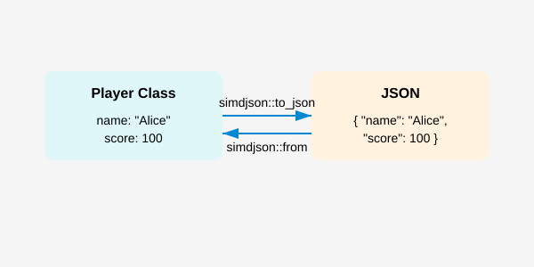
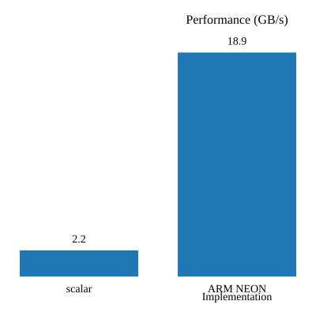
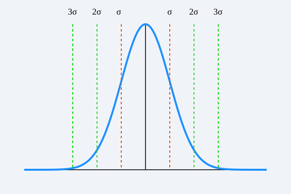
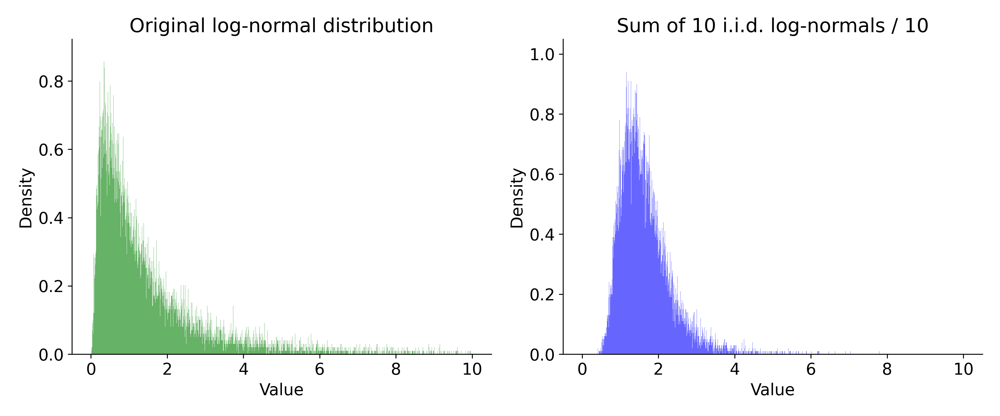

<style>
.center-table {
  display: flex;
  justify-content: center;
}
</style>

<!-- -->

<!--  --- -->


## <!--fit--> SIMD-accelerated data processing


Daniel Lemire, professor
Université du Québec (TÉLUQ)
Montréal :canada:

blog: https://lemire.me 
X: [@lemire](https://x.com/lemire)
GitHub: [https://github.com/lemire/](https://github.com/lemire/)

---

# Doubles every 3 years


<div class="center-table">


| Specification  | year                | one channel      |
|--------------|--------------------|--------|
| PCIe 1.x  | 2003   | 500 MB/s |
|  PCIe 2.x |  2007   | 1 GB/s |
|  PCIe 3.x |  2010   | 2 GB/s |
|  PCIe 4.x |  2017  | 4 GB/s |
| PCIe 5.x  | 2019  | 8 GB/s |
|  PCIe 6.x|  2022  | 16 GB/s|
|  PCIe 7.x |  2025 | 32 GB/s|
</div>


---

# Disk at gigabytes per second


* Sony PlayStation 5 (2020): 5&nbsp;GB/s
* Sony PlayStation 6 (2027): 15&nbsp;GB/s (?)


---


# High Bandwidth Memory

* Xeon Max processors contain 64&nbsp;GB of HBM
* Bandwidth 800&nbsp;GB/s


---


# Some numbers

* Processors: 4 GHz 
* One byte per cycle: 4 GB/s
*  **Easily CPU bound**

---


* openbenchmarking.org
* 14 GB/s, less than 5.7 GHz
* Parsing JSON at better than 2.5&nbsp;bytes per cycle

---


## SIMD (Single Instruction, multiple data)

* Allows us to process 16 (or more) bytes or more with one instruction
* Supported on all modern CPUs (phone, laptop)
* Data-parallel types (SIMD) (recently added to C++26)

---

<div class="center-table">


| processor       | year    | arithmetic logic units    | SIMD units |
|-----------------|---------|---------------------------|-----|
| Pentium 4       |  2000   |    2                      | $2 \times 128$ | 
| AMD Zen 2       |  2019   |    4                      | $2 \times 256$ |
| AMD Zen 5       |  2024   |    6                      | $4 \times 512$ |

</div>

---


# You are probably using simdjson

* Node.js, Electron,...
* ClickHouse
* WatermelonDB, Apache Doris, Meta Velox, Milvus,  QuestDB,  StarRocks

 

---

# simdjson: Design


* First scan identifies the structural characters, start of all strings at about 10 GB/s using SIMD instructions.
* Validates Unicode at 30 GB/s.
* Rest of parsing relies on the generated index.
* Allows fast skipping. (Only parse what we need)
* Can minify JSON at 10 to 20 GB/s


---

# Classifying characters

- comma (0x2c) `,`
- colon (0x3a) `:`
- brackets (0x5b,0x5d, 0x7b, 0x7d): `[, ], {, }`
- white-space (0x09, 0x0a, 0x0d, 0x20)
- others


---

# Vectorized classification

* Most SIMD ISAs support 'vectorized lookup tables' (at least 16-element)
* If we had 256-element tables, we could do `H(c)`.
* For 16-element tables, need two tables `H1`and `H2`.
* Find two tables `H1` and `H2` such as the bitwise AND of the look classify the characters: `H1(low(& 0xf) & H2(c >> 4)`

---

```C
low_nibble_mask = {16, 0, 0, 0, 0, 0, 0, 0, 0, 8, 12, 1, 2, 9, 0, 0};
high_nibble_mask = {8, 0, 18, 4, 0, 1, 0, 1, 0, 0, 0, 3, 2, 1, 0, 0};
```

Five instructions:
```C
    nib_lo = input & 0xf;
    nib_hi = input >> 4;
    shuf_lo = lookup(low_nibble_mask, nib_lo);
    shuf_hi = lookup(high_nibble_mask, nib_hi);
    return shuf_lo & shuf_hi;
```


---


- comma (0x2c): 1
- colon (0x3a): 2
- brackets (0x5b,0x5d, 0x7b, 0x7d): 4
- most white-space (0x09, 0x0a, 0x0d): 8
- white space (0x20): 16
- others: 0

---


# Deserialization (Apple Silicon)


---

# C++26 (compile-time reflection)



---

# Serialization (Apple Silicon)


---

# Optimization #1: Consteval
## The Power of Compile-Time

**The Insight:** JSON field names are known at compile time!

**Traditional (Runtime):**
```cpp
// Every serialization call:
write_string("\"username\"");  // Quote & escape at runtime
write_string("\"level\"");     // Quote & escape again!
```

**With Consteval (Compile-Time):**
```cpp
constexpr auto username_key = "\"username\":";  // Pre-computed!
b.append_literal(username_key);  // Just memcpy!
```


---

# Optimization #2: SIMD String Escaping

**The Problem:** JSON requires escaping `"`, `\`, and control chars

**Traditional (1 byte at a time):**
```cpp
for (char c : str) {
    if (c == '"' || c == '\\' || c < 0x20)
        return true;
}
```

**SIMD (16 bytes at once):**
```cpp
auto chunk = load_16_bytes(str);
auto needs_escape = check_all_conditions_parallel(chunk);
if (!needs_escape)
    return false;  // Fast path!
```


---


* Part of Safari, Chrome, and most browsers
* Process Unicode and Base64 formats at gigabytes per second
* Support LoongArch, x64, ARM, POWER, RISC-V

---

# Unicode (UTF-16)

* Code points from U+0000 to U+FFFF, a single 16-bit value.
* Beyond: a surrogate pair `[U+D800 to U+DBFF]` followed by `U+DC00 to U+DFFF`


---

# Validate 


* Check whether we have a lone code unit ($x \leq \mathrm{0xD7FF} \lor x\geq \mathrm{0xDBFF}$), if so ok
* Check whether we have the first part of the surrogate ($\mathrm{0xD800} \leq x\leq \mathrm{0xDBFF}$) and if so check that we have the second part of a surrogate

---

# Validate 

```javascript
PROCEDURE validate_utf16(code_units)
    i ← 0
    WHILE i < |code_units|
        unit ← code_units[i]
        IF unit ≤ 0xD7FF OR unit ≥ 0xE000 THEN
            INCREMENT i
            CONTINUE
        IF unit ≥ 0xD800 AND unit ≤ 0xDBFF THEN
            IF i + 1 ≥ |code_units| THEN
                RETURN false
            next_unit ← code_units[i + 1]
            IF next_unit < 0xDC00 OR next_unit > 0xDFFF THEN
                RETURN false
            i ← i + 2  // Valid surrogate pair
            CONTINUE
        RETURN false
    RETURN true
```


---

# UTF-16

* Write SIMD correction function (not just validation)
* Actually deployed in v8 (Google Chrome, Microsoft Edge)

---

# UTF-16 correction, Apple M4





|               |     scalar      |    ARM NEON    |
|---------------|-------------|-------------|
| GB/s          | 2.2         | 18.9        |
| ins/byte      | 12.0        | 0.9         |


---

# Base64

- Encodes binary data to text using 64 characters (A-Z, a-z, 0-9, +, /)
- 3 bytes input → 4 characters output (33% overhead)
- Used in data URLs, email, web APIs

---

# Example

- `text = "Hello, World!"`

```
SGVsbG8sIFdvcmxkIQ==
```

---

# New JavaScript functions

```javascript
const b64 = Uint8Array.toBase64(bytes);      // string          
const recovered = Uint8Array.fromBase64(b64); // Uint8Array, matches original 'bytes'
```

- SIMD accelerates encoding/decoding to gigabytes per second
- Part of simdutf: fast, portable implementations


---

# Result in the browser (Safari, Apple M4)


| function  | speed |
|-----------|-------|
| `Uint8Array.fromBase64()` | 11 GiB/s |
| `Uint8Array.toBase64()` | 20 GiB/s |


Test in your browser at https://simdutf.github.io/browserbase64/ 


---


# AVX-512 base64 encoding/decoding

- Encoding a 64-byte block requires only two non-memory instructions `vpermb` (twice) and `vpmultishiftqb`.

---

# Interested? Check these projects

* simdjson: The fastest JSON parser in the world https://simdjson.org 
  * Node.js, Electron,...
  * ClickHouse, WatermelonDB, Apache Doris, Meta Velox, Milvus, QuestDB, StarRocks
* simdutf: Unicode routines (UTF8, UTF16, UTF32) and Base64 https://github.com/simdutf/simdutf 
  * Node.js, Bun, WebKit (Safari), Chromium (Chrome, Edge)


---

# Credit

- simdjson reflection work with Francisco Geiman Thiesen (Microsoft)
- simdutf UTF-16 correction is joint work with Robert Clausecker
- simdjson and simdutf are community efforts (Geoff Langdale, John Keiser, Paul Dreik, Yagiz Nizipli and others)

---

---


---


# Measurements

* We often assume that measurements (timings) are normally distributed.
* It is often an incorrect assumption.


---

# Measurements

* If your measurements are normally distributed, the 'error' falls off as $1/\sqrt{N}$

<!--https://lemire.me/blog/2023/04/27/hotspot-performance-engineering-fails/-->

---


---

# Sigma events




---


* 1-sigma is 32%
* 2-sigma is 5%
* 3-sigma is 0.3% (once every 300 trials)
* 4-sigma is 0.00669% (once every 15000 trials)
* 5-sigma is 5.9e-05% (once every 1,700,000 trials)
* 6-sigma is 2e-07% (once every 500,000,000)
* $e^{- n^2 / 2} /(n * \sqrt{\pi /2}) \times  100$ for $n> 3$


---

# What if we dealt with log-normal distributions?





---

# Real-world measurements

* You cannot assume normality
* Measurements are **not independent**.
* Reality: the absolute minimum is often a *reliable metric*
* Margin: difference between mean and minimum

<!--https://lemire.me/blog/2023/04/27/hotspot-performance-engineering-fails/-->

---

# Conclusion

* Processors are getting much better! Wider!
* 'hot spot' engineering can fail, better to reduce overall instruction count.
* Branchy code can do well in synthetic benchmarks, but be careful.

