<style>
@import url('https://fonts.googleapis.com/css2?family=Fraunces:opsz,wght@9..144,400;9..144,500;9..144,600;9..144,700&family=Inter:wght@400;500;600&family=JetBrains+Mono:wght@400;500&display=swap');

:root {
  --paper:      #faf8f4;
  --ink:        #1c1c28;
  --muted:      #5c5c6b;
  --accent:     #9a2b2b;
  --accent-soft:#c45c52;
  --rule:       #e4ded3;
  --code-bg:    #f3efe7;
  --serif: "Fraunces", "Iowan Old Style", "Palatino", Georgia, serif;
  --sans:  "Inter", -apple-system, "Helvetica Neue", Arial, sans-serif;
  --mono:  "JetBrains Mono", "SF Mono", Menlo, monospace;
}

/* ---------- base ---------- */
section {
  position: relative;
  background: var(--paper);
  color: var(--ink);
  font-family: var(--sans);
  font-size: 28px;
  line-height: 1.5;
  letter-spacing: .005em;
  padding: 70px 80px 64px;
  display: flex;
  flex-direction: column;
  justify-content: center;
}

/* hairline letterhead rule along the top of content slides */
section:not(.lead) {
  border-top: 3px solid var(--accent);
}

/* ---------- headings ---------- */
h1, h2, h3 {
  font-family: var(--serif);
  font-weight: 600;
  color: var(--ink);
  letter-spacing: -.01em;
  margin: 0 0 .5em;
}
section:not(.lead) h1 {
  font-size: 1.85em;
  line-height: 1.12;
}
section:not(.lead) h1::after {
  content: "";
  display: block;
  width: 2.2em;
  height: 3px;
  margin-top: .32em;
  background: var(--accent);
  border-radius: 3px;
}
section:not(.lead) h2 {
  font-size: 1.25em;
  font-weight: 500;
  font-style: italic;
  color: var(--accent);
}

/* ---------- lists ---------- */
ul, ol { margin: .3em 0; padding-left: 1.1em; }
li { margin: .42em 0; padding-left: .3em; }
ul > li::marker { color: var(--accent); content: "▪  "; }
ol > li::marker { color: var(--accent); font-weight: 600; }

strong { color: var(--accent); font-weight: 600; }
a { color: var(--accent); text-decoration: none; border-bottom: 1px solid var(--rule); }

/* ---------- tables (editorial: hairlines only, no grid, no zebra) ---------- */
section table {
  border: none;
  border-collapse: collapse;
  margin: .4em auto;
  font-size: .92em;
  width: auto;
}
section table tr,
section table tbody tr:nth-child(2n) { background: transparent !important; }
section table th,
section table td {
  border: none !important;
  background: transparent !important;
  padding: .55em 1.1em;
}
section table thead th {
  font-family: var(--sans);
  font-weight: 600;
  text-transform: uppercase;
  letter-spacing: .06em;
  font-size: .8em;
  color: var(--muted);
  border-bottom: 2px solid var(--ink) !important;
  text-align: left;
}
section table tbody td { border-bottom: 1px solid var(--rule) !important; }
section table tbody tr:last-child td { border-bottom: 2px solid var(--ink) !important; }

/* ---------- blockquotes ---------- */
blockquote {
  border: none;
  margin: 0;
  padding: 0 0 0 .1em;
  font-family: var(--serif);
  font-style: italic;
  font-weight: 400;
  font-size: 1.28em;
  line-height: 1.5;
  color: var(--ink);
  position: relative;
  max-width: 26em;
}
blockquote::before {
  content: "\201C";
  position: absolute;
  left: -.42em;
  top: -.36em;
  font-size: 3em;
  line-height: 1;
  color: var(--accent);
  opacity: .22;
}
blockquote p { margin: .3em 0; }

/* ---------- code ---------- */
code { font-family: var(--mono); }
:not(pre) > code {
  background: var(--code-bg);
  color: var(--accent);
  padding: .1em .4em;
  border-radius: 5px;
  font-size: .85em;
}
pre {
  background: var(--code-bg);
  border: 1px solid var(--rule);
  border-radius: 12px;
  padding: .9em 1.15em;
  font-size: .74em;
  line-height: 1.55;
  box-shadow: 0 8px 24px rgba(28, 28, 40, .07);
}
pre code { color: var(--ink); background: none; }
/* larger code for short command/prompt slides */
section.prompt pre { font-size: 1.02em; line-height: 1.6; }

/* ---------- figures (exclude inline emoji) ---------- */
section img:not(.emoji),
section video {
  display: block;
  margin: 0 auto;
  max-height: 80%;
  max-width: 92%;
  border-radius: 12px;
  box-shadow: 0 14px 38px rgba(28, 28, 40, .14);
}
section img.emoji {
  box-shadow: none;
  border-radius: 0;
}
section video {
  max-height: 68%;
  max-width: 80%;
}

/* ---------- footer & pagination ---------- */
footer {
  font-family: var(--sans);
  font-size: 15px;
  letter-spacing: .04em;
  color: var(--muted);
  opacity: .9;
}
section::after {
  font-family: var(--sans);
  font-size: 15px;
  color: var(--muted);
}

/* ---------- lead (title / closing) ---------- */
section.lead {
  align-items: center;
  text-align: center;
  background:
    radial-gradient(1200px 600px at 50% -10%, rgba(154, 43, 43, .06), rgba(250, 248, 244, 0) 70%),
    var(--paper);
}
section.lead h1, section.lead h2 {
  font-family: var(--serif);
  font-weight: 600;
  font-size: 2.6em;
  line-height: 1.08;
  letter-spacing: -.015em;
  margin-bottom: .15em;
}
section.lead h2::after {
  content: "";
  display: block;
  width: 3.2em;
  height: 3px;
  margin: .45em auto .1em;
  background: var(--accent);
  border-radius: 3px;
}
section.lead p { font-size: .92em; color: var(--muted); margin: .25em 0; }
section.lead strong { color: var(--ink); }
section.lead a { border-bottom: none; }
section.lead footer { display: none; }
</style>


<!-- _class: lead -->
<!-- _paginate: false -->

## La prochaine frontière&nbsp;: IA et code

**Daniel Lemire**, professeur
Université du Québec (TÉLUQ)
Montréal :canada:

blog: https://lemire.me

X: [@lemire](https://x.com/lemire) · GitHub: [github.com/lemire](https://github.com/lemire/)


---

<video src="iannick.mp4" width="50%" autoplay muted loop playsinline controls></video>

---

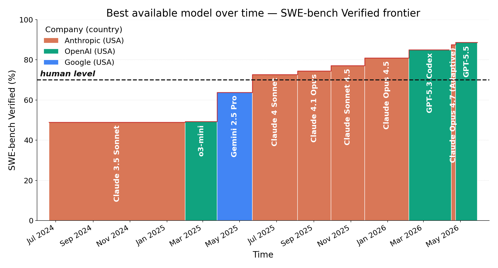


---

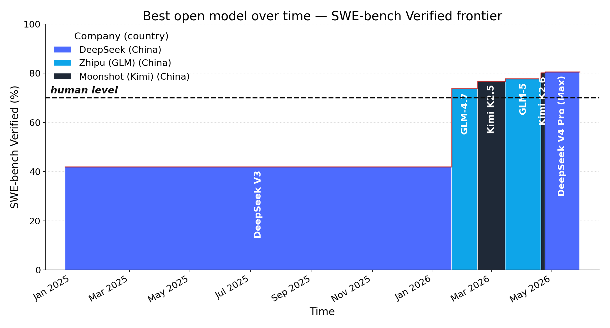


---


> En fait, on parle souvent de ce concept appelé AGI, pour intelligence artificielle générale, c'est-à-dire une IA aussi intelligente qu'une personne. Et je pense en réalité que nous avons franchi ce seuil il y a environ trois mois. (Andreesen, 19 mai 2026)


---

# Les grands laboratoires d'IA

- xAI 2023
- Anthropic 2021
- OpenAI 2019 (à but lucratif)

---

| Entreprise | Valorisation | Date |
|---|---:|---|
| Bombardier | 21 milliards $ | mai 2026 |
| Quebecor | 9,5 à 11 milliards $ | mai 2026 |

---

| Entreprise | Valorisation | Type | Date |
|---|---:|---|---|
| Intel | 608 milliards $ | Capitalisation boursière | mai 2026 |
| Oracle | 580 à 630 milliards $ | Capitalisation boursière | mai 2026 |
| Bombardier | 21 à 22 milliards $ | Capitalisation boursière | mai 2026 |
| Manuvie | 64 milliards $ | Capitalisation boursière | mai 2026 |
| Quebecor | 10 à 11 milliards $ | Capitalisation boursière | mai 2026 |


---

| Entreprise | date de fondation | Valorisation | Date |
|---|---:|---:|---|
| xAI | 2023 | 250 milliards $ | fév. 2026 |
| OpenAI | 2021 |  852 milliards $ | mars 2026 |
| Anthropic | 2019 | 965 milliards $ | mai 2026 |
| Somme | | 2067 milliards $ | mai 2026 |


- Entreprises canadiennes (hors banques) : 2600 milliards $

---

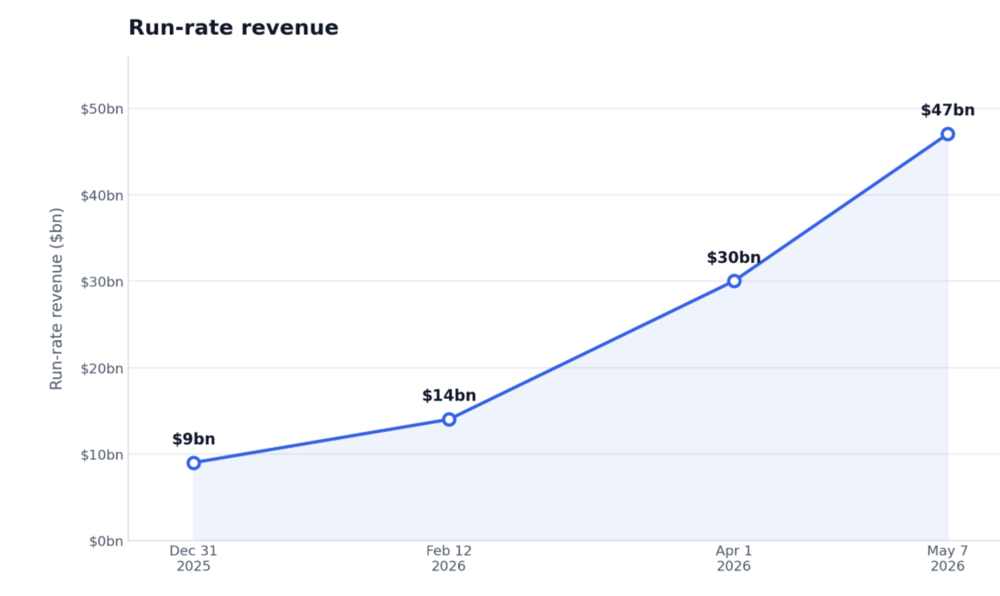


---


## GitHub Copilot

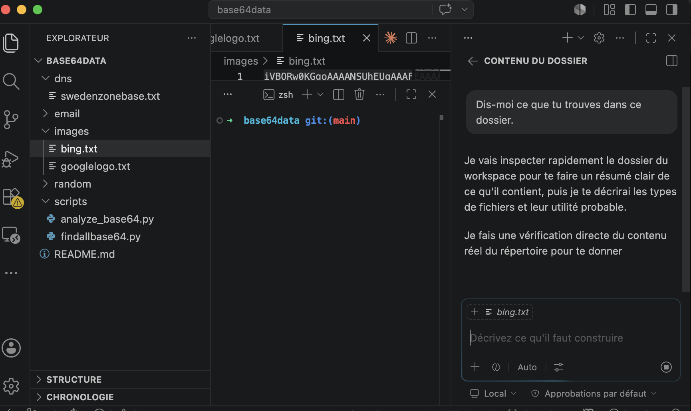


---

## GitHub Copilot + Visual Studio Code

- Suggestion de code en contexte (2024!!!)
- Génération de fonctions complètes
- Chat intégré dans l’IDE

---


# IA agentique

- Comprendre des objectifs
- Les décomposer en étapes
- Utiliser des outils (recherche web, exécution de code, API, etc.)
- Itérer et s'adapter en fonction des résultats

---

# Ligne de commandes


- Elle est textuelle et déterministe
- Elle expose des outils puissants et composables (git, curl, jq, grep, find, awk, etc.)
- Elle permet l’exécution directe de code et de scripts
- Elle est facilement scriptable et observable


---

# Git


- Branchement rapide : `git checkout -b feature/ia-agent` ou `git switch -c`, git worktrees
- Itération sans peur : commits atomiques + git reset
- Revue et validation : git diff, git log, git blame
- Sauvegarde d’états : possibilité de revenir en arrière facilement si l’agent part dans une mauvaise direction


---

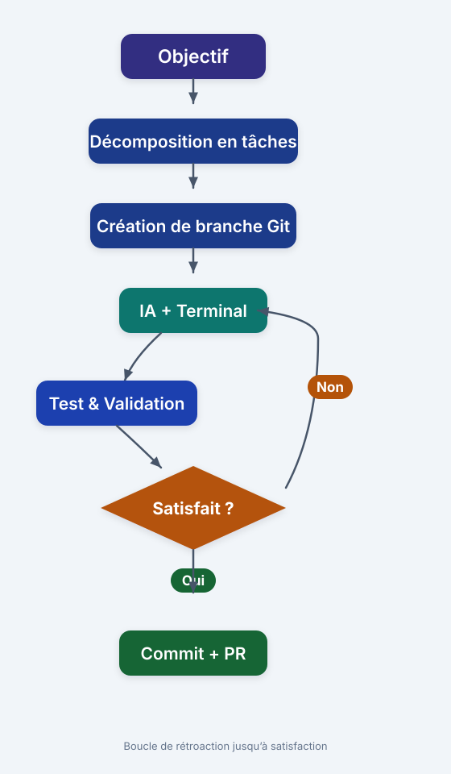

---

# Markdown

```markdown
## Introduction à Java (exemple)

Nous pouvons définir une variable en Java ainsi.

Notez les différents éléments de la syntaxe.

- Type
- Nom de variable
- Affectation d'une valeur
```


---

## Grok Build


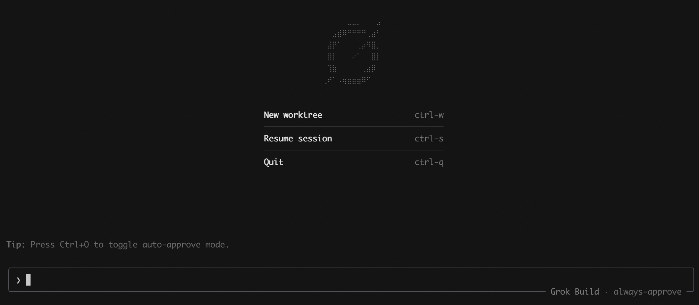


---

## Claude Code

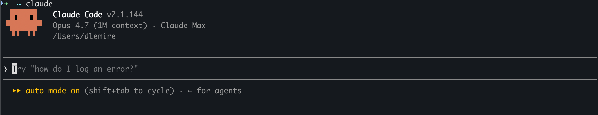

---

# Agentique : Pas seulement pour les programmeurs


- Préparer une réunion stratégique avec 
  - ordre du jour, 
  - données et scénarios, 
  - consultation des agendas, 
  - échanges par courriel

---

# Compétences

- Un dossier réutilisable contenant un fichier SKILL.md
- Un mécanisme de chargement dynamique : l'IA ne charge que le nom et la description au démarrage
- Un moyen de créer des agents spécialisés


---

# Exemple

- Aller chercher des données officielles
- Créer un graphique au format PNG
- Produire une version anglaise et une version française


---

# Créer le dossier

La compétence va se nommer plotdata.

```bash
mkdir -p ~/.claude/skills/plotdata
```


---

# Créer le fichier

```text
~/.claude/skills/plotdata/SKILL.md
```

---

```markdown
---
name: data-plot
description: Récupère des données du web et génère des graphiques matplotlib
  de qualité publication en français et en anglais.
allowed-tools: Bash(mkdir *) Bash(uv *) Bash(python3 *)
  Bash(curl *) Bash(wget *) Bash(ls *) Bash(cat *) Bash(cd *)
  WebFetch WebSearch Read Write Edit
argument-hint: [requête décrivant les données à visualiser]
---
```


---

````markdown
# Compétence de visualisation de données

À partir d'une requête, trouver des données fiables en ligne, les télécharger et produire des graphiques bilingues (français/anglais) avec matplotlib.

## Répertoire de travail

Toute la sortie va dans ~/myplots/<slug>/ où <slug> est un nom court en kebab-case.

1. S'assurer que ~/myplots existe (mkdir -p ~/myplots)
2. Créer le sous-répertoire pour cette requête, par exemple ~/myplots/population-canada-2024/
3. Tous les scripts, données, README et PNG vont dans ce sous-répertoire

## Sources de données

- Privilégier les sources officielles ou gouvernementales
- Privilégier les formats lisibles par machine dans cet ordre : CSV > JSON > tableau HTML
- Utiliser WebSearch et WebFetch pour localiser l'URL du jeu de données
- Noter l'URL exacte de la source et la date d'accès dans le README

## Environnement Python

Toujours utiliser uv pour les dépendances. Initialiser le projet dans le sous-répertoire :

```bash
cd ~/myplots/<slug>
uv init --no-readme --no-workspace
uv add pandas matplotlib requests
```
````


---

# Utilisation

```text
/plotdata Donne-moi le taux de fécondité par province canadienne,
ainsi que le pourcentage de femmes dans chaque province
ayant un diplôme universitaire.
```

---

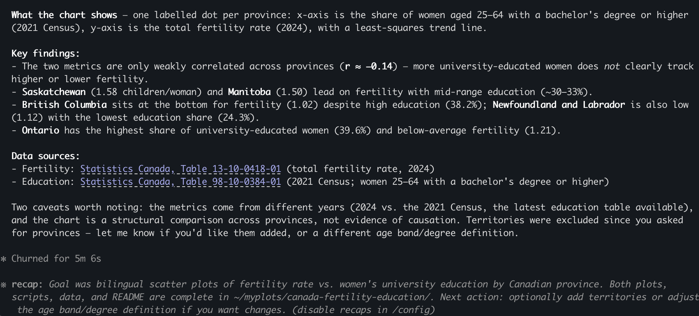


---

# Et voilà !

- Rédiger la compétence une seule fois
- Automatiser la production de graphiques

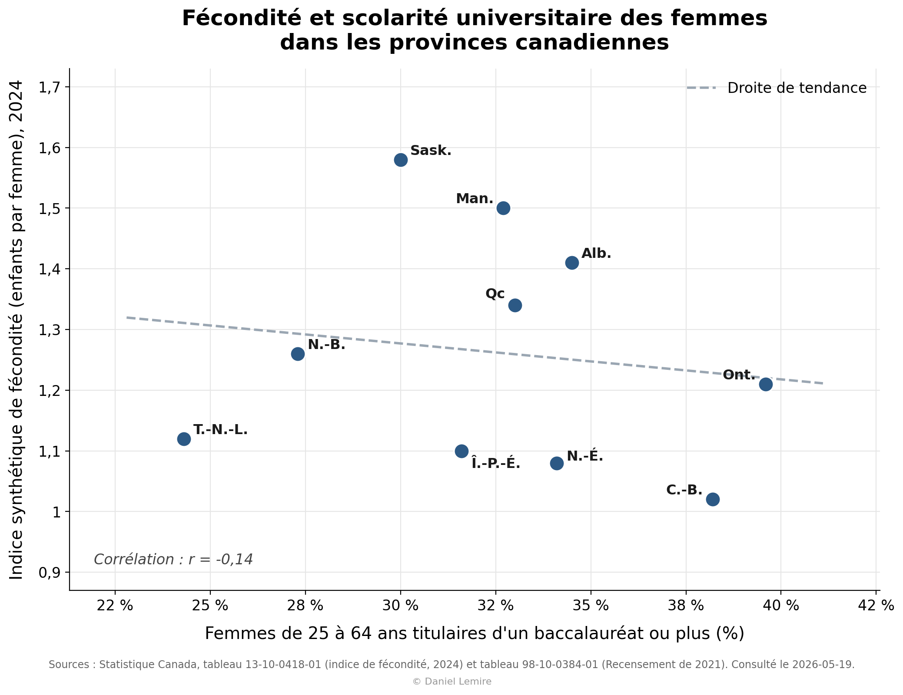


---

<!-- _class: prompt -->

```text
/plotdata Fais un graphique qui donne l'âge moyen
par province au Canada, et ajoute l'âge moyen
des États-Unis (comme onzième province).
```

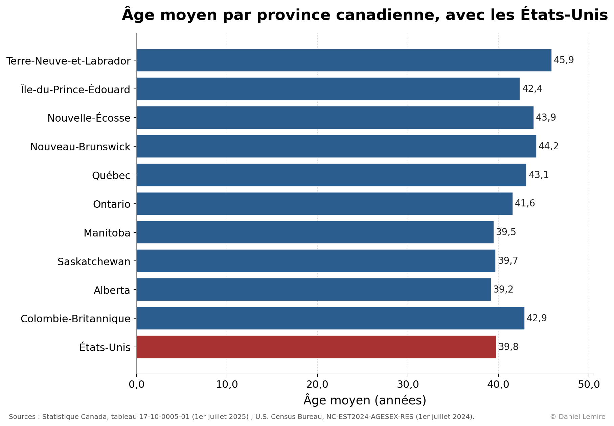

---

# Permissions

- ~/.claude/settings.json

```json
{
  "permissions": {
    "allow": ["Read", "Write", "Edit", "Bash(git status)", "Bash(git commit -m:*)"],
    "deny": ["Read(.env*)", "Bash(rm -rf /)", "Bash(sudo:*)"],
    "ask": ["Bash(git push --force:*)", "Bash(docker run:*)"]
  }
}
```

---

# allow, deny, ask

- **allow** : actions autorisées automatiquement (faible risque, fréquentes)
- **deny** : actions interdites en tout temps (secrets, opérations destructives)
- **ask** : actions sensibles qui exigent une confirmation explicite


---

# MCP (Model Context Protocol)

- Relie un LLM à des outils externes
- Il standardise l'accès aux outils
- Exemples : Git, Slack, Oracle, PostgreSQL, SSH, Google Drive


---

# Étendre des compétences en sécurité

- N'exposer que les actions strictement nécessaires dans le serveur MCP
- Traçabilité : journaliser les appels MCP et auditer régulièrement

Exemple : pour une compétence SSH/SFTP, on autorise la lecture et l'écriture dans un seul dossier et on place toute opération destructive en mode **ask**.


---

# Exemple de serveur MCP : server.py

- Ce script démarre un serveur MCP nommé ssh-files
- Il lit credentials.json (host, username, remotedirectory) pour se connecter en SSH/SFTP
- Il expose des outils : upload_file, download_file, list_files, make_dir, delete_file, delete_dir
- Tous les chemins sont confinés à remotedirectory (protection contre la sortie de sandbox)
- Il applique des garde-fous, notamment la vérification des clés SSH

---

```bash
claude mcp add ssh-files server.py --scope user
```


---

```text
claude mcp list

  - claude.ai Google Drive — authentification requise
  - claude.ai Gmail — authentification requise
  - claude.ai Google Calendar — authentification requise
  - ssh-files (./ssh-mcp/server.py) — connecté
```


---

> Téléverse le résultat à l'aide du MCP ssh-files dans un répertoire correspondant. Donne-moi ensuite l'URL. Crée aussi un beau fichier index.html.

---

```text
/data-plot Valeur marchande estimée d'Anthropic, OpenAI et xAI.
```

---


https://lemire.me/plot_data/ai-lab-valuations/


---

# Réviser un vieux cours


---

Bonjour Claude,
Dans le dossier TRA 4030, tu vas trouver des documents Word (docx) représentant le contenu du cours TRA 4030 dans son état actuel.
Je veux que tu me fasses un site web moderne (dans le dossier html) avec une version modernisée du cours. Tu vas copier le contenu du cours vers mon site à https://lemire.me/trad4030/
Je t'invite à explorer le contenu du site https://m2.teluq.ca/course/view.php?id=3274
Essaie de copier le style du site.
N'oublie pas d'inclure une feuille de route. Le cours dure 15 semaines.

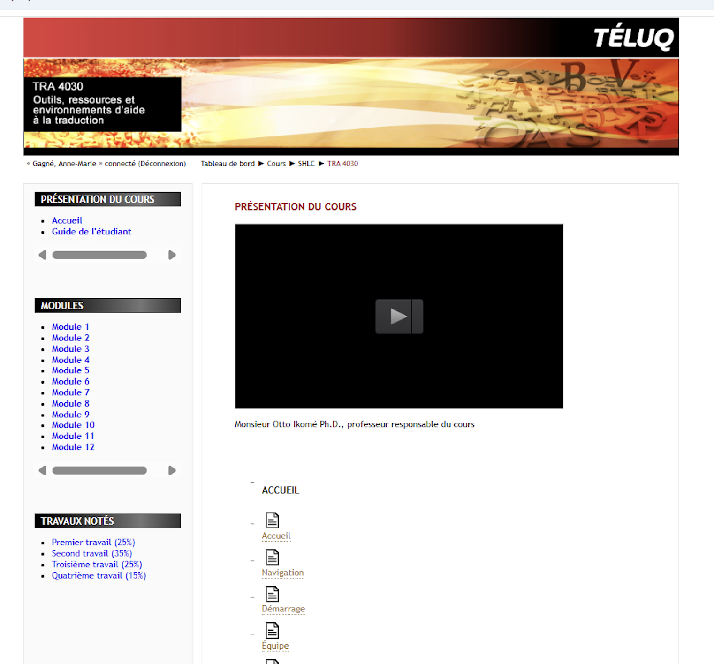


---

https://lemire.me/trad4030/


---

# Créer une nouvelle application web à une journée


---

# Jeudi 7 mai 2026

Après-midi : la direction transmet les fichiers Excel des plans de travail.

---

# Vendredi 8 mai 2026

## 8 h 20

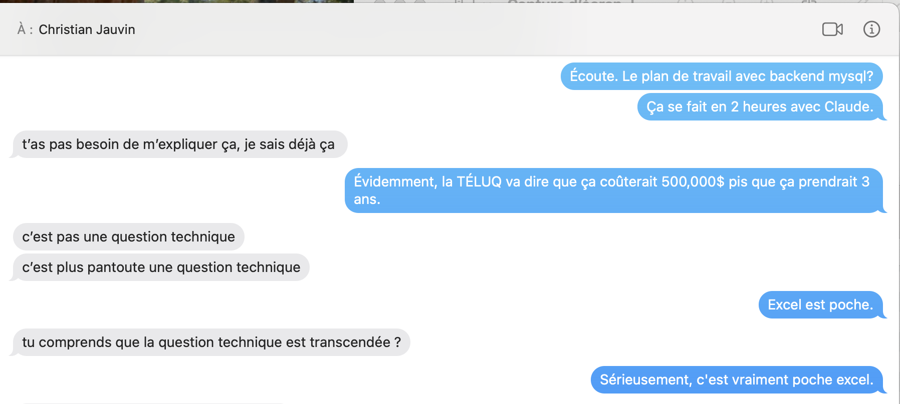

---


## 8 h 25

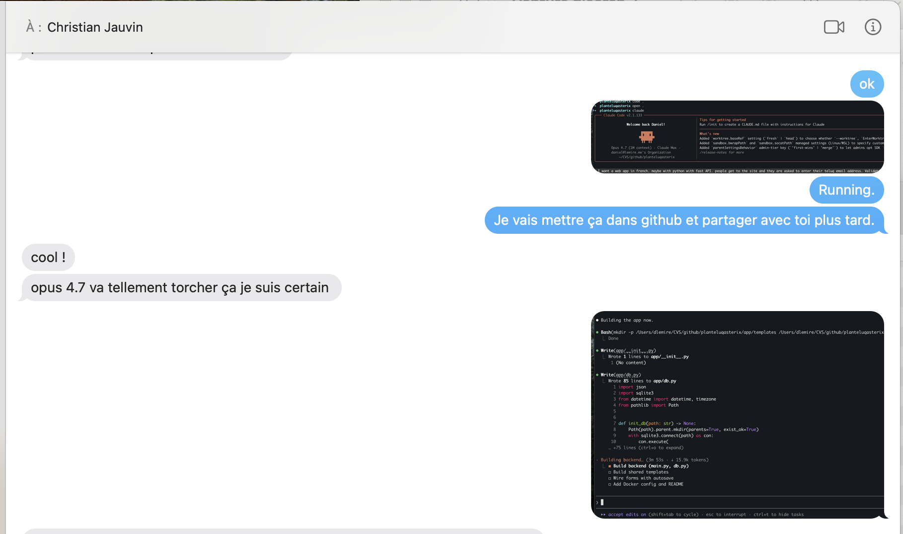


---


## 8 h 45

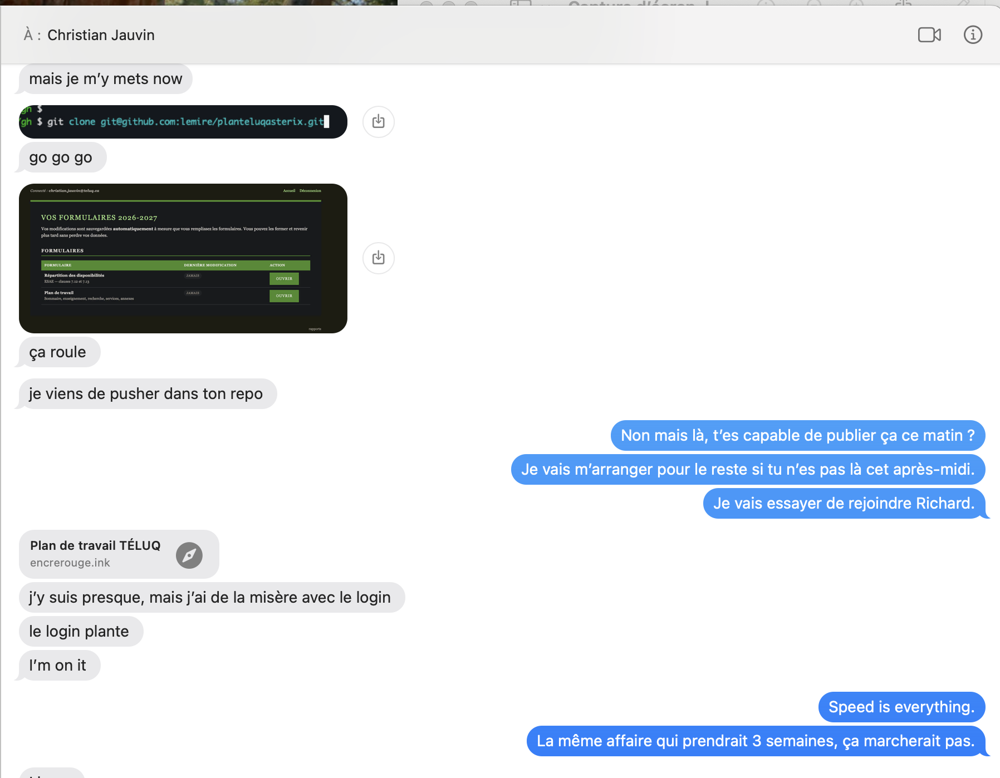


---

# Vendredi 8 mai 2026

## 9 h 00

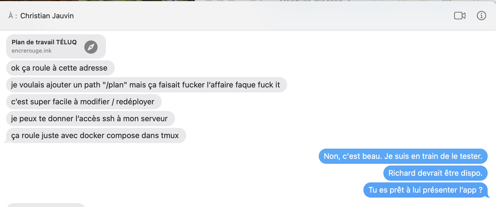


---

<https://encrerouge.ink> 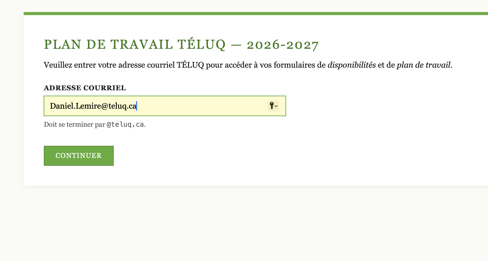


---

# Organisation du travail désuette


---


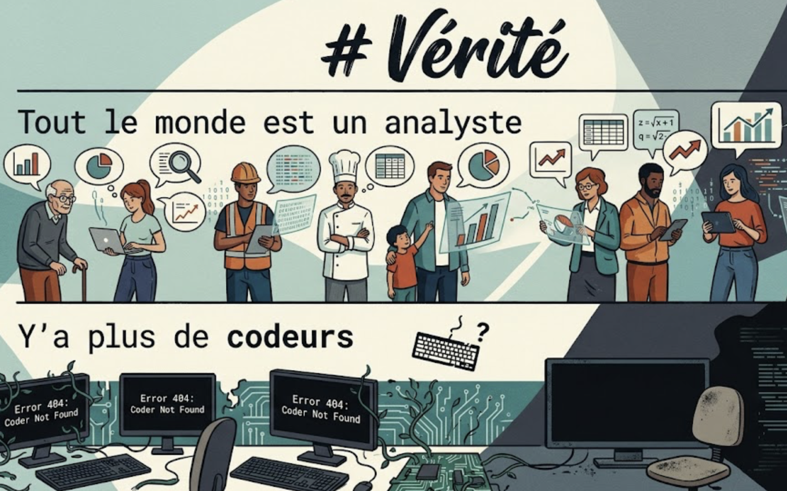


---


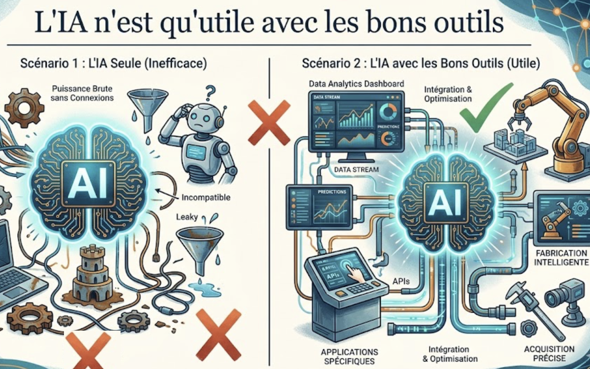


---

<video src="avocat.mp4" width="50%" autoplay muted loop playsinline controls></video>

---

<!-- _class: lead -->
<!-- _paginate: false -->

## Questions&nbsp;?

**Daniel Lemire** — [lemire.me](https://lemire.me)

:canada:
