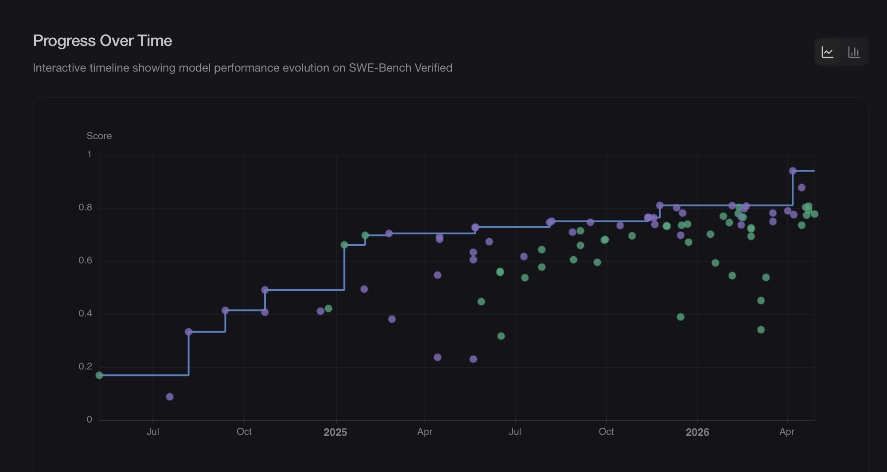
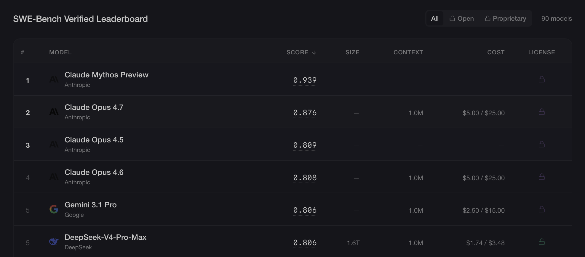

## <!--fit--> The Next Frontier: AI and Code

Daniel Lemire, professor
University of Quebec (TÉLUQ)
Montreal :canada:

blog: https://lemire.me

X: [@lemire](https://x.com/lemire)
GitHub: [https://github.com/lemire/](https://github.com/lemire/)


---

# Where I Am Coming From

- Creator of widely used high-performance libraries, including simdutf and fast_float (both integrated into major browsers), Roaring Bitmaps, simdjson, and several other performance-critical projects.
- Ranked among the top 2% of scientists worldwide (Stanford/Elsevier ranking), with more than 100 peer-reviewed academic papers.
- Among the 1000 most-followed developers on GitHub, thanks to high-impact open-source contributions.
- Node.js core contributor, notably in C++ code review and security improvements.


---


---


---


> People often talk about this concept called AGI, meaning artificial general intelligence, that is, an AI as intelligent as a person. I actually think we crossed that threshold about three months ago. (Andreesen, May 19, 2026)


---

# Big AI Labs

- xAI 2023
- Anthropic 2021
- OpenAI 2019 (for profit)

---

| Company | Valuation | Date |
|---|---:|---|
| Bombardier | $21 billion | May 2026 |
| Quebecor | $9.5 to $11 billion | May 2026 |

---

| Company | Valuation | Type | Date |
|---|---:|---|---|
| Intel | $608 billion | Public market capitalization | May 2026 |
| Oracle | $580 to $630 billion | Public market capitalization | May 2026 |
| Bombardier | $21 to $22 billion | Public market capitalization | May 2026 |
| Manulife | $64 billion | Public market capitalization | May 2026 |
| Quebecor | $10 to $11 billion | Public market capitalization | May 2026 |

- Canadian companies (excluding banks): $2.6 trillion

---

| Company | Valuation | Date |
|---|---:|---|
| xAI | $250 billion | Feb. 2026 |
| OpenAI | $852 billion | Mar. 2026 |
| Anthropic | $965 billion | May 2026 |
| Bombardier | $21 billion | May 2026 |

---


---




---



---

# Agentic AI

- Understand goals
- Break them down into steps
- Use tools (web search, code execution, APIs, and so on)
- Iterate and adapt based on results

---


---


---


---

# Markdown

```markdown
## Introduction to Java (example)

We can define a variable in Java like this.

Notice the different elements of the syntax.

- Type
- Variable name
- Assigning a value
```


---

# Skills

- A reusable folder containing a SKILL.md file
- A dynamic loading mechanism: the AI only loads the name and description at startup
- A way to create specialized agents


---

# Example

- Fetch official data
- Create a PNG chart
- Produce English and French output


---

# Create the Folder

The skill will be named plotdata.

```bash
mkdir -p ~/.claude/skills/plotdata
```


---

# Create the File

```text
~/.claude/skills/plotdata/SKILL.md
```

---

```markdown
---
name: data-plot
description: Fetches data from the web and generates publication-quality
  matplotlib plots in French and English.
allowed-tools: Bash(mkdir *) Bash(uv *) Bash(python3 *)
  Bash(curl *) Bash(wget *) Bash(ls *) Bash(cat *) Bash(cd *)
  WebFetch WebSearch Read Write Edit
argument-hint: [query describing the data to plot]
---
```


---

```markdown
# Data Plot Skill

Given a query, find reliable online data, download it, and produce bilingual (French/English) matplotlib plots.

## Working Directory

All output goes in ~/myplots/<slug>/ where <slug> is a short kebab-case name.

1. Ensure that ~/myplots exists (mkdir -p ~/myplots)
2. Create the subdirectory for this query, for example ~/myplots/canada-population-2024/
3. Put all scripts, data, README files, and PNGs in that subdirectory

## Data Sources

- Prefer official or government sources
- Prefer machine-readable formats in this order: CSV > JSON > HTML table
- Use WebSearch and WebFetch to locate the dataset URL
- Record the exact source URL and access date in the README

## Python Environment

Always use uv for dependencies. Initialize the project in the subdirectory:

```bash
cd ~/myplots/<slug>
uv init --no-readme --no-workspace
uv add pandas matplotlib requests
```
```


---

# Usage

```text
/plotdata Give me the fertility rate for each Canadian province,
along with the percentage of women in each province
who have a university degree.
```

---


---

# And There You Have It

- Write the skill once
- Automate chart production


---

```text
/plotdata Make a chart showing the average age
by province in Canada, and add the average age
for the United States as an eleventh province.
```


---

# Permissions

- ~/.claude/settings.json

```json
{
  "permissions": {
    "allow": ["Read", "Write", "Edit", "Bash(git status)", "Bash(git commit -m:*)"],
    "deny": ["Read(.env*)", "Bash(rm -rf /)", "Bash(sudo:*)"],
    "ask": ["Bash(git push --force:*)", "Bash(docker run:*)"]
  }
}
```

---

# allow, deny, ask

- allow: actions automatically authorized (low risk, frequent)
- deny: actions always forbidden (secrets, destructive operations)
- ask: sensitive actions requiring explicit confirmation


---

# MCP (Model Context Protocol)

- Connects an LLM to external tools
- Standardizes access to tools
- Examples: Git, Slack, Oracle, PostgreSQL, SSH, Google Drive


---

# Extending Skills Securely

- Only expose the strictly necessary actions in the MCP server
- Traceability: log MCP calls and audit them regularly

Example: for an SSH/SFTP skill, allow read and write access in a single folder and put every destructive operation in ask mode.


---

# Example MCP Server: server.py

- This script starts an MCP server named ssh-files
- It reads credentials.json (host, username, remotedirectory) to connect over SSH/SFTP
- It exposes tools such as upload_file, download_file, list_files, make_dir, delete_file, and delete_dir
- All paths are confined to remotedirectory (protection against escaping the sandbox)
- It applies safeguards, including SSH key verification

---

```bash
claude mcp add ssh-files server.py --scope user
```


---

```text
claude mcp list

  - claude.ai Google Drive — authentication required
  - claude.ai Gmail — authentication required
  - claude.ai Google Calendar — authentication required
  - ssh-files (./ssh-mcp/server.py) — connected
```


---

> Upload the result using the ssh-files MCP into the corresponding directory. Then give me the URL. Also create a nice index.html file.

---

```text
/data-plot Estimated market value of Anthropic, OpenAI, and xAI.
```

---


https://lemire.me/plot_data/ai-lab-valuations/


---

Hello Claude,
In the TRA 4030 folder, you will find Word documents (docx) representing the current content of the TRA 4030 course.
I want you to build me a modern website (in the html folder) with a modernized version of the course. You will copy the course content to my site at https://lemire.me/trad4030/
TÉLUQ usually divides a course into modules. In each module, there are common sections such as get started, get informed, and so on. I invite you to explore the content of the site https://m2.teluq.ca/course/view.php?id=3274
Try to copy the style of the site.
Do not forget to include a roadmap. The course lasts 15 weeks.


---

https://lemire.me/trad4030/


---

# Thursday, May 7, 2026

Afternoon: management sends the Excel spreadsheets for the work plans.

---

# Friday, May 8, 2026

## 8:20


---

# Friday, May 8, 2026

## 8:25


---

# Friday, May 8, 2026

## 8:45


---

# Friday, May 8, 2026

## 9:00


---

<https://encrerouge.ink>


---

# Work Organization

- Coder-analyst
- Architect-programmer

---

## <!--fit--> Questions?

Daniel Lemire — [lemire.me](https://lemire.me)

:canada: