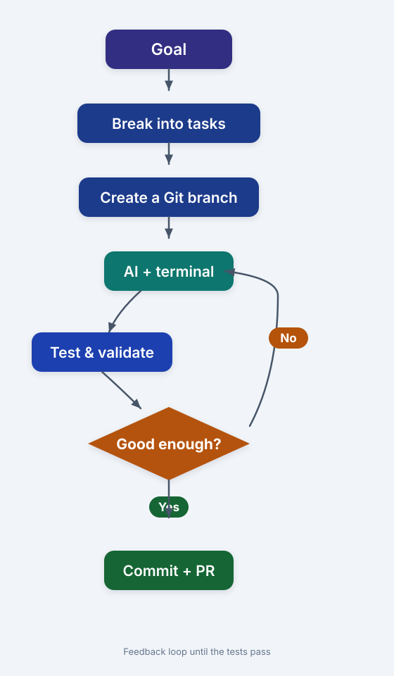
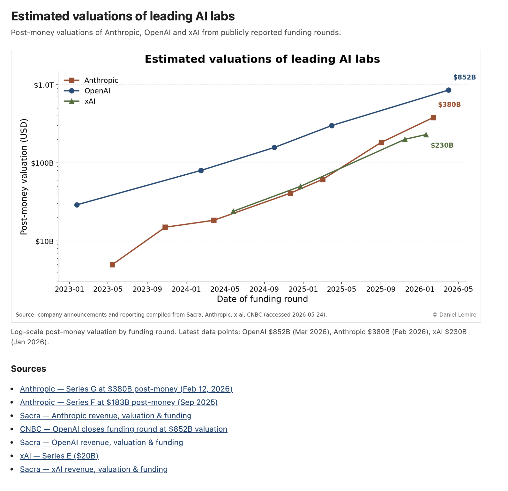

<style>
@import url('https://fonts.googleapis.com/css2?family=Fraunces:opsz,wght@9..144,400;9..144,500;9..144,600;9..144,700&family=Inter:wght@400;500;600&family=JetBrains+Mono:wght@400;500&display=swap');

:root {
  --paper:      #faf8f4;
  --ink:        #1c1c28;
  --muted:      #5c5c6b;
  --accent:     #9a2b2b;
  --accent-soft:#c45c52;
  --rule:       #e4ded3;
  --code-bg:    #f3efe7;
  --serif: "Fraunces", "Iowan Old Style", "Palatino", Georgia, serif;
  --sans:  "Inter", -apple-system, "Helvetica Neue", Arial, sans-serif;
  --mono:  "JetBrains Mono", "SF Mono", Menlo, monospace;
}

/* ---------- base ---------- */
section {
  position: relative;
  background: var(--paper);
  color: var(--ink);
  font-family: var(--sans);
  font-size: 28px;
  line-height: 1.5;
  letter-spacing: .005em;
  padding: 70px 80px 64px;
  display: flex;
  flex-direction: column;
  justify-content: center;
}

/* hairline letterhead rule along the top of content slides */
section:not(.lead) {
  border-top: 3px solid var(--accent);
}

/* ---------- headings ---------- */
h1, h2, h3 {
  font-family: var(--serif);
  font-weight: 600;
  color: var(--ink);
  letter-spacing: -.01em;
  margin: 0 0 .5em;
}
section:not(.lead) h1 {
  font-size: 1.85em;
  line-height: 1.12;
}
section:not(.lead) h1::after {
  content: "";
  display: block;
  width: 2.2em;
  height: 3px;
  margin-top: .32em;
  background: var(--accent);
  border-radius: 3px;
}
section:not(.lead) h2 {
  font-size: 1.25em;
  font-weight: 500;
  font-style: italic;
  color: var(--accent);
}

/* ---------- lists ---------- */
ul, ol { margin: .3em 0; padding-left: 1.1em; }
li { margin: .42em 0; padding-left: .3em; }
ul > li::marker { color: var(--accent); content: "▪  "; }
ol > li::marker { color: var(--accent); font-weight: 600; }

strong { color: var(--accent); font-weight: 600; }
a { color: var(--accent); text-decoration: none; border-bottom: 1px solid var(--rule); }

/* ---------- tables (editorial: hairlines only, no grid, no zebra) ---------- */
section table {
  border: none;
  border-collapse: collapse;
  margin: .4em auto;
  font-size: .92em;
  width: auto;
}
section table tr,
section table tbody tr:nth-child(2n) { background: transparent !important; }
section table th,
section table td {
  border: none !important;
  background: transparent !important;
  padding: .55em 1.1em;
}
section table thead th {
  font-family: var(--sans);
  font-weight: 600;
  text-transform: uppercase;
  letter-spacing: .06em;
  font-size: .8em;
  color: var(--muted);
  border-bottom: 2px solid var(--ink) !important;
  text-align: left;
}
section table tbody td { border-bottom: 1px solid var(--rule) !important; }
section table tbody tr:last-child td { border-bottom: 2px solid var(--ink) !important; }

/* ---------- blockquotes ---------- */
blockquote {
  border: none;
  margin: 0;
  padding: 0 0 0 .1em;
  font-family: var(--serif);
  font-style: italic;
  font-weight: 400;
  font-size: 1.28em;
  line-height: 1.5;
  color: var(--ink);
  position: relative;
  max-width: 26em;
}
blockquote::before {
  content: "\201C";
  position: absolute;
  left: -.42em;
  top: -.36em;
  font-size: 3em;
  line-height: 1;
  color: var(--accent);
  opacity: .22;
}
blockquote p { margin: .3em 0; }

/* ---------- code ---------- */
code { font-family: var(--mono); }
:not(pre) > code {
  background: var(--code-bg);
  color: var(--accent);
  padding: .1em .4em;
  border-radius: 5px;
  font-size: .85em;
}
pre {
  background: var(--code-bg);
  border: 1px solid var(--rule);
  border-radius: 12px;
  padding: .9em 1.15em;
  font-size: .74em;
  line-height: 1.55;
  box-shadow: 0 8px 24px rgba(28, 28, 40, .07);
}
pre code { color: var(--ink); background: none; }
/* larger code for short command/prompt slides */
section.prompt pre { font-size: 1.02em; line-height: 1.6; }

/* ---------- figures (exclude inline emoji) ---------- */
section img:not(.emoji),
section video {
  display: block;
  margin: 0 auto;
  max-height: 80%;
  max-width: 92%;
  border-radius: 12px;
  box-shadow: 0 14px 38px rgba(28, 28, 40, .14);
}
section img.emoji {
  box-shadow: none;
  border-radius: 0;
}
section video {
  max-height: 68%;
  max-width: 80%;
}

/* ---------- footer & pagination ---------- */
footer {
  font-family: var(--sans);
  font-size: 15px;
  letter-spacing: .04em;
  color: var(--muted);
  opacity: .9;
}
section::after {
  font-family: var(--sans);
  font-size: 15px;
  color: var(--muted);
}

/* ---------- lead (title / closing / section dividers) ---------- */
section.lead {
  align-items: center;
  text-align: center;
  background:
    radial-gradient(1200px 600px at 50% -10%, rgba(154, 43, 43, .06), rgba(250, 248, 244, 0) 70%),
    var(--paper);
}
section.lead h1, section.lead h2 {
  font-family: var(--serif);
  font-weight: 600;
  font-size: 2.6em;
  line-height: 1.08;
  letter-spacing: -.015em;
  margin-bottom: .15em;
}
section.lead h2::after {
  content: "";
  display: block;
  width: 3.2em;
  height: 3px;
  margin: .45em auto .1em;
  background: var(--accent);
  border-radius: 3px;
}
section.lead p { font-size: .92em; color: var(--muted); margin: .25em 0; }
section.lead strong { color: var(--ink); }
section.lead a { border-bottom: none; }
section.lead footer { display: none; }
</style>

<!-- _class: lead -->
<!-- _paginate: false -->

## Programming in the Era of AI

**Daniel Lemire**, professor
Université du Québec (TÉLUQ)
Montréal :canada:

blog: https://lemire.me

X: [@lemire](https://x.com/lemire) · GitHub: [github.com/lemire](https://github.com/lemire/)

---

# Where I am coming from

- Author of high-performance libraries integrated into major browsers, runtimes and standard libraries: **simdutf**, **fast_float**, **simdjson**, **Roaring Bitmaps**.
- Among the top 2% of scientists worldwide (Stanford/Elsevier), 100+ peer-reviewed papers.
- Among the 1000 most-followed developers on GitHub.
- **And: I have not typed most of my code by hand in over a year.**

---

# The plan

1. Where we actually are
2. What makes an agent work
   - benchmarks and tests as constraints
   - context management
   - orchestrating parallel agents
3. Field reports
4. What we must change: teaching, work, research

---

<!-- _class: lead -->

## Part 1

## Where we actually are

---


---

# What that poll really shows

- this is a practice change, not a tool upgrade.

---

# SWE-bench Verified

- Real GitHub issues from real open-source Python repositories.
- The model gets the repository, the issue text, and nothing else.
- Success = the project's own **hidden tests** pass afterwards.
- 500 tasks, human-validated as solvable.

**It is not a quiz. It is a work order.**


---


---


---

# Superhuman

- Top systems now resolve **~90%** of SWE-bench Verified tasks.
- A skilled human given the same isolated issue, the same repository, and no colleagues, does **not** do better.
- The machine does it in minutes, in parallel, for a few dollars.

---

# Open weights are close behind

- The leading open-weight models sit within a few points of the leading proprietary models.
- They run on hardware you can own, or rent by the hour.


---


---


> People often talk about this concept called AGI, meaning artificial general intelligence, that is, an AI as intelligent as a person. I actually think we crossed that threshold about three months ago.

— Marc Andreessen, May 19, 2026

---

# Three companies, founded within a decade

| Company | Founded | Valuation | Date |
|---|---|---:|---|
| OpenAI | 2015 | $852 billion | Mar. 2026 |
| Anthropic | 2021 | $965 billion | May 2026 |
| xAI | 2023 | $250 billion | Feb. 2026 |
| **Sum** | | **$2.07 trillion** | |

---

| Company | Valuation | Date |
|---|---:|---|
| Intel | $608 billion | May 2026 |
| Oracle | $580–630 billion | May 2026 |
| Manulife | $64 billion | May 2026 |
| Bombardier | $21 billion | May 2026 |
| Quebecor | $10–11 billion | May 2026 |

All Canadian public companies, excluding banks: **$2.6 trillion**

---


---

<!-- _class: lead -->

## Part 2

## What makes an agent work

---

# 2024: autocomplete


---

# GitHub Copilot + Visual Studio Code

- In-context code suggestion
- Whole-function generation
- Chat inside the IDE

Useful. But **you** were still the loop.

---

# Agentic AI

An agent can:

- Understand a goal
- Break it into steps
- Use tools (shell, web search, code execution, APIs)
- Observe the result and **adapt**

The model stopped being an oracle and became a worker.

---



---

# Why the command line won

- It is textual and deterministic.
- It exposes powerful, composable tools: `git`, `curl`, `jq`, `grep`, `find`, `awk`, compilers, test runners.
- Code can be executed directly, and the output read back.
- It is scriptable and observable.

The terminal is the richest tool API ever built, and it already exists.

---

# Why Git matters more than ever

- **Cheap branching**: `git switch -c feature/agent-1`, and `git worktree` for parallel work.
- **Fearless iteration**: atomic commits plus `git reset`.
- **Review and validation**: `git diff`, `git log`, `git blame`.
- **An undo button** when the agent goes in a bad direction.

Git is the safety harness that makes delegation rational.

---

# Why Markdown

```markdown
## Introduction to Java (example)

We can define a variable in Java like this.

Notice the different elements of the syntax.

- Type
- Variable name
- Assigning a value
```

Structured enough for a machine, readable enough for a human, diffable in Git.

---


---


---

<!-- _class: lead -->

## Constraints

## Benchmarks and tests as the steering wheel

---

# The central problem

A language model will produce something plausible **every single time**.

It has no way, on its own, to know whether it is right.

So the entire engineering problem becomes: **give it something it can check.**

---

# The hierarchy of constraints

From weakest to strongest:

1. "Looks good to me"
2. A type checker or linter
3. A unit test
4. A **property** test or differential test against a reference
5. A **fuzzer**
6. A **benchmark** with a numeric target

Each level lets you delegate more and supervise less.

---

# Tests are no longer just for regressions

- Historically: tests protect code you already wrote.
- Now: tests **specify** code that does not exist yet.
- The test suite is the contract that the agent iterates against.

Write the test first — not for purity, but because it is the only instruction the machine cannot talk its way out of.

---

# A benchmark is an even better constraint

A test says *correct / incorrect*.
A benchmark says *how much better*.

```text
Make `parse_number` faster. Run `make bench` after every
attempt. Do not stop until cycles/byte drops below 0.20
and the differential fuzzer still passes.
```

The agent now has a gradient to climb, and a stopping condition.

---


# It works on hard code

- `fast_float` is used by Chrome, Safari, GCC, Rust, Go, MySQL.
- It has been tuned by hand for five years.
- An agent, given the benchmark, found **two independent 10% improvements**.

---

# Why that surprised me

- I did not believe there was 20% left.
- The agent was not smarter than the contributors. It was **more patient**.
- It tried hundreds of variants overnight and kept the ones the benchmark liked.

**Search plus a good objective function beats intuition.**

---

# Differential testing: the workhorse

```text
Here is a slow, obviously-correct reference implementation.
Here is a fuzzer that feeds random inputs to both and
compares outputs, including edge cases: empty input,
one byte, unaligned buffers, invalid encodings.

Write a fast version. Run the fuzzer after every change.
```

You are not reviewing the code. You are reviewing **the contract**.

> If I cannot state how I would check the result, I do not delegate it.

---

<!-- _class: lead -->

## Context

## The scarce resource

---

# Context windows are large now

A million tokens is roughly a 3000-page book. So the problem is solved?

**No.** A large context is a large *haystack*.

- Attention dilutes: the more irrelevant material you include, the more the model misses the relevant part.
- Stale information competes with fresh information — and looks identical.
- Cost and latency scale with what you keep.
- The failure is silent: you get a confident answer built on the wrong file.

---

# Context management: the moves

1. **Curate, don't dump.** Retrieve the three right files, not the repository.
2. **Persist the durable facts** in a file the agent always reads.
3. **Externalize state** to disk and to Git, not to conversation history.
4. **Isolate**: give a sub-task its own fresh context.
5. **Compact deliberately**: summarize and restart rather than letting a session rot.

---

# A project memory file

```markdown
# CLAUDE.md

## Build
`cmake -B build && cmake --build build -j`

## Test
`ctest --test-dir build --output-on-failure`

## Rules
- C++17. No exceptions in the hot path.
- Every SIMD kernel needs a scalar reference + a fuzzer.
- Never edit files under `third_party/`.
```

Written once. Read at the start of every session. This is the highest-leverage file in the repository.

---

# Permissions

```json
{
  "permissions": {
    "allow": ["Read", "Write", "Edit", "Bash(git status)", "Bash(git commit -m:*)"],
    "deny": ["Read(.env*)", "Bash(rm -rf /)", "Bash(sudo:*)"],
    "ask": ["Bash(git push --force:*)", "Bash(docker run:*)"]
  }
}
```

`~/.claude/settings.json`

---

# allow, deny, ask

- **allow**: automatically authorized (low risk, frequent)
- **deny**: forbidden at all times (secrets, destructive operations)
- **ask**: sensitive actions requiring explicit confirmation

The goal is not to be safe. The goal is to be safe enough that you stop supervising every keystroke.

---

# MCP (Model Context Protocol)

- Connects a model to external tools
- Standardizes tool access across vendors
- Examples: Git, Slack, Oracle, PostgreSQL, SSH, Google Drive, your internal API

If the command line is the universal tool API, MCP is the one for everything that is not a command line.

---

# Extending capabilities securely

- Expose **only** the strictly necessary actions in the MCP server
- Confine every path to a sandbox directory
- Traceability: log MCP calls and audit them regularly

For an SSH/SFTP skill: read and write in a single folder, and every destructive operation goes in `ask` mode.

---

# Example MCP server: `server.py`

- Starts an MCP server named `ssh-files`
- Reads `credentials.json` (host, username, remote directory)
- Exposes `upload_file`, `download_file`, `list_files`, `make_dir`, `delete_file`, `delete_dir`
- All paths confined to the remote directory (no sandbox escape)
- Verifies SSH host keys

---

```bash
claude mcp add ssh-files server.py --scope user
```

```text
claude mcp list

  - claude.ai Google Drive — authentication required
  - ssh-files (./ssh-mcp/server.py) — connected
```

---

<!-- _class: prompt -->

```text
/plotdata Estimated market value of Anthropic, OpenAI, and xAI.

Then upload the result using the ssh-files MCP into the
corresponding directory, create a nice index.html file,
and give me the URL.
```



https://lemire.me/plot_data/ai-lab-valuations/

---

<!-- _class: lead -->

## Orchestration

## Many agents at once

---

# Why parallelism, concretely

- A single agent run is minutes of wall-clock time, and most of it is spent waiting on a build or a test suite.
- Running four agents costs four times the tokens and roughly zero extra minutes.

**`git worktree` is the enabling primitive:**

```bash
git worktree add ../work-a -b feature-a
git worktree add ../work-b -b feature-b
```

Each agent gets its own directory and its own branch. Same repository, no shared working tree, no file collisions. Merge or discard independently.

---

# Pattern 1: fan-out over independent work

One task list, one agent per item.

- Migrate 30 files to a new API
- Add tests to 12 modules
- Port a kernel to five instruction sets

**Requirement:** the items must not touch the same files.

---

# Pattern 2: the panel

Ask **N** agents the same question independently, then compare.

- Three designs for the same feature, then pick one.
- Three reviewers on the same patch, keep findings that two of them agree on.

Independent samples catch what one confident sample does not.

---

# Pattern 3: adversarial verification

The generator and the critic must not be the same context.

```text
Agent A: implement the feature until the tests pass.
Agent B: given only the diff, try to prove it is wrong.
         Find an input where it misbehaves.
```

A model asked to defend its own work will defend it.

---

# What does *not* parallelize

- Anything with a shared, mutable, non-mergeable resource: one database, one port, one flaky integration test.
- Work where step 2 genuinely needs the answer to step 1.
- Anything where merging costs more than doing.

**And you still have to read the results.** That does not parallelize at all.

---

# The honest accounting

| | cost |
|---|---|
| Tokens | multiplied by the number of agents |
| Wall-clock | roughly unchanged |
| **Your review time** | **multiplied by the number of agents** |

Parallelism buys throughput only if verification is automated.
Otherwise you have built a machine for generating homework.

---

<!-- _class: lead -->

## Part 3

## Field reports


---

<!-- _class: lead -->

## Part 4

## What we must change

---

# Teaching: what stops working

- Take-home programming assignments as an assessment of *coding*.
- "Implement a linked list" as a filter.
- Grading the artifact instead of the reasoning.
- Any exercise whose specification is complete enough to paste into a chat box.

If a task is fully specified, it is already automated.

---

# Teaching: what becomes essential

- **Reading** code critically — the skill formerly gained by writing it.
- **Specification**: turning a vague need into a checkable statement.
- **Testing**, fuzzing, property-based thinking.
- **Measurement**: benchmarks, statistics, performance counters.
- **Systems fluency**: the shell, Git, build systems, deployment.
- Knowing what is **hard**, so you notice when the answer is too easy.

---

# Assessment has to move

- Oral defence of a design decision.
- Review a patch, in the room, and justify the review.
- Give students an agent and a hard problem, and grade the **process**.
- Assume the tool is present, then ask for something it cannot do alone.

We stopped grading arithmetic when calculators arrived. We did not stop teaching mathematics.

---

# Work organization is the real bottleneck

Two roles are emerging:

- **The coder-analyst** — closest to the problem, now able to build the tool themselves.
- **The architect-programmer** — sets constraints, defines interfaces, owns the tests, reviews.

The team structure built around "one specification, thrown over a wall, then six months of implementation" no longer matches the cost structure.

---

# Review becomes the constraint

- Generating a 2000-line patch costs minutes.
- Reviewing a 2000-line patch costs a day.
- The queue moves to the humans.

**Everything that makes review cheaper is now the highest-value engineering investment**: small diffs, strong tests, clear invariants, automated checks.

---

# Research: what to prioritize

- **Verification at scale**: how do we gain confidence in code no human read line by line?
- **Better objective functions**: benchmarks that capture what we actually want.
- **Context and retrieval**: what to show a model, and when.
- **Orchestration**: when does a second agent help, and when is it noise?
- **Empirical software engineering**: we have a new, measurable subject and very little data.

---

# The bad news

- Models are confident when they are wrong, and the failure is invisible in the diff.
- Generated code raises volume: more code, more surface, more supply-chain exposure.
- Prompt injection is a real attack: an agent that reads the web and can run commands is a new class of target.
- Skills are eroding in the people who never had to acquire them the hard way.
- The economics of junior positions are genuinely under pressure.

None of this is a reason to opt out. All of it is a reason to build the checkers.

---

# If you take five things home

1. The capability is real, it is cheap, and it is available to your competitors.
2. **Whatever you cannot check, you cannot delegate.** Build the checkers first.
3. Tests and benchmarks are no longer overhead — they are the steering wheel.
4. Context is the scarce resource: curate, persist, isolate, compact.
5. Parallel agents buy throughput only when verification is automated.

---

<!-- _class: lead -->
<!-- _paginate: false -->

## Questions?

**Daniel Lemire** — [lemire.me](https://lemire.me) (blog)

<https://simdjson.org> · <https://roaringbitmap.org>

<https://simdutf.github.io/simdutf/> · <https://fastfloat.github.io/fast_float/>

:canada:
