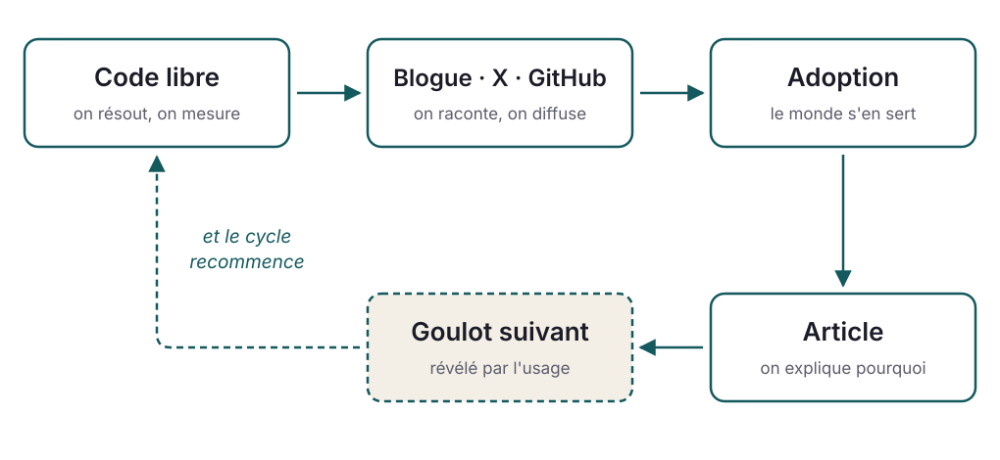

<!-- _class: lead -->
<!-- _paginate: false -->

## Le logiciel libre comme méthode de recherche

### *De l'article scientifique à des milliards d'appareils*

**Daniel Lemire**, professeur
Université du Québec (TÉLUQ)

blogue : https://lemire.me

X : [@lemire](https://x.com/lemire) · GitHub : [github.com/lemire](https://github.com/lemire/)

---

# Ce matin, sans le savoir…

2019

première version

20 k+

étoiles GitHub

10⁹

appareils

- Vous avez ouvert une page web : **simdutf** a validé son texte.
- Votre application a lu du JSON : **simdjson** l'a analysé.
- Un chiffre est passé de texte à nombre : **fast_float** s'en est chargé.

Node.js, Chrome, Safari, Rust, Go, .NET, ClickHouse… du code écrit dans un laboratoire universitaire, au Québec.

---

<!-- _class: lead big -->

## La question

Comment la recherche universitaire finit-elle
**dans la poche de milliards de gens ?**

---

<!-- _class: quote -->

# D'où viennent les idées ?

> I never come up with anything by going off to a mountaintop to think. Instead, my ideas come from two sources: talking to real users with real problems and then trying to solve them. This ensures I come up with ideas that somebody cares about and the rubber meets the road and not the sky.

<strong>Michael Stonebraker</strong> — prix Turing 2014 · Ingres, PostgreSQL, Vertica

---

# Le modèle linéaire de l'innovation

- Le prof réfléchit. Il publie.
- L'ingénieur lit, conçoit.
- Le client consomme.

---

# Vers un vrai modèle de l'innovation

- Révolution industrielle : sous-vêtements.
- Origine du clavier.
- ChatGPT: GPU (jeux), textes (web), chat (Discord).
- Relativité (train)

---

<!-- _class: lead -->

## Partie 1

## Le libre comme *méthode* de recherche

---

> Le logiciel libre n'est pas seulement une façon de publier des résultats de recherche : c'est une méthode de recherche à part entière.

---

# 1. Reproductibilité

- Le code **et** les bancs d'essai sont publics.
- N'importe qui peut relancer la mesure — sur sa machine, avec ses données.
- N'importe qui peut donc **vous réfuter**. C'est le but.

Un gain de performance qui ne survit pas à la machine d'un inconnu n'était pas un résultat.

---

# 2. Une évaluation par les pairs bien réelle

### Comité de lecture

- 2 à 3 lecteurs
- Ils lisent la description
- Un seul verdict, une seule fois
- Anonyme, sans suite

### Revue de code publique

- Des centaines d'yeux
- Ils exécutent le code
- Un verdict à **chaque** version
- Signé, et il faut y répondre

Les revues de code, les <em>issues</em> et les demandes d'intégration sont souvent un arbitrage plus exigeant qu'un comité de lecture.

---

# 3. Les données du monde réel viennent à vous

- Des **cas adversariaux** : ça ne fonctionne pas, ça ne suffit pas.
- Des **architectures exotiques** : ARM, POWER, RISC-V, WebAssembly.
- Des **charges réelles** : les fichiers que personne n'aurait pensé à fabriquer.

---

<!-- _class: lead -->

## Partie 2

## Une histoire : *simdjson*

---

<!-- _class: diagram -->

# Le cycle

---

# Acte 1 — l'analyse du JSON

2019

- Le JSON est partout, et son analyse est **lente** : des centaines de mégaoctets par seconde, au mieux.
- **D'abord le code** : simdjson, écrit avec Geoff Langdale — plusieurs **gigaoctets par seconde**, grâce aux instructions SIMD.
- **Puis un billet de blogue**, GitHub, quelques messages sur X. En quelques jours, des milliers de lecteurs.
- **Puis l'adoption** : bases de données, moteurs analytiques, environnements JavaScript.
- **L'article vient après** : *Parsing Gigabytes of JSON per Second* (VLDB Journal).

L'ordre compte : le logiciel était déjà adopté quand l'article est paru — et l'article n'aurait pas existé sans les mesures que l'usage a rendues possibles.

---

# Acte 2 — un goulot inattendu : les nombres

Révélé par l'usage

- Une fois le reste accéléré, l'analyse des **nombres à virgule flottante** devient le goulot.
- Personne n'aurait posé ce problème *a priori* : c'est le profilage d'un vrai analyseur qui l'a désigné.
- Résultat : l'algorithme **Eisel-Lemire**, exact et rapide (*Number Parsing at a Gigabyte per Second*).
- Adoption : Rust, Go, .NET, C++ — les bibliothèques standards elles-mêmes.

---

# Acte 3 — un autre goulot : l'UTF-8

Révélé par l'usage

- Analyser du JSON, c'est aussi **valider** de l'UTF-8 : la sécurité en dépend.
- Objectif atteint : la validation en **moins d'une instruction par octet**.
- Le morceau s'est détaché pour devenir une bibliothèque à part entière : **simdutf**.
- Adoption : Node.js, Bun, Deno, navigateurs — la validation et la transcodification d'Unicode du web.

---

# Le même cycle, trois fois

| Problème | Code | Adoption | Article |
|---|---|---|---|
| Analyse JSON | simdjson | bases de données, moteurs JS | VLDB Journal |
| Analyse des nombres | fast_float | Rust, Go, .NET, C++ | Software: P&E |
| Validation UTF-8 | simdutf | Node.js, Bun, navigateurs | Software: P&E |

Chaque ligne est née de la précédente. Aucune n'était au programme de recherche du départ.

---

<!-- _class: lead -->

## Partie 3

## Les tensions honnêtes

---

# La maintenance est ingrate

- Le succès se paie en **rapports de bogues**, en demandes de portage, en questions.
- Une faille de sécurité dans votre code, c'est une faille dans Node.js.
- Ce travail est **sans fin** et **invisible** — il ne s'écrit dans aucun CV académique.

Publier un article, c'est terminer. Publier une bibliothèque, c'est commencer.

---

# Les incitatifs sont mal alignés

### Ce que les comités comptent

- Les articles
- Les citations
- Les subventions

### Ce qui change le monde

- Les demandes d'intégration
- Les versions maintenues
- Les utilisateurs

**Il n'existe pas de case « adopté par un milliard d'appareils » dans un formulaire de promotion.**

---

<!-- _class: lead big -->

## Ce que je retiens

Le code ouvert **pose** les questions de recherche,
puis il en **vérifie** les réponses.

---

<!-- _class: quote -->

# La leçon du transfert

> The problem in this business isn't to keep people from stealing your ideas; it's making them steal your ideas.

<strong>Howard Aiken</strong> — cité par David Patterson, prix Turing 2017

---

<!-- _class: lead -->

## Merci

**Daniel Lemire** · Université du Québec (TÉLUQ)

blogue : https://lemire.me

X : [@lemire](https://x.com/lemire) · GitHub : [github.com/lemire](https://github.com/lemire/)

*simdjson · fast_float · simdutf · Roaring Bitmaps*
