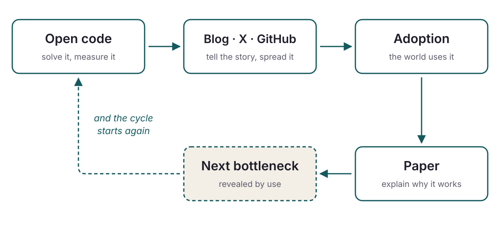

<!-- _class: lead -->
<!-- _paginate: false -->

## Open Source as a Research Method

### *From the research paper to billions of devices*

**Daniel Lemire**, professor
Université du Québec (TÉLUQ)

blog: https://lemire.me

X: [@lemire](https://x.com/lemire) · GitHub: [github.com/lemire](https://github.com/lemire/)

---

# This morning, without knowing it…

2019

first release

20 k+

GitHub stars

10⁹

devices

- You opened a web page: **simdutf** validated its text.
- Your app read some JSON: **simdjson** parsed it.
- A number went from text to binary: **fast_float** took care of it.

Node.js, Chrome, Safari, Rust, Go, .NET, ClickHouse… code written in a university lab, in Quebec.

---

<!-- _class: lead big -->

## The question

How does academic research end up
**in the pockets of billions of people?**

---

<!-- _class: quote -->

# Where do ideas come from?

> I never come up with anything by going off to a mountaintop to think. Instead, my ideas come from two sources: talking to real users with real problems and then trying to solve them. This ensures I come up with ideas that somebody cares about and the rubber meets the road and not the sky.

<strong>Michael Stonebraker</strong> — 2014 Turing Award · Ingres, PostgreSQL, Vertica

---

# The linear model of innovation

- The professor thinks. The professor publishes.
- The engineer reads, designs.
- The customer consumes.

---

# Toward a real model of innovation

- Industrial revolution: underwear.
- Where the keyboard came from.
- ChatGPT: GPUs (games), text (the web), chat (Discord).
- Relativity (trains)

---

<!-- _class: lead -->

## Part 1

## Open source as a research *method*

---

> Open source is not just a way to publish research results: it is a research method in its own right.

---

# 1. Reproducibility

- The code **and** the benchmarks are public.
- Anyone can rerun the measurements — on their own machine, with their own data.
- So anyone can **prove you wrong**. That is the point.

A performance gain that does not survive a stranger's machine was never a result.

---

# 2. Peer review that is actually real

### Journal referees

- 2 to 3 reviewers
- They read the description
- One verdict, once
- Anonymous, no follow-up

### Public code review

- Hundreds of eyes
- They run the code
- A verdict on **every** release
- Signed, and you must answer

Code reviews, issues and pull requests are often a more demanding form of review than a journal's referees.

---

# 3. Real-world data comes to you

- **Adversarial cases**: it doesn't work, it isn't fast enough.
- **Exotic architectures**: ARM, POWER, RISC-V, WebAssembly.
- **Real workloads**: the files nobody would have thought to make up.

---

<!-- _class: lead -->

## Part 2

## A story: *simdjson*

---

<!-- _class: diagram -->

# The cycle

---

# Act 1 — parsing JSON

2019

- JSON is everywhere, and parsing it is **slow**: hundreds of megabytes per second, at best.
- **Code first**: simdjson, written with Geoff Langdale — several **gigabytes per second**, thanks to SIMD instructions.
- **Then a blog post**, GitHub, a few posts on X. Within days, thousands of readers.
- **Then adoption**: databases, analytics engines, JavaScript runtimes.
- **The paper comes after**: *Parsing Gigabytes of JSON per Second* (VLDB Journal).

The order matters: the software was already adopted when the paper came out — and the paper would not exist without the measurements that real use made possible.

---

# Act 2 — an unexpected bottleneck: numbers

Revealed by use

- Once everything else is fast, parsing **floating-point numbers** becomes the bottleneck.
- Nobody would have posed this problem *a priori*: profiling a real parser pointed to it.
- Result: the **Eisel-Lemire** algorithm, exact and fast (*Number Parsing at a Gigabyte per Second*).
- Adoption: Rust, Go, .NET, C++ — the standard libraries themselves.

---

# Act 3 — another bottleneck: UTF-8

Revealed by use

- Parsing JSON also means **validating** UTF-8: security depends on it.
- Goal reached: validation in **less than one instruction per byte**.
- That piece broke off to become a library of its own: **simdutf**.
- Adoption: Node.js, Bun, Deno, browsers — Unicode validation and transcoding for the web.

---

# The same cycle, three times

| Problem | Code | Adoption | Paper |
|---|---|---|---|
| JSON parsing | simdjson | databases, JS engines | VLDB Journal |
| Number parsing | fast_float | Rust, Go, .NET, C++ | Software: P&E |
| UTF-8 validation | simdutf | Node.js, Bun, browsers | Software: P&E |

Each row grew out of the one before. None of them was in the original research plan.

---

<!-- _class: lead -->

## Part 3

## The honest tensions

---

# Maintenance is thankless

- Success is paid for in **bug reports**, porting requests, questions.
- A security flaw in your code is a security flaw in Node.js.
- This work is **endless** and **invisible** — it shows up on no academic CV.

Publishing a paper means you are done. Publishing a library means you are just getting started.

---

# The incentives are misaligned

### What committees count

- Papers
- Citations
- Grants

### What changes the world

- Pull requests
- Maintained releases
- Users

**There is no "adopted by a billion devices" box on a promotion form.**

---

<!-- _class: lead big -->

## My takeaway

Open code **raises** the research questions,
then it **checks** the answers.

---

<!-- _class: quote -->

# The lesson of technology transfer

> The problem in this business isn't to keep people from stealing your ideas; it's making them steal your ideas.

<strong>Howard Aiken</strong> — quoted by David Patterson, 2017 Turing Award

---

<!-- _class: lead -->

## Thank you

**Daniel Lemire** · Université du Québec (TÉLUQ)

blog: https://lemire.me

X: [@lemire](https://x.com/lemire) · GitHub: [github.com/lemire](https://github.com/lemire/)

*simdjson · fast_float · simdutf · Roaring Bitmaps*
