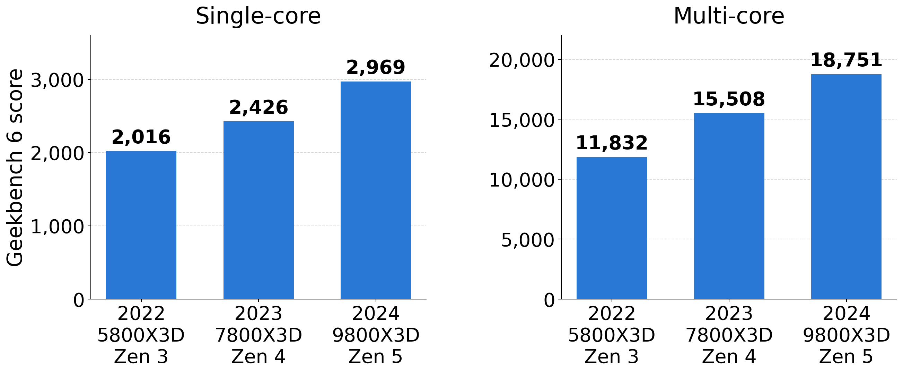
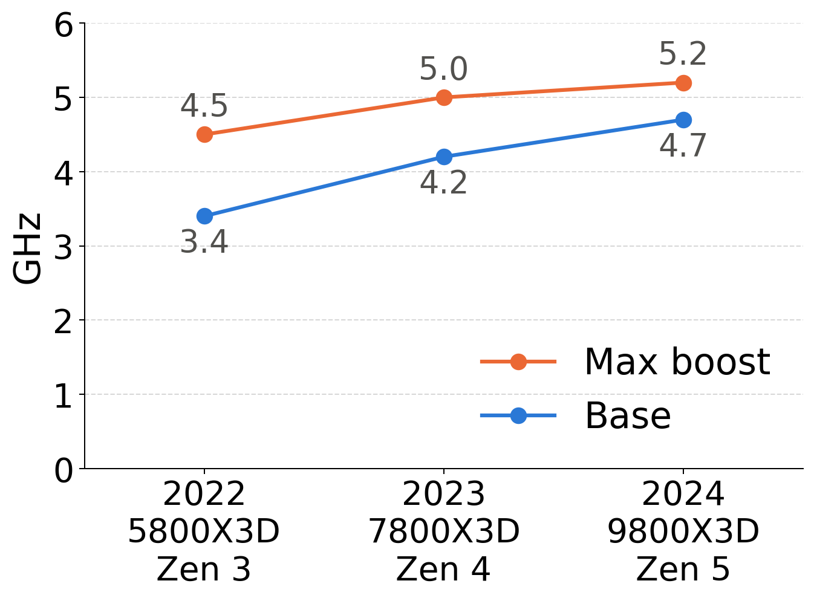
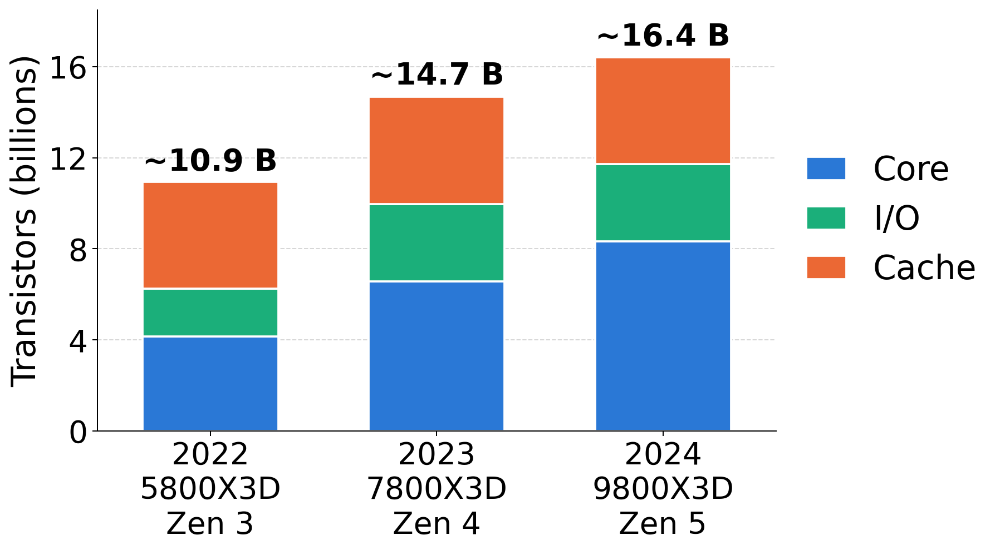
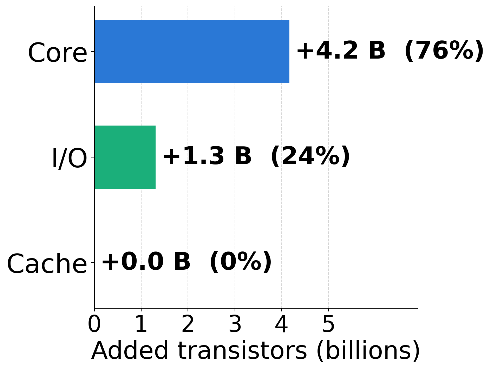
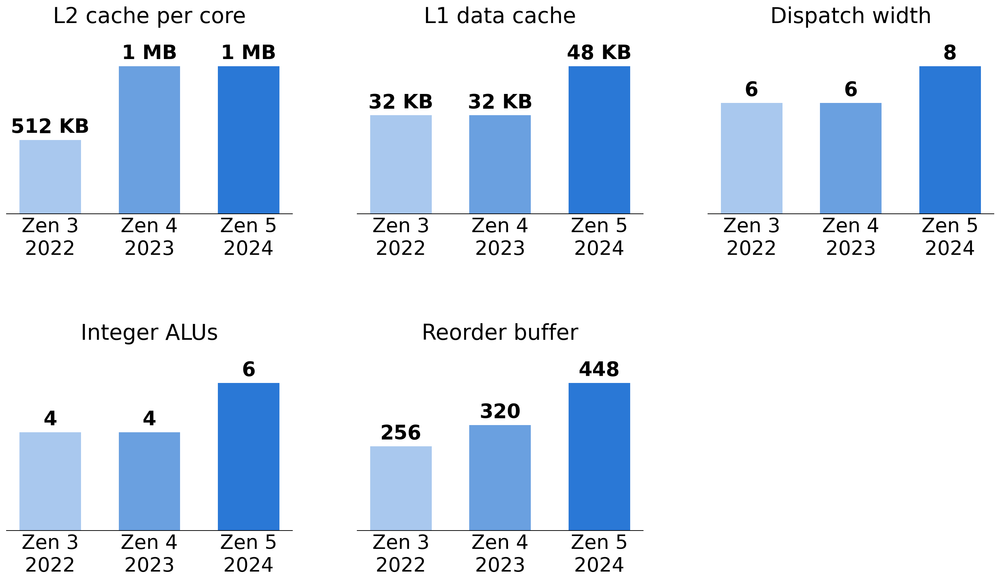
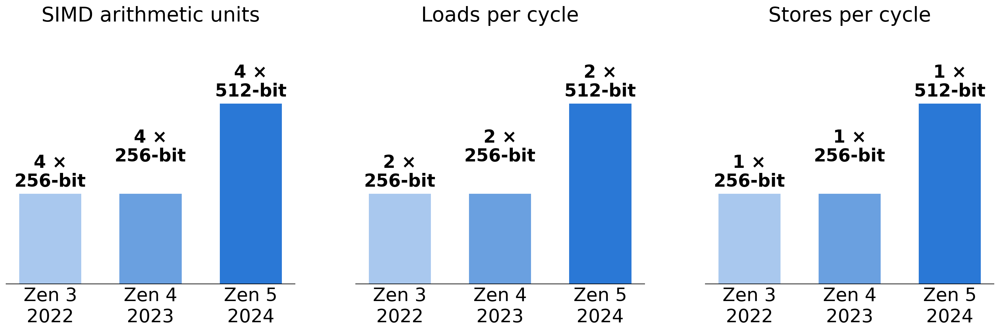

# Where did AMD put 5.5 billion transistors?

People still tell me that CPUs are boring. That nothing much happens anymore. The clock frequency has been stuck near 4 GHz for two decades, so what could possibly change?

Let us look at three AMD Ryzen 7 processors from 2022 to 2024: the 5800X3D (Zen 3), the 7800X3D (Zen 4) and the 9800X3D (Zen 5). They are comparable chips: 8 cores, one core die, one I/O die, and a 64 MB 3D V-Cache die stacked on top. Same shape, three generations.

## Performance: +50% in two years

On Geekbench 6, the 2024 chip is 47% faster than the 2022 chip on a single core, and 58% faster with all cores. Same number of cores.

|             | 2022, 5800X3D, Zen 3 | 2023, 7800X3D, Zen 4 | 2024, 9800X3D, Zen 5 |
|-------------|-------|--------|--------|
| Single-core | 2,016 | 2,426  | 2,969  |
| Multi-core  | 11,832 | 15,508 | 18,751 |

## The clock did not do it

The max boost went from 4.5 GHz to 5.2 GHz, about 15%. The base clock went up more, from 3.4 GHz to 4.7 GHz, but the 5800X3D had an unusually low base clock because its cache die sat on top of the cores and trapped heat; the 9800X3D puts the cache die underneath. Either way, the clock explains a fraction of the gain.

|           | Zen 3 (2022) | Zen 4 (2023) | Zen 5 (2024) |
|-----------|---------|---------|---------|
| Base      | 3.4 GHz | 4.2 GHz | 4.7 GHz |
| Max boost | 4.5 GHz | 5.0 GHz | 5.2 GHz |

For perspective: a Pentium 4 in 2000 ran at 1.3 to 2 GHz. Twenty-five years later, we are at 4.7 to 5.2 GHz. About 2.5× in a quarter century. The clock is not where the action is.

## The transistors did it

The package went from about 10.9 billion transistors to about 16.4 billion: up 50%, matching the performance gain almost exactly. Where did they go?

The chip is three dies, and they did not grow equally.

| Die                | 2022 | 2024 | Change |
|--------------------|------|------|--------|
| Core die (CCD)     | 4.15 B | 8.3 B | +4.2 B (2×) |
| I/O die (IOD)      | 2.09 B | 3.4 B | +1.3 B |
| 3D V-Cache die     | ~4.7 B | ~4.7 B | 0 |

Three quarters of the new transistors went into the core die. The core die *doubled* its transistor count with the same eight cores and the same 32 MB of L3. The I/O die got the rest, and that happened in one step, 2022 to 2023: the move from AM4 to AM5 brought DDR5, PCIe 5.0 and a small RDNA2 GPU into the I/O die. The cache die did not change at all: same 64 MB, same part.

So the question becomes: how do you double the transistors in a core, without adding cores, and get 50% more performance?

## You make the core wider

You give each core more of everything. Dispatch width went from 6 instructions per cycle to 8. Integer ALUs went from 4 to 6. The reorder buffer went from 256 entries to 448, so the processor can keep more instructions in flight and find more of them to run in parallel. The L2 cache per core doubled to 1 MB. The L1 data cache went from 32 KB to 48 KB.

|                    | Zen 3 (2022) | Zen 4 (2023) | Zen 5 (2024) |
|--------------------|-------|-------|-------|
| L2 cache per core  | 512 KB | 1 MB | 1 MB |
| L1 data cache      | 32 KB | 32 KB | 48 KB |
| Dispatch width     | 6     | 6     | 8     |
| Integer ALUs       | 4     | 4     | 6     |
| Reorder buffer     | 256   | 320   | 448   |

Notice that the L2 doubling, the only pure-SRAM item on the list, is a small part of the transistor budget: 4 MB of extra L2 across eight cores is roughly 0.2 to 0.3 billion transistors, a tenth of the growth. The rest is logic: wider front end, more execution units, a deeper out-of-order window, bigger branch predictors.

## And for data parallelism, Zen 5 is a different machine

Zen 3 and Zen 4 had four 256-bit SIMD arithmetic units. Zen 4 could execute AVX-512 instructions, but it ran a 512-bit operation as two 256-bit passes, so it did no more work per cycle than Zen 3. Zen 5 has four native 512-bit units. The loads and stores widened to match: two 512-bit loads and one 512-bit store per cycle, double the L1 bandwidth.

|                       | Zen 3 (2022) | Zen 4 (2023) | Zen 5 (2024) |
|-----------------------|-------------|-------------|-------------|
| SIMD arithmetic units | 4 × 256-bit | 4 × 256-bit | 4 × 512-bit |
| Loads per cycle       | 2 × 256-bit | 2 × 256-bit | 2 × 512-bit |
| Stores per cycle      | 1 × 256-bit | 1 × 256-bit | 1 × 512-bit |

That is a doubling of the arithmetic throughput per cycle on a chip you can buy at a retail store.

## Where the transistors go, and what it means for your code

Take the list of things AMD did with its transistors:

* more instructions per cycle (wider dispatch, more ALUs, bigger reorder buffer);
* better speculation (bigger predictors);
* more cache and more memory-level parallelism;
* wider SIMD units.

The first three make *existing* code faster. You recompile nothing, you change nothing, and the branchy scalar loop you wrote in 2015 runs better on Zen 5 than on Zen 3. That is the deal we have had with processor vendors for forty years.

The last one is different. A 512-bit SIMD unit does nothing for you until your code issues 512-bit instructions. Compilers do it only in the easy cases. So the one place where the transistors doubled the throughput is also the one place where the gain is not automatic: you, or a library you use, must ask for it.

I already made the point that [processors are getting wider](https://lemire.me/blog/2025/09/01/processors-are-getting-wider/). This is what that looks like, transistor by transistor, on a desktop chip. The question for the rest of us is whether our software is wide enough to use it.

*Transistor counts per die are AMD's published figures where available; the V-Cache die of the 9800X3D is undisclosed and assumed equal to the previous generation. Geekbench 6 scores are the browser.geekbench.com medians as of September 2026. Microarchitecture parameters from AMD's Zen 3, Zen 4 and Zen 5 disclosures.*
