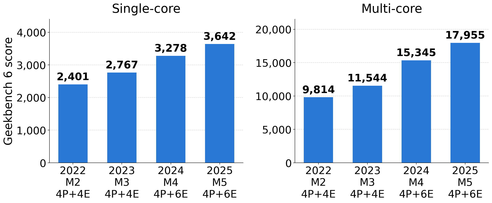
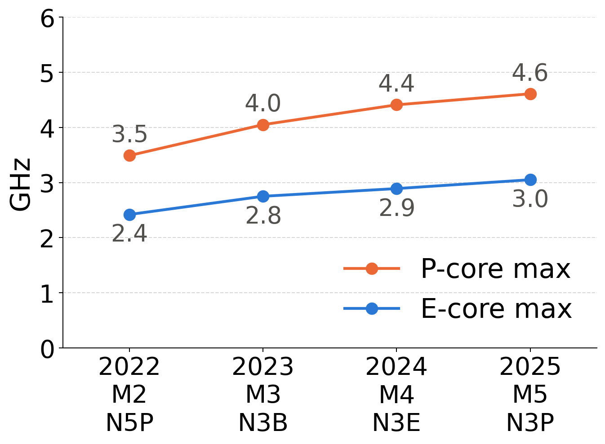
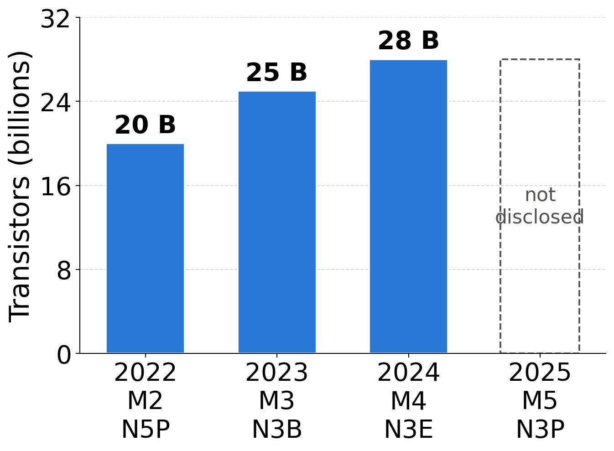
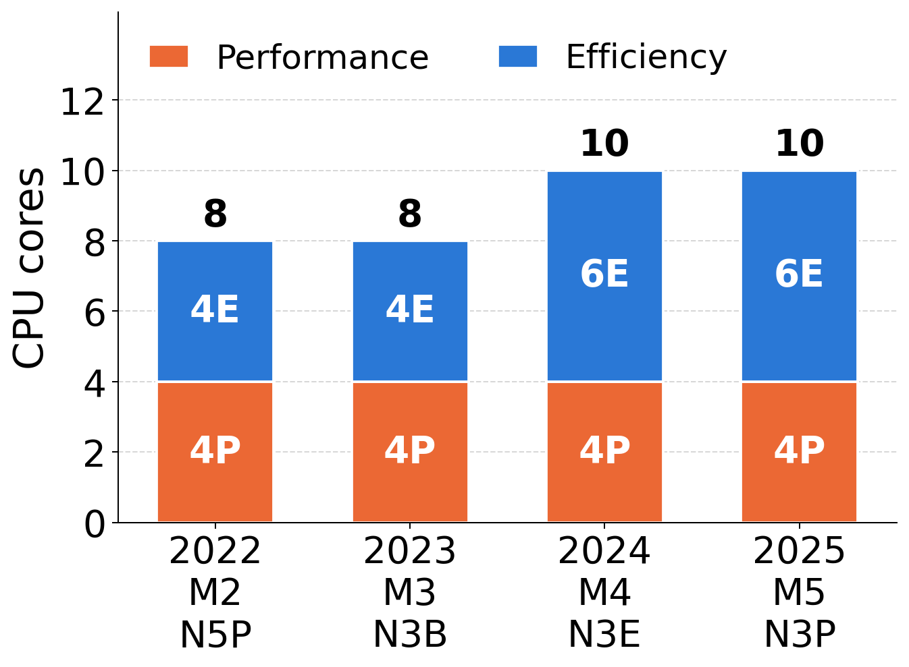
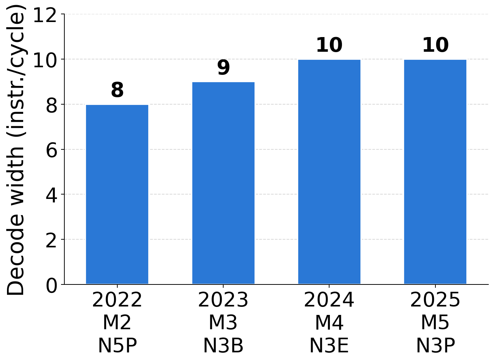
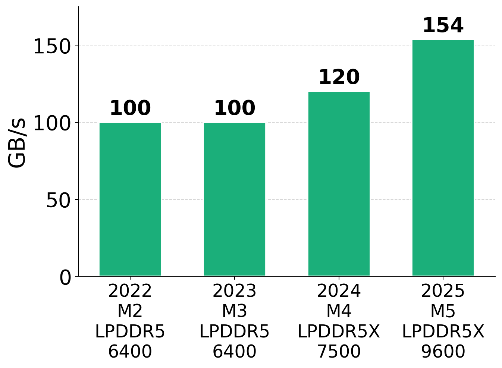
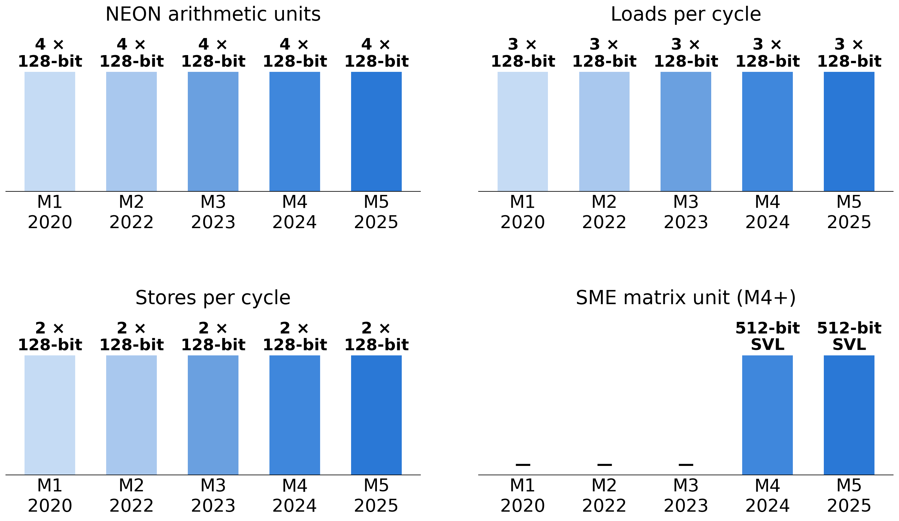

# How did Apple silicon get 50% faster in three years?

I recently looked at [how AMD Ryzen got 50% faster in two years](https://lemire.me/blog/2026/09/18/how-did-amd-ryzen-get-50-faster-in-two-years/). Let us do the same exercise with Apple.

I take the base Apple chips from 2022 to 2025: the M2, M3, M4 and M5. They are the chips in the MacBook Air and in the entry-level MacBook Pro. Same product tier, and the same four performance cores throughout.

On Geekbench 6, performance went up by about 50% in three years.

|             | 2022, M2 | 2023, M3 | 2024, M4 | 2025, M5 |
|-------------|-------|--------|--------|--------|
| Single-core | 2,401 | 2,767  | 3,278  | 3,642  |
| Multi-core  | 9,814 | 11,544 | 15,345 | 17,955 |

The 2025 chip is 52% faster on a single core than the 2022 chip, and 83% faster with all cores.

Unlike AMD, Apple got a lot of it from the clock. The performance cores went from 3.49 GHz to 4.61 GHz, a 32% increase; the efficiency cores from 2.42 GHz to 3.05 GHz, 26%. The big step was the M3, Apple's first 3 nm chip.

|                    | M2 (2022) | M3 (2023) | M4 (2024) | M5 (2025) |
|--------------------|----------|----------|----------|----------|
| Performance core   | 3.49 GHz | 4.05 GHz | 4.41 GHz | 4.61 GHz |
| Efficiency core    | 2.42 GHz | 2.75 GHz | 2.89 GHz | 3.05 GHz |
| Process            | TSMC N5P | N3B      | N3E      | N3P      |

Take the clock out of the single-core gain and about 15% is left: that is how much more each performance core does per cycle in 2025 than in 2022. For AMD over 2022 to 2024, the same computation gives about 28%.

The number of transistors went from 20 billion to 28 billion, up 40% in two years. Apple did not disclose the M5 count.

Where did they go? Apple does not say. An M-series chip is a single die with the CPU, the GPU, the neural engine, the media engines and the memory controllers on it, so there is no core die and cache die to count separately, as there is with Ryzen. What we can say is where they did *not* go: the four performance cores are the same four performance cores. The extra CPU cores are efficiency cores, four to six with the M4.

|                    | M2 | M3 | M4 | M5 |
|--------------------|----|----|----|----|
| Performance cores  | 4  | 4  | 4  | 4  |
| Efficiency cores   | 4  | 4  | 6  | 6  |

The two extra efficiency cores are a good part of the multi-core gain. The single-core score does not see them.

So how did the performance core get 15% better per cycle? The front end got wider. The M2 decodes 8 instructions per cycle, the M3 9, the M4 and M5 10. For comparison, AMD went from 6 to 8 dispatched instructions per cycle over Zen 3 to Zen 5, and Apple was already at 8 in 2020 with the M1.

The other thing that grew is memory bandwidth: 100 GB/s on the M2 and M3 with LPDDR5-6400, 120 GB/s on the M4 with LPDDR5X-7500, 153.6 GB/s on the M5 with LPDDR5X-9600. Up 54% in three years. That helps many threads at once, and the GPU, more than it helps one thread.

|                    | M2 | M3 | M4 | M5 |
|--------------------|----|----|----|----|
| Memory             | LPDDR5-6400 | LPDDR5-6400 | LPDDR5X-7500 | LPDDR5X-9600 |
| Bandwidth          | 100 GB/s | 100 GB/s | 120 GB/s | 154 GB/s |

Now the part that interests me most. For data parallelism (SIMD), nothing changed. The performance core has four 128-bit NEON arithmetic units, three 128-bit loads per cycle and two 128-bit stores per cycle, on the M2, and on the M5, and on the M1 before them. No SVE, no SVE2, no wider vectors.

|                       | M2 (2022) | M3 (2023) | M4 (2024) | M5 (2025) |
|-----------------------|-------------|-------------|-------------|-------------|
| NEON arithmetic units | 4 × 128-bit | 4 × 128-bit | 4 × 128-bit | 4 × 128-bit |
| Loads per cycle       | 3 × 128-bit | 3 × 128-bit | 3 × 128-bit | 3 × 128-bit |
| Stores per cycle      | 2 × 128-bit | 2 × 128-bit | 2 × 128-bit | 2 × 128-bit |
| SME matrix unit       | —           | —           | 512-bit     | 512-bit     |

The M4 added SME, a matrix extension with 512-bit streaming vectors. It is aimed at machine learning and it is a separate unit with its own mode, not a wider general-purpose SIMD path: your NEON code does not get faster because of it.

Compare with AMD over the same years. Zen 3 and Zen 4 had four 256-bit SIMD units; Zen 5 has four 512-bit units, with the loads and stores widened to match. In bits of SIMD arithmetic per cycle, an Apple performance core has 512, unchanged since 2020; a Zen 5 core has 2048, double what it had in 2023.

Two companies, two answers to the same question. AMD kept its clock and widened its core, SIMD included. Apple raised its clock, widened its front end, added efficiency cores and memory bandwidth, and left its SIMD units alone. Both got about 50% more performance. On a Zen 5, vector code that moves to 512-bit registers can run twice as fast as before. On an M5, the vector width you had in 2022 is the vector width you have today, and the only way to go faster is to keep all four units busy.

I already made the point that [processors are getting wider](https://lemire.me/blog/2025/09/01/processors-are-getting-wider/). Apple's cores were wide early. Whether the vectors get wider too is, for now, a question only AMD and Intel have answered.

*Geekbench 6 scores are the browser.geekbench.com Mac medians as of September 2026 (Mac mini M2, MacBook Pro 14-inch M3, Mac mini M4, MacBook Pro 14-inch M5). Clock frequencies, transistor counts and memory specifications are Apple's announced figures. Decode widths and SIMD unit counts are from third-party measurements, since Apple does not publish its microarchitecture.*
