<style>
.center-table {
  display: flex;
  justify-content: center;
}
</style>


## <!--fit--> Make Your Code Faster with Data Parallelism

Daniel Lemire, professor
Université du Québec (TÉLUQ)
Montréal :canada:

blog: https://lemire.me
X: [@lemire](https://x.com/lemire)
GitHub: [https://github.com/lemire/](https://github.com/lemire/)

---

# Where I am coming from

* Author of libraries you are probably running right now: **simdjson**, **simdutf**, **fast_float**, **Roaring Bitmaps**.
* Shipped inside .NET, Rust, Go, Node.js, Bun, Deno, Google Chrome, Safari, ClickHouse.
* Node.js core contributor (C++ review, performance, security).
* Editor, *Software: Practice and Experience* (Wiley, founded 1971).


---

<!-- ============ PART 1 ============ -->

# Part 1

## Parallelism for the win

---

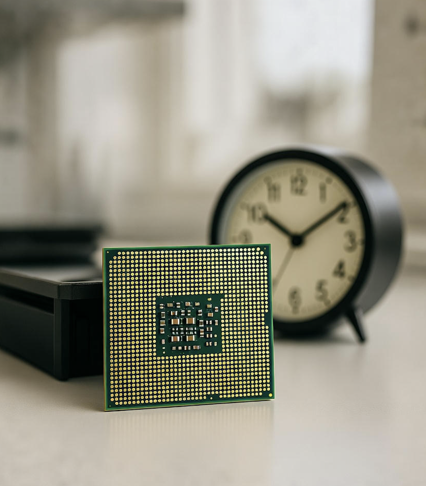

# Some numbers

* Time is discrete: the clock cycle
* Processors: ~4&nbsp;GHz
* One cycle is 0.25 nanoseconds
* Light travels 7.5&nbsp;cm per cycle
* **One byte per cycle is only 4&nbsp;GB/s**

---

# Frequencies and transistors

| processor | year  | frequency  | transistors    |
|-----------|-------|------------|----------------|
| Pentium 4 | 2000  | 3.8 GHz    | 0.040 billions |
| Intel Haswell  | 2013  | 4.4 GHz    | 1.4 billions  |
| Apple M1  | 2020  | 3.2 GHz    | 16 billions    |
| Apple M3  | 2024  | 4.05 GHz   | 25 billions    |
| Apple M4  | 2024  | 4.5 GHz    | 28 billions    |
| AMD Zen 5 | 2024  | 5.7 GHz    | 50 billions    |

**Frequency: +50% in 25 years. Transistors: 1000×.**

---

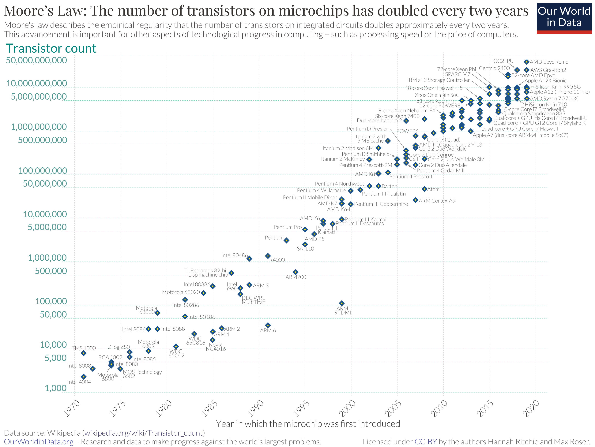

---

# Where do the transistors go?

* More cores
* More superscalar execution (more instructions per cycle)
* Better speculative execution ($\to$ more instructions per cycle)
* More cache, more memory-level parallelism ($\to$ more instructions per cycle)
* Better **data-level parallelism** (SIMD) ($\to$ **fewer instructions**)

The last one is different: the hardware does not do it *for* you. 

---

# Doubles every 3 years


<div class="center-table">

| Specification  | year                | one channel      |
|--------------|--------------------|--------|
| PCIe 1.x  | 2003   | 500 MB/s |
|  PCIe 2.x |  2007   | 1 GB/s |
|  PCIe 3.x |  2010   | 2 GB/s |
|  PCIe 4.x |  2017  | 4 GB/s |
| PCIe 5.x  | 2019  | 8 GB/s |
|  PCIe 6.x|  2022  | 16 GB/s|
|  PCIe 7.x |  2025 | 32 GB/s|
</div>

---

# Disk at gigabytes per second


* Sony PlayStation 5 (2020): 5&nbsp;GB/s
* Sony PlayStation 6 (2027): 15&nbsp;GB/s (?)

---

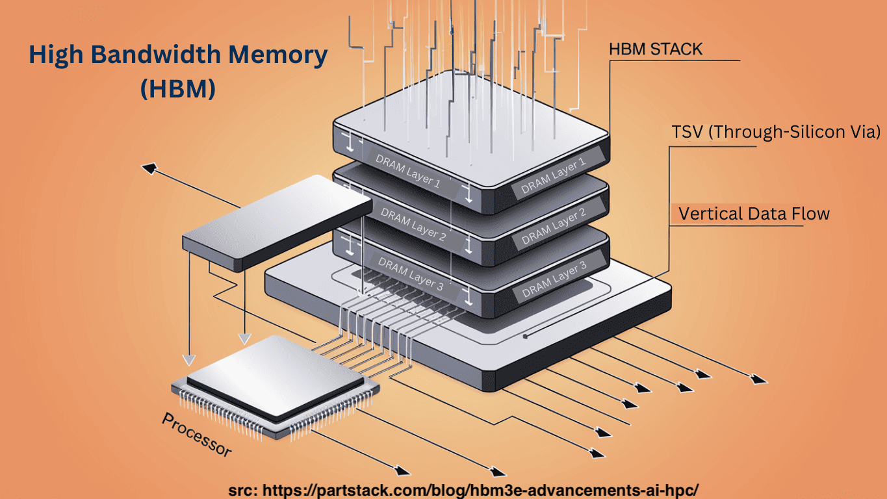

# High Bandwidth Memory


| Generation | Year | Bandwidth (per stack) |
|------------|--------------|----------------------------|
| HBM2E      | 2020    | ~460 GB/s                  |
| HBM3       | 2022         | 819 GB/s                   |
| HBM3E      | 2024    | ~1.2 TB/s                  |
| HBM4       | 2026    | >2.8 TB/s |
| HBM4E      | 2027         | ~4 TB/s                    |

---

# The squeeze

* Your storage delivers gigabytes per second.
* Your memory delivers hundreds of gigabytes per second.
* Your software processes bytes **one at a time**.

**You are CPU bound.**


---

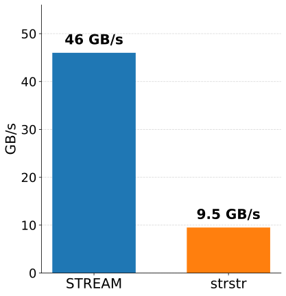

# Zen 5 AWS (EPYC 9R45, c8a)

- STREAM single thread bandwidth: 46 GB/s
- `strstr`, 32-byte needle: 9.5 GB/s

---

<!-- ============ PART 2 ============ -->

# Part 2

## The kinds of parallelism

---

# 1. Multicore

* The one everyone knows.
* Hard: synchronization, false sharing, non-determinism.
* Does nothing for a single request that must finish in 2&nbsp;ms.
* Multiplies your energy bill by the number of cores.

**Do this last, not first.**

---

# 2. Superscalar and speculative execution

| processor       | year    | arithmetic logic units    | SIMD units |
|-----------------|---------|---------------------------|-----|
| Pentium 4       |  2000   |    2                      | $2 \times 128$ |
| AMD Zen 2       |  2019   |    4                      | $2 \times 256$ |
| Apple M*        |  2019   |    6+                     | $4 \times 128$ |
| Intel Lion Cove |  2024   |    6                      | $4 \times 256$ |
| AMD Zen 5       |  2024   |    6                      | $4 \times 512$ |

Processors *predict* branches and execute code *speculatively*. A misprediction costs 10–20 cycles.

---

# How much can your processor learn?

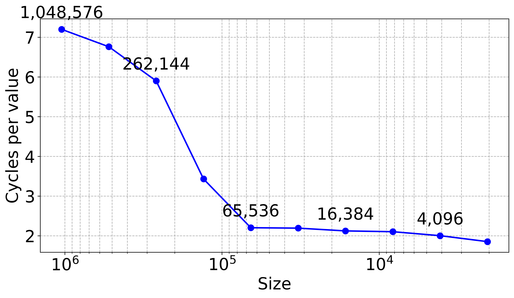

---

# Apple M4 can learn 10,000 random (0/1) branches


1. Benchmark over **massive** inputs, or you are measuring the branch predictor's memory.
2. Prefer a branchless solution when it costs you nothing.

---

# 3. Memory-level parallelism

* Latency to RAM: ~100&nbsp;ns (400 cycles).
* But you can have dozens of loads in flight at once.

| cycle | action | action | pizza en route |
|-------|--------|---------|----------------|
| 1    | order pizza A |      |             |
| 2    | order pizza B |      | A🚚            |
| 3   | order pizza C |      | A🚚, B🚚            |
| 4   | order pizza D | eat pizza A 🍕    | B🚚, C🚚 |
| 5   | order pizza E | eat pizza B 🍕    |  C🚚, D🚚 |

---

# Little's Law

* Latency harms throughput
* Parallelism hides latency

$$\mathrm{throughput} = \frac{\mathrm{parallelism}}{\mathrm{latency}}$$

---


---

# Bloom filter


Restructure the queries so several memory accesses are in flight at once.

---

# Bloom filter (Intel Ice Lake, out-of-cache)


Same algorithm. Same hash functions. **Different memory access pattern.**

---

# 4. Data-level parallelism

## The rest of this talk

---

<!-- ============ PART 3 ============ -->

# Part 3

## SIMD and SWAR

---

## SIMD (Single Instruction, Multiple Data)

* Process 16, 32 or 64 bytes with **one** instruction
* Supported on every modern CPU — your phone included
* Not a niche feature: it is most of the silicon area of a modern core

---

# The instruction sets

* **x64**: SSE2 (baseline, 128-bit), AVX2 (256-bit), AVX-512 (512-bit)
* **ARM**: NEON (128-bit, baseline on ARMv8), SVE/SVE2 (scalable)
* **RISC-V**: RVV (scalable)
* **POWER**: AltiVec/VSX · **LoongArch**: LSX, LASX
* **WebAssembly**: 128-bit SIMD, in every browser

Portability is mostly solved: compile several kernels, dispatch at runtime on CPU features. C++26 adds data-parallel types (`std::simd`).

---

# SWAR: SIMD within a register

* Use plain 64-bit integer instructions
* A 64-bit register holds 8 bytes
* Fully portable C, C++, Rust, Go, Java...
* No intrinsics, no dispatch, no `#ifdef`
* Requires some cleverness

**A great place to start.**

---

## Check whether we have 8 digits

In ASCII/UTF-8, the digits 0, 1, ..., 9 have values
0x30, 0x31, ..., 0x39.

To recognize a digit:

* The high nibble should be 3.
* The high nibble should remain 3 if we add 6 (0x39 + 0x6 is 0x3f)

---

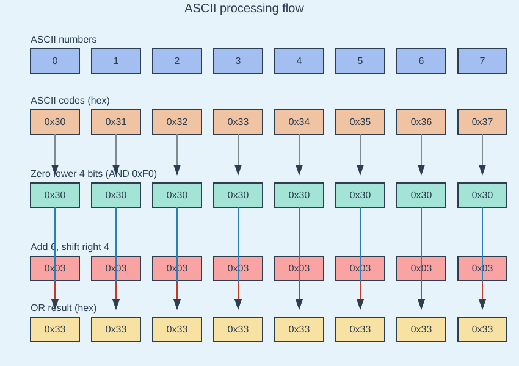

---

```cpp
 // load 8 input bytes into val
 bool is_made_of_eight_digits_fast(uint64_t val)  noexcept  {
  return !((((val + 0x4646464646464646)
          | (val - 0x3030303030303030))
          & 0x8080808080808080));
 }
```

compiles to

```asm
add     rax, rdi
add     rdi, rdx
or      rax, rdi
test    rax, rdx
```

**Four instructions for eight characters, and no branch.**

---

<!-- ============ PART 4 ============ -->

# Part 4

## Case studies

---

# Case study: parsing a number

- `1.3321321e-12` to `double`

```cpp
double result;
fast_float::from_chars(
  input.data(), input.data() + input.size(), result);
```

* Used by major browsers (Safari, Chrome), GCC (12+), C#, Rust, MySQL, Go, Python
* About $4 \times$ faster than the conventional alternatives

---

We massively reduced the number of CPU instructions required.

| function | instructions |
|----------|--------------|
| strtod   |     $> 1000$     |
| our parser   |    $\approx 200$     |

*Reference*:
Number Parsing at a Gigabyte per Second, Software: Practice and Experience 51 (8), 2021

https://github.com/fastfloat/fast_float

---

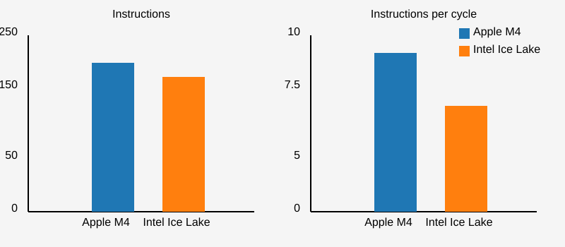

---

# The lesson

* We did not make the instructions faster.
* We **removed** instructions.
* Data parallelism is an instruction-count strategy.

---

<!-- ============ PART 5 ============ -->

# Case study: 64 characters, 3 instructions

---

# ASCII to lower case

```javascript
For each character c
    If c - 'A' <= 'Z' - 'A' then
        c = c + 'a' - 'A'
    EndIf
EndFor
```

One byte per iteration. One unpredictable branch per byte.

---

# 64 characters in 3 instructions

- Compute $c-\mathrm{A}$
```cpp
__m512i ca = _mm512_sub_epi8(c, _mm512_set1_epi8('A'));
```

- Turn $c-\mathrm{'A'} \leq \mathrm{Z}-\mathrm{A}$ into a mask
```cpp
__mmask64 is_upper = _mm512_cmple_epu8_mask(ca, _mm512_set1_epi8('Z' - 'A'));
```

- Add $\mathrm{a} - \mathrm{A}$ to $c$ according to the mask
```cpp
__m512i result = _mm512_mask_add_epi8(c, is_upper, c, to_lower);
```

**No branch at all.**

---

# Let us check with llvm-mca

* `llvm-mca` is a static machine-code analyzer shipped with LLVM
* Feed it assembly, name a microarchitecture, get a cycle estimate
* No hardware required, no noise, no warm-up

```bash
llvm-mca -mcpu=icelake-server -iterations=100 kernel.s
```

---

# The scalar loop: 1 byte per iteration

```asm
movzbl  (%rdi,%rax), %ecx
leal    -65(%rcx), %edx
cmpb    $26, %dl
jae     .LBB1_2
addb    $32, %cl
movb    %cl, (%rdi,%rax)
addq    $1, %rax
cmpq    %rax, %rsi
jne     .LBB1_1
```

---

# The AVX-512 loop: 64 bytes per iteration

```asm
vmovdqu64  (%rdi,%rax), %zmm2
vpsubb     %zmm0, %zmm2, %zmm3
vpcmpub    $2, %zmm1, %zmm3, %k1
vpaddb     %zmm4, %zmm2, %zmm2 {%k1}
vmovdqu64  %zmm2, (%rdi,%rax)
addq       $64, %rax
cmpq       %rax, %rsi
jne        .LBB0_1
```

---

# llvm-mca says...

```text
                             scalar        AVX-512
Iterations:                     100            100
Instructions:                   900            800
Total Cycles:                   206            216
uOps Per Cycle:                4.37           4.63
IPC:                           4.37           3.70
```

* Bytes processed: **100** vs **6400**
* Cycles per byte: **2.06** vs **0.034**

**About 60× fewer cycles per byte.**

---

# Read that table again

* The scalar loop has the **higher IPC** (4.37 vs 3.70).
* The scalar loop retires **more instructions per cycle**.
* The scalar loop is **60× slower**.

**IPC is not a performance metric. It is a diagnostic.**

---

# What llvm-mca will not tell you

* It assumes perfect branch prediction — the scalar loop's real cost is worse.
* It assumes every load hits L1 — real code will be memory bound.
* It models one microarchitecture at a time.

Use it to *explain* a measurement, not to replace one.

---

<!-- ============ JSON ============ -->

# Case study: JSON

---

# JSON

* Portable, simple, human-readable; used by ~97% of API requests
* Strings (escaped), numbers, objects, arrays
* Reading and writing JSON is often *slow*: 100 MB/s to 300 MB/s
* Slower than a fast disk or a fast network

```bash
$ go run parse_twitter.go
Parsed 0.63 GB in 6.961 seconds (90.72 MB/s)
```

---

# "But JSON parsing is inherently serial"

* Every byte can change the meaning of every following byte.
* Strings contain escapes; escapes contain quotes.
* It is a textbook state machine.

This was the conventional wisdom. It was wrong.

---

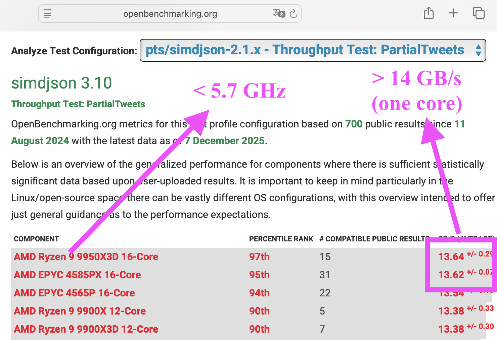

* openbenchmarking.org
* 14 GB/s, at less than 5.7 GHz
* Parsing JSON at better than **2.5 bytes per cycle**

---

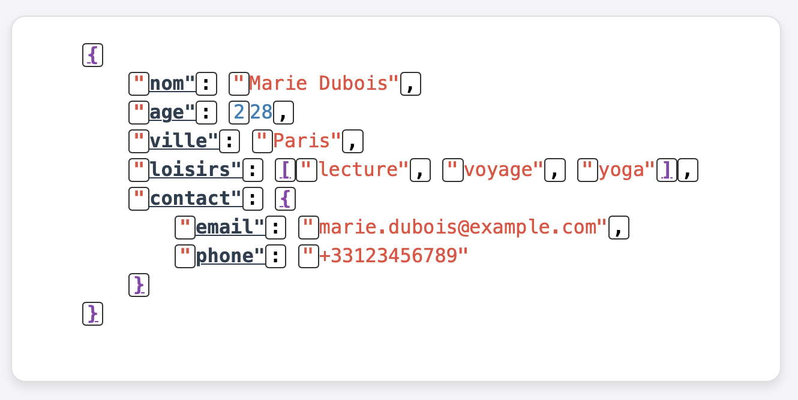

# You are probably using simdjson

* Node.js, Bun, Deno, Electron
* ClickHouse
* WatermelonDB, Apache Doris, Meta Velox, Milvus, QuestDB, StarRocks

 

---

# Every major JavaScript engine parses JSON with SIMD

* `JSON.parse` in Node.js, Bun and Deno is data-parallel.
* Billions of calls per second worldwide.
* Nobody had to change a single line of JavaScript.

---

# simdjson: two-stage design

**Stage 1 (data-parallel):** scan the whole document with SIMD
* find every structural character and the start of every string
* validate UTF-8
* produce an index

**Stage 2 (mostly serial):** walk the index and build values
* the hard, branchy work now runs on ~5% of the bytes

---

# simdjson: the numbers

* Structural scan: about **10 GB/s**
* UTF-8 validation: about **30 GB/s**
* Minification: **10 to 20 GB/s**
* Fast skipping: only parse what you actually read

---

# Classifying characters

We need to sort every byte into a class:

- comma (0x2c) `,`
- colon (0x3a) `:`
- brackets (0x5b, 0x5d, 0x7b, 0x7d): `[, ], {, }`
- white-space (0x09, 0x0a, 0x0d, 0x20)
- everything else

A switch statement per byte? No.

---

# Vectorized classification

* Most SIMD instruction sets support 'vectorized lookup tables' (at least 16-element)
* With a 256-element table we could just compute `H(c)`
* With 16-element tables, we need two tables `H1` and `H2`
* Find `H1` and `H2` such that the bitwise AND of the lookups classifies the character:
  `H1(c & 0xf) & H2(c >> 4)`

---

```c
low_nibble_mask  = {16, 0, 0, 0, 0, 0, 0, 0, 0, 8, 12, 1, 2, 9, 0, 0};
high_nibble_mask = {8, 0, 18, 4, 0, 1, 0, 1, 0, 0, 0, 3, 2, 1, 0, 0};
```

Five instructions, 16 to 64 bytes at a time:
```c
    nib_lo  = input & 0xf;
    nib_hi  = input >> 4;
    shuf_lo = lookup(low_nibble_mask, nib_lo);
    shuf_hi = lookup(high_nibble_mask, nib_hi);
    return shuf_lo & shuf_hi;
```

**This trick generalizes: any 256-way classification into 8 classes.**

---

# Serialization is also a data-parallel problem

* JSON requires escaping `"`, `\`, and control characters.
* Almost no string actually needs escaping.
* So: check 16 to 64 bytes at once, and take the fast path.

---

# SIMD string escaping

**Traditional (1 byte at a time):**
```cpp
for (char c : str) {
    if (c == '"' || c == '\\' || c < 0x20)
        return true;
}
```

**SIMD (64 bytes at once):**
```cpp
auto chunk = load_64_bytes(str);
auto needs_escape = check_all_conditions_parallel(chunk);
if (!needs_escape)
    return false;  // Fast path!
```

---

# C++26 compile-time reflection


---

# One line each way (C++26)

```cpp
struct Player {
    std::string username;
    int level;
};

Player load_player(std::string& json_str) {
    return simdjson::from(json_str);
}

std::string save_player(const Player& p) {
    return simdjson::to_json(p);
}
```

No macros. No code generation step. No runtime reflection cost.

---

# Deserialization (Apple Silicon)

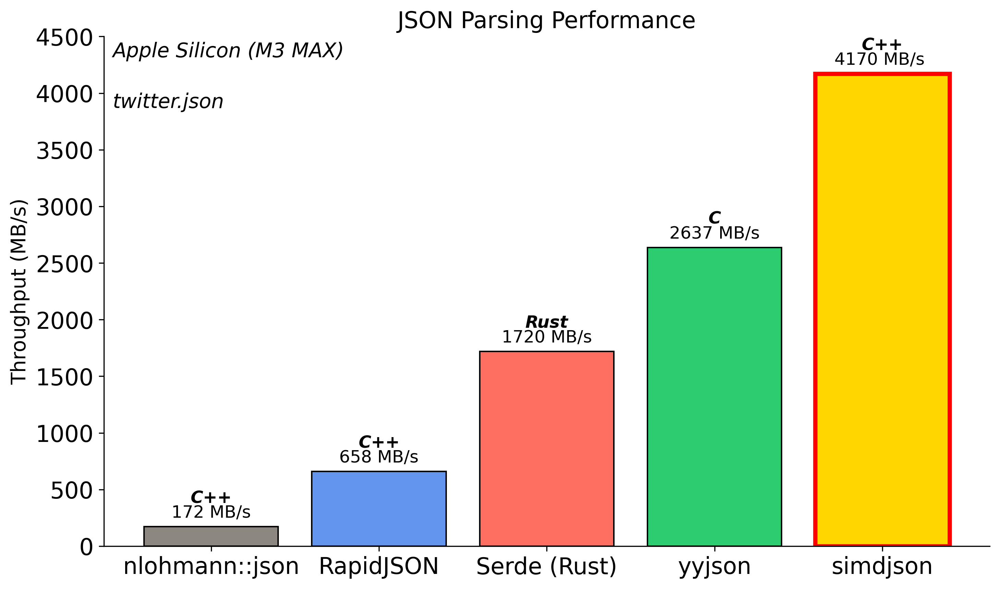

---

# Serialization (Apple Silicon)

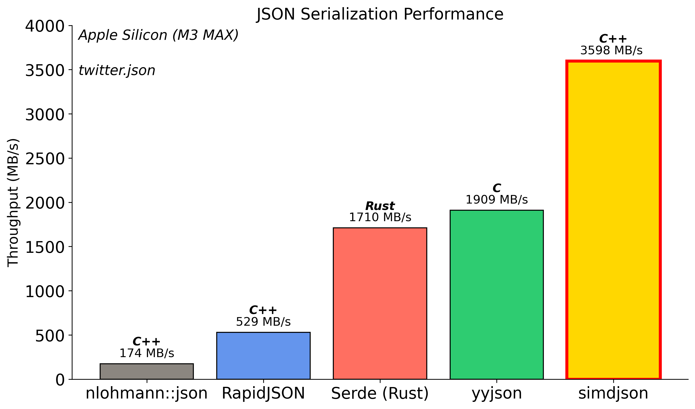

---

<!-- ============ UNICODE ============ -->

# Case study: Unicode

---


# simdutf

* Inside Safari, Chrome, Node.js, Bun
* Unicode transcoding and validation at gigabytes per second
* Base64 too
* x64, ARM, POWER, RISC-V, LoongArch

---

# Unicode (UTF-16)

* Code points from U+0000 to U+FFFF: a single 16-bit value.
* Beyond: a *surrogate pair*, `U+D800`–`U+DBFF` followed by `U+DC00`–`U+DFFF`.
* A lone surrogate makes the string ill-formed.

Every JavaScript string, every Java string, every Windows filename.

---

# Validate

```javascript
PROCEDURE validate_utf16(code_units)
    i ← 0
    WHILE i < |code_units|
        unit ← code_units[i]
        IF unit ≤ 0xD7FF OR unit ≥ 0xE000 THEN
            INCREMENT i
            CONTINUE
        IF unit ≥ 0xD800 AND unit ≤ 0xDBFF THEN
            IF i + 1 ≥ |code_units| THEN
                RETURN false
            next_unit ← code_units[i + 1]
            IF next_unit < 0xDC00 OR next_unit > 0xDFFF THEN
                RETURN false
            i ← i + 2  // Valid surrogate pair
            CONTINUE
        RETURN false
    RETURN true
```

---

# Performance results (Apple M4)

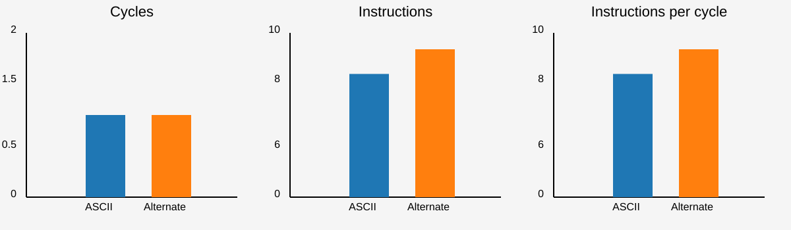

1 character per cycle might be just 4 GB/s — slower than your disk.

---

# Now make the input adversarial

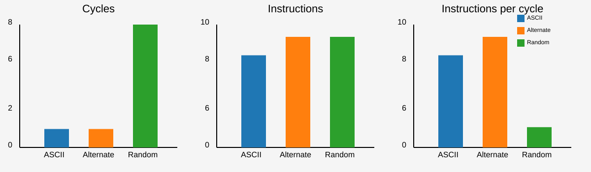

We are now barely at 1 GB/s. **The branch predictor was doing the work.**

---

# Finite state machine to the rescue

```cpp
static uint8_t transition_table[3][256] = { {...}, {...}, {...} };

bool is_valid_utf16_ff(std::span<uint16_t> code_units) {
    uint8_t state = 0; // Start in Initial state
    for (auto code_unit : code_units) {
        uint8_t high_byte = code_unit >> 8;
        state = transition_table[state][high_byte];
    }
    return state == 0; // Valid only if we end in Initial state
}
```

Three states: default, just saw a high surrogate, error. **No branches.**

---

# The finite-state approach can be $7 \times$ faster


---

# But we can do better than validation

```javascript
const str = "ab\uD800";
console.log(str.toWellFormed());
// "ab�"
```

`String.prototype.toWellFormed()` must *copy and repair*, not merely check.

---

# UTF-16, random (adversarial), Apple M4


The SIMD **correction** function (which copies the data) beats the non-SIMD **validation** function.

---

# UTF-16 correction, Apple M4


|               |     scalar      |    ARM NEON    |
|---------------|-------------|-------------|
| GB/s          | 2.2         | 18.9        |
| ins/byte      | 12.0        | 0.9         |

**13× fewer instructions per byte.**

---

# In the browser (Apple M4)

- Chromium: 16 GB/s (**uses our new function**)
- Firefox: 3.4 GB/s
- Safari: 1.2 GB/s

Test it yourself: https://lemire.github.io/browserwellformed/

---

<!-- ============ PART 8 ============ -->

# Case study: base64

---

# Base64

- Encodes binary data as text using 64 characters (A-Z, a-z, 0-9, +, /)
- 3 bytes input → 4 characters output (33% overhead)
- Data URLs, email, JWTs, web APIs, embedded images

- `"Hello, World!"` → `SGVsbG8sIFdvcmxkIQ==`

Bit manipulation on a fixed schedule: **the ideal SIMD problem.**

---

# New JavaScript functions

```javascript
const b64 = Uint8Array.prototype.toBase64(bytes);
const recovered = Uint8Array.fromBase64(b64);
```

| function (Safari, Apple M4) | speed |
|-----------|-------|
| `Uint8Array.fromBase64()` | 11 GiB/s |
| `Uint8Array.toBase64()` | 20 GiB/s |

Test in your browser: https://simdutf.github.io/browserbase64/

---

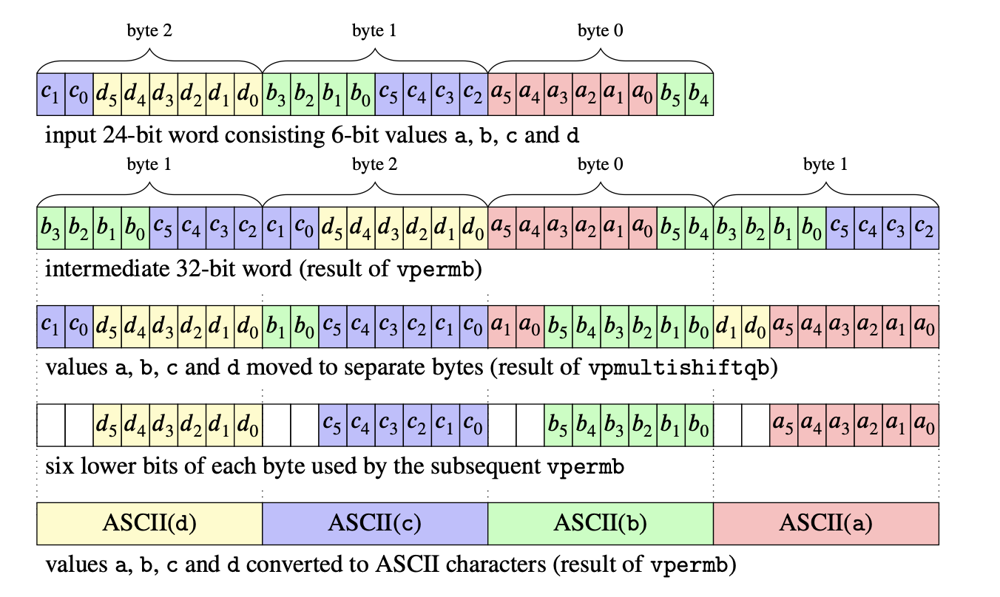

# AVX-512 base64 encoding

- Encoding a 64-byte block requires only **two** non-memory instructions:
  `vpermb` (twice) and `vpmultishiftqb`.
- The right instruction turns an algorithm into a lookup.

---

<!-- ============ PART 5 ============ -->

# Part 5

## Why your compiler will not do this for you

---

# Auto-vectorization: the good case

Successive differences: `out[i] = in[i] - in[i-1]`


Scalar: **1 cycle** per element, 6 instructions per element.

---

# Auto-vectorization: the good case


Vectorized: **0.25 cycles** per element, 0.9 instructions per element. 4× faster, for free.

Note the instructions per cycle went **down**, from 6 to 3.8.

---

# But look at the prefix sum

* `out[i] = out[i-1] + in[i]`
* Same shape of loop. Same data. Same compiler.
* **Unchanged**: 1 cycle per element, in both builds.
* There is a loop-carried dependency, so the compiler gives up.

---

# And yet the prefix sum *does* vectorize

* Shift-and-add, $\log_2 n$ steps: a classic parallel-prefix network.
* The compiler cannot invent it, because it is **a different algorithm**, not a different schedule.

**This is the whole talk in one slide.**

---

# What compilers can do

* Unroll loops
* Vectorize simple, dependency-free, contiguous loops
* Choose instruction schedules

# What compilers cannot do

* Change your data layout
* Change your algorithm
* Decide that a rare case can be handled on a slow path

---

# Unrolling is not vectorizing


Fewer cycles, yes. But you are still touching one element at a time.

---

<!-- ============ PART 6 ============ -->

# Part 6

## Can an LLM write your SIMD code?

---

# The honest answer: partly

Frontier models in 2026 are genuinely good at:

* Recalling intrinsic names and semantics (better than I am)
* Translating a working NEON kernel to AVX2, or to RVV
* Writing the scalar reference implementation and the test harness
* Explaining an unfamiliar instruction

---

# Where they still struggle

* **Inventing** the vectorized algorithm (the nibble-lookup trick, the prefix network)
* Reasoning about throughput vs. latency and port pressure
* Knowing that a 512-bit instruction may downclock the core
* Noticing that the fast path is fast only on *your* data

They optimize what you measured. They do not choose what to measure.

---

# What actually works: close the loop

Give the agent the three things it cannot produce on its own:

1. **A benchmark** it can run, over realistic inputs
2. **A differential fuzzer** against a scalar reference
3. **`llvm-mca`** (or `perf`) so it can see cycles, not vibes

Then let it iterate.

---

# A workable prompt shape

```text
Here is a scalar reference implementation and a fuzzer that
compares any candidate against it.

Here is a benchmark: `make bench` prints cycles per byte.

Write an AVX2 version. After each attempt, run the fuzzer and
the benchmark, and run llvm-mca on the inner loop. Do not stop
until the fuzzer passes and cycles/byte is below 0.2.
```

The constraint is the contribution. The agent supplies the patience.

---

# The failure mode to watch for

* An agent will happily produce SIMD code that is **correct on your test inputs** and wrong on the surrogate pair, the truncated block, the empty string, the 63-byte tail.
* Tail handling is where hand-written SIMD goes to die, and LLMs inherit that.
* **Fuzz the tails. Fuzz the alignment. Fuzz the adversarial input.**

---

# The division of labour

| you | the agent |
|---|---|
| choose the algorithm | write the intrinsics |
| define correctness | run the fuzzer |
| define the benchmark | iterate on the schedule |
| decide when it is fast enough | port to the other instruction sets |

---

<!-- ============ PART 7 ============ -->

# Part 7

## Measure properly, or do not bother

---

# Measurements

* We often assume that measurements (timings) are normally distributed.
* If they were, the 'error' would fall off as $1/\sqrt{N}$.
* It is often an incorrect assumption.

---

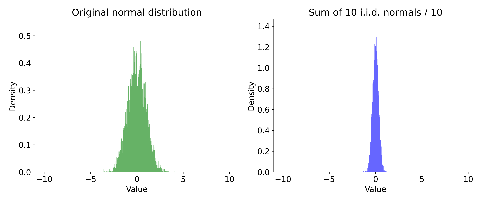

---

# What if we dealt with log-normal distributions?


---

# Real-world measurements

* You cannot assume normality
* Measurements are **not independent**
* Reality: the absolute **minimum** is often the *reliable* metric
* Margin: the difference between the mean and the minimum

<!--https://lemire.me/blog/2023/04/27/hotspot-performance-engineering-fails/-->

---

# Use performance counters

Timings tell you *that* something is slow. Counters tell you *why*.

* **instructions retired** — did I actually remove work?
* **cycles** — the ground truth
* **branch misses** — is the predictor carrying me?
* **cache misses** — am I memory bound after all?

`perf stat`, `Instruments`, or a library such as `performancecounters`.

---

# The diagnostic table I always build

| variant | ns/byte | instr/byte | cycles/byte | IPC | branch miss/byte |
|---|---|---|---|---|---|
| scalar | | | | | |
| SWAR | | | | | |
| SIMD | | | | | |

If instructions/byte did not drop, you did not do data parallelism.
If cycles/byte did not drop, find out which counter did move.

---

# Hot-spot engineering fails

* A profiler shows you where the cycles are *now*.
* It does not show you the 30% of instructions spread evenly over every function.
* Reducing the total instruction count beats optimizing the top-of-profile function.

<!--https://lemire.me/blog/2023/04/27/hotspot-performance-engineering-fails/-->

---

<!-- ============ CONCLUSION ============ -->

# When is data parallelism worth it?

**Good signs**
* You touch every byte or every element
* The work per element is small and uniform
* You have an unpredictable branch per element
* You are validating, scanning, transcoding, filtering, or counting

**Bad signs**
* Deep pointer chasing
* Genuinely irregular control flow with expensive bodies
* You are already memory bound at full bandwidth

---

# It applies more often than you think

* JSON parsing — every JavaScript engine
* Unicode validation — every browser
* base64 — the JavaScript standard library
* Number parsing — every compiler toolchain
* Bitmap indexes, hashing, compression, `memchr`, CSV, regex prefiltering

"Inherently serial" is usually a statement about the algorithm you happen to know.

---

# What to take home

1. Clock speeds are flat; parallelism is where performance lives.
2. Data parallelism reduces **instructions**, not just time.
3. Your compiler schedules; it does not redesign. That part is yours.
4. Branchy code looks great in a synthetic benchmark and dies on real data.
5. IPC is a diagnostic, not a goal. The minimum time is your metric.
6. AI agents are excellent hands and mediocre architects — give them a benchmark and a fuzzer.

---

# Interested? Check these projects

* **simdjson** — the fastest JSON parser in the world https://simdjson.org
  * Node.js, Bun, Deno, Electron
  * ClickHouse, WatermelonDB, Apache Doris, Meta Velox, Milvus, QuestDB, StarRocks
* **simdutf** — Unicode (UTF-8/16/32) and base64 https://github.com/simdutf/simdutf
  * Node.js, Bun, WebKit (Safari), Chromium (Chrome, Edge)
* **fast_float** — number parsing https://github.com/fastfloat/fast_float
* **Roaring Bitmaps** — https://roaringbitmap.org

---

# Credit

- simdjson reflection work with Francisco Geiman Thiesen (Microsoft)
- simdutf UTF-16 correction is joint work with Robert Clausecker
- simdjson and simdutf are community efforts (Geoff Langdale, John Keiser, Paul Dreik, Yagiz Nizipli and others)

---

## <!--fit--> Questions?

Daniel Lemire — [lemire.me](https://lemire.me)

X: [@lemire](https://x.com/lemire) · GitHub: [github.com/lemire](https://github.com/lemire/)

:canada:
