<style>
.center-table {
  display: flex;
  justify-content: center;
}
/* full-bleed figure slides: small padding, compact title, figure fills the rest */
section.fig { padding: 24px 36px; }
section.fig h1 { font-size: 1.35em; margin: 0 0 10px 0; }
section.fig img { max-height: 575px; max-width: 100%; display: block; margin: 0 auto; }
section.fig p { margin: 8px 0 0 0; font-size: 0.85em; text-align: center; }
</style>


<style scoped>
h2 { font-size: 2.4em; line-height: 1.1; }
.affil { font-size: 0.6em; }
</style>

## Make Your Code Faster with Data Parallelism

Daniel Lemire, professor
<span class="affil">Université du Québec (TÉLUQ)</span>
Montréal :canada:

blog: https://lemire.me
X: [@lemire](https://x.com/lemire)
GitHub: [https://github.com/lemire/](https://github.com/lemire/)

---

# Where I am coming from

* Author of libraries you are probably running right now: **simdjson**, **simdutf**, **fast_float**, **Roaring Bitmaps**.
* Shipped inside .NET, Rust, Go, Node.js, Bun, Deno, Google Chrome, Safari, ClickHouse.
* Node.js core contributor (C++ review, performance, security).
* Editor, *Software: Practice and Experience* (Wiley, founded 1971).


---

<!-- ============ PART 1 ============ -->

# Part 1

## Parallelism for the win

---


# Some numbers

* Time is discrete: the clock cycle
* Processors: ~4&nbsp;GHz
* One cycle is 0.25 nanoseconds
* Light travels 7.5&nbsp;cm per cycle
* **One byte per cycle is only 4&nbsp;GB/s**

---

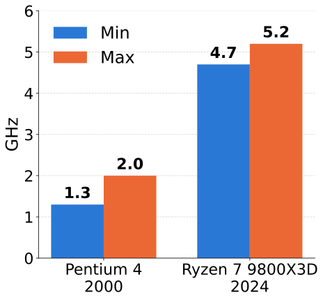

# Clock frequency: 25&nbsp;years

- Pentium 4 (2000): 1.3 to 2 GHz
- AMD Ryzen 7 9800X3D (2024): 4.7 to 5.2 GHz
- **About 2.5× in 25 years**

---

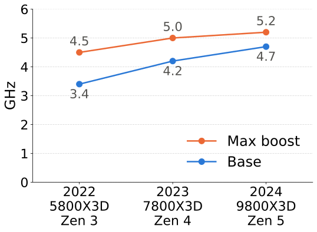


# Clock frequency: AMD Ryzen 7, 2022–2024


- Up 15% is two years

---

# Geekbench 6: Apple M2–M5, 2022–2025

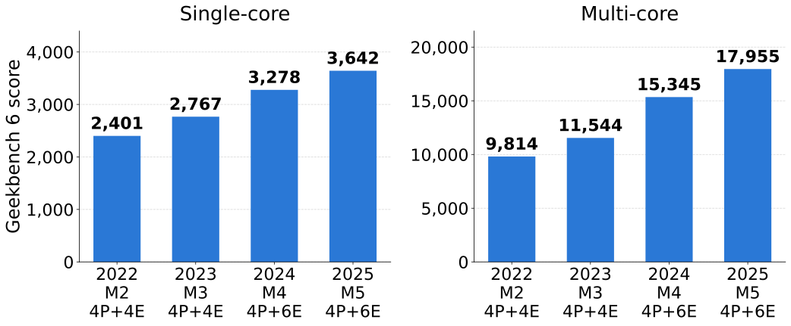

Single-core: **+52%**. Multi-core: **+83%**. Same 4 P-cores.

---

# Geekbench 6: AMD Ryzen 7, 2022–2024

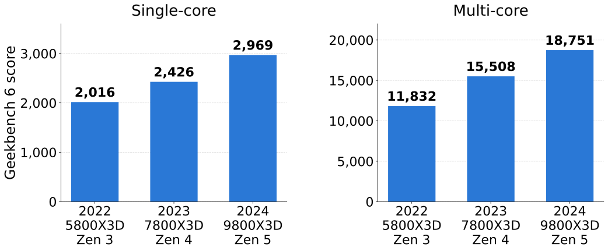

Single-core: **+47%**. Multi-core: **+58%**. Same 8 cores.

---

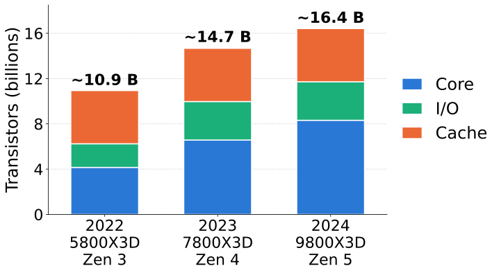

# Transistors: AMD Ryzen 7, 2022–2024

- 8 cores 
- Up 50% is two years


---

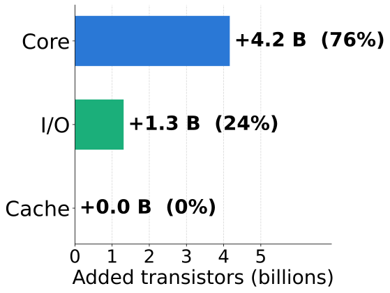

# +5.5 B transistors, 2022–2024

- Same 8 cores
- **76%** went into the core die
- 24% into the I/O die
- Cache die unchanged


---


<div style="margin-left:auto;margin-right:auto">
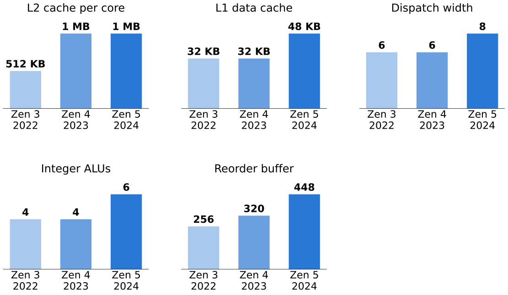
</div>

---

# What changed in the core: SIMD (same 8 cores)

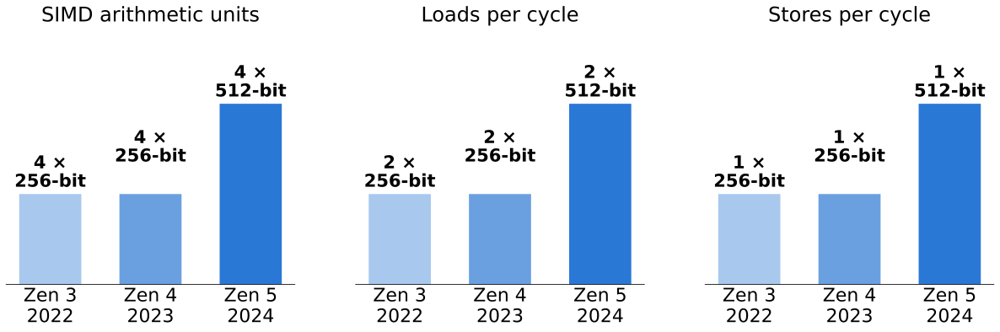


---

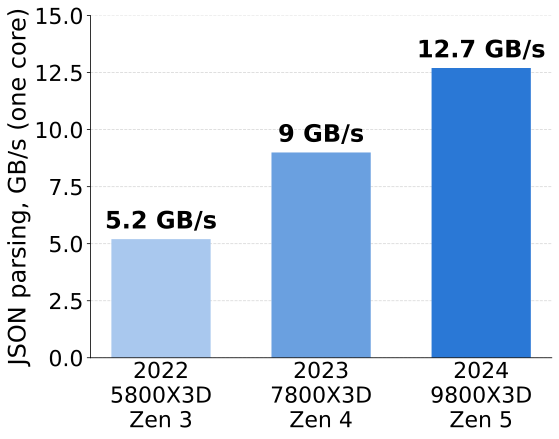

# Same software, three years apart

- simdjson, PartialTweets benchmark, one core
- Same code: **2.4×** from 2022 to 2024
- The library is designed for data parallelism
- Same $


---

# Disk at gigabytes per second


| device | year | PCI | read speed |
|--------|------|-----------|-----------:|
| PS5 | 2020 | 4.0 | 5 GB/s |
| WD Black SN8100 | 2025 | 5.0 | 14.9&nbsp;GB/s |
| Samsung PM1763 | 2026 | 6.0 | 28.4&nbsp;GB/s |

     |

---

# **You are CPU bound.**

## More than you know.


---


# Zen 5 AWS (EPYC 9R45, c8a)

- STREAM single thread bandwidth: 46 GB/s
- `strstr`, 32-byte needle: 9.5 GB/s


---

# Data-level parallelism

## The rest of this talk

---

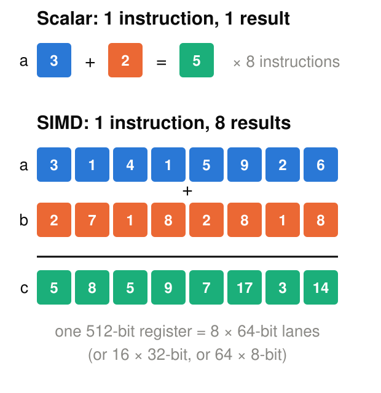

## SIMD (Single Instruction, Multiple Data)

* Process 16, 32 or 64 bytes with **one** instruction
* Supported on every modern CPU — your phone included
* Not a niche feature: it is most of the silicon area of a modern core

---

# The instruction sets

* **x64**: SSE2 (baseline, 128-bit), AVX2 (256-bit), AVX-512 (512-bit)
* **ARM**: NEON (128-bit, baseline on ARMv8), SVE/SVE2 (scalable)
* **RISC-V**: RVV (scalable)
* **POWER**: AltiVec/VSX · **LoongArch**: LSX, LASX
* **WebAssembly**: 128-bit SIMD, in every browser

Portability: compile several kernels, dispatch at runtime on CPU features. C++26 adds data-parallel types (`std::simd`).

---

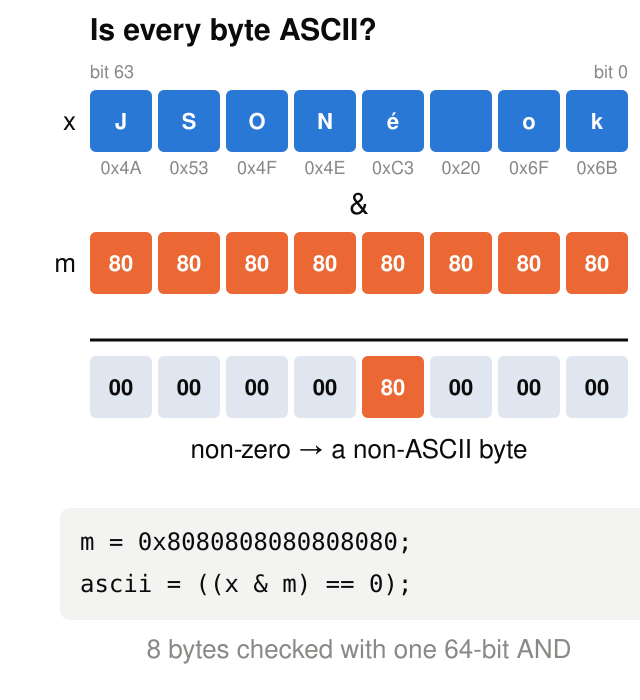

# SWAR: SIMD within a register

* Use plain 64-bit integer instructions
* A 64-bit register holds 8 bytes
* Fully portable C, C++, Rust, Go, Java...
* No intrinsics, no dispatch, no `#ifdef`
* Requires some cleverness

**A great place to start.**

---

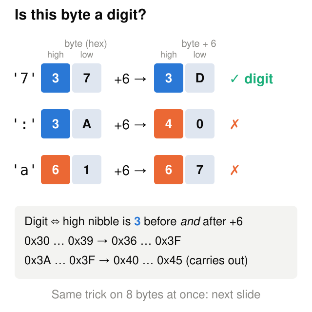

## Check whether we have 8 digits

In ASCII/UTF-8, the digits 0, 1, ..., 9 have values
0x30, 0x31, ..., 0x39.

To recognize a digit:

* The high nibble should be 3.
* The high nibble should remain 3 if we add 6 (0x39 + 0x6 is 0x3f)

---

```cpp
 // load 8 input bytes into val
 bool is_made_of_eight_digits_fast(uint64_t val)  noexcept  {
  return !((((val + 0x4646464646464646)
          | (val - 0x3030303030303030))
          & 0x8080808080808080));
 }
```

compiles to

```asm
add     rax, rdi
add     rdi, rdx
or      rax, rdi
test    rax, rdx
```

**Four instructions for eight characters, and no branch.**

---


<!-- ============ PART 5 ============ -->

# Case study: ASCII processing

---

# ASCII to lower case

```javascript
For each character c
    If c - 'A' <= 'Z' - 'A' then
        c = c + 'a' - 'A'
    EndIf
EndFor
```

One byte per iteration. One unpredictable branch per byte.

---

# 64 characters in 3 instructions

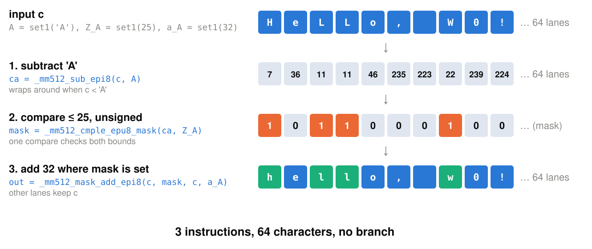

---

# Let us check with llvm-mca

* `llvm-mca` is a static machine-code analyzer shipped with LLVM
* Feed it assembly, name a microarchitecture, get a cycle estimate
* No hardware required, no noise, no warm-up

```bash
llvm-mca -mcpu=icelake-server -iterations=100 kernel.s
```

---

# The scalar loop: 1 byte per iteration

```asm
movzbl  (%rdi,%rax), %ecx
leal    -65(%rcx), %edx
cmpb    $26, %dl
jae     .LBB1_2
addb    $32, %cl
movb    %cl, (%rdi,%rax)
addq    $1, %rax
cmpq    %rax, %rsi
jne     .LBB1_1
```

---

# The AVX-512 loop: 64 bytes per iteration

```asm
vmovdqu64  (%rdi,%rax), %zmm2
vpsubb     %zmm0, %zmm2, %zmm3
vpcmpub    $2, %zmm1, %zmm3, %k1
vpaddb     %zmm4, %zmm2, %zmm2 {%k1}
vmovdqu64  %zmm2, (%rdi,%rax)
addq       $64, %rax
cmpq       %rax, %rsi
jne        .LBB0_1
```

---

# llvm-mca says...

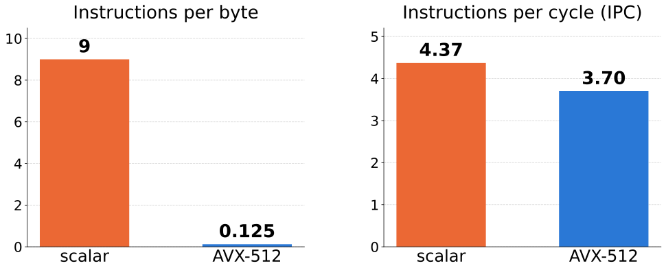

**About 60× fewer cycles per byte.**


---

# What llvm-mca will not tell you

* It assumes perfect branch prediction
* It assumes every load hits L1
* It often ignores memory alignment issues
* It models one microarchitecture at a time.

It is a model. Not reality.

---

# Reality: Intel Xeon Gold 6548N (Emerald Rapids)

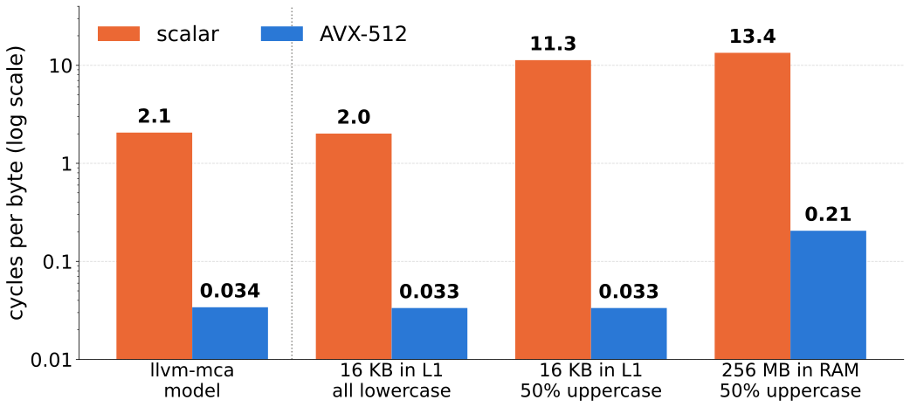

---

# Model vs reality

* Model assumptions hold (L1, predictable, aligned): **within 3%** of llvm-mca
* Unpredictable branches: scalar is **5× slower** than the model
* 256 MB in RAM: AVX-512 is **6× slower** than the model (memory-bound, ~17 GB/s)
* Reality: AVX-512 is **~65× faster** than scalar on real text


---

# Alignment: 64-byte loads and stores, 64 offsets

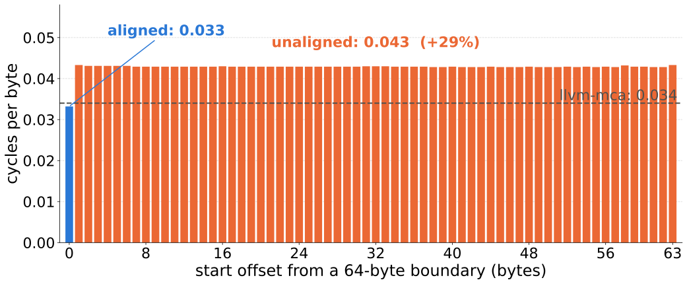

Only 1 offset in 64 matches the model. The other 63 straddle two cache lines: **+30%**.

---

# Masked loads and stores

* AVX-512 loads and stores take a 64-bit mask: one bit per byte
* Masked-out bytes are not read, not written, and **cannot fault**
* Round `p` down to the cache line, mask off the bytes before `p`: the rest of the loop is aligned
* Same trick handles the tail: no scalar loop, no branch

---

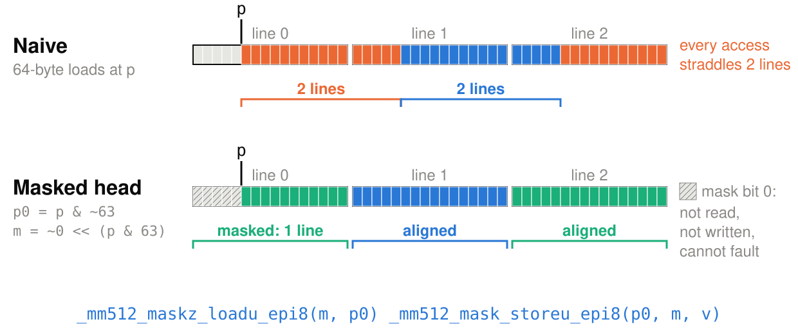

---

<!-- ============ JSON ============ -->

# Case study: JSON

Joint work with many people such as Geoff Langdale (Intel), John Keiser (Microsoft),  Francisco Geiman Thiesen (Microsoft), etc.

---

# JSON

* Portable, simple, human-readable; used by ~97% of API requests
* Strings (escaped), numbers, objects, arrays
* Reading and writing JSON is often *slow*: 100 MB/s to 300 MB/s
* Slower than a fast disk or a fast network

```bash
$ go run parse_twitter.go
Parsed 0.63 GB in 6.961 seconds (90.72 MB/s)
```

---

# "But JSON parsing is inherently serial"

* Every byte can change the meaning of every following byte.
* Strings contain escapes; escapes contain quotes.
* It is a textbook state machine.

This was the conventional wisdom. It was wrong.

---


# You are probably using simdjson

* Node.js, Bun, Deno, Electron
* ClickHouse
* WatermelonDB, Apache Doris, Meta Velox, Milvus, QuestDB, StarRocks

 

---

# Every major JavaScript engine parses JSON with SIMD

* `JSON.parse` in Node.js, Bun and Deno is data-parallel.
* Billions of calls per second worldwide.
* Nobody had to change a single line of JavaScript.

---

# simdjson: two-stage design

**Stage 1 (data-parallel):** scan the whole document with SIMD
* find every structural character and the start of every string
* validate UTF-8
* produce an index

**Stage 2 (mostly serial):** walk the index and build values
* the hard, branchy work now runs on ~5% of the bytes


---

# Deserialization (Intel Xeon Gold 6548N)

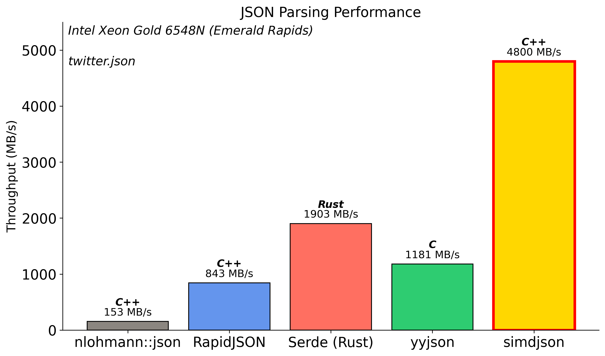

---

# Serialization (Intel Xeon Gold 6548N)

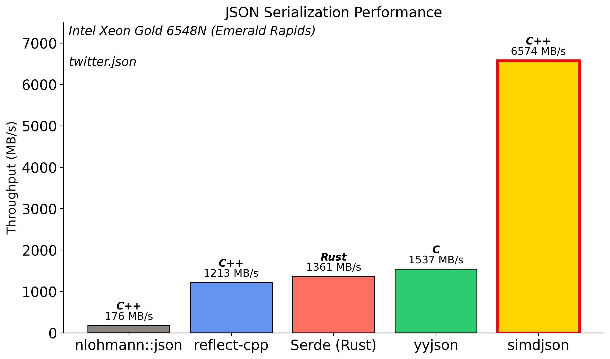


---

# Classifying characters

We need to sort every byte into a class:

- comma (0x2c) `,`
- colon (0x3a) `:`
- brackets (0x5b, 0x5d, 0x7b, 0x7d): `[, ], {, }`
- white-space (0x09, 0x0a, 0x0d, 0x20)
- everything else

A switch statement per byte? No.

---

# Vectorized classification

* Most SIMD instruction sets support 'vectorized lookup tables' (at least 16-element)
* With a 256-element table we could just compute `H(c)`
* With 16-element tables, we need two tables `H1` and `H2`
* Find `H1` and `H2` such that the bitwise AND of the lookups classifies the character:
  `H1(c & 0xf) & H2(c >> 4)`

---

```c
low_nibble_mask  = {16, 0, 0, 0, 0, 0, 0, 0, 0, 8, 12, 1, 2, 9, 0, 0};
high_nibble_mask = {8, 0, 18, 4, 0, 1, 0, 1, 0, 0, 0, 3, 2, 1, 0, 0};
```

Five instructions, 16 to 64 bytes at a time:
```c
    nib_lo  = input & 0xf;
    nib_hi  = input >> 4;
    shuf_lo = lookup(low_nibble_mask, nib_lo);
    shuf_hi = lookup(high_nibble_mask, nib_hi);
    return shuf_lo & shuf_hi;
```

**This trick generalizes: any 256-way classification into 8 classes.**

---


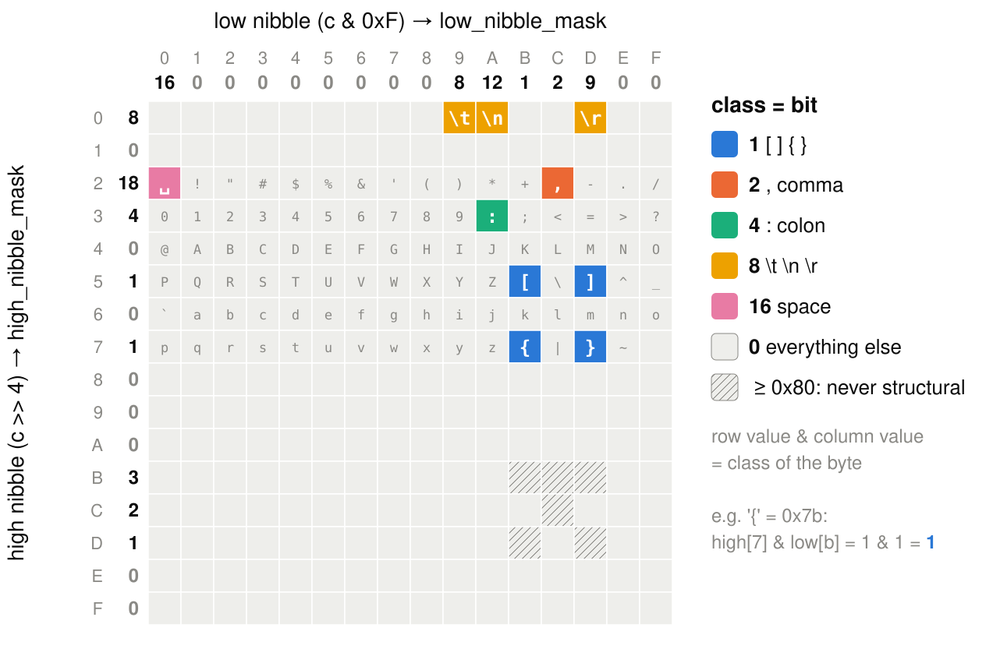

---

# Classification, 64 bytes at a time

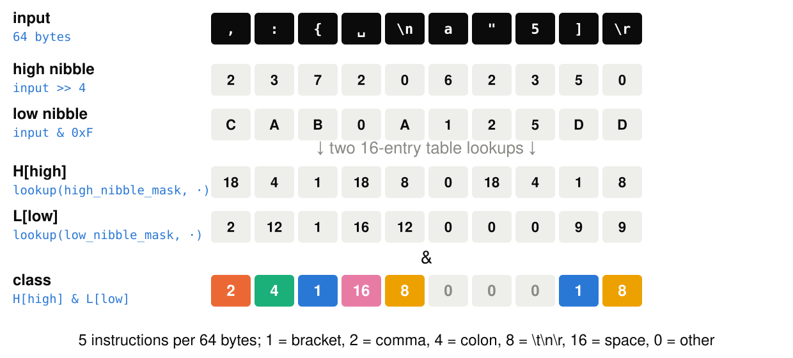

---

# When the instruction set gives you the instruction: SVE2

* ARM SVE2 has `match`: input vector, a 16-byte *set*, one predicate bit per byte in the set
* Our structural-character classifier: **4 NEON instructions → 1**

---
<!-- _class: fig -->

# NEON vs SVE2 `match`, one 16-byte block

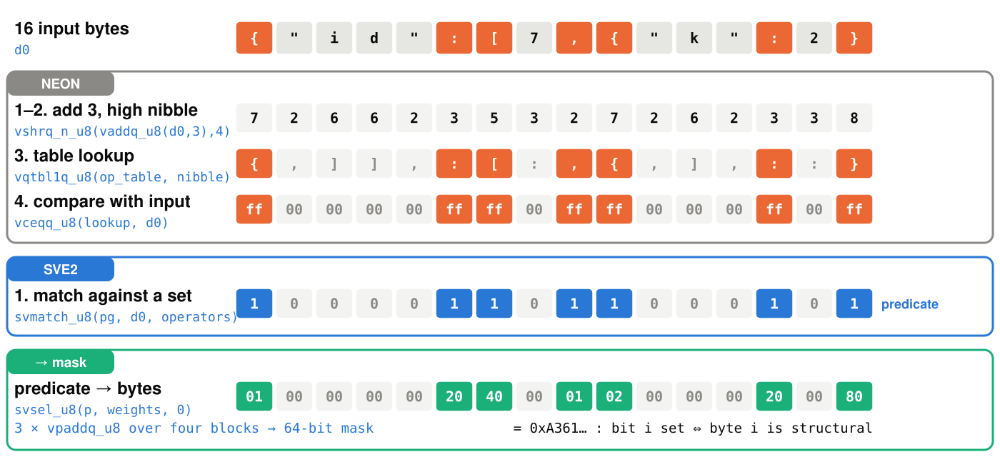


---

# Serialization is also a data-parallel problem

* JSON requires escaping `"`, `\`, and control characters.
* Almost no string actually needs escaping.
* So: check 16 to 64 bytes at once, and take the fast path.

---

<!-- _class: fig -->

# SIMD string escaping

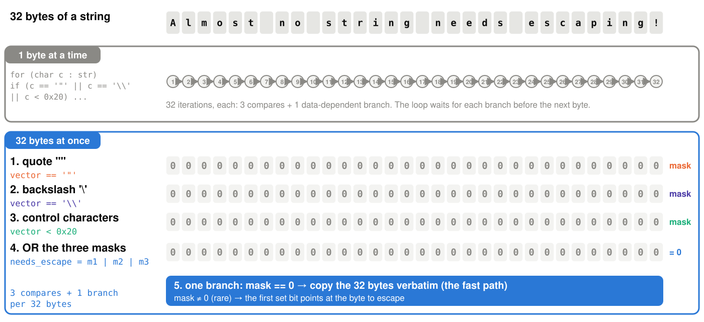

---

# C++26 compile-time reflection


---

# One line each way (C++26)

```cpp
struct Player {
    std::string username;
    int level;
};

Player load_player(std::string& json_str) {
    return simdjson::from(json_str);
}

std::string save_player(const Player& p) {
    return simdjson::to_json(p);
}
```

No macros. No code generation step. No runtime reflection cost.

---

<!-- ============ IP ADDRESSES ============ -->

# Case study: IP addresses

Joint work with Yagiz Nizipli (SpaceX)

---

# `192.168.0.1` → 32 bits

* Every server logs the client address. Every firewall evaluates a rule. Every URL parser meets an IP literal.
* The usual tool: `inet_pton` from the C library, ~340 instructions per address.
* An IPv4 address is at most 15 bytes: it fits in **one** 16-byte register.
* An IPv6 address is at most 45 bytes: it fits in **one** 64-byte register.

**Load the whole address once. Never walk it.**

---
<!-- _class: fig -->


# IPv4 in six steps, no loop

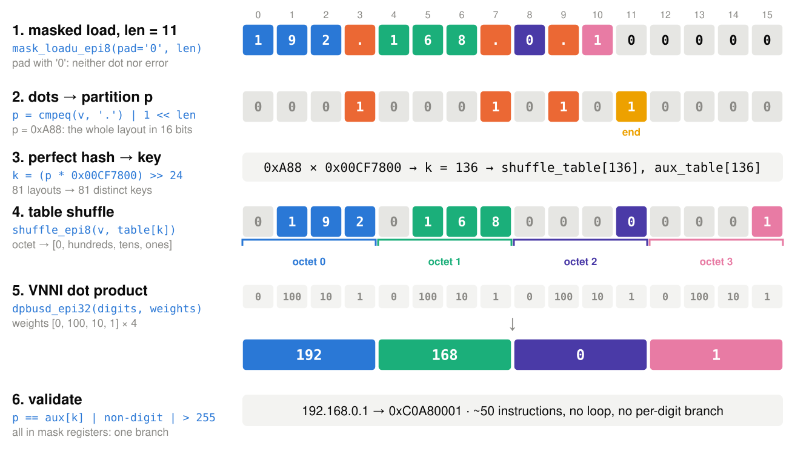

---
<!-- _class: fig -->


# IPv4 parsing, Intel Xeon Gold 6548N

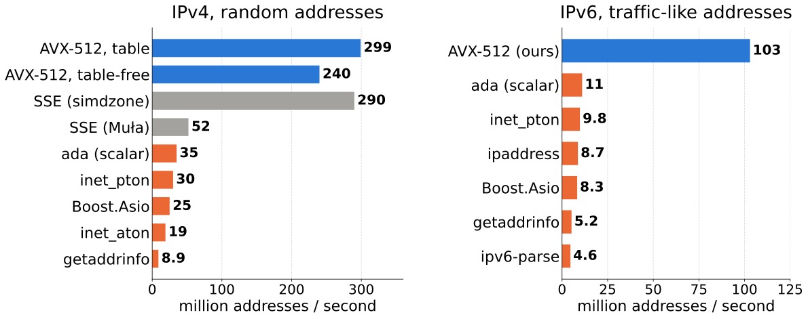

10× over `inet_pton` on IPv4, 10× on traffic-like IPv6. 6–60× fewer instructions.

---
<!-- _class: fig -->


# Deployed: ada → Node.js

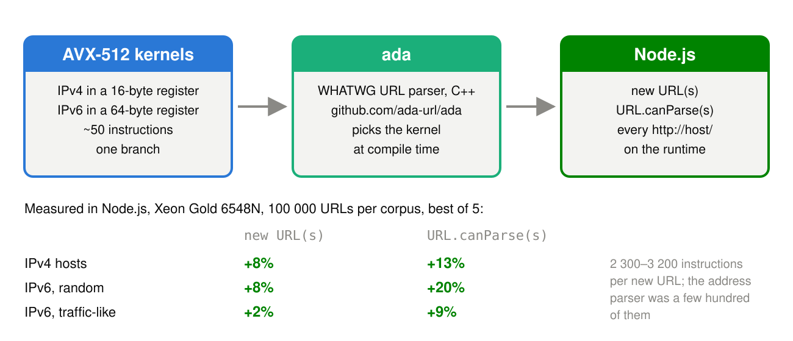

---

<!-- ============ PERFECT HASHING ============ -->

# Case study: perfect hashing

---

# Looking up!

* Map a string to a value: HTTP method, header name, URL scheme, keyword, MIME type
* The keys are **fixed when you write the code**
* Yet we hash, mask, probe, chase a pointer, compare: `std::unordered_map`, 12.8 ns
* With the keys known at compile time, we can build a **perfect hash**: no collisions, one candidate per slot

Library: [github.com/ConstexprCore/perfect_hash](https://github.com/ConstexprCore/perfect_hash) (with Francisco Geiman Thiesen at Microsoft)

---
<!-- _class: fig -->


# One hash, one comparison

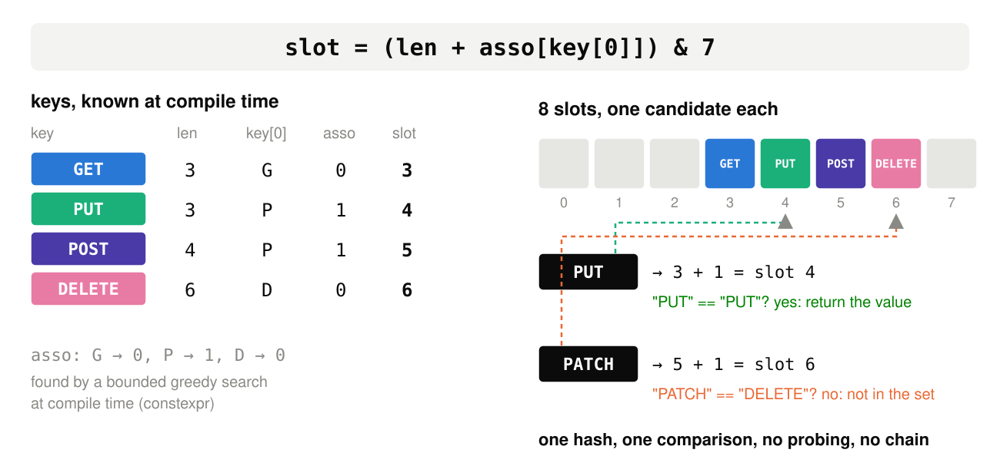

---
<!-- _class: fig -->


# Compare the whole key at once

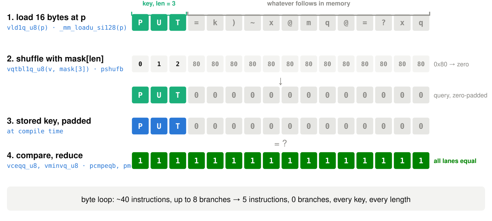

---
<!-- _class: fig -->


# The memory page trick

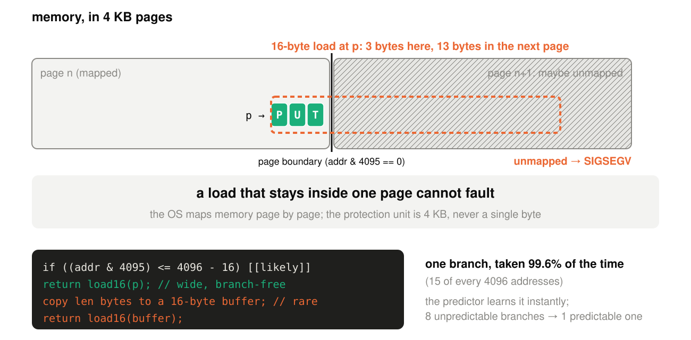

---
<!-- _class: fig -->


# URL schemes, 6 keys, Apple M3 Max

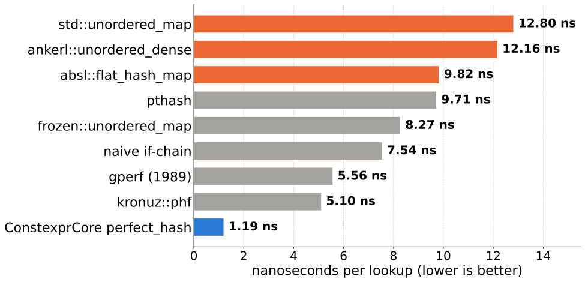

1.19 ns, 4.9 cycles, 8.7 instructions per cycle, **zero** branch mispredictions.

---

<!-- ============ UNICODE ============ -->

# Case study: Unicode

---


# simdutf

* Inside Safari, Chrome, Node.js, Bun
* Unicode transcoding and validation at gigabytes per second
* Base64 too
* x64, ARM, POWER, RISC-V, LoongArch

---

# Unicode (UTF-16)

* Code points from U+0000 to U+FFFF: a single 16-bit value.
* Beyond: a *surrogate pair*, `U+D800`–`U+DBFF` followed by `U+DC00`–`U+DFFF`.
* A lone surrogate makes the string ill-formed.

Every JavaScript string, every Java string, every Windows filename.

---

# Validate

```javascript
PROCEDURE validate_utf16(code_units)
    i ← 0
    WHILE i < |code_units|
        unit ← code_units[i]
        IF unit ≤ 0xD7FF OR unit ≥ 0xE000 THEN
            INCREMENT i
            CONTINUE
        IF unit ≥ 0xD800 AND unit ≤ 0xDBFF THEN
            IF i + 1 ≥ |code_units| THEN
                RETURN false
            next_unit ← code_units[i + 1]
            IF next_unit < 0xDC00 OR next_unit > 0xDFFF THEN
                RETURN false
            i ← i + 2  // Valid surrogate pair
            CONTINUE
        RETURN false
    RETURN true
```

---
<!-- _class: fig -->


# Repair, 64 bytes at a time

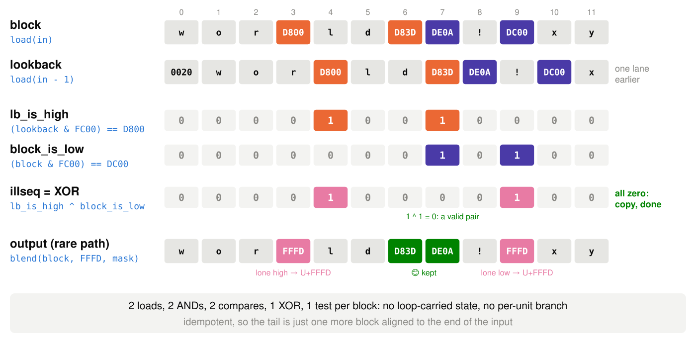

---
<!-- _class: fig -->


# One function, every V8 embedder

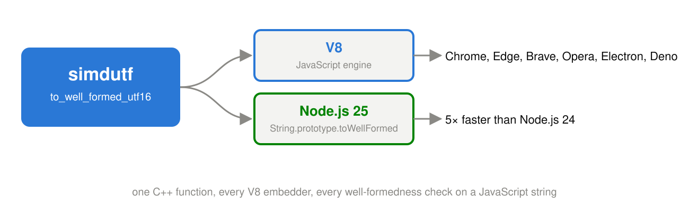

---

# UTF-16 correction, Apple M4


|               |     scalar      |    ARM NEON    |
|---------------|-------------|-------------|
| GB/s          | 2.2         | 18.9        |
| ins/byte      | 12.0        | 0.9         |

**13× fewer instructions per byte.**

---

# In the browser (Apple M4)

- Chromium: 16 GB/s (**uses our new function**)
- Firefox: 3.4 GB/s
- Safari: 1.2 GB/s

Test it yourself: https://lemire.github.io/browserwellformed/

---

<!-- ============ PART 8 ============ -->

# Case study: base64

---

# Base64

- Encodes binary data as text using 64 characters (A-Z, a-z, 0-9, +, /)
- 3 bytes input → 4 characters output (33% overhead)
- Data URLs, email, JWTs, web APIs, embedded images

- `"Hello, World!"` → `SGVsbG8sIFdvcmxkIQ==`

Bit manipulation on a fixed schedule: **the ideal SIMD problem.**

---

# New JavaScript functions

```javascript
const b64 = Uint8Array.prototype.toBase64(bytes);
const recovered = Uint8Array.fromBase64(b64);
```

| function (Safari, Apple M4) | speed |
|-----------|-------|
| `Uint8Array.fromBase64()` | 11 GiB/s |
| `Uint8Array.toBase64()` | 20 GiB/s |

Test in your browser: https://simdutf.github.io/browserbase64/

---

# The web's Base64 is not RFC 4648

* ES2026 `Uint8Array.fromBase64` follows WHATWG *forgiving base64*: **ignore** ASCII whitespace, **reject** anything else
* MIME e-mail breaks lines every 76 characters; DNS zone files put spaces every 50; JSON and data URLs wrap freely
* Every earlier SIMD decoder assumed clean input: one `\n` and it falls back to a byte loop

**Keep the SIMD throughput on input that has whitespace in it.**

---
<!-- _class: fig -->


# Decode in blocks, compact the rare ones

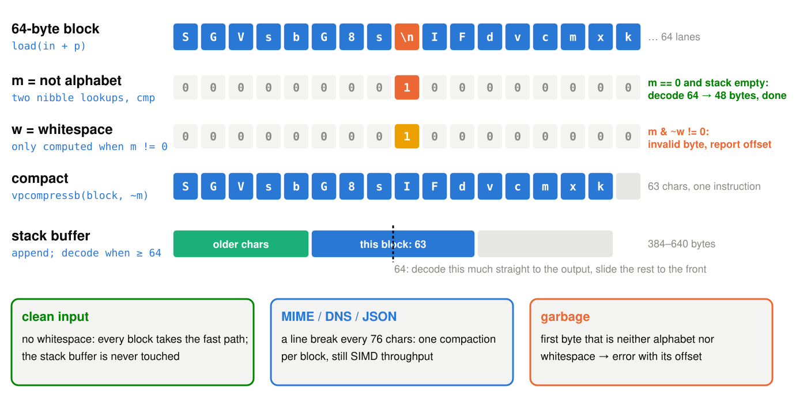

---
<!-- _class: fig -->


# Base64 decoding with whitespace

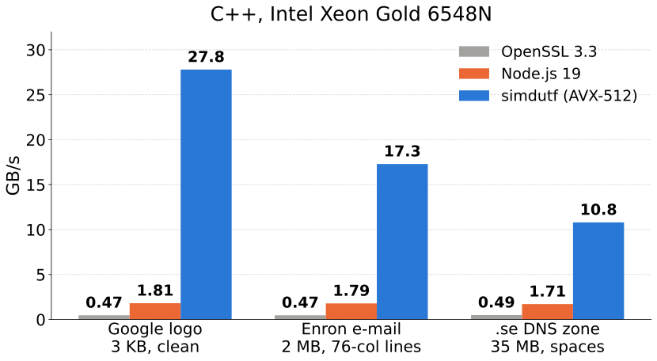

---
<!-- _class: fig -->


# In the browsers, in the runtimes

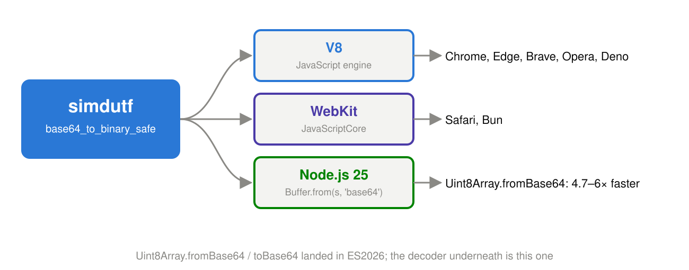

---


# AVX-512 base64 encoding

- Encoding a 64-byte block requires only **two** non-memory instructions:
  `vpermb` (twice) and `vpmultishiftqb`.
- The right instruction turns an algorithm into a lookup.

---

<!-- ============ PART 5 ============ -->

# Part 5

## Why your compiler will not do this for you

---

# What compilers can do

* Unroll loops
* Vectorize simple, dependency-free, contiguous loops
* Choose instruction schedules

# What compilers cannot do

* Change your data layout
* Change your algorithm

---


# After decades of autovectorization research

- C# (.NET) has intrinsics
- C++ added std::simd
- Java Vector

---

<!-- ============ PART 6 ============ -->

# Part 6

## Can an LLM write your SIMD code?

---

# Partly

Frontier models in 2026 are genuinely good at:

* Recalling intrinsic names and semantics (better than I am)
* Translating a working NEON kernel to AVX2, or to RVV
* Writing the scalar reference implementation and the test harness
* Explaining an unfamiliar instruction

---

# What actually works: close the loop

Help your agent.

1. **A benchmark** it can run, over realistic inputs
2. **A differential fuzzer** against a scalar reference
3. **`llvm-mca`** (or `perf`) so it can see cycles, not vibes

Then let it iterate.

---

<!-- ============ PART 7 ============ -->

# Part 7

## Measure properly, or do not bother

---

# Measurements

* We often assume that measurements (timings) are normally distributed.
* If they were, the 'error' would fall off as $1/\sqrt{N}$.
* It is often an incorrect assumption.

---


---

# What if we dealt with log-normal distributions?


---

# Real-world measurements

* You cannot assume normality
* Measurements are **not independent**
* Reality: the absolute **minimum** is often the *reliable* metric
* Margin: the difference between the mean and the minimum

<!--https://lemire.me/blog/2023/04/27/hotspot-performance-engineering-fails/-->

---

# Use performance counters

Timings tell you *that* something is slow. Counters tell you *why*.

* **instructions retired** — did I actually remove work?
* **cycles** — the ground truth
* **branch misses** — is the predictor carrying me?
* **cache misses** — am I memory bound after all?

`perf stat`, `Instruments`, or a library such as `performancecounters`.


---

# Hot-spot engineering fails

* A profiler shows you where the cycles are *now*.
* It does not show you the 30% of instructions spread evenly over every function.
* Reducing the total instruction count beats optimizing the top-of-profile function.

<!--https://lemire.me/blog/2023/04/27/hotspot-performance-engineering-fails/-->

---

<!-- ============ CONCLUSION ============ -->

# When is data parallelism worth it?

**Good signs**
* You touch every byte or every element
* The work per element is small and uniform
* You are validating, scanning, transcoding, filtering, or counting

**Bad signs**
* Deep pointer chasing
* Genuinely irregular control flow with expensive bodies
* You are already memory bound at full bandwidth

---

# Data parallelism applies more often than you think

* JSON parsing — every JavaScript engine
* Unicode validation — every browser
* base64 — the JavaScript standard library
* Number parsing — every compiler toolchain
* Bitmap indexes, hashing, compression, `memchr`, CSV, regex prefiltering

"Inherently serial" is usually a statement about the algorithm you happen to know.

---

# What to take home

1. Clock speeds are flat; parallelism is where performance lives.
2. Data parallelism reduces **instructions**, not just time.
3. Your compiler schedules; it does not redesign. That part is yours.
4. Branchy code looks great in a synthetic benchmark and dies on real data.
5. IPC is a diagnostic, not a goal. The minimum time is your metric.
6. AI agents are excellent hands and mediocre architects — give them a benchmark and a fuzzer.

---

# Interested? Check these projects

* **simdjson** — the fastest JSON parser in the world https://simdjson.org
  * Node.js, Bun, Deno, Electron
  * ClickHouse, WatermelonDB, Apache Doris, Meta Velox, Milvus, QuestDB, StarRocks
* **simdutf** — Unicode (UTF-8/16/32) and base64 https://github.com/simdutf/simdutf
  * Node.js, Bun, WebKit (Safari), Chromium (Chrome, Edge)
* **fast_float** — number parsing https://github.com/fastfloat/fast_float
* **Roaring Bitmaps** — https://roaringbitmap.org

---

# Credit

- simdjson reflection work with Francisco Geiman Thiesen (Microsoft)
- simdutf UTF-16 correction is joint work with Robert Clausecker
- simdjson and simdutf are community efforts (Geoff Langdale, John Keiser, Paul Dreik, Yagiz Nizipli and others)

---

## <!--fit--> Questions?

Daniel Lemire — [lemire.me](https://lemire.me)

X: [@lemire](https://x.com/lemire) · GitHub: [github.com/lemire](https://github.com/lemire/)

:canada:
