<!--
Apple counterpart of the AMD Ryzen 7 slides in tower.md.
Base chips only (M1, M2, M3, M4, M5): same product tier, 4 P-cores throughout.
Plots: plots/apple_*.py
-->

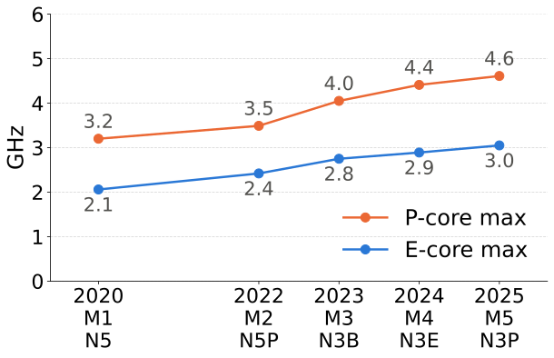

# Clock frequency: Apple M1–M5, 2020–2025

- P-core: up 44% in five years
- E-core: up 48%

---

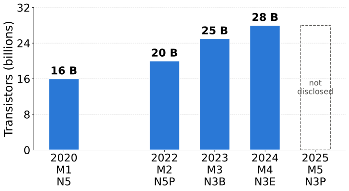

# Transistors: Apple M1–M5, 2020–2025

- 4 P-cores throughout (+2 E-cores from M4)
- Up 75% in four years (M1 → M4)
- Apple did not disclose the M5 count

---

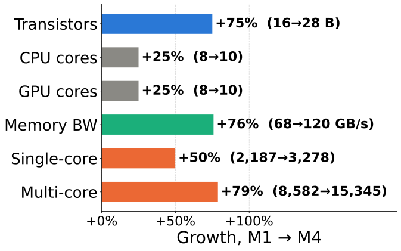

# +12 B transistors, 2020–2024

- Same 4 P-cores
- Monolithic die: no core / I/O / cache split
- Cores: +25%; memory bandwidth: +76%
- Single-core: **+50%**, multi-core: **+79%**

---

# Geekbench 6: Apple M1–M5, 2020–2025

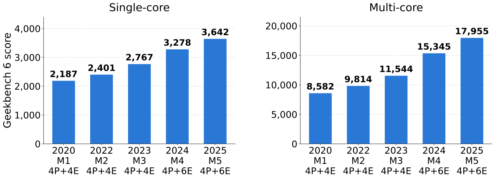

Single-core: **+67%**. Multi-core: **+109%**. Same 4 P-cores.

---

# What changed in the P-core (same 4 P-cores)

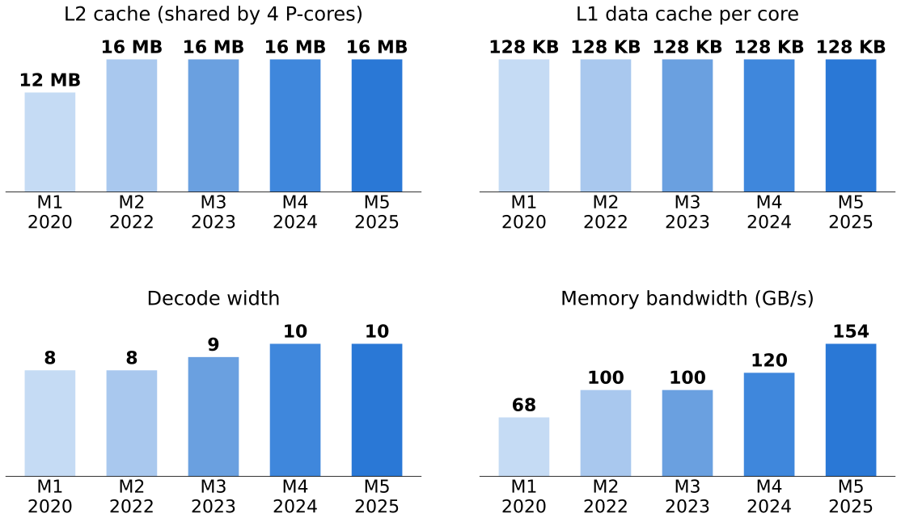

---

# What changed in the P-core: SIMD (same 4 P-cores)

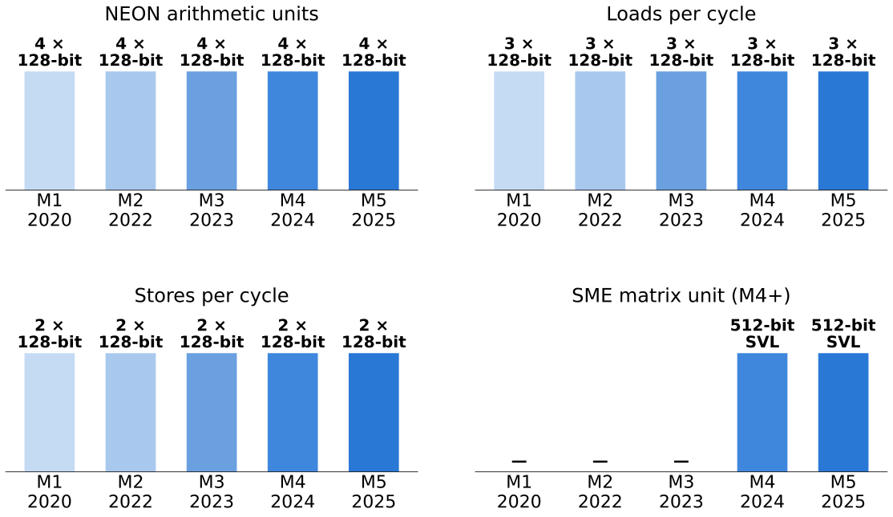

---

<!-- M2 -> M5 sequence (M1 dropped). Plots: plots/apple_m2m5.py -->

# Geekbench 6: Apple M2–M5, 2022–2025

Single-core: **+52%**. Multi-core: **+83%**. Same 4 P-cores.

---

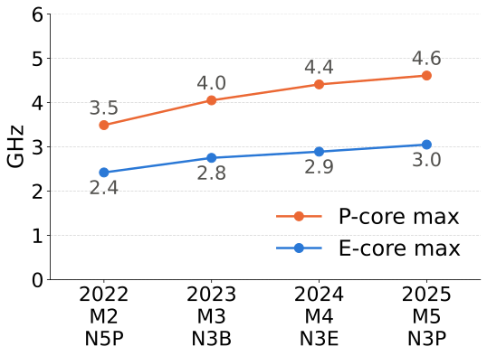

# Clock frequency: Apple M2–M5, 2022–2025

- P-core: up 32% in three years
- E-core: up 26%

---

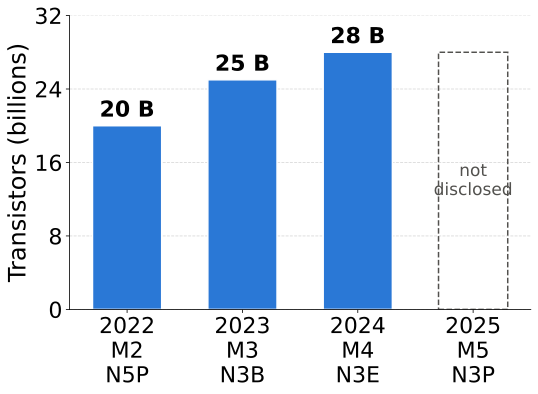

# Transistors: Apple M2–M5, 2022–2025

- Up 40% in two years (M2 → M4)
- Apple did not disclose the M5 count

---

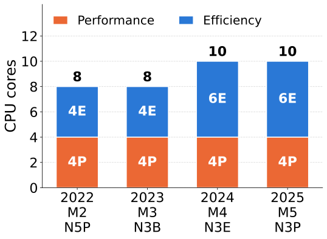

# CPU cores: Apple M2–M5, 2022–2025

- Same 4 performance cores
- Efficiency cores: 4 → 6 with the M4
- Single-core score does not see them

---

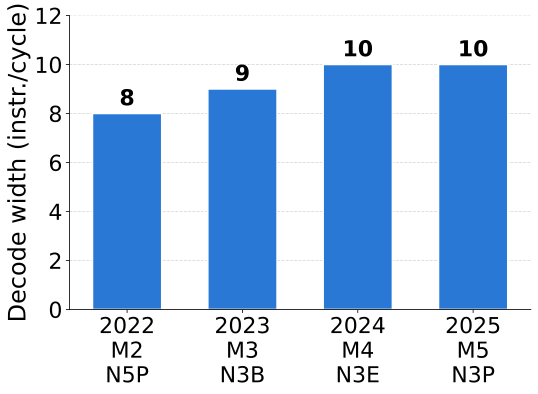

# P-core decode width: Apple M2–M5

- 8 → 9 → 10 instructions per cycle
- Wider front end, same NEON width (4 × 128-bit)

---

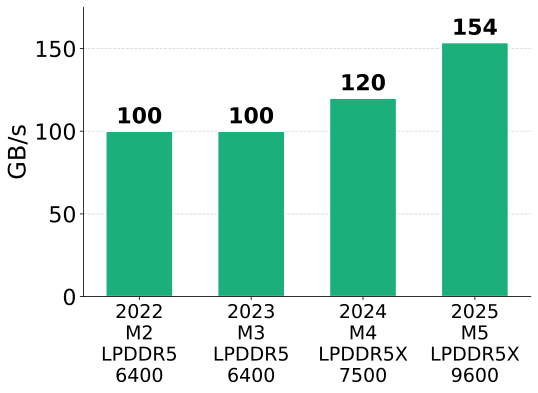

# Memory bandwidth: Apple M2–M5

- Up 54% in three years
- LPDDR5 6400 → LPDDR5X 9600
- Helps many threads, not one
